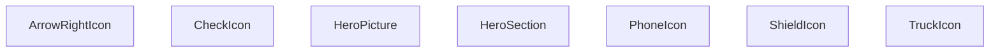

## Genel Bakış
Bu modül, bir web sayfasının başlık bölümünü (hero section) oluşturan React bileşenlerini içerir. Ana görsel ve metin içeriği ile birlikte, hizmet veya özellikleri simgeleyen küçük ikon bileşenleri de tanımlanmıştır.

## Fonksiyon Grupları
### Ana Düzen Bileşenleri
Hero bölümünün temel yapısını ve içeriğini oluşturur.
- HeroSection, HeroPicture

### Simge Bileşenleri
Hizmet, güvenlik veya özellikleri görsel olarak temsil eden küçük ikonları sağlar.
- ArrowRightIcon, CheckIcon, TruckIcon, ShieldIcon, PhoneIcon

---

## AXIOMS – Mimari Varsayımlar
Bu modül için özel aksiyom tanımlanmamıştır.

[Aksiyom 1]: Eğer ArrowRightIcon, CheckIcon, TruckIcon, ShieldIcon veya PhoneIcon bileşenlerine **className** prop'ı verilmezse, bu prop'un değeri boş string (`''`) olur.  
[Aksiyom 2]: Eğer yukarıdaki ikon bileşenlerine **className** prop'ı **string** olmayan bir değer verilirse, TypeScript derleme hatası oluşur ve beklenen stil uygulanmayabilir.  
[Aksiyom 3]: Eğer **HeroPicture** bileşeni içinde kullanılan görsel varlıkları (ör. `` veya `<source>` öğelerinin `src`/`srcSet` özellikleri) modülün derleme zamanında mevcut ve doğru şekilde içe aktarılmamışsa, bileşen görüntüyü gösteremez veya boş bir alan render eder.  
[Aksiyom 4]: Eğer **HeroSection** bileşeni içindeki statik metin veya içerik (başlık, açıklama vb.) modülün kaynak dosyalarında bulunmuyorsa veya yanlış şekilde içe aktarılmışsa, Section boş veya eksik içerikle render edilir.  
[Aksiyom 5]: Eğer **SpotlightHeroOverlay** sabiti (olası bir bileşen) **HeroSection** içinde kullanılıyorsa, bu sabit dışarıdan aktarıldığı ve geçerli bir React bileşeni olduğu varsayılır; aksi takdirde Section render edilirken çalışma zamanı hatası oluşur.

---

## FONKSIYON DETAYLARI

### HeroPicture
**Ne yapar**: Hero bileşeninin görsel kısmını render eder; genellikle sayfanın baş kısmında büyük bir resim veya animasyon gösterir.  
**Nasıl yapar**: React fonksiyonel bileşeni olarak JSX döndürür; içeriği genellikle bir `` veya `<picture>` elementiyle tanımlanır ve stil sınıfları veya props aracılığıyla özelleştirilebilir.  
**Parametreler**:  
- (Bu fonksiyon parametre almaz)  
**Dönüş**: `React.FC` türünde bir JSX elementi döndürür; render edildiğinde sayfada görsel içerik gösterilir.

### HeroSection
**Ne yapar**: Sayfanın hero bölümünün tamamını oluşturur; genellikle başlık, açıklama, görsel ve çağrı-eylem butonları gibi öğeleri birleştirir.  
**Nasıl yapar**: React fonksiyonel bileşeni olarak çalışır; iç yapısı `HeroPicture`, metin ve buton bileşenlerini içerebilir ve bu öğeleri flex veya grid düzeniyle yerleştirir.  
**Parametreler**:  
- (Bu fonksiyon parametre almaz)  
**Dönüş**: `React.FC` türünde bir JSX elementi döndürür; render edildiğinde sayfanın üst kısmındaki hero bloğu görünür olur.

### ArrowRightIcon
**Ne yapar**: Ok yönünde gösteren bir simge (ikon) render eder; kullanıcıya bir yönlendirme veya ilerleme işareti sunmak için kullanılır.  
**Nasıl yapar**: `className` adlı isteğe bağlı string prop alır; bu prop, simgenin stil sınıflarını özelleştirmek için kullanılır. Bileşen JSX olarak bir SVG veya font‑tabanlı ikon döndürür ve `className` propu bu öğeye uygulanır.  
**Parametreler**:  
- className: string — simgenin CSS sınıfı; stil özelleştirmek için opsiyonel olarak geçirilebilir (varsayılan boş string).  
**Dönüş**: Belirtilen tipten (void veya bilinmiyor) bir değer döndürür; pratikte bu, render edilen JSX elementi anlamına gelir.

### CheckIcon
**Ne yapar**: Onay işareti simgesini render eder; genellikle bir işlemin başarılı tamamlandığını veya bir seçeneğin aktif olduğunu göstermek için kullanılır.  
**Nasıl yapar**: `className` propunu alır ve bu sınıfı simge öğesine uygular; iç mantık bir SVG veya font‑ikon döndürür.  
**Parametreler**:  
- className: string — simgenin stil sınıfı; opsiyonel, varsayılan boş string.  
**Dönüş**: Return tipi belirtilmemiş (void veya bilinmiyor); gerçekte JSX elementi döndürülür.

### TruckIcon
**Ne yapar**: Bir kamyon simgesini render eder; lojistik, teslimat veya taşıma ile ilgili bilgileri görselleştirmek için kullanılır.  
**Nasıl yapar**: `className` propunu kabul eder; bu prop simgenin dış görünümünü değiştirmek için CSS sınıfı olarak kullanılır. Bileşen JSX olarak bir ikon döndürür.  
**Parametreler**:  
- className: string — simgenin stil sınıfı; opsiyonel, varsayılan boş string.  
**Dönüş**: Return tipi belirtilmemiş (void veya bilinmiyor); aslında render edilen JSX elementi döndürür.

### ShieldIcon
**Ne yapar**: Bir kalkış simgesi (kalkan) render eder; güvenlik, koruma veya garantiyi simgeler.  
**Nasıl yapar**: `className` propunu alır ve bu sınıfı simge öğesine uygular; iç yapı genellikle bir SVG veya font‑ikon içerir.  
**Parametreler**:  
- className: string — simgenin stil sınıfı; opsiyonel, varsayılan boş string.  
**Dönüş**: Return tipi belirtilmemiş (void veya bilinmiyor); pratikte JSX elementi döndürür.

### PhoneIcon
**Ne yapar**: Bir telefon simgesi render eder; iletişim bilgileri veya destek hattı gibi telefonla ilgili içerikleri göstermek için kullanılır.  
**Nasıl yapar**: `className` propunu alır; bu prop simgenin stilini özelleştirmek için kullanılır. Bileşen JSX olarak bir ikon döndürür.  
**Parametreler**:  
- className: string — simgenin stil sınıfı; opsiyonel, varsayılan boş string.  
**Dönüş**: Return tipi belirtilmemiş (void veya bilinmiyor); aslında render edilen JSX elementi döndürür.

---

## SABİTLER
- **SpotlightHeroOverlay** (call) — `React.lazy(() => import('./SpotlightHeroOverlay'))`

---

## AST POINTERS

### [N1_NASIL] AST Pointer: src/components/HeroSection.tsx::HeroPicture
- **params**: (parametre yok)
- **ic_degiskenler**: (yok)
- **Dönüs**: React.FC

### [N2_NASIL] AST Pointer: src/components/HeroSection.tsx::HeroSection
- **params**: (parametre yok)
- **ic_degiskenler**:
  - `t` — i18n çeviri fonksiyonu, home namespace’inden metinler almak için kullanılır.
  - `heroRef` — hero bölümünün kök `
` elemanına referans tutar, paralaks etkisi için mouse pozisyonu hesaplanır.
  - `bgRef` — arka plan görselinin `
` elemanına referans tutar, yüksek çözünürlüklü arka plan geçişi için kullanılır.
  - `enableParallax` — paralaks efektinin etkin olup olmadığını belirleyen boolean; düşük hareket veya dokunmatik cihazlarda kapatılır.
  - `isDesktop` — viewport genişliği 1024 px ve üzeri olup olmadığını tutan boolean state.
  - `setIsDesktop` — `isDesktop` state’ini güncelleyen setter fonksiyonu.
  - `showOverlay` — spotlight overlay’ının gösterilip gösterilmeyeceğini tutan boolean state.
  - `setShowOverlay` — `showOverlay` state’ini güncelleyen setter fonksiyonu.
  - `mq` — `window.matchMedia('(min-width: 1024px)')` sonucu tutan MediaList objesi.
  - `onChange` — media sorgu değişikliğinde `isDesktop`’i güncelleyen callback fonksiyonu.
  - `coarse` — `window.matchMedia('(pointer: coarse)')` sonucu, dokunmatik gibi düşük hassasiyetli giriş var mı.
  - `rm` — `window.matchMedia('(prefers-reduced-motion: reduce)')` sonucu, kullanıcı hareket azaltmayı tercih ediyor mu.
  - `idle` — `requestIdleCallback` veya `setTimeout` ile düşük öncelikli çalıştırma sağlayan yardımcı fonksiyon.
  - `cb` — `idle` fonksiyonuna geçirilen, overlay gösterimi için çağrılacak parametresiz fonksiyon.
  - `el` — `bgRef.current` olan arka plan `
` elemanı.
  - `setHighResNow` — arka plan yüksek çözünürlüklü URL’yi anında uygulayan fonksiyon.
  - `raf` — `requestAnimationFrame` ile blur efekti başlatmak için alınan animasyon çerçevesi kimliği.
  - `onLoad` — `window` load olayı olduğunda yüksek çözünürlüklü geçişi gecikmeli olarak tetikleyen fonksiyon.
  - `isMobile` — `max-width: 1023px` veya `pointer: coarse` koşulu sağlanıp sağlanmadığını belirten boolean.
  - `delay` — mobil masaüstü farkına göre overlay geçişi için bekleme süresi (ms).
  - `e` — `onMouseMove` olayı nesnesi.
  - `rect` — `heroRef.current` elemanının `getBoundingClientRect()` sonucu, mouse koordinatları için referans alınır.
  - `x` — mouse X koordinatının yüzde cinsinden hesaplanmış değeri (0‑100).
  - `y` — mouse Y koordinatının yüzde cinsinden hesaplanmış değeri (0‑100).
  - `CounterProps` — `LazyInView` bileşeni için beklenen prop türü (`label: string`, `to: number`, `suffix?: string`).
  - `loader` — `./InViewCounter` bileşenini dinamik olarak import eden fonksiyon.
  - `ph` — veri yüklenirken gösterilecek placeholder `
` elementi.
- **Dönüs**: React.FC

### [N3_NASIL] AST Pointer: src/components/HeroSection.tsx::ArrowRightIcon
- **params**: `{ className = '' }: { className?: string }`
- **ic_degiskenler**: (yok)
- **Dönüs**: yok (void)

### [N4_NASIL] AST Pointer: src/components/HeroSection.tsx::CheckIcon
- **params**: `{ className = '' }: { className?: string }`
- **ic_degiskenler**: (yok)
- **Dönüs**: yok (void)

### [N5_NASIL] AST Pointer: src/components/HeroSection.tsx::TruckIcon
- **params**: `{ className = '' }: { className?: string }`
- **ic_degiskenler**: (yok)
- **Dönüs**: yok (void)

### [N6_NASIL] AST Pointer: src/components/HeroSection.tsx::ShieldIcon
- **params**: `{ className = '' }: { className?: string }`
- **ic_degiskenler**: (yok)
- **Dönüs**: yok (void)

### [N7_NASIL] AST Pointer: src/components/HeroSection.tsx::PhoneIcon
- **params**: `{ className = '' }: { className?: string }`
- **ic_degiskenler**: (yok)
- **Dönüs**: yok (void)

---

## MERMAID CALL GRAPH

## NODE ID STANDARD

  file: src\components\HeroSection.tsx
  function: src\components\HeroSection.tsx::HeroPicture
  function: src\components\HeroSection.tsx::HeroSection
  function: src\components\HeroSection.tsx::ArrowRightIcon
  function: src\components\HeroSection.tsx::CheckIcon
  function: src\components\HeroSection.tsx::TruckIcon
  function: src\components\HeroSection.tsx::ShieldIcon
  function: src\components\HeroSection.tsx::PhoneIcon

---

## DISA AKTARILANLAR (EXPORTS)
  export: ArrowRightIcon
  export: CheckIcon
  export: HeroPicture
  export: HeroSection
  export: PhoneIcon
  export: ShieldIcon
  export: TruckIcon

---

## STİL TOKENLERİ

### Arbitrary Değerler (token'a geçirilmemiş)
Yok — tüm stiller token'a geçirilmiş. ✅

### Kullanılan Token'lar (zaten token'a geçirilmiş)
- (yok)

### Tailwind Sınıf Özeti
- **Renkler:** `bg-gradient-to-br`, `bg-gradient-to-r`, `bg-gradient-to-t`, `bg-primary-navy`, `bg-white`, `border-2`, `border-light-gray`, `border-primary-navy`, `from-air-blue`, `from-primary-navy/20`, `lg:text-6xl`, `md:text-5xl`, `text-4xl`, `text-center`, `text-industrial-gray`
- **Layout:** `absolute`, `bottom-0`, `flex`, `flex-col`, `flex-shrink-0`, `from-air-blue`, `from-primary-navy/20`, `gap-12`, `gap-3`, `gap-4`, `grid`, `grid-cols-1`, `grid-cols-2`, `group-hover:translate-x-1`, `h-20`
- **Responsive:** `lg:`, `md:`, `sm:` prefix kullanımları
