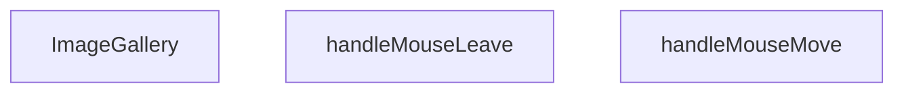

## Genel Bakış
ImageGallery bileşeni, bir ürünün görsellerini düzenli bir galeri formatında sergileyen ve kullanıcının fare etkileşimlerine yanıt veren dinamik bir React bileşenidir. Temel işlevi, görsellerin gösterimini ve bu görseller üzerinde fare hareketlerine bağlı olarak tetiklenen efektleri (örneğin yakınlaştırma veya açıklama gösterimi) yönetmektir.

## Fonksiyon Grupları
### Görsel Galeri Oluşturma ve Yerleşim
Bileşenin ana gövdesi, dışarıdan gelen görsel listesi ve ürün meta verilerini alarak ekrana düzenli ve interaktif bir galeri yerleşimi oluşturur.
- ImageGallery

### Fare Etkileşimi Yönetimi
Kullanıcının fare hareketlerini izleyerek galeri üzerinde geçici görsel efektlerin başlatılmasını ve sonlandırılmasını kontrol eden yardımcı işlevler.
- handleMouseMove
- handleMouseLeave

---

## AXIOMS – Mimari Varsayımlar

Bu modül için, fonksiyon gövdesinden üretilen aksiyomlar aşağıdadır. Aksiyomlar yalnızca fonksiyon imzaları ve modül sabitleri temel alınarak çıkarılmıştır; docstring, yorum veya değişken isimlerinden bilgi çıkarılmamıştır.

[Aksiyom 1]: Eğer `images` parametresi boş bir dizi ise veya `undefined`/`null` olarak iletilirse, bileşen düzgün render edilemez ve potansiyel olarak hata oluşur.
[Aksiyom 2]: Eğer `productName` parametresi `undefined` veya boş string olarak iletilirse, galeri içindeki ürün adı gösterimi eksik veya hatalı olur.
[Aksiyom 3]: Eğer `slug` parametresi geçerli bir ürün tanımlayıcısı içermiyorsa, `Product3DViewer` çağrılamaz veya yanlış ürün yüklenir.
[Aksiyom 4]: Eğer `modelType` parametresi `Product3DViewer` componenti tarafından beklenen formatta değilse, 3D görüntüleyici doğru çalışmayabilir.
[Aksiyom 5]: Eğer `handleMouseMove` fonksiyonu `React.MouseEvent<HTMLDivElement>` tipinde bir event almıyorsa, fare hareketi takibi yapılamaz ve dinamik efektler devre dışı kalır.
[Aksiyom 6]: Eğer `handleMouseLeave` fonksiyonu çağrılmasa, fare galeri alanından ayrıldığında efektler sıfırlanmaz ve geçici durumlar kalıcı olur.
[Aksiyom 7]: Eğer `Product3DViewer` modülü içe aktarılamıyorsa veya kullanılamıyorsa, 3D model görüntüleme işlevi çalışmaz.

---

## FONKSİYON DETAYLARI

### ImageGallery
**Ne yapar**: Bir ürünün görsellerini gösteren bir bileşen render eder.  
**Nasıl yapar**: props olarak gelen images dizisini mapleyerek her bir görseli  veya benzeri bir eleman olarak döndürür; ayrıca productName, slug ve modelType bilgilerini UI içinde kullanabilir.  
**Parametreler**:  
- images: Image[] — Gösterilecek görsel dizisi (her bir görselin URL ve meta veri içerdiği tip)  
- productName: string — Ürünün adı, başlık veya alt metin olarak gösterilir  
- slug: string — Ürünün URL slug'ı, navigasyon veya SEO amaçlı kullanılır  
- modelType: string — Ürünün model tipi, filtreleme veya sınıflandırma için kullanılır  
**Dönüş**: React.FC<ImageGalleryProps> — JSX elementi döndüren fonksiyonel bileşen

### handleMouseMove
**Ne yapar**: Fare hareketi olayını yakalayıp, görsel galerisinde etkileşim (örneğin zoom veya hareket efekti) için gerekli koordinatları işler.  
**Nasıl yapar**: Olay nesnesinden clientX ve clientY değerlerini çıkararak state veya ref üzerinden güncellenen pozisyon bilgilerini ayarlar; bu sayede görselin üzerine gelen fareye göre dinamik efekt sağlanır.  
**Parametreler**:  
- e: React.MouseEvent<HTMLDivElement> — Fare hareketi olayı, hedef bir 
 elementi üzerinden tetiklenir  
**Dönüş**: void — Fonksiyon bir değer döndürmez

### handleMouseLeave
**Ne yapar**: Fare galeriye dışarı çıktığında tetiklenen olay işleyicisidir; aktif etkileşimi sıfırlayarak görseli varsayılan duruma döndürür.  
**Nasıl yapar**: State veya ref üzerinden fare üzerindeki etkileşimi (örneğin zoom ölçeği) sıfırlayarak galeriyi başlangıç pozisyonuna getirir.  
**Parametreler**: (yok)  
**Dönüş**: void — Fonksiyon bir değer döndürmez

---

## İTHALATLAR (IMPORTS)
- import: ../i18n/I18nProvider::useI18n
- import: ./ui/VentImage::VentImage
- import: lucide-react::Box
- import: lucide-react::ChevronLeft
- import: lucide-react::ChevronRight
- import: lucide-react::Maximize2
- import: lucide-react::X
- import: next/dynamic::dynamic
- import: react-dom::createPortal
- import: react::React
- import: react::useCallback
- import: react::useEffect
- import: react::useRef
- import: react::useState

---

## INTERFACES

### ImageGalleryProps
- `images: { path: string; alt?: string | null }[]`
- `productName: string`
- `slug?: string`
- `modelType?: string`

---

## SABİTLER
- **Product3DViewer** (call) — `dynamic(
    () => import('./products/3d/Product3DViewer'),
    { ssr: fals...`

---

## AST POINTERS

### [N1_NASIL] AST Pointer: ImageGallery.tsx::ImageGallery
- **params**: `{ images, productName, slug, modelType }`
- **ic_degiskenler**:
  - `t` — `useI18n()` hook'undan alınan çeviri fonksiyonu, UI metinleri için kullanılır
  - `activeIdx` — `useState(0)`, o an seçili olan resmin indeksini tutar
  - `isLightboxOpen` — `useState(false)`, lightbox modalının açık olup olmadığını tutar
  - `is3DMode` — `useState(false)`, 3D model görünümünün aktif olup olmadığını tutar
  - `is3DFullscreen` — `useState(false)`, 3D modelin tam ekran modunda olup olmadığını tutar
  - `zoomStyle` — `useState<React.CSSProperties>({})`, mouse hover zoom efekti için CSS transform stilini tutar
  - `imageContainerRef` — `useRef<HTMLDivElement>(null)`, ana resim container DOM elementine referans verir
  - `activeImage` — `images` dizisinden `activeIdx` ile seçili olan resim nesnesi (path, alt içerir) veya `null`
  - `nextImage` — `useCallback`, sonraki resme geçmek için fonksiyon, `(prev + 1) % images.length` hesaplar
  - `prevImage` — `useCallback`, önceki resme geçmek için fonksiyon, `(prev - 1 + images.length) % images.length` hesaplar
- **Dönüş**: JSX (resim galerisi UI'ı, thumbnail'ler, lightbox portal, 3D viewer portal)

---

## MERMAID CALL GRAPH

## NODE ID STANDARD

  file: src\components\ImageGallery.tsx
  function: src\components\ImageGallery.tsx::ImageGallery
  function: src\components\ImageGallery.tsx::handleMouseMove
  function: src\components\ImageGallery.tsx::handleMouseLeave

---

## DISA AKTARILANLAR (EXPORTS)
  export: ImageGallery

---

## STİL TOKENLERİ

### Arbitrary Değerler (token'a geçirilmemiş)
Yok — tüm stiller token'a geçirilmiş. ✅

### Kullanılan Token'lar (zaten token'a geçirilmiş)
- (yok)

### Tailwind Sınıf Özeti
- **Renkler:** `bg-black/20`, `bg-black/95`, `bg-gray-100`, `bg-white`, `bg-white/10`, `bg-white/80`, `bg-white/95`, `border-2`, `border-gray-200`, `border-primary-navy`, `border-transparent`, `border-white`, `hover:bg-white`, `hover:bg-white/20`, `hover:border-gray-300`
- **Layout:** `absolute`, `backdrop-blur-md`, `backdrop-blur-sm`, `bottom-6`, `cursor-zoom-in`, `fixed`, `flex`, `flex-col`, `flex-wrap`, `gap-0.5`, `gap-2`, `h-14`, `h-16`, `h-full`, `items-center`
- **Varyant/Responsive:** `:`, `group-hover:`, `hover:`, `md:` önekleri
- **Yardımcı Sınıflar:** `${!is3DMode`, `${activeIdx`, `-translate-x-1/2`, `-translate-y-1/2`, `:`, `===`, `activeIdx`, `aspect-square`, `border`, `duration-200`, `ease-out`, `font-bold`, `group`, `group-hover:opacity-100`, `hover:opacity-100`