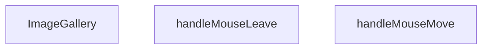

## Genel Bakış
ImageGallery bileşeni, bir ürünün görsellerini listeleyip kullanıcı etkileşimlerine yanıt veren bir resim galerisi sunar. Görsellerin gösterimi ve fare hareketlerine dayalı dinamik efektler bileşenin temel işlevlerini oluşturur.

## Fonksiyon Grupları
### Görsel Render ve Yerleşim
Bileşenin ana işlevi, gelen görsel listesini ve ürün bilgilerini alarak ekrana düzenli bir galeriyi çizdirmektir.
- ImageGallery

### Fare Etkileşimi Yönetimi
Kullanıcının galeriye üzerindeki fare hareketlerini izleyerek görsel üzerinde geçici efektler (örneğin zoom veya açıklama gösterimi) sağlar.
- handleMouseMove
- handleMouseLeave

---

## AXIOMS – Mimari Varsayımlar
Bu modülün doğru çalışması için aşağıdaki koşulların sağlanması gerekir.

[Aksiyom 1]: Eğer `images` prop'u sağlanmazsa, galeride görüntü gösterilemez ve bileşen boş görünebilir.  
[Aksiyom 2]: Eğer `productName` prop'u sağlanmazsa, ürün adı bölümü render edilmez veya undefined gösterilir.  
[Aksiyom 3]: Eğer `slug` prop'u sağlanmazsa, ürüne özgü URL oluşturulaması ve ilgili navigasyon işlevselliği kaybolur.  
[Aksiyom 4]: Eğer `modelType` prop'u sağlanmazsa, `Product3DViewer` bileşeni doğru model tipi alamadığından 3D görüntüleme işlevi çalışmayabilir.  
[Aksiyom 5]: Eğer `handleMouseMove` fonksiyonuna geçirilen argüman `React.MouseEvent<HTMLDivElement>` tipi değilse (örneğin başka bir eleman üzerinden olay veya null), TypeScript çalışma‑zamanı tip hatası oluşur ve fonksiyon beklendiği gibi çalışmayabilir.  
[Aksiyom 6]: Eğer `handleMouseLeave` fonksiyonu çağrılmazsa (örneğin mouse leave eventi bağlanmazsa), fare öğeden çıktığında ilgili durum güncellenmez ve kullanıcı deneyimi etkilenir.  
[Aksiyom 7]: Eğer `Product3DViewer` bileşeni içe aktarılamaz veya tanımlanmazsa, `ImageGallery` render edilirken hata verir ve 3D görüntüleme özelliği kullanılamaz.

---

## FONKSİYON DETAYLARI

### ImageGallery
**Ne yapar**: Bir ürünün görsellerini gösteren bir bileşen render eder.  
**Nasıl yapar**: props olarak gelen images dizisini mapleyerek her bir görseli  veya benzeri bir eleman olarak döndürür; ayrıca productName, slug ve modelType bilgilerini UI içinde kullanabilir.  
**Parametreler**:  
- images: Image[] — Gösterilecek görsel dizisi (her bir görselin URL ve meta veri içerdiği tip)  
- productName: string — Ürünün adı, başlık veya alt metin olarak gösterilir  
- slug: string — Ürünün URL slug'ı, navigasyon veya SEO amaçlı kullanılır  
- modelType: string — Ürünün model tipi, filtreleme veya sınıflandırma için kullanılır  
**Dönüş**: React.FC<ImageGalleryProps> — JSX elementi döndüren fonksiyonel bileşen

### handleMouseMove
**Ne yapar**: Fare hareketi olayını yakalayıp, görsel galerisinde etkileşim (örneğin zoom veya hareket efekti) için gerekli koordinatları işler.  
**Nasıl yapar**: Olay nesnesinden clientX ve clientY değerlerini çıkararak state veya ref üzerinden güncellenen pozisyon bilgilerini ayarlar; bu sayede görselin üzerine gelen fareye göre dinamik efekt sağlanır.  
**Parametreler**:  
- e: React.MouseEvent<HTMLDivElement> — Fare hareketi olayı, hedef bir 
 elementi üzerinden tetiklenir  
**Dönüş**: void — Fonksiyon bir değer döndürmez

### handleMouseLeave
**Ne yapar**: Fare galeriye dışarı çıktığında tetiklenen olay işleyicisidir; aktif etkileşimi sıfırlayarak görseli varsayılan duruma döndürür.  
**Nasıl yapar**: State veya ref üzerinden fare üzerindeki etkileşimi (örneğin zoom ölçeği) sıfırlayarak galeriyi başlangıç pozisyonuna getirir.  
**Parametreler**: (yok)  
**Dönüş**: void — Fonksiyon bir değer döndürmez

---

## INTERFACES

### ImageGalleryProps
- `images: { path: string; alt?: string | null }[]`
- `productName: string`
- `slug?: string`
- `modelType?: string`

---

## SABİTLER
- **Product3DViewer** (call) — `dynamic(

    () => import('./products/3d/Product3DViewer'),

    { ssr: fals...`

---

## AST POINTERS

### [N1_NASIL] AST Pointer: src/components/ImageGallery.tsx::ImageGallery
- **params**: (images, productName, slug, modelType)
- **ic_degiskenler**:
  - `t` — çeviri fonksiyonu, i18n'den alınan t metodu
  - `activeIdx` — aktif görselin indeksi, useState ile tutulan durum
  - `setActiveIdx` — activeIdx'i güncelleyen setter fonksiyonu
  - `isLightboxOpen` — lightbox açılıp açılmadığını gösteren boolean durum
  - `setIsLightboxOpen` — lightbox durumunu güncelleyen setter
  - `is3DMode` — 3D görüntüleme modunun aktif olup olmadığını gösteren boolean
  - `setIs3DMode` — 3D modunu güncelleyen setter
  - `is3DFullscreen` — 3D tam ekran modunun aktif olup olmadığını gösteren boolean
  - `setIs3DFullscreen` — 3D tam ekran durumunu güncelleyen setter
  - `zoomStyle` — görsele uygulanacak zoom stilini tutan React.CSSProperties nesnesi
  - `setZoomStyle` — zoomStyle'i güncelleyen setter
  - `imageContainerRef` — görsel konteyner div'ine referans tutan useRef
  - `activeImage` — aktif indeksteki görsel nesnesi (images[activeIdx] veya null)
  - `handleMouseMove` — fare hareketi ile zoom efekti için tanımlanan fonksiyon
  - `handleMouseLeave` — fare çıktığında zoom'u sıfırlayan fonksiyon
  - `nextImage` — sonraki görsele geçmek için useCallback ile oluşturulan fonksiyon
  - `prevImage` — önceki görsele geçmek için useCallback ile oluşturulan fonksiyon
- **Dönüş**: React.FC<ImageGalleryProps> (JSX elementi)

### [N2_NASIL] AST Pointer: src/components/ImageGallery.tsx::handleMouseMove
- **params**: (e: React.MouseEvent<HTMLDivElement>)
- **ic_degiskenler**:
  - `left` — imageContainerRef.current'in sol koordinatı (getBoundingClientRect().left)
  - `top` — imageContainerRef.current'in üst koordinatı
  - `width` — imageContainerRef.current'in genişliği
  - `height` — imageContainerRef.current'in yüksekliği
  - `x` — fare X koordinatının konteyner içindeki yüzdelik konumu (0‑100)
  - `y` — fare Y koordinatının konteyner içindeki yüzdelik konumu (0‑100)
- **Dönüş**: yok

### [N3_NASIL] AST Pointer: src/components/ImageGallery.tsx::handleMouseLeave
- **params**: (parametre yok)
- **ic_degiskenler**: yok
- **Dönüş**: yok

### [N4_NASIL] AST Pointer: src/components/ImageGallery.tsx::nextImage
- **params**: (e?: React.MouseEvent)
- **ic_degiskenler**: yok
- **Dönüş**: yok

### [N5_NASIL] AST Pointer: src/components/ImageGallery.tsx::prevImage
- **params**: (e?: React.MouseEvent)
- **ic_degiskenler**: yok
- **Dönüş**: yok

### [N6_NASIL] AST Pointer: src/components/ImageGallery.tsx::useEffect callback
- **params**: (parametre yok)
- **ic_degiskenler**:
  - `handleKeyDown` — klavye tuşlarına basıldığında çağrılan iç fonksiyon (Escape, ok tuşları)
  - `locked` — lightbox veya 3D tam ekran açıksa true, body overflow'unu kilitlemek için kullanılan boolean
- **Dönüş**: cleanup fonksiyonu (void)

### [N7_NASIL] AST Pointer: src/components/ImageGallery.tsx::handleKeyDown (useEffect içi)
- **params**: (e: KeyboardEvent)
- **ic_degiskenler**: yok
- **Dönüş**: yok

### [N8_NASIL] AST Pointer: src/components/ImageGallery.tsx::cleanup function (useEffect içi)
- **params**: (parametre yok)
- **ic_degiskenler**: yok
- **Dönüş**: yok

### [N9_NASIL] AST Pointer: src/components/ImageGallery.tsx::imageContainerRef onKeyDown
- **params**: (e)
- **ic_degiskenler**: yok
- **Dönüş**: yok

### [N10_NASIL] AST Pointer: src/components/ImageGallery.tsx::main thumbnail map callback
- **params**: (img, idx)
- **ic_degiskenler**: yok
- **Dönüş**: JSX elementi (thumbnail butonu)

### [N11_NASIL] AST Pointer: src/components/ImageGallery.tsx::lightbox thumbnail map callback
- **params**: (img, idx)
- **ic_degiskenler**: yok
- **Dönüş**: JSX elementi (lightbox thumbnail butonu)

---

## MERMAID CALL GRAPH

## NODE ID STANDARD

  file: src\components\ImageGallery.tsx
  function: src\components\ImageGallery.tsx::ImageGallery
  function: src\components\ImageGallery.tsx::handleMouseMove
  function: src\components\ImageGallery.tsx::handleMouseLeave

---

## DISA AKTARILANLAR (EXPORTS)
  export: ImageGallery

---

## STİL TOKENLERİ

### Arbitrary Değerler (token'a geçirilmemiş)
Yok — tüm stiller token'a geçirilmiş. ✅

### Kullanılan Token'lar (zaten token'a geçirilmiş)
- (yok)

### Tailwind Sınıf Özeti
- **Renkler:** `bg-black/20`, `bg-black/95`, `bg-gray-100`, `bg-white`, `bg-white/10`, `bg-white/80`, `bg-white/95`, `border-2`, `border-gray-200`, `border-primary-navy`, `border-transparent`, `border-white`, `hover:bg-white`, `hover:bg-white/20`, `hover:border-gray-300`
- **Layout:** `absolute`, `backdrop-blur-md`, `backdrop-blur-sm`, `bottom-6`, `cursor-zoom-in`, `fixed`, `flex`, `flex-col`, `flex-wrap`, `gap-0.5`, `gap-2`, `h-14`, `h-16`, `h-full`, `items-center`
- **Varyant/Responsive:** `:`, `group-hover:`, `hover:`, `md:` önekleri
- **Yardımcı Sınıflar:** `${!is3DMode`, `${activeIdx`, `-translate-x-1/2`, `-translate-y-1/2`, `:`, `===`, `activeIdx`, `aspect-square`, `border`, `duration-200`, `ease-out`, `font-bold`, `group`, `group-hover:opacity-100`, `hover:opacity-100`