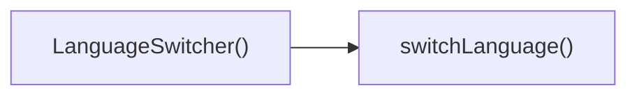

## Genel Bakış
LanguageSwitcher modülü, uygulamanın dil seçimini sağlayan basit bir React bileşenidir. Kullanıcıya mevcut dillerden birini seçme ve bu seçimi uygulama genelinde güncelleme imkanı sunar.

## Fonksiyon Grupları
### Ana Bileşen
Bu grup, dil değiştirme işlevselliğini tek bir fonksiyonda toplar ve kullanıcı arayüzünü render eder.
- LanguageSwitcher

### Dil Değiştirme Mantığı
Bu grup, seçilen dili uygulama genelinde güncellemek için kullanılan işlevi içerir.
- switchLanguage

---

## AXIOMS – Mimari Varsayımlar
Bu modül için özel aksiyom tanımlanmamıştır.

**Aksiyom 1**: Eğer uygulama içinde ortak bir dil durumu (global language state) bulunmuyorsa, `LanguageSwitcher` bileşeni mevcut dili gösteremez ve dil değişikliği yapılamaz.  

**Aksiyom 2**: Eğer `switchLanguage` fonksiyonuna `'tr'` ya da `'en'` dışındaki bir değer (`newLang`) gönderilirse, geçersiz dil hatası oluşur ve dil değişikliği gerçekleşmez.  

**Aksiyom 3**: Eğer React çalışma ortamı (React runtime ve ilgili bağlam sağlayıcıları) mevcut değilse, `LanguageSwitcher` bileşeni render edilemez ve hiçbir etkileşim gerçekleşmez.  

**Aksiyom 4**: Eğer `switchLanguage` fonksiyonu çağrıldığında ilgili dil paketleri (i18n çeviri dosyaları) yüklenmemişse, UI’da yeni dilde metinler gösterilemez ve varsayılan (fallback) dil kullanılır.

---

## FONKSIYON DETAYLARI

### LanguageSwitcher
**Ne yapar**: React uygulamasında dil değiştirme arayüzünü sağlayan bir fonksiyon bileşeni döndürür.  
**Nasıl yapar**: Fonksiyon, bir React Functional Component (FC) tanımlayarak, kullanıcıların mevcut dili seçebileceği UI öğelerini render eder. Bileşen içinde dil değişimini tetikleyen `switchLanguage` fonksiyonu çağrılabilir.  
**Parametreler**:  
- *Yok* — Bu fonksiyon parametre almaz.  
**Dönüş**: React.FC — Dil seçici bileşenini temsil eden bir React Functional Component döndürür.

### switchLanguage
**Ne yapar**: Uygulamanın aktif dilini, verilen yeni dil koduna (`'tr'` veya `'en'`) göre değiştirir.  
**Nasıl yapar**: Fonksiyon, `newLang` parametresiyle belirtilen dil kodunu alır ve uygulama çapında dil ayarını günceller; genellikle i18n kütüphanesi veya global durum yöneticisi aracılığıyla bu değişikliği yayar.  
**Parametreler**:  
- newLang: `'tr' | 'en'` — Değiştirilecek hedef dil kodu.  
**Dönüş**: Belirtilmemiş — Fonksiyonun dönüş tipi dokümantasyonda tanımlı değildir (muhtemelen `void`).

---

## AST POINTERS

### [N1_NASIL] AST Pointer: src/components/LanguageSwitcher.tsx::LanguageSwitcher
- **params**: (parametre yok)
- **ic_degiskenler**:
  - `lang` — `useI18n` hookundan gelen mevcut dil kodu (`'tr'` | `'en'`).
  - `setLang` — `useI18n` hookundan gelen fonksiyon, dil değiştiğinde state’i günceller.
  - `t` — `useI18n` hookundan gelen çeviri fonksiyonu, anahtarları yerelleştirir.
  - `pathname` — `usePathname` hookundan gelen mevcut URL yolu (string).
  - `router` — `useRouter` hookundan gelen router nesnesi, `push` ve `refresh` metodlarını sağlar.
  - `switchLanguage` — iç tanımlı fonksiyon, dil değişimini yönetir.
- **Dönüş**: React.FC (JSX elemanı döner; yan etkileri: dil cookie ve localStorage güncellenir, router ile yönlendirme yapılır).

### [N2_NASIL] AST Pointer: src/components/LanguageSwitcher.tsx::switchLanguage
- **params**: `newLang: 'tr' | 'en'`
- **ic_degiskenler**:
  - `newLang` — hedef dil kodu, `'tr'` veya `'en'`.
  - `lang` — dış kapsamdaki `useI18n` hookundan alınan mevcut dil (karşılaştırma için).
  - `document.cookie` — tarayıcı cookie’sine `NEXT_LOCALE` anahtarıyla yeni dil değerini yazar.
  - `localStorage` — `setItem('lang', newLang)` ile yeni dili kalıcı olarak saklar (try/catch içinde).
  - `setLang` — `useI18n` hookundan gelen fonksiyon, client‑side state’i günceller.
  - `pathname` — dış kapsamdaki `usePathname` hookundan gelen mevcut yol.
  - `segments` — `pathname.split('/')` sonrası boş olmayan parçalar dizisi.
  - `firstSegment` — `segments[0]`, yolun ilk bölümü (varsa).
  - `newPath` — hesaplanan yeni URL yolu (string).
  - `router` — dış kapsamdaki `useRouter` hookundan gelen nesne; `push` ve `refresh` metodları çağrılır.
- **Dönüş**: yok (fonksiyon yan etkilerle çalışır; cookie, localStorage, state ve router güncellenir).

---

## ÇAĞRI HARİTASI

### Dışarıya Çağrılar (Outgoing)
**LanguageSwitcher()** fonksiyonu, **switchLanguage** fonksiyonunu çağırarak dil değiştirme işlemini başlatır.

### Dışarıdan Çağrılanlar (Incoming)
Verilen veride bu modülü kullanan dış dosya veya fonksiyon belirtilmemiştir.

### İç İçe Fonksiyonlar (Nested)
Yok

---

## DOSYA-İÇİ ÇAĞRI GRAFİĞİ
  LanguageSwitcher() → switchLanguage()

---

## NODE ID STANDARD

  file: src\components\LanguageSwitcher.tsx
  function: src\components\LanguageSwitcher.tsx::LanguageSwitcher
  function: src\components\LanguageSwitcher.tsx::switchLanguage

---

## DISA AKTARILANLAR (EXPORTS)
  export: LanguageSwitcher