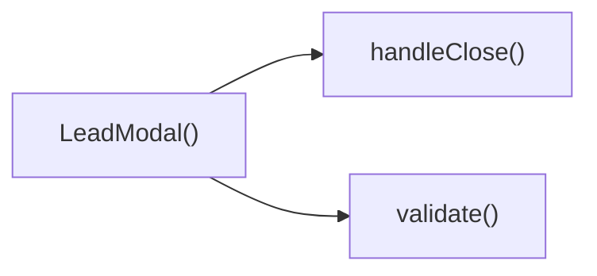

## Genel Bakış
Bu modül, kullanıcıdan potansiyel müşteri bilgilerini toplama amacıyla bir açılır pencere (modal) bileşeni tanımlar. Modalın görünürlüğü, kapatılması ve formun doğrulama‑gönderme işlevleri içindeki fonksiyonlarla koordine edilerek kullanıcı deneyimi sağlanır.

## Fonksiyon Grupları
### Modal Görünümü ve Kapatma İşlemleri
Bu grup, modalın render edilmesi, açık/kapalı durumu yönetimi ve kullanıcı tarafından kapatma talebini işleyen fonksiyonları içerir.
- LeadModal, handleClose

### Form Doğrulama ve Gönderme
Bu grup, kullanıcının girdiği bilgilerin geçerliliğini kontrol eden ve geçerli olduğunda veriyi işleyen işlevleri bir araya getirir.
- validate, submit

---

## AXIOMS – Mimari Varsayımlar
Bu modülün doğru çalışması için aşağıdaki koşulların sağlanması gerekir.

- **Eğer** `open` prop’u boolean olarak verilmezse, **modalın** görünürlüğü kontrol edilemez.  
- **Eğer** `onClose` prop’u fonksiyon olarak verilmezse, **handleClose()** çağrıldığında hata oluşur.  
- **Eğer** `productName` prop’u string olarak verilmezse, **validate()** ürün adı alanını kontrol edemez.  
- **Eğer** `_productId` (veya `__productId`) prop’u tanımlanmazsa, **submit()** işlemi sırasında ürün kimliği eksik olur.  
- **Eğer** `applicationAreas` sabiti boş bir dizi ise, **validate()** veya **submit()** içinde alan seçimi kontrolü başarısız olur.  
- **Eğer** `validate()` fonksiyonu çağrılmadan **submit()** çalıştırılırsa, form geçerliliği garantisi olmaz.  
- **Eğer** `submit()` fonksiyonuna geçirilen `e` argümanı `React.FormEvent` tipi değilse, olay nesnesi üzerinden veri çıkarma işlemi başarısız olur.  
- **Eğer** `handleClose()` fonksiyonu çağrıldığında `onClose` prop’u tanımlı değilse, modal kapatma işlemi gerçekleşemez.

---

---

## FONKSIYON DETAYLARI

### LeadModal
**Ne yapar**: Potansiyel müşteri (lead) oluşturmak için kullanılan veri giriş formunu içeren bir React modal bileşenidir.
**Nasıl yapar**: `open` prop'u ile görünürlüğü kontrol eder, `productName` ve `_productId` bilgilerini kullanarak form içeriğini bağlama duyarlı hale getirir ve kullanıcı etkileşimlerini yönetir.
**Parametreler**:
- open: boolean — Modalın açık veya kapalı olduğunu belirten durum bayrağı.
- onClose: function — Modalın kapatılması gerektiğinde çalıştırılan geri çağırım fonksiyonu.
- productName: string — Lead ile ilişkilendirilecek ürünün adı.
- _productId: string | number — Lead ile ilişkilendirilecek ürünün benzersiz tanımlayıcısı.
**Dönüş**: React.FC<LeadModalProps> — React bileşeni yapısı döner.

### validate
**Ne yapar**: Form içindeki kullanıcı girdilerinin gerekli kriterlere uygun olup olmadığını denetleyen doğrulama fonksiyonudur.
**Nasıl yapar**: Form alanlarını (muhtemelen isim, e-posta vb.) kontrol ederek, eksik veya hatalı veri varsa hata durumlarını ayarlar.
**Parametreler**: Yok
**Dönüş**: void — Herhangi bir değer döndürmez, genellikle durum (state) güncellemesi yapar.

### submit
**Ne yapar**: Formun gönderilme olayını ele alan ve lead oluşturma işlemini başlatan fonksiyondur.
**Nasıl yapar**: Tarayıcının varsayılan form gönderme davranışını engeller, verileri doğrular (`validate`) ve başarılıysa ilgili işlemleri gerçekleştirir.
**Parametreler**:
- e: React.FormEvent — Form gönderildiğinde oluşan olay nesnesi.
**Dönüş**: void — Herhangi bir değer döndürmez.

### handleClose
**Ne yapar**: Modal penceresini kapatma işlemini tetikleyen ve gerekli temizlik işlemlerini yapan fonksiyondur.
**Nasıl yapar**: Üst bileşenden gelen `onClose` prop'unu çağırarak modalın ekrandan kaldırılmasını sağlar.
**Parametreler**: Yok
**Dönüş**: void — Herhangi bir değer döndürmez.

---

## INTERFACES

### LeadModalProps
- `open: boolean`
- `onClose: () => void`
- `productName?: string`
- `_productId?: string`

---

## AST POINTERS

### [N1_NASIL] AST Pointer: C:\Users\alize\venthub-hvac\src\components\LeadModal.tsx::LeadModal
- **params**: open, onClose, productName, _productId
- **ic_degiskenler**: 
  - `__productId` — _productId parametresinin dahili yeniden isimlendirilmiş hali
  - `useState` hook türevli state setterları: setName, setCompany, setEmail, setPhone, setCity, setAppArea, setConsent, setMessage, setIsSuccess, setSubmitted, setErrors
  - `t` — useI18n hook'undan alınan çeviri fonksiyonu
- **Dönüş**: React.FC<LeadModalProps> tipinde React bileşeni

### [N2_NASIL] AST Pointer: C:\Users\alize\venthub-hvac\src\components\LeadModal.tsx::validate
- **params**: (parametre yok)
- **ic_degiskenler**:
  - `e` — Form doğrulama hatalarını tutan Record<string, string> tipinde nesne
  - `name` — Formdaki isim alanı değeri, boşluk kontrolü için kullanılır
  - `email` — Formdaki e-posta alanı değeri, iletişim bilgisi kontrolü için kullanılır
  - `phone` — Formdaki telefon alanı değeri, iletişim bilgisi kontrolü için kullanılır
  - `consent` — Kullanıcı onay durumu, onay kontrolü için kullanılır
  - `t` — i18n çeviri fonksiyonu, çevrilmiş hata mesajları almak için kullanılır
- **Dönüş**: Doğrulama hatalarını içeren Record<string, string> nesnesi

### [N3_NASIL] AST Pointer: C:\Users\alize\venthub-hvac\src\components\LeadModal.tsx::submit
- **params**: e: React.FormEvent
- **ic_degiskenler**:
  - `e` — Form gönderim olay nesnesi, varsayılan form davranışını engellemek için kullanılır
  - `v` — validate() fonksiyonundan dönen hata nesnesi
  - `setErrors` — Form hata state'ini güncelleyen setter fonksiyonu
  - `Object.keys` — Yerel JavaScript nesne metodu, hata nesnesinin anahtar sayısını almak için kullanılır
  - `setSubmitted` — Form gönderim durumu state'ini güncelleyen setter
  - `setIsSuccess` — Başarı durumu state'ini güncelleyen setter
  - `handleClose` — Modal kapatma işlemini yürüten dahili fonksiyon
- **Dönüş**: yok

### [N4_NASIL] AST Pointer: C:\Users\alize\venthub-hvac\src\components\LeadModal.tsx::handleClose
- **params**: (parametre yok)
- **ic_degiskenler**:
  - `onClose` — Prop olarak alınan üst bileşen kapatma callback fonksiyonu
  - `setIsSuccess` — Başarı durumu state'ini sıfırlayan setter
  - `setName` — İsim alanı state'ini sıfırlayan setter
  - `setCompany` — Şirket alanı state'ini sıfırlayan setter
  - `setEmail` — E-posta alanı state'ini sıfırlayan setter
  - `setPhone` — Telefon alanı state'ini sıfırlayan setter
  - `setCity` — Şehir alanı state'ini sıfırlayan setter
  - `setAppArea` — Uygulama alanı state'ini sıfırlayan setter
  - `setConsent` — Kullanıcı onay state'ini sıfırlayan setter
  - `setMessage` — Mesaj alanı state'ini varsayılan değere sıfırlayan setter
  - `productName` — Prop olarak alınan ürün ismi, varsayılan mesaj oluşturmak için kullanılır
  - `t` — i18n çeviri fonksiyonu, varsayılan mesajın çevirisini almak için kullanılır
  - `setErrors` — Form hata state'ini sıfırlayan setter
- **Dönüş**: yok

---

## ÇAĞRI HARİTASI

### Disariya Cagrilar (Outgoing)
LeadModal() fonksiyonu, kapatma ve doğrulama işlemleri için sırasıyla handleClose ve validate fonksiyonlarını çağırıyor.

### Disaridan Cagrilanlar (Incoming)
Bu modüle ait dışarıdan gelen çağrı bilgisi verilmemiştir.

### Ic Ice Fonksiyonlar (Nested)
Veri bulunmamaktadır.

---

## DOSYA-İÇİ ÇAĞRI GRAFİĞİ
  LeadModal() → handleClose()
  LeadModal() → validate()

---

## NODE ID STANDARD

  file: src\components\LeadModal.tsx
  function: src\components\LeadModal.tsx::LeadModal
  function: src\components\LeadModal.tsx::validate
  function: src\components\LeadModal.tsx::submit
  function: src\components\LeadModal.tsx::handleClose

---

## DISA AKTARILANLAR (EXPORTS)
  export: LeadModal