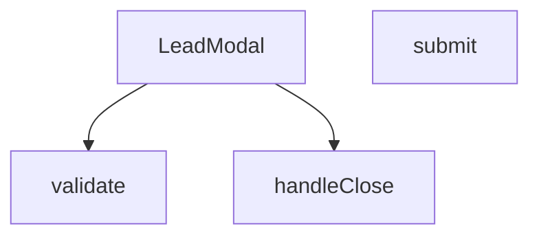

## Genel Bakış
`LeadModal` bileşeni, bir ürünle ilgili potansiyel müşteri (lead) bilgilerini toplamak için kullanılan bir modal penceresidir. Açılma/kapanma kontrolü, form doğrulama ve gönderim işlemlerini içerir.

## Fonksiyon Grupları
### Modal Kontrol ve Render
Modalın görünürlüğünü yönetir, kapanma olayını işler ve JSX çıktısını üretir.  
- LeadModal

### Form Doğrulama
Kullanıcı tarafından girilen verilerin geçerliliğini kontrol eder.  
- validate

### Form İşleme
Form gönderildiğinde olayları yakalar, doğrulama çalıştırır ve başarılı ise veriyi işler; ayrıca hata durumlarını yönetir.  
- submit, handleClose

---

## AXIOMS – Mimari Varsayımlar
Bu modül için özel aksiyom tanımlanmamıştır.

**Aksiyom 1**: Eğer `LeadModal` bileşenine `open` prop’u sağlanmazsa, modal hiçbir zaman görüntülenmez.  
**Aksiyom 2**: Eğer `LeadModal` bileşenine `onClose` callback’i sağlanmazsa, modal kapatılmaya çalışıldığında bir hata oluşur ve UI’da “close” işlemi gerçekleşmez.  
**Aksiyom 3**: Eğer `LeadModal` bileşenine `productName` prop’u sağlanmazsa, modal içinde ürün adı gösterilemez; bu durum UI’da boş bir alan ya da “bilinmiyor” metni olarak ortaya çıkar.  
**Aksiyom 4**: Eğer `LeadModal` bileşenine `_productId` (alias `__productId`) prop’u sağlanmazsa, `validate` ve `submit` fonksiyonları ürün kimliğine erişemez ve ilgili iş mantığı (ör. API çağrısı) çalışmaz.  
**Aksiyom 5**: Eğer `validate()` fonksiyonu çağrıldığında gerekli form alanları (ör. isim, e‑posta vb.) eksik ya da geçersizse, `validate` `false` döner ve form gönderimi engellenir.  
**Aksiyom 6**: Eğer `submit(e)` fonksiyonu çağrıldığında `e` bir `React.FormEvent` nesnesi değilse, fonksiyon içinde `preventDefault()` çağrısı başarısız olur ve sayfa yenilenmesi gerçekleşir.  
**Aksiyom 7**: Eğer `submit(e)` fonksiyonu içinde `validate()` `false` dönerse, `submit` işlemine devam edilmez ve form verileri gönderilmez.  
**Aksiyom 8**: Eğer `handleClose()` fonksiyonu çağrıldığında `onClose` callback’i tanımlı değilse, modal kapanmaz ve UI’da “close” butonu işlevsiz kalır.  
**Aksiyom 9**: Eğer `handleClose()` fonksiyonu çağrıldığında `onClose` tanımlıysa, `onClose` callback’i çalıştırılır ve modal kapanır.  

*Domain‑specific notlar*: Bu aksiyomlar, `LeadModal` bileşeninin doğru çalışması için gerekli olan temel prop ve fonksiyon davranışlarını tanımlar; değer sınırları veya kabul kriterleri fonksiyon gövdesinde belirtilmediği için “bilinmiyor” olarak bırakılmıştır.

---

## FONKSİYON DETAYLARI

### LeadModal
**Ne yapar**: Kullanıcıların iletişim bilgilerini topladığı bir modal pencere bileşeni oluşturur.  
**Nasıl yapar**: Props olarak gelen `open`, `onClose`, `productName` ve `_productId` değerlerini alır, bu değerleri modal içinde gösterir ve form gönderimi için `validate`, `submit` gibi yardımcı fonksiyonları kullanır.  
**Parametreler**:
- `open`: boolean — Modal’ın açık/kapalı durumunu belirler.  
- `onClose`: () => void — Modal kapatıldığında çalıştırılacak geri çağırma fonksiyonu.  
- `productName`: string — Modal içinde gösterilecek ürün adı.  
- `_productId`: any — İçeride `__productId` olarak yeniden adlandırılan ürün kimliği.  
**Dönüş**: React.FC\<LeadModalProps\> — Tanımlı prop tipleriyle bir React fonksiyonel bileşeni döndürür.

### validate
**Ne yapar**: Form gönderiminde girilen verileri kontrol eder ve hataları bir nesne olarak döndürür.  
**Nasıl yapar**: Form submit olayında `e.preventDefault()` ile varsayılan davranışı engeller, `validate()` fonksiyonunu çağırarak doğrulama sonuçlarını alır, `setErrors` ile hataları state’e kaydeder ve hata yoksa formun gönderilmesine izin verir.  
**Parametreler**: Yok.  
**Dönüş**: Bilinmiyor (kod içinde dönüş değeri kullanılmaktadır; muhtemelen hata nesnesi).

### submit
**Ne yapar**: Form gönderildiğinde çalıştırılan ana işlem akışını yönetir.  
**Nasıl yapar**: `e.preventDefault()` ile formun doğal gönderimini durdurur, `validate()` ile doğrulama yapar, hatalar varsa işlemi sonlandırır; hatasız ise `setSubmitted(true)` ile gönderim durumunu işaretler, ardından API taklidi için gecikmeli bir `setTimeout` içinde başarı durumunu ayarlar, modalı otomatik kapatmak için ikinci bir gecikme başlatır.  
**Parametreler**:
- `e`: React.FormEvent — Form submit olay nesnesi.  
**Dönüş**: Bilinmiyor (fonksiyon içinde yan etkiler vardır, dönüş değeri belirtilmemiştir).

### handleClose
**Ne yapar**: Modal kapanış işlemini tetikler.  
**Nasıl yapar**: İçeride tanımlı `handleClose` fonksiyonunu çağırarak modalın kapanmasını sağlar; bu, dışarıdan gelen `onClose` geri çağırma fonksiyonuna yönlendirilmiş olabilir.  
**Parametreler**: Yok.  
**Dönüş**: Bilinmiyor (fonksiyon yan etki üretir, dönüş değeri belirtilmemiştir).

---

## INTERFACES

### LeadModalProps
- `open: boolean`
- `onClose: () => void`
- `productName?: string`
- `_productId?: string`

---

## AST POINTERS

### [N1_NASIL] AST Pointer: src/components/LeadModal.tsx::validate
- **params**: (none)
- **ic_degiskenler**:
  - `e` — boş nesne (`Record<string, string>`) oluşturur; hataları tutmak için kullanılır.
  - `name` — bileşenin `name` state’ini temsil eder; boşsa `e.name` e hata mesajı atanır.
  - `email` — bileşenin `email` state’ini temsil eder; boşsa `e.contact` e hata mesajı atanır.
  - `phone` — bileşenin `phone` state’ini temsil eder; boşsa `e.contact` e hata mesajı atanır.
  - `consent` — bileşenin `consent` state’ini temsil eder; `false` ise `e.consent` e hata mesajı atanır.
  - `t` — i18n çeviri fonksiyonu; hata mesajlarını çevirir.
- **Dönüş**: `Record<string, string>` – topladığı hataları döndürür.

### [N2_NASIL] AST Pointer: src/components/LeadModal.tsx::submit
- **params**: `e: React.FormEvent`
- **ic_degiskenler**:
  - `e` — form submit olayını temsil eder; `e.preventDefault()` ile varsayılan davranışı engeller.
  - `v` — `validate()` fonksiyonunun döndürdüğü hata nesnesi.
  - `errors` — bileşenin `errors` state’ini güncellemek için `setErrors(v)` ile kullanılır.
  - `Object` — `Object.keys(v).length` ile hata sayısı kontrol edilir; eğer hata varsa fonksiyon erken döner.
  - `setSubmitted` — bileşenin `submitted` state’ini `true` yapar.
  - `setIsSuccess` — bileşenin `isSuccess` state’ini `true` yapar (API çağrısı simülasyonu).
  - `setTimeout` — 1200 ms sonra başarı durumunu ayarlar, ardından 3000 ms sonra `handleClose()` çağrılır.
  - `handleClose` — modalı kapatmak için çağrılır.
- **Dönüş**: yok (void)

### [N3_NASIL] AST Pointer: src/components/LeadModal.tsx::handleClose
- **params**: (none)
- **ic_degiskenler**:
  - `onClose` — üst bileşenden gelen kapanış callback’i; `onClose()` ile modal kapatılır.
  - `setIsSuccess` — `isSuccess` state’ini `false` yapar.
  - `setName`, `setCompany`, `setEmail`, `setPhone`, `setCity`, `setAppArea`, `setConsent` — ilgili state’leri sıfırlar veya boş string’e ayarlar.
  - `setMessage` — `productName` varsa varsayılan mesajı çeviri ile ayarlar, yoksa boş string’e ayarlar.
  - `setErrors` — hata state’ini boş nesneyle sıfırlar.
  - `setTimeout` — 300 ms sonra yukarıdaki state sıfırlama işlemlerini gerçekleştirir.
- **Dönüş**: yok (void)

---

## MERMAID CALL GRAPH

## NODE ID STANDARD

  file: src\components\LeadModal.tsx
  function: src\components\LeadModal.tsx::LeadModal
  function: src\components\LeadModal.tsx::validate
  function: src\components\LeadModal.tsx::submit
  function: src\components\LeadModal.tsx::handleClose

---

## DISA AKTARILANLAR (EXPORTS)
  export: LeadModal

---

## STİL TOKENLERİ

### Arbitrary Değerler (token'a geçirilmemiş)
Yok — tüm stiller token'a geçirilmiş. ✅

### Kullanılan Token'lar (zaten token'a geçirilmiş)
- (yok)

### Tailwind Sınıf Özeti
- **Renkler:** `bg-gradient-to-br`, `bg-gray-100`, `bg-gray-50`, `bg-gray-50/50`, `bg-green-100`, `bg-primary-navy`, `bg-secondary-blue/80`, `bg-white`, `bg-white/10`, `border-2`, `border-gray-100`, `border-gray-200`, `border-gray-300`, `border-red-400`, `border-t`
- **Layout:** `absolute`, `backdrop-blur-md`, `backdrop-blur-sm`, `block`, `fixed`, `flex`, `flex-1`, `flex-col`, `from-blue-600/20`, `gap-1`, `gap-2`, `gap-3`, `gap-4`, `gap-5`, `grid`
- **Varyant/Responsive:** `:`, `disabled:`, `focus-visible:`, `focus:`, `group-hover:`, `hover:`, `md:`, `sm:` önekleri
- **Yardımcı Sınıflar:** `${errors.name`, `-mt-2`, `:`, `animate-bounce`, `animate-in`, `animate-spin`, `border`, `cursor-pointer`, `disabled:cursor-not-allowed`, `disabled:opacity-70`, `duration-300`, `fade-in`, `focus-visible:outline-none`, `focus-visible:ring-2`, `focus-visible:ring-gray-300`