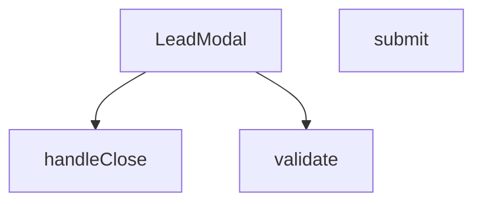

## Genel Bakış
Bu modül, potansiyel müşteri (lead) bilgilerini toplamak için kullanılan bir modal form bileşeni içerir. Bileşen, formun doğrulamasını, gönderilmesini ve modalın açılıp kapanma kontrolünü yöneterek kullanıcı verilerini sisteme kaydetme işlemini gerçekleştirir.

## Fonksiyon Grupları
### Modal Kontrol ve Render
Modalın açılıp kapanma durumunu kontrol eder, prop'lar aracılığıyla görünürlüğü yönetir ve form alanlarını içeren arayüzü oluşturur.
- LeadModal

### Form Doğrulama
Kullanıcı tarafından girilen form verilerinin geçerliliğini kontrol eder; zorunlu alanların doluluğunu ve veri formatını doğrular.
- validate

### Form İşleme
Form gönderim olayını yakalayarak doğrulama çalıştırır, başarılı ise veriyi işler; ayrıca modalı kapatma ve ilgili geri çağırma fonksiyonunu tetikleme işlemini yönetir.
- submit, handleClose

---

## AXIOMS – Mimari Varsayımlar

[Aksiyom 1]: Eğer `open` prop'u sağlanmazsa, modalın açık/kapalı durumu belirlenemez ve bileşen render edilse bile görünür olup olmadığı kontrol edilemez.

[Aksiyom 2]: Eğer `onClose` prop'u sağlanmazsa, kullanıcı modalı kapatamaz; handleClose fonksiyonu kapatma işlemini tetikleyecek bir callback bulamaz.

[Aksiyom 3]: Eğer `productName` prop'u sağlanmazsa, formda ürün adı gösterilemez; hangi ürün için lead toplandığı kullanıcıya bildirilemez.

[Aksiyom 4]: Eğer validate fonksiyonu submit öncesinde çağrılmazsa, geçersiz veya eksik form verileriyle gönderim yapılabilir.

[Aksiyom 5]: Eğer submit fonksiyonu bir FormEvent almazsa, formun varsayılan davranışı (sayfa yenileme) engellenemez.

[Aksiyom 6]: Eğer handleClose fonksiyonu onClose prop'unu çağırmazsa, modal kapatıldığında üst bileşen durumdan haberdar olamaz ve modal tekrar açılamaz hale gelebilir.

---

## FONKSİYON DETAYLARI

### LeadModal
**Ne yapar**: Kullanıcıların iletişim bilgilerini topladığı bir modal pencere bileşeni oluşturur.  
**Nasıl yapar**: Props olarak gelen `open`, `onClose`, `productName` ve `_productId` değerlerini alır, bu değerleri modal içinde gösterir ve form gönderimi için `validate`, `submit` gibi yardımcı fonksiyonları kullanır.  
**Parametreler**:
- `open`: boolean — Modal’ın açık/kapalı durumunu belirler.  
- `onClose`: () => void — Modal kapatıldığında çalıştırılacak geri çağırma fonksiyonu.  
- `productName`: string — Modal içinde gösterilecek ürün adı.  
- `_productId`: any — İçeride `__productId` olarak yeniden adlandırılan ürün kimliği.  
**Dönüş**: React.FC\<LeadModalProps\> — Tanımlı prop tipleriyle bir React fonksiyonel bileşeni döndürür.

### validate
**Ne yapar**: Form gönderiminden önce form alanlarının doğrulama işlemini tetikler ve doğrulama hatalarını state'e kaydeder. Form geçerliyse gönderim sürecini başlatır.
**Nasıl yapar**: Asenkron bir arrow function olarak tanımlanmıştır ve `React.FormEvent` parametresi alır. Önce `e.preventDefault()` ile formun varsayılan tarayıcı davranışını (sayfa yenileme) engeller. Ardından dışarıdan tanımlı `validate()` fonksiyonunu çağırarak doğrulama sonuçlarını alır ve `setErrors` ile hata state'ine atar. Eğer hata nesnesinde anahtar varsa (yani doğrulama başarısızsa) fonksiyondan erken çıkış yapar. Doğrulama başarılıysa `setSubmitted(true)` ile gönderim durumunu aktif eder ve `submitContactMessage` fonksiyonunu `supabaseBrowserClient` ile birlikte çağırır. Gönderilen veriler arasında `name`, `message`, `email`, `phone`, `company`, `city`, `applicationArea` (appArea'dan), `subject` (productName varsa `lead:${productName}`, yoksa `lead` olarak) ve `consent` alanları bulunur. Başarı durumunda `setIsSuccess(true)` ve `setSubmitted(false)` çağrıları yapılır, ardından 3000 milisaniye gecikmeyle `handleClose()` çağrılarak modal otomatik kapatılır. Hata durumunda `reportError` ile hata raporlanır (kaynak: `LeadModal.submit`), `setSubmitted(false)` yapılır ve kullanıcıya çevrilmiş bir hata mesajı (`t('lead.errors.submitFailed')`) `setErrors` aracılığıyla gösterilir. Hata durumunda form açık kalır ve kullanıcı girdileri korunur; teknik hata detayı yalnızca teşhis kaydına gider.
**Parametreler**:
- e: React.FormEvent — Form gönderilme olayı nesnesi; varsayılan davranışı engellemek için kullanılır
**Dönüş**: Bilinmiyor (return tipi belirtilmemiş)

### submit
**Ne yapar**: Form gönderimini simüle eden ve geçmişte kusurlu bir yapıya sahip olan fonksiyon. Dokümantasyon notuna göre bu fonksiyon, 2026-08-26 tarihinde ölçülen canlı bir kusuru belgelemektedir.
**Nasıl yapar**: Fonksiyon gövdesi verilmemiştir, yalnızca docstring bilgisi mevcuttur. Docstring'e göre eskiden bu fonksiyonun içinde `setTimeout(1200ms)` bulunuyordu ve yorumu "Simulate API Call for better UX instead of mailto" şeklindeydi. Yani ana sayfadaki ve her ürün sayfasındaki talep formu müşteriye "aldık" mesajı gösterirken hiçbir yere veri yazmıyordu. Bu kusur üç ay boyunca canlı ortamda tespit edilememiş ve 2026-08-26'da ölçülmüştür. Mevcut durumda fonksiyonun nasıl çalıştığına dair gövde bilgisi verilmemiştir.
**Parametreler**:
- e: React.FormEvent — Form gönderilme olayı nesnesi
**Dönüş**: Bilinmiyor (return tipi belirtilmemiş)

### handleClose
**Ne yapar**: Modal penceresini kapatma işlemini tetikler.
**Nasıl yapar**: Arrow function olarak tanımlanmıştır. Gövdesinde yalnızca `handleClose()` çağrısı bulunmaktadır. Bu, muhtemelen üst bileşenden veya bir context/prop aracılığıyla gelen kapatma fonksiyonunu çağırır. Fonksiyonun kendisi bir sarmalayıcı (wrapper) işlevi görür.
**Parametreler**: Belirtilmemiş
**Dönüş**: Bilinmiyor (return tipi belirtilmemiş)

---

## İTHALATLAR (IMPORTS)
- import: ../hooks/useLocalizedRoutes::useLocalizedRoutes
- import: ../i18n/I18nProvider::useI18n
- import: ../lib/errorReporter::reportError
- import: ../lib/services/contactMessageService::submitContactMessage
- import: ../lib/supabase/client::supabaseBrowserClient
- import: next/link::Link
- import: react::React
- import: react::useState

---

## INTERFACES

### LeadModalProps
- `open: boolean`
- `onClose: () => void`
- `productName?: string`
- `_productId?: string`

---

## AST POINTERS

### [N1_NASIL] AST Pointer: LeadModal.tsx::validate
- **params**: (parametre yok)
- **ic_degiskenler**:
  - `e` — hataları toplayan boş `Record<string, string>` nesnesi; koşullar sağlanmazsa `name`, `contact`, `consent` anahtarlarıyla hata mesajı eklenir
  - `name` — dış kapsamdan gelen form alanı; `trim()` ile boşluk kontrolü yapılır
  - `email` — dış kapsamdan gelen form alanı; `trim()` ile boşluk kontrolü yapılır
  - `phone` — dış kapsamdan gelen form alanı; `trim()` ile boşluk kontrolü yapılır
  - `consent` — dış kapsamdan gelen onay boolean'ı; falsy ise hata eklenir
  - `t` — dış kapsamdan gelen çeviri fonksiyonu; hata mesajlarını yerelleştirmek için kullanılır
- **Dönüş**: `Record<string, string>` — doğrulama hatalarını içeren nesne; hata yoksa boş nesne döner

### [N2_NASIL] AST Pointer: LeadModal.tsx::submit
- **params**: `e` — `React.FormEvent` tipinde form gönderim olayı
- **ic_degiskenler**:
  - `v` — `validate()` çağrısının dönüşü; doğrulama hatalarını tutar
  - `name` — dış kapsamdan gelen form alanı; `submitContactMessage` payload'ında kullanılır
  - `message` — dış kapsamdan gelen form alanı; `submitContactMessage` payload'ında kullanılır
  - `email` — dış kapsamdan gelen form alanı; `submitContactMessage` payload'ında kullanılır
  - `phone` — dış kapsamdan gelen form alanı; `submitContactMessage` payload'ında kullanılır
  - `company` — dış kapsamdan gelen form alanı; `submitContactMessage` payload'ında kullanılır
  - `city` — dış kapsamdan gelen form alanı; `submitContactMessage` payload'ında kullanılır
  - `appArea` — dış kapsamdan gelen form alanı; `applicationArea` anahtarıyla `submitContactMessage` payload'ına gönderilir
  - `productName` — dış kapsamdan gelen prop; varsa `subject` değeri `"lead:{productName}"` olarak, yoksa `"lead"` olarak ayarlanır
  - `consent` — dış kapsamdan gelen onay boolean'ı; `submitContactMessage` payload'ında kullanılır
  - `err` — `catch` bloğunda yakalanan hata nesnesi; `reportError` ile teşhis kaydına gönderilir
  - `supabaseBrowserClient` — dış kapsamdan gelen Supabase istemcisi; `submitContactMessage` fonksiyonuna birinci argüman olarak geçilir
- **Dönüş**: yok (async void)

### [N3_NASIL] AST Pointer: LeadModal.tsx::handleClose
- **params**: (parametre yok)
- **ic_degiskenler**:
  - `onClose` — dış kapsamdan gelen kapatma callback'i; modal kapatma işlemini tetikler
  - `productName` — dış kapsamdan gelen prop; `productName` varsa `t('lead.defaultMessage', { productName })` ile varsayılan mesaj oluşturulur, yoksa boş string atanır
  - `t` — dış kapsamdan gelen çeviri fonksiyonu; varsayılan mesajı yerelleştirmek için kullanılır
- **Dönüş**: yok (yan etki: `onClose()` çağrılır, 300ms sonra tüm form state'leri sıfırlanır)

### [N4_NASIL] AST Pointer: LeadModal.tsx::handleClose (setTimeout callback)
- **params**: (parametre yok)
- **ic_degiskenler**:
  - `productName` — dış kapsamdan gelen prop; varsa `t('lead.defaultMessage', { productName })` ile varsayılan mesaj oluşturulur, yoksa boş string atanır
  - `t` — dış kapsamdan gelen çeviri fonksiyonu; varsayılan mesajı yerelleştirmek için kullanılır
- **Dönüş**: yok (yan etki: `isSuccess`, `name`, `company`, `email`, `phone`, `city`, `appArea`, `consent`, `message`, `errors` state'leri sıfırlanır)

---

## MERMAID CALL GRAPH

## NODE ID STANDARD

  file: src\components\LeadModal.tsx
  function: src\components\LeadModal.tsx::LeadModal
  function: src\components\LeadModal.tsx::validate
  function: src\components\LeadModal.tsx::submit
  function: src\components\LeadModal.tsx::handleClose

---

## DISA AKTARILANLAR (EXPORTS)
  export: LeadModal

---

## STİL TOKENLERİ

### Arbitrary Değerler (token'a geçirilmemiş)
Yok — tüm stiller token'a geçirilmiş. ✅

### Kullanılan Token'lar (zaten token'a geçirilmiş)
- (yok)

### Tailwind Sınıf Özeti
- **Renkler:** `bg-gradient-to-br`, `bg-gray-100`, `bg-gray-50`, `bg-gray-50/50`, `bg-green-100`, `bg-primary-navy`, `bg-red-50`, `bg-secondary-blue/80`, `bg-white`, `bg-white/10`, `border-2`, `border-gray-100`, `border-gray-200`, `border-gray-300`, `border-red-200`
- **Layout:** `absolute`, `backdrop-blur-md`, `backdrop-blur-sm`, `block`, `fixed`, `flex`, `flex-1`, `flex-col`, `from-blue-600/20`, `gap-1`, `gap-2`, `gap-3`, `gap-4`, `gap-5`, `grid`
- **Varyant/Responsive:** `:`, `disabled:`, `focus-visible:`, `focus:`, `group-hover:`, `hover:`, `md:`, `sm:` önekleri
- **Yardımcı Sınıflar:** `${errors.name`, `-mt-2`, `:`, `animate-bounce`, `animate-in`, `animate-spin`, `border`, `cursor-pointer`, `disabled:cursor-not-allowed`, `disabled:opacity-70`, `duration-300`, `fade-in`, `focus-visible:outline-none`, `focus-visible:ring-2`, `focus-visible:ring-gray-300`