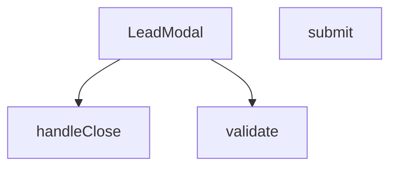

## Genel Bakış
`LeadModal` bileşeni, ürünlerle ilgili potansiyel müşteri (lead) bilgilerini toplamak için kullanılan bir modal form penceresidir. Bileşen, form alanlarının doğrulamasını, gönderim işlemini ve modalın açılıp kapanma kontrollerini yönetir.

## Fonksiyon Grupları
### Modal Kontrol ve Render
Modalın açılıp kapanmasını kontrol eder, prop'lar aracılığıyla görünürlüğü yönetir ve form alanlarını içeren JSX yapısını render eder.
- LeadModal

### Form Doğrulama
Kullanıcı tarafından doldurulan form alanlarının geçerliliğini kontrol eder; zorunlu alanların doluluğunu ve veri formatlarını doğrular.
- validate

### Form İşleme
Form gönderim olayını yakalayarak doğrulama çalıştırır, başarılı ise lead verisini işler; ayrıca modal kapatma işlemini ve ilgili callback çağrısını yönetir.
- submit, handleClose

---

## AXIOMS – Mimari Varsayımlar

Bu modül için fonksiyon gövdeleri paylaşılmadığı için çıkarılabilir mimari varsayımlar üretilememektedir. Fonksiyon gövdesi içeriği olmadan, modülün doğru çalışması için gerekli koşullar (form alanlarının varlığı, API çağrılarının koşulları, state güncellemelerinin gereklilikleri vb.) tespit edilemez.

---

## FONKSİYON DETAYLARI

### LeadModal
**Ne yapar**: Kullanıcıların iletişim bilgilerini topladığı bir modal pencere bileşeni oluşturur.  
**Nasıl yapar**: Props olarak gelen `open`, `onClose`, `productName` ve `_productId` değerlerini alır, bu değerleri modal içinde gösterir ve form gönderimi için `validate`, `submit` gibi yardımcı fonksiyonları kullanır.  
**Parametreler**:
- `open`: boolean — Modal’ın açık/kapalı durumunu belirler.  
- `onClose`: () => void — Modal kapatıldığında çalıştırılacak geri çağırma fonksiyonu.  
- `productName`: string — Modal içinde gösterilecek ürün adı.  
- `_productId`: any — İçeride `__productId` olarak yeniden adlandırılan ürün kimliği.  
**Dönüş**: React.FC\<LeadModalProps\> — Tanımlı prop tipleriyle bir React fonksiyonel bileşeni döndürür.

### validate
**Ne yapar**: Form gönderiminde girilen verileri kontrol eder ve hataları bir nesne olarak döndürür.  
**Nasıl yapar**: Form submit olayında `e.preventDefault()` ile varsayılan davranışı engeller, `validate()` fonksiyonunu çağırarak doğrulama sonuçlarını alır, `setErrors` ile hataları state’e kaydeder ve hata yoksa formun gönderilmesine izin verir.  
**Parametreler**: Yok.  
**Dönüş**: Bilinmiyor (kod içinde dönüş değeri kullanılmaktadır; muhtemelen hata nesnesi).

### submit
**Ne yapar**: Form gönderildiğinde çalıştırılan ana işlem akışını yönetir.  
**Nasıl yapar**: `e.preventDefault()` ile formun doğal gönderimini durdurur, `validate()` ile doğrulama yapar, hatalar varsa işlemi sonlandırır; hatasız ise `setSubmitted(true)` ile gönderim durumunu işaretler, ardından API taklidi için gecikmeli bir `setTimeout` içinde başarı durumunu ayarlar, modalı otomatik kapatmak için ikinci bir gecikme başlatır.  
**Parametreler**:
- `e`: React.FormEvent — Form submit olay nesnesi.  
**Dönüş**: Bilinmiyor (fonksiyon içinde yan etkiler vardır, dönüş değeri belirtilmemiştir).

### handleClose
**Ne yapar**: Modal kapanış işlemini tetikler.  
**Nasıl yapar**: İçeride tanımlı `handleClose` fonksiyonunu çağırarak modalın kapanmasını sağlar; bu, dışarıdan gelen `onClose` geri çağırma fonksiyonuna yönlendirilmiş olabilir.  
**Parametreler**: Yok.  
**Dönüş**: Bilinmiyor (fonksiyon yan etki üretir, dönüş değeri belirtilmemiştir).

---

## INTERFACES

### LeadModalProps
- `open: boolean`
- `onClose: () => void`
- `productName?: string`
- `_productId?: string`

---

## AST POINTERS

### [N1_NASIL] AST Pointer: src/components/LeadModal.tsx::LeadModal
- **params**: (open, onClose, productName, __productId)
  - `open` — boolean, modal'ın açık olup olmadığını kontrol eder
  - `onClose` — function, modal kapatma fonksiyonu
  - `productName` — string, ürün adı, varsayılan mesajda kullanılır
  - `__productId` — string, ürün ID'si (prop'tan yeniden adlandırılmış)
- **ic_degiskenler**:
  - (fonksiyon gövdesi verilmemiş, sadece inner fonksiyonlar var)
- **Dönüş**: React.FC<LeadModalProps> (modal bileşenini render eder)

### [N2_NASIL] AST Pointer: src/components/LeadModal.tsx::validate
- **params**: (yok)
- **ic_degiskenler**:
  - `e` — Record<string, string> object, hata mesajlarını tutar, başlangıçta boş object
- **Dönüş**: `e` object (validation hatalarını içerir)

### [N3_NASIL] AST Pointer: src/components/LeadModal.tsx::submit
- **params**: (e: React.FormEvent)
- **ic_degiskenler**:
  - `e` — React.FormEvent, form submit olayı
  - `v` — validate() fonksiyonunun dönüş değeri, hata objesi
- **Dönüş**: yok (yan etkiler: hata state'ini günceller, submit state'ini yönetir, setTimeout ile success modal'ını açar ve 3 saniye sonra handleClose'ı çağırır)

### [N4_NASIL] AST Pointer: src/components/LeadModal.tsx::handleClose
- **params**: (yok)
- **ic_degiskenler**:
  - (fonksiyon gövdesinde değişken tanımı yok, sadece state setter'ları ve onClose çağrısı var)
- **Dönüş**: yok (yan etkiler: onClose callback'ini çağırır, 300ms delay ile form state'ini sıfırlar: isSuccess, name, company, email, phone, city, appArea, consent, message, errors)

---

## MERMAID CALL GRAPH

## NODE ID STANDARD

  file: src\components\LeadModal.tsx
  function: src\components\LeadModal.tsx::LeadModal
  function: src\components\LeadModal.tsx::validate
  function: src\components\LeadModal.tsx::submit
  function: src\components\LeadModal.tsx::handleClose

---

## DISA AKTARILANLAR (EXPORTS)
  export: LeadModal

---

## STİL TOKENLERİ

### Arbitrary Değerler (token'a geçirilmemiş)
Yok — tüm stiller token'a geçirilmiş. ✅

### Kullanılan Token'lar (zaten token'a geçirilmiş)
- (yok)

### Tailwind Sınıf Özeti
- **Renkler:** `bg-gradient-to-br`, `bg-gray-100`, `bg-gray-50`, `bg-gray-50/50`, `bg-green-100`, `bg-primary-navy`, `bg-secondary-blue/80`, `bg-white`, `bg-white/10`, `border-2`, `border-gray-100`, `border-gray-200`, `border-gray-300`, `border-red-400`, `border-t`
- **Layout:** `absolute`, `backdrop-blur-md`, `backdrop-blur-sm`, `block`, `fixed`, `flex`, `flex-1`, `flex-col`, `from-blue-600/20`, `gap-1`, `gap-2`, `gap-3`, `gap-4`, `gap-5`, `grid`
- **Varyant/Responsive:** `:`, `disabled:`, `focus-visible:`, `focus:`, `group-hover:`, `hover:`, `md:`, `sm:` önekleri
- **Yardımcı Sınıflar:** `${errors.name`, `-mt-2`, `:`, `animate-bounce`, `animate-in`, `animate-spin`, `border`, `cursor-pointer`, `disabled:cursor-not-allowed`, `disabled:opacity-70`, `duration-300`, `fade-in`, `focus-visible:outline-none`, `focus-visible:ring-2`, `focus-visible:ring-gray-300`