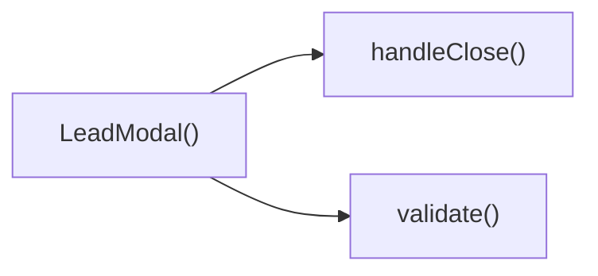

## Genel Bakış
Bu modül, kullanıcıdan potenci müşteri bilgilerini toplama amaçlı bir açılır pencere (modal) bileşenini tanımlar. Modalın görünürlüğü, kapatılması ve formun doğrulama‑gönderme işlevleri içindeki fonksiyonlarla koordine edilerek kullanıcı deneyimi sağlanır.

## Fonksiyon Grupları
### Modal Görünümü ve Kapatma İşlemleri
Bu grup, modalın render edilmesi, açık/kapalı durumu yönetimi ve kullanıcı tarafından kapatma talebini işleyen fonksiyonları içerir.
- LeadModal, handleClose

### Form Doğrulama ve Gönderme
Bu grup, kullanıcının girdiği bilgilerin geçerliliğini kontrol eden ve geçerli olduğunda veriyi işleyen işlevleri bir araya getirir.
- validate, submit

---

## AXIOMS – Mimari Varsayımlar
Bu modülün doğru çalışması için aşağıdaki koşulların sağlanması gerekir.

- **Eğer** `open` prop’u boolean olarak verilmezse, **modalın** görünürlüğü kontrol edilemez.  
- **Eğer** `onClose` prop’u fonksiyon olarak verilmezse, **handleClose()** çağrıldığında hata oluşur.  
- **Eğer** `productName` prop’u string olarak verilmezse, **validate()** ürün adı alanını kontrol edemez.  
- **Eğer** `_productId` (veya `__productId`) prop’u tanımlanmazsa, **submit()** işlemi sırasında ürün kimliği eksik olur.  
- **Eğer** `applicationAreas` sabiti boş bir dizi ise, **validate()** veya **submit()** içinde alan seçimi kontrolü başarısız olur.  
- **Eğer** `validate()` fonksiyonu çağrılmadan **submit()** çalıştırılırsa, form geçerliliği garantisi olmaz.  
- **Eğer** `submit()` fonksiyonuna geçirilen `e` argümanı `React.FormEvent` tipi değilse, olay nesnesi üzerinden veri çıkarma işlemi başarısız olur.  
- **Eğer** `handleClose()` fonksiyonu çağrıldığında `onClose` prop’u tanımlı değilse, modal kapatma işlemi gerçekleşemez.

---

## FONKSIYON DETAYLARI

### LeadModal
**Ne yapar**: LeadModal bileşeni, bir ürünle ilgili lead toplamak için kullanılan modalı görüntüler ve yönetir.  
**Nasıl yapar**: `open` prop'una göre modalın görünürlüğünü kontrol eder, `onClose` callback'ini kapatma işlemi için çağırır, `productName` ve `_productId` (alias `__productId`) değerlerini göstererek kullanıcıya ürün bilgisi sunar.  
**Parametreler**:
- open: boolean — modalın açık olup olmadığını belirler  
- onClose: () => void — modal kapatıldığında çalışacak fonksiyon  
- productName: string — gösterilecek ürünün adı  
- _productId: string — (alias __productId) ürünün benzersiz kimliği  
**Dönüş**: React.FC<LeadModalProps> — bileşenin render ettiği JSX elementi  

### validate
**Ne yapar**: Form girişlerinin geçerliliğini kontrol etmek üzere tasarlanmış bir işlev (adına dayanarak tahmin edilir).  
**Nasıl yapar**: Sağlanan kod parçacığında uygulama detayı bulunmadığından davranışı net olarak açıklanamaz.  
**Parametreler**: *(yok)*  
**Dönüş**: void veya bilinmiyor — dönüş tipi belirtilmemiştir  

### submit
**Ne yapar**: Formun gönderilmesini işleyen olay işleyicisi (adına dayanarak tahmin edilir).  
**Nasıl yapar**: Sağlanan kod parçacığında uygulama detayı bulunmadığından davranışı net olarak açıklanamaz.  
**Parametreler**:
- e: React.FormEvent — form submit olayı nesnesi  
**Dönüş**: void veya bilinmiyor — dönüş tipi belirtilmemiştir  

### handleClose
**Ne yapar**: Modalın kapatılmasını sağlayan işlev (adına dayanarak tahmin edilir).  
**Nasıl yapar**: Sağlanan kod parçacığında uygulama detayı bulunmadığından davranışı net olarak açıklanamaz.  
**Parametreler**: *(yok)*  
**Dönüş**: void veya bilinmiyor — dönüş tipi belirtilmemiştir

---

## INTERFACES

### LeadModalProps
- `open: boolean`
- `onClose: () => void`
- `productName?: string`
- `_productId?: string`

---

## SABİTLER
- **applicationAreas** (array) — `[
  'Otopark Havalandırma',
  'Endüstriyel Mutfak',
  'Hastane/Temiz Oda',...`

---

## AST POINTERS

### [N1_NASIL] AST Pointer: C:\Users\alize\venthub-hvac\src\components\LeadModal.tsx::LeadModal
- **params**: open, onClose, productName, _productId
- **ic_degiskenler**:
  - `t` — useI18n hook'undan gelen çeviri fonksiyonu, UI metinlerini çevirmek için kullanılır
  - `name` — kullanıcının adı soyadı giriş alanının durum durumu
  - `setName` — `name` durumunu güncelleyen setter fonksiyonu
  - `company` — firma adı giriş alanının durum durumu
  - `setCompany` — `company` durumunu güncelleyen setter fonksiyonu
  - `email` — e-posta giriş alanının durum durumu
  - `setEmail` — `email` durumunu güncelleyen setter fonksiyonu
  - `phone` — telefon giriş alanının durum durumu
  - `setPhone` — `phone` durumunu güncelleyen setter fonksiyonu
  - `city` — şehir giriş alanının durum durumu
  - `setCity` — `city` durumunu güncelleyen setter fonksiyonu
  - `appArea` — seçilen uygulama alanı'nın durum durumu
  - `setAppArea` — `appArea` durumunu güncelleyen setter fonksiyonu
  - `message` — proje/talept Detayı metin alanı'nın durum durumu, productName'a göre başlangıç değeri ayarlanır
  - `setMessage` — `message` durumunu güncelleyen setter fonksiyonu
  - `consent` — KVKK onay kutusunun işaretlenip işaretlenmediğini tutan boolean durum
  - `setConsent` — `consent` durumunu güncelleyen setter fonksiyonu
  - `submitted` — form gönderimi sırasında bekleme/gönderim durumu
  - `setSubmitted` — `submitted` durumunu güncelleyen setter fonksiyonu
  - `isSuccess` — gönderim başarılı olduğunda gösterilen durum
  - `setIsSuccess` — `isSuccess` durumunu güncelleyen setter fonksiyonu
  - `errors` — alan bazlı doğrulama hatalarını tutan Record<string, string> nesnesi
  - `setErrors` — `errors` durumunu güncelleyen setter fonksiyonu
- **Dönüş**: JSX elementi (React node)

### [N2_NASIL] AST Pointer: C:\Users\alize\venthub-hvac\src\components\LeadModal.tsx::validate
- **params**: yok
- **ic_degiskenler**:
  - `e` — doğrulama hatalarını toplamak için geçici Record<string, string> nesnesi
- **Dönüş**: Record<string, string> (hata nesnesi)

### [N3_NASIL] AST Pointer: C:\Users\alize\venthub-hvac\src\components\LeadModal.tsx::submit
- **params**: e: React.FormEvent
- **ic_degiskenler**:
  - `v` — `validate()` fonksiyonundan dönen hata nesnesi
- **Dönüş**: yok

### [N4_NASIL] AST Pointer: C:\Users\alize\venthub-hvac\src\components\LeadModal.tsx::handleClose
- **params**: yok
- **ic_degiskenler**: yok
- **Dönüş**: yok

---

## ÇAĞRI HARİTASI

### Disariya Cagrilar (Outgoing)
- `LeadModal()` fonksiyonu, form doğrulaması için `validate()` ve pencereyi kapatmak için `handleClose()` fonksiyonlarını çağırır.

### Disaridan Cagrilanlar (Incoming)
- Verilen veri setinde bu modülü çağıran dış bir fonksiyon veya modül bulunmamaktadır.

### Ic Ice Fonksiyonlar (Nested)
- Yok

---

## DOSYA-İÇİ ÇAĞRI GRAFİĞİ
  LeadModal() → handleClose()
  LeadModal() → validate()

---

## NODE ID STANDARD

  file: src\components\LeadModal.tsx
  function: src\components\LeadModal.tsx::LeadModal
  function: src\components\LeadModal.tsx::validate
  function: src\components\LeadModal.tsx::submit
  function: src\components\LeadModal.tsx::handleClose

---

## DISA AKTARILANLAR (EXPORTS)
  export: LeadModal