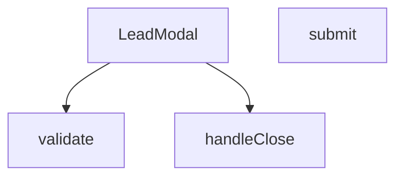

## Genel Bakış
`LeadModal` bileşeni, potansiyel müşteri (lead) bilgilerini toplamak için kullanılan modal tabanlı bir form penceresidir. Bileşen, form alanlarının doğrulamasını, gönderim işlemini ve modalın açılıp kapanma kontrollerini yöneterek kullanıcı iletişim verilerini sisteme kaydeder.

## Fonksiyon Grupları
### Modal Kontrol ve Render
Modalın açılıp kapanmasını kontrol eder, prop'lar aracılığıyla görünürlüğü yönetir ve form alanlarını içeren JSX yapısını render eder.
- LeadModal

### Form Doğrulama
Kullanıcı tarafından doldurulan form alanlarının geçerliliğini kontrol eder; zorunlu alanların doluluğunu ve veri formatlarını doğrular.
- validate

### Form İşleme
Form gönderim olayını yakalayarak doğrulama çalıştırır, başarılı ise lead verisini işler; ayrıca modal kapatma işlemini ve ilgili callback çağrısını yönetir.
- submit, handleClose

---

## AXIOMS – Mimari Varsayımlar

Bu modül, ürün ile ilgili potansiyel müşteri bilgilerini toplayan kontrollü bir modal form bileşenidir. Aşağıdaki varsayımlar fonksiyon imzaları ve yapısal ipuçlarından türetilmiştir.

---

**[Aksiyom 1]:** Eğer `onClose` callback'i sağlanmazsa, modal bileşeni kendi kendini kontrollü modo kapatabilir (`open` prop'u false yapabilir) ancak üst bileşen durumunu güncelleyemez ve modal kalıcı olarak açık kalır.

**[Aksiyom 2]:** Eğer `open` prop'u `boolean` türünde (veya truthy/falsy dönüştürülebilir) değilse, modalın render edilip edilmeyeceği belirlenemez ve bileşen beklenmedik davranışı gösterir.

**[Aksiyom 3]:** Eğer `productName` değeri sağlanmazsa, toplanan lead bilgileri hangi ürüne ait olduğu belirsiz olacağından, form gönderiminde ürün bağlamı eksik olur.

**[Aksiyom 4]:** Eğer `validate()` fonksiyonu `submit()` invokasyonundan önce çağrılmazsa, geçersiz form verileri sunucuya gönderilebilir; bu nedenle validasyon submit iş akışının zorunlu bir ön koşuludur.

**[Aksiyom 5]:** Eğer `submit()` fonksiyonu `React.FormEvent` parametresi almazsa (örn: çağrıcı event'i iletmezse), form default submit davranışını (`page reload`) engelleyemez.

**[Aksiyom 6]:** `_productId` prop'u (`__productId` olarak yeniden adlandırılmış) sağlanmazsa, lead kaydının hangi ürün ID'sine bağlı olacağı belirsiz olur; bu değerin form submission payload'ında gerekli olduğu varsayılır.

---

### Domain-Specific Kurallar

| Kural | Açıklama |
|---|---|
| **Zorunlu alan doğrulaması** | `validate()`, tüm zorunlu form alanlarının doluluğunu kontrol etmelidir; boş alan bırakılamaz. |
| **Kontrollü bileşen paterni** | Modal görünürlüğü `open` prop'u ile dışarıdan yönetilir; bileşen içinden `open` state'i doğrudan mutate edilmez. |
| **Eşik değer** | Tanımlanmamıştır — form alanı sayısına veya zorunlu alan koşullarına ilişkin eşik değer kodda belirlenmemiştir. |

---

## FONKSİYON DETAYLARI

### LeadModal
**Ne yapar**: Kullanıcıların iletişim bilgilerini topladığı bir modal pencere bileşeni oluşturur.  
**Nasıl yapar**: Props olarak gelen `open`, `onClose`, `productName` ve `_productId` değerlerini alır, bu değerleri modal içinde gösterir ve form gönderimi için `validate`, `submit` gibi yardımcı fonksiyonları kullanır.  
**Parametreler**:
- `open`: boolean — Modal’ın açık/kapalı durumunu belirler.  
- `onClose`: () => void — Modal kapatıldığında çalıştırılacak geri çağırma fonksiyonu.  
- `productName`: string — Modal içinde gösterilecek ürün adı.  
- `_productId`: any — İçeride `__productId` olarak yeniden adlandırılan ürün kimliği.  
**Dönüş**: React.FC\<LeadModalProps\> — Tanımlı prop tipleriyle bir React fonksiyonel bileşeni döndürür.

### validate
**Ne yapar**: Bu fonksiyon, bir formun gönderilmeden önce (submit) içeriğinin geçerliliğini kontrol eder. Tüm form alanlarının doğruluğunu değerlendirir ve bulunan hataları bir nesne olarak döndürür. Hata yoksa boş bir nesne döner.

**Nasıl yapar**: Fonksiyon, bir React form olay işleyicisi içinde `e.preventDefault()` ile varsayılan form gönderme işlemini engelledikten hemen sonra çağrılır. Çağrının ardından, döndürülen hata nesnesi `setErrors` aracılığıyla bileşenin state'ine kaydedilir. Eğer hata anahtarı varsa (hata bulunuyorsa) fonksiyon erken bir `return` ile işlemi sonlandırır, böylece başarılı gönderim (API çağrısı simülasyonu) sadece hata yokken çalıştırılır.

**Parametreler**:
- Bu fonksiyonun tanımında herhangi bir parametre listelenmemiştir. Ancak çağrı yapılan bağlamda (`validate()`) boş olarak çağrıldığı görülmektedir. Fonksiyonun ihtiyaç duyduğu form verilerine, muhtemelen bileşenin kendi state'inden veya bir bağlam (context) üzerinden eriştiği varsayılmaktadır.

**Dönüş**: Belirtilmemiştir. Ancak kullanımından, hata durumlarını içeren bir nesne veya boş bir nesne döndüreceği anlaşılmaktadır.

### submit
**Ne yapar**: Form gönderildiğinde çalıştırılan ana işlem akışını yönetir.  
**Nasıl yapar**: `e.preventDefault()` ile formun doğal gönderimini durdurur, `validate()` ile doğrulama yapar, hatalar varsa işlemi sonlandırır; hatasız ise `setSubmitted(true)` ile gönderim durumunu işaretler, ardından API taklidi için gecikmeli bir `setTimeout` içinde başarı durumunu ayarlar, modalı otomatik kapatmak için ikinci bir gecikme başlatır.  
**Parametreler**:
- `e`: React.FormEvent — Form submit olay nesnesi.  
**Dönüş**: Bilinmiyor (fonksiyon içinde yan etkiler vardır, dönüş değeri belirtilmemiştir).

### handleClose
**Ne yapar**: Bu fonksiyon, bir modal veya açılır pencere bileşeninin kapanmasını tetikler. Genellikle bir başarı durumu gösterildikten sonra veya kullanıcı "kapat" butonuna tıkladığında çağrılır.

**Nasıl yapar**: Fonksiyon, kapanış işlemini yöneten bir durumu (state) veya prop'u günceller. Sağlanan gövde kodunda, callback fonksiyonu içinde kendisini (`handleClose()`) çağırmaktadır. Bu, genellikle bir `useState` hook'u ile yönetilen `isOpen` veya benzeri bir boolean'ı `false` yaparak modalı görünmez kılan bir eylemdir. Başarılı form gönderimi sonrasında da otomatik kapanma için belirli bir gecikmeyle (3 saniye) bu fonksiyon çağrılır.

**Parametreler**:
- Bu fonksiyonun tanımında herhangi bir parametre listelenmemiştir. Çağrıldığında boş olarak çağrılır (`handleClose()`).

**Dönüş**: Belirtilmemiştir, ancak bir durum güncelleme eylemi gerçekleştirdiği için doğrudan bir değer döndürmez (void/undefined).

---

## İTHALATLAR (IMPORTS)
- import: ../hooks/useLocalizedRoutes::useLocalizedRoutes
- import: ../i18n/I18nProvider::useI18n
- import: next/link::Link
- import: react::React
- import: react::useState

---

## INTERFACES

### LeadModalProps
- `open: boolean`
- `onClose: () => void`
- `productName?: string`
- `_productId?: string`

---

## AST POINTERS

### [N1_NASIL] AST Pointer: src/components/LeadModal.tsx::validate
- **params**: ()
- **ic_degiskenler**:
  - `e` — Form validasyon hatalarını tutan bir nesne. Başlangıçta boş bir `Record<string, string>` olarak oluşturulur ve hata mesajlarıyla doldurulur.
- **Dönüş**: `e` — Hataları içeren bir nesne (`Record<string, string>`).

### [N2_NASIL] AST Pointer: src/components/LeadModal.tsx::submit
- **params**: (`e: React.FormEvent`)
- **ic_degiskenler**:
  - `v` — `validate()` fonksiyonunun döndürdüğü validasyon sonuçlarını (hatalar) tutan nesne.
- **Dönüş**: yok (yan etki: formu submit eder, durumları değiştirir, başarı durumunu tetikler)

### [N3_NASIL] AST Pointer: src/components/LeadModal.tsx::handleClose
- **params**: ()
- **ic_degiskenler**:
  - (fonksiyon gövdesinde yeni bir değişken tanımlanmaz; dışarıdan gelen `onClose`, `setIsSuccess`, `setName`, vb. state setter'ları kullanılır)
- **Dönüş**: yok (yan etki: modalı kapatır, form alanlarını sıfırlar)

### [N4_NASIL] AST Pointer: src/components/LeadModal.tsx::handleClose (iç kapanış fonksiyonu)
- **params**: ()
- **ic_degiskenler**:
  - (fonksiyon gövdesinde yeni bir değişken tanımlanmaz; sadece `handleClose()` çağrısı yapılır)
- **Dönüş**: yok (yan etki: ana kapanış fonksiyonunu çağırır)

### [N5_NASIL] AST Pointer: src/components/LeadModal.tsx::resetForm
- **params**: ()
- **ic_degiskenler**:
  - (fonksiyon gövdesinde yeni bir değişken tanımlanmaz; dışarıdan gelen `onClose`, `setIsSuccess`, `setName`, `setCompany`, `setEmail`, `setPhone`, `setCity`, `setAppArea`, `setConsent`, `setMessage`, `setErrors` state setter'ları ve `productName`, `t` fonksiyonu kullanılır)
- **Dönüş**: yok (yan etki: modalı kapatır, tüm form alanlarını başlangıç değerlerine sıfırlar)

### [N6_NASIL] AST Pointer: src/components/LeadModal.tsx::resetForm (iç sıfırlama fonksiyonu)
- **params**: ()
- **ic_degiskenler**:
  - (fonksiyon gövdesinde yeni bir değişken tanımlanmaz; dışarıdan gelen `setIsSuccess`, `setName`, `setCompany`, `setEmail`, `setPhone`, `setCity`, `setAppArea`, `setConsent`, `setMessage`, `setErrors` state setter'ları ve `productName`, `t` fonksiyonu kullanılır)
- **Dönüş**: yok (yan etki: form alanlarını başlangıç değerlerine sıfırlar)

---

## MERMAID CALL GRAPH

## NODE ID STANDARD

  file: src\components\LeadModal.tsx
  function: src\components\LeadModal.tsx::LeadModal
  function: src\components\LeadModal.tsx::validate
  function: src\components\LeadModal.tsx::submit
  function: src\components\LeadModal.tsx::handleClose

---

## DISA AKTARILANLAR (EXPORTS)
  export: LeadModal

---

## STİL TOKENLERİ

### Arbitrary Değerler (token'a geçirilmemiş)
Yok — tüm stiller token'a geçirilmiş. ✅

### Kullanılan Token'lar (zaten token'a geçirilmiş)
- (yok)

### Tailwind Sınıf Özeti
- **Renkler:** `bg-gradient-to-br`, `bg-gray-100`, `bg-gray-50`, `bg-gray-50/50`, `bg-green-100`, `bg-primary-navy`, `bg-secondary-blue/80`, `bg-white`, `bg-white/10`, `border-2`, `border-gray-100`, `border-gray-200`, `border-gray-300`, `border-red-400`, `border-t`
- **Layout:** `absolute`, `backdrop-blur-md`, `backdrop-blur-sm`, `block`, `fixed`, `flex`, `flex-1`, `flex-col`, `from-blue-600/20`, `gap-1`, `gap-2`, `gap-3`, `gap-4`, `gap-5`, `grid`
- **Varyant/Responsive:** `:`, `disabled:`, `focus-visible:`, `focus:`, `group-hover:`, `hover:`, `md:`, `sm:` önekleri
- **Yardımcı Sınıflar:** `${errors.name`, `-mt-2`, `:`, `animate-bounce`, `animate-in`, `animate-spin`, `border`, `cursor-pointer`, `disabled:cursor-not-allowed`, `disabled:opacity-70`, `duration-300`, `fade-in`, `focus-visible:outline-none`, `focus-visible:ring-2`, `focus-visible:ring-gray-300`