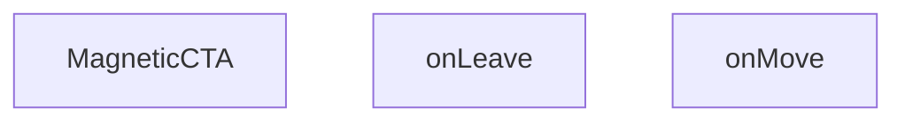

## Genel Bakış
MagneticCTA bileşeni, fare hareketlerini izleyerek bir çağrı‑eylem (CTA) öğesinin konumunu ve görünümünü dinamik olarak değiştiren, etkileşimli bir React bileşenidir. Bileşen, fare giriş ve çıkış olaylarını yöneterek kullanıcıya görsel geri bildirim ve manyetik bir efekt sunar.

## Fonksiyon Grupları
### Bileşen Tanımı
Bileşenin ana yapısını oluşturur, durumunu yönetir ve ekrana basılacak JSX'i döndürür.
- MagneticCTA

### Olay İşleyicileri
Fare hareketlerini yakalayarak bileşenin konumunu ve görünümünü tetikleyen işlevleri içerir.
- onMove, onLeave

---

## AXIOMS – Mimari Varsayımlar
Bu modül için temel varsayım: `onMove` ve `onLeave` olay işleyicilerinin, fare tabanlı etkileşimlerin doğru yönetilmesi için gerekli olay nesnelerini alacak şekilde bağlanması zorunludur.

[Aksiyom 1]: Eğer `onMove(e)` fonksiyonuna geçilen `e` parametresi geçerli bir DOM olay nesnesi (örn: `MouseEvent`) değilse veya `e.clientX` / `e.clientY` özellikleri içermiyorsa, bileşenin manyetik konum hesaplaması çalışamaz.

[Aksiyom 2]: Eğer `onLeave()` fonksiyonu fare bileşen alanını terk ettiğinde tetiklenmezse, manyetik hareket efekti sıfırlanmaz ve bileşen hatalı konumda kalır.

[Aksiyom 3]: Eğer `MagneticCTA` bileşeni bir DOM elementi içinde render edilmezse veya fare olayları dinlenebilecek bir etkileşim ortamı yoksa, hem `onMove` hem `onLeave` olayları hiç tetiklenemez.

---

## FONKSİYON DETAYLARI

### MagneticCTA
**Ne yapar**: Manyetik etki yaratan bir CTA (Call-to-Action) bileşenini render eder. Kullanıcı fare hareketlerine tepki veren interaktif bir bileşendir.

**Nasıl yapar**: React fonksiyonel bileşeni olarak tanımlanmıştır. Bileşen, içeriğinde fare olaylarını dinleyen `onMove` ve `onLeave` handler'larını kullanarak manyetik hareket efektini sağlar. DOM üzerindeki fare pozisyonuna göre bileşenin konumunu veya stilini dinamik olarak güncelleyebilir.

**Parametreler**:
- Bu bileşen harici parametre almamaktadır (props'suz bileşen)

**Dönüş**: `React.FC` — Manyetik CTA içeriğini render eden React bileşeni

### onMove
**Ne yapar**: HTMLDivElement üzerindeki fare hareketini yakalayan bir olay işleyicisi tanımlar.  
**Nasıl yapar**: Fonksiyon, bir React.MouseEvent<HTMLDivElement, MouseEvent> nesnesini alır ve bu olay üzerinden fare konumu bilgilerini kullanarak manyetik efektin hesaplanmasını sağlar.  
**Parametreler**:  
- e: React.MouseEvent<HTMLDivElement, MouseEvent> — fare hareketi olayı nesnesi  
**Dönüş**: React.MouseEventHandler<HTMLDivElement> — aynı öğe üzerinde fare hareketi işleyici olarak kullanılabilecek bir fonksiyon tipi.

### onLeave
**Ne yapar**: HTMLDivElement üzerinden fare çıktığında tetiklenen bir olay işleyicisi tanımlar.  
**Nasıl yapar**: Fonksiyon, fare öğeden çıktığında çağrılır ve manyetik efekti sıfırlayıp öğeyi varsayılan durumuna döndürmek için kullanılır.  
**Parametreler**: yok  
**Dönüş**: void (veya belirtilmemiş) — fonksiyon bir değer döndürmez.

---

## AST POINTERS

### [N1_NASIL] AST Pointer: MagneticCTA.tsx::MagneticCTA
- **params**: (parametre yok — React.FC bileşeni)
- **ic_degiskenler**:
  - `t` — `useI18n()` hook'undan dönen çeviri fonksiyonu; `t('homeCta.title')`, `t('homeCta.subtitle')`, `t('homeCta.button')` çağrılarıyla JSX içinde metinler render edilir
  - `ref` — `useRef<HTMLDivElement | null>(null)`; manyetik efekt uygulanan butonu saran div'e bağlanır, DOM erişimi için kullanılır
  - `hover` — `useState(false)` boolean durum değişkeni; fare div'in üzerindeyken `true`, ayrılınca `false` olur; `onMove` içinde erişilerek hareket hesaplamasının çalışıp çalışmayacağı kontrol edilir
  - `onMove` — `React.MouseEventHandler<HTMLDivElement>` türünde fare hareket handler'ı; fare koordinatlarına göre CSS custom property'ler (`--dx`, `--dy`) ayarlayarak butonun manyetik kayma efektini hesaplar
  - `onLeave` — fare div'den ayrılınca tetiklenen handler; CSS custom property'leri sıfırlar ve `hover` durumunu `false` yapar
- **Dönüş**: JSX (`<section>` — CTA bölümü; başlık, alt başlık ve manyetik efektli buton içerir)

---

### [N2_NASIL] AST Pointer: MagneticCTA.tsx::onMove
- **params**: `(e: React.MouseEvent<HTMLDivElement>)` — fare hareket olayı nesnesi
- **ic_degiskenler**:
  - `hover` — outer scope'tan closure ile erişilen boolean; `false` ise fonksiyon erken return ile çıkar
  - `el` — `ref.current`'ten elde edilen DOM elementi (HTMLDivElement); `null` ise erken return yapılır
  - `rect` — `el.getBoundingClientRect()` sonucu DOMRect nesnesi; elementin viewport'taki konum ve boyut bilgisini tutar (`rect.left`, `rect.top`, `rect.width`, `rect.height` kullanılır)
  - `dx` — yatay manyetik kayma mesafesi (px); `((e.clientX - rect.left) / rect.width - 0.5) * 12` formülü ile fare imlecinin element merkezine göre yatay oranı 12px aralığa ölçeklenir
  - `dy` — dikey manyetik kayma mesafesi (px); `((e.clientY - rect.top) / rect.height - 0.5) * 12` formülü ile aynı mantık dikey eksende uygulanır
- **Dönüş**: yok (yan etki: `el.style.setProperty('--dx', ...)` ve `el.style.setProperty('--dy', ...)` ile CSS custom property'leri güncellenir)

---

### [N3_NASIL] AST Pointer: MagneticCTA.tsx::onLeave
- **params**: (parametre yok)
- **ic_degiskenler**:
  - `el` — `ref.current`'ten elde edilen DOM elementi (HTMLDivElement); `null` ise erken return yapılır
- **Dönüş**: yok (yan etki: `el.style.setProperty('--dx', '0px')` ve `el.style.setProperty('--dy', '0px')` ile kayma efekti sıfırlanır; `setHover(false)` çağrısı ile hover durumu deaktif edilir)

---

### [N4_NASIL] AST Pointer: MagneticCTA.tsx::inline onClick handler
- **params**: (parametre yok)
- **ic_degiskenler**:
  - `window` — `typeof window !== 'undefined'` kontrolü ile SSR güvenliği sağlanır; `window` tanımlı ise `window.openLeadModal?.()` çağrılarak lead modal açılır
- **Dönüş**: yok (yan etki: lead modal penceresi açılır)

---

## MERMAID CALL GRAPH

## NODE ID STANDARD

  file: src\components\MagneticCTA.tsx
  function: src\components\MagneticCTA.tsx::MagneticCTA
  function: src\components\MagneticCTA.tsx::onMove
  function: src\components\MagneticCTA.tsx::onLeave

---

## DISA AKTARILANLAR (EXPORTS)
  export: MagneticCTA

---

## STİL TOKENLERİ

### Arbitrary Değerler (token'a geçirilmemiş)
Yok — tüm stiller token'a geçirilmiş. ✅

### Kullanılan Token'lar (zaten token'a geçirilmiş)
- (yok)

### Tailwind Sınıf Özeti
- **Renkler:** `bg-gradient-to-r`, `bg-white`, `border-light-gray`, `from-primary-navy`, `text-2xl`, `text-primary-navy`, `text-white`, `text-white/90`, `to-secondary-blue`
- **Layout:** `flex`, `flex-col`, `from-primary-navy`, `gap-4`, `hover:shadow-xl`, `inline-flex`, `items-center`, `items-start`, `justify-between`, `justify-center`, `max-w-7xl`, `p-8`, `relative`, `shadow-lg`, `sm:flex-row`
- **Varyant/Responsive:** `hover:`, `lg:`, `sm:` önekleri
- **Yardımcı Sınıflar:** `border`, `font-bold`, `lg:px-8`, `mx-auto`, `px-4`, `px-8`, `py-10`, `py-4`, `rounded-2xl`, `rounded-xl`, `sm:px-6`, `transition-transform`