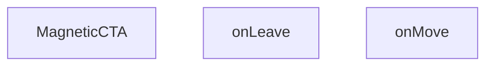

## Genel Bakış
MagneticCTA bileşeni, kullanıcının fare hareketlerini izleyerek bir çağrı‑eylem (CTA) öğesini dinamik olarak konumlandırıp gösteren bir React bileşenidir. Fare bileşenin üzerine geldiğinde ve ayrıldığında ilgili olay işleyicileri tetiklenerek görsel efektler sağlanır.

## Fonksiyon Grupları
### Bileşen Tanımı
Bileşenin ana yapısını oluşturur ve render edilen JSX'i döndürür.
- MagneticCTA

### Olay İşleyicileri
Fare hareketlerini takip ederek bileşenin davranışını kontrol eder.
- onMove
- onLeave

---

## AXIOMS – Mimari Varsayımlar
Bu bileşen, fare etkileşimlerini `onMove` ve `onLeave` fonksiyonlarıyla yönetmek zorundadır; bu fonksiyonların tanımlı ve doğru bir olay nesnesi alması, bileşenin beklenen davranışını sağlar.

[Aksiyom 1]: Eğer `onMove` fonksiyonu tanımlı değilse, fare hareketi olayları işlenmez ve fonksiyon çağrıldığında çalış‑zamanı hatası oluşabilir.  
[Aksiyom 2]: Eğer `onLeave` fonksiyonu tanımlı değilse, fare bileşenden çıktığında beklenen temizleme veya durum güncellemesi gerçekleşmez.  
[Aksiyom 3]: Eğer bileşen bir DOM ortamında render edilmezse (örneğin sunucu‑tarafı render), `onMove` ve `onLeave` olayları tetiklenmeyeceğinden fare‑tabanlı etkileşimler çalışmayacaktır.  
[Aksiyom 4]: Eğer `onMove` veya `onLeave` fonksiyonlarına geçirilen olay nesnesi `clientX`, `clientY` veya `preventDefault` gibi standart fare olay özelliklerini içermiyorsa, fonksiyonların içindeki bu özelliklere dayalı işlemler `undefined` döndürebilir veya beklenmeyen sonuçlara yol açabilir.

---

## FONKSIYON DETAYLARI

### MagneticCTA
**Ne yapar**: React.FC tipinde bir fonksiyonel bileşen tanımlar.  
**Nasıl yapar**: Bileşen, JSX döndürerek bir CTA (Çağrı Eylemi) öğesi renderlar; bu öğe genellikle manyetik efekt sağlayacak şekilde tasarlanmıştır.  
**Parametreler**: yok  
**Dönüş**: React.FC — bir React fonksiyonel bileşeni temsil eder.

### onMove
**Ne yapar**: HTMLDivElement üzerindeki fare hareketini yakalayan bir olay işleyicisi tanımlar.  
**Nasıl yapar**: Fonksiyon, bir React.MouseEvent<HTMLDivElement, MouseEvent> nesnesini alır ve bu olay üzerinden fare konumu bilgilerini kullanarak manyetik efektin hesaplanmasını sağlar.  
**Parametreler**:  
- e: React.MouseEvent<HTMLDivElement, MouseEvent> — fare hareketi olayı nesnesi  
**Dönüş**: React.MouseEventHandler<HTMLDivElement> — aynı öğe üzerinde fare hareketi işleyici olarak kullanılabilecek bir fonksiyon tipi.

### onLeave
**Ne yapar**: HTMLDivElement üzerinden fare çıktığında tetiklenen bir olay işleyicisi tanımlar.  
**Nasıl yapar**: Fonksiyon, fare öğeden çıktığında çağrılır ve manyetik efekti sıfırlayıp öğeyi varsayılan durumuna döndürmek için kullanılır.  
**Parametreler**: yok  
**Dönüş**: void (veya belirtilmemiş) — fonksiyon bir değer döndürmez.

---

## AST POINTERS

### [N1_NASIL] AST Pointer: src/components/MagneticCTA.tsx::MagneticCTA
- **params**: (parametre yok)
- **ic_degiskenler**:
  - `t` — çeviri fonksiyonu, useI18n'den elde edilen yerelleştirilmiş metinleri almak için kullanılır
  - `ref` — buttonu içeren div elemanına bağlanan React ref, boyut ve konum ölçümü için kullanılır
  - `hover` — fare div üzerindeyken true olan boolean durum
  - `setHover` — hover durumunu güncelleyen setter fonksiyonu
  - `onMove` — fare hareketi sırasında div üzerindeki konuma göre --dx ve --dy CSS değişkenlerini güncelleyen olay işleyicisi
  - `onLeave` — fare divden çıktığında --dx ve --dy sıfırlayıp hover'ı false yapan olay işleyicisi
- **Dönüş**: JSX elementi (React element)

### [N2_NASIL] AST Pointer: src/components/MagneticCTA.tsx::onMove
- **params**: e — MouseEvent, fare konumunu sağlar
- **ic_degiskenler**:
  - `el` — ref.current ile elde edilen div DOM elemanı
  - `rect` — el.getBoundingClientRect() sonucu, elemanın boyutu ve sayfadaki konumu
  - `dx` — fare'nin elemanın yatay merkezinden olan piksel offseti (merkezden sağ/sol)
  - `dy` — fare'nin elemanın dikey merkezinden olan piksel offseti (merkezden aşağı/yukarı)
- **Dönüş**: yok

### [N3_NASIL] AST Pointer: src/components/MagneticCTA.tsx::onLeave
- **params**: (parametre yok)
- **ic_degiskenler**:
  - `el` — ref.current ile elde edilen div DOM elemanı, stil sıfırlama için kullanılır
- **Dönüş**: yok

### [N4_NASIL] AST Pointer: src/components/MagneticCTA.tsx::onClick (button)
- **params**: (parametre yok)
- **ic_degiskenler**: (yok)
- **Dönüş**: yok

---

## MERMAID CALL GRAPH

## NODE ID STANDARD

  file: src\components\MagneticCTA.tsx
  function: src\components\MagneticCTA.tsx::MagneticCTA
  function: src\components\MagneticCTA.tsx::onMove
  function: src\components\MagneticCTA.tsx::onLeave

---

## DISA AKTARILANLAR (EXPORTS)
  export: MagneticCTA

---

## STİL TOKENLERİ

### Arbitrary Değerler (token'a geçirilmemiş)
Yok — tüm stiller token'a geçirilmiş. ✅

### Kullanılan Token'lar (zaten token'a geçirilmiş)
- (yok)

### Tailwind Sınıf Özeti
- **Renkler:** `bg-gradient-to-r`, `bg-white`, `border-light-gray`, `from-primary-navy`, `text-2xl`, `text-primary-navy`, `text-white`, `text-white/90`, `to-secondary-blue`
- **Layout:** `flex`, `flex-col`, `from-primary-navy`, `gap-4`, `hover:shadow-xl`, `inline-flex`, `items-center`, `items-start`, `justify-between`, `justify-center`, `max-w-7xl`, `p-8`, `relative`, `shadow-lg`, `sm:flex-row`
- **Responsive:** `lg:`, `sm:` prefix kullanımları
