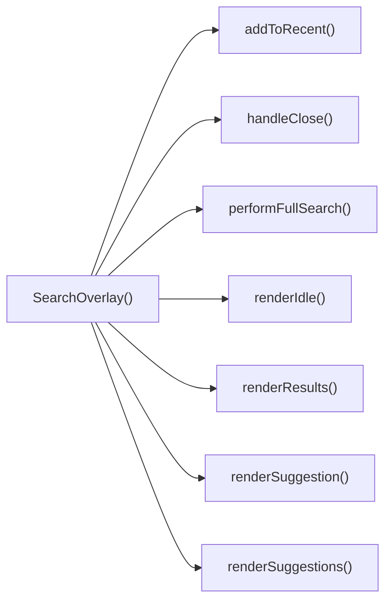

## Genel Bakış
Bu modül, VentHub HVAC platformunda kullanıcıların karşısına açılan, açılır kapanır arama arayüzünü (search overlay) yöneten React bileşenidir. Kullanıcının arama yapmasını, arama önerilerini ve sonuçlarını görüntülemesini, önceki aramalarını kaydetmesini sağlayan tüm temel işlevleri tek bir modülde toplar. Arayüzün açılıp kapanma durumunu, klavye etkileşimlerini ve farklı kullanıcı durumlarına göre içerik gösterme mantığını yönetir.

## Fonksiyon Grupları
### Çekirdek Bileşen ve Temel Etkileşim Yönetimi
Overlay'in genel yaşam döngüsünü, açılıp kapanma mantığını ve klavye gibi temel kullanıcı girişlerini yöneterek bileşenin ana çalışma prensibini hayata geçirir.
- SearchOverlay, handleClose, handleKeyDown

### Arama İşlevleri Yönetimi
Kullanıcının girdiği arama terimleriyle ilgili tüm işlemleri yürütür, tam metin arama sorgularını çalıştırır ve yapılan aramaları son aramalar listesine ekleyerek kaydeder.
- addToRecent, performFullSearch

### İçerik Renderlama Mantığı
Arayüzün mevcut durumuna göre uygun ekranı (boşta bekleme, arama önerileri, arama sonuçları) ve her bir öneri öğesini kullanıcıya göstermek için tüm render işlemlerini yönetir.
- renderIdle, renderSuggestion, renderSuggestions, renderResults

---

## AXIOMS – Mimari Varsayımlar
Bu React tabanlı arama kaplama (SearchOverlay) bileşeni, üst bileşenlerden gerekli prop'ların düzgün iletildiği, arama iş akışları için gereken tüm harici kaynak ve veri yapılarının erişilebilir olduğu durumlarda tasarlandığı şekilde çalışır.

[Aksiyom 1]: Eğer SearchOverlay bileşenine `open` boolean durumu prop olarak iletilmezse, bileşenin görünürlük durumu yönetilemez, beklenen şekilde açılamaz veya kapanamaz.
[Aksiyom 2]: Eğer SearchOverlay bileşenine `onClose` kapatma callback fonksiyonu prop olarak iletilmezse, kullanıcı tarafından tetiklenen kapanma eylemleri üst bileşene iletilemez, overlay'in durum senkronizasyonu bozulur.
[Aksiyom 3]: Eğer `SearchSuggestion` tipinde tanımlı öneri ve sonuç veri yapıları beklenen formatta bileşene iletilmezse, `renderSuggestion`, `renderSuggestions` ve `renderResults` içerik gösterme fonksiyonları çalışmaz, arama içerikleri görüntülenemez.
[Aksiyom 4]: Eğer klavye etkileşimleri için gerekli React.KeyboardEvent nesneleri doğru şekilde `handleKeyDown` fonksiyonuna iletilmezse, klavye gezintisi, ESC tuşıyla kapatma gibi erişilebilirlik özellikleri devre dışı kalır.
[Aksiyom 5]: Eğer son aramaların saklanacağı istemci tarafı depolama veya merkezi durum yönetim sistemi erişilemez durumdaysa, `addToRecent` fonksiyonu çalışmaz, geçmiş aramalar sonraki kullanımlarda listelenemez.
[Aksiyom 6]: Eğer tam arama işlevini gerçekleştirecek arama API'si veya yerel veri kaynağı erişilemez durumdaysa, `performFullSearch` fonksiyonu hiçbir sonuç üretemez, kullanıcıya arama çıktısı sunulamaz.
[Aksiyom 7]: Eğer bileşen içindeki `renderIdle`, `renderSuggestions`, `renderResults` gibi durum bazlı alt render fonksiyonlarından herhangi biri çalışmaz durumdaysa, ilgili arama durumunda kullanıcı arayüzü bozuk görüntülenir.

---

## FONKSIYON DETAYLARI

### SearchOverlay
**Ne yapar**: VentHub HVAC projesinin arama işlevselliğini sunan, ekranın üstünde açılan kaplama (overlay) arayüzünü oluşturan ana React fonksiyonel bileşenidir. Arama girişini, önerilerini, sonuçlarını ve tüm arama ile ilgili etkileşimleri tek bir arayüzde toplar, yalnızca açık olduğu durumda ekranda görünür.
**Nasıl yapar**: İçerisinde tanımlı tüm yardımcı arayüz ve işlev fonksiyonlarını kullanarak kullanıcı etkileşimlerini yönetir. `open` prop'u ile görünürlüğünü dinamik olarak kontrol eder, kapanma işlemi için üst bileşenden alınan `onClose` callback'ini tetikler. Arama sürecinin tüm aşamalarını (boş durum, öneri gösterme, sonuç gösterme) yöneterek uygun arayüzü ekrana yansıtır.
**Parametreler**:
- open: boolean — Arama arayüzünün görünür olup olmadığını belirten doğruluk değeri, true olduğunda arayüz ekranda aktif olur, false olduğunda gizlenir
- onClose: () => void — Arama arayüzünün kapatılması gerektiğinde üst bileşene bildirim göndermek için kullanılan callback fonksiyonu
**Dönüş**: React.FC<SearchOverlayProps> — Tür tanımı yapılmış React fonksiyonel bileşeni olarak arama arayüzünü uygulama DOM yapısına ekler.

### handleClose
**Ne yapar**: SearchOverlay arayüzünün düzenli bir şekilde kapanmasını sağlayan iç yardımcı fonksiyondur. Kapanma sırasında tüm geçici durumları sıfırlayarak arayüzün bir sonraki açılışında temiz bir başlangıç yapmasını garanti eder.
**Nasıl yapar**: Bileşene prop olarak iletilen `onClose` callback fonksiyonunu tetikler, kapanma öncesinde arama giriş alanını temizler, açık olan öneri veya sonuç listelerini sıfırlar, odak yönetimini düzenleyerek erişilebilirlik standartlarına uygun kapanma süreci sunar.
**Parametreler**: Hiçbir parametre almaz
**Dönüş**: void — Kaynak kodda belirtilen şekilde herhangi bir değer döndürmez, yalnızca kapanma işlemini yürütür.

### addToRecent
**Ne yapar**: Kullanıcının gerçekleştirdiği arama terimlerini kaydederek son aramalar listesini güncelleyen iç yardımcı fonksiyondur. Kullanıcıların önceki aramalarına hızlıca erişmesini sağlamak amacıyla kullanılır.
**Nasıl yapar**: Aynı arama teriminin listede birden fazla kez yer almasını engellemek için mevcut listedeki eşleşen terimi siler, yeni eklenen terimi listenin en başına ekler, güncel listeyi kalıcı depolama alanına kaydederek sayfa yenilenmelerinde bile verilerin korunmasını sağlar.
**Parametreler**:
- term: string — Son aramalar listesine eklenecek, kullanıcının girdiği tam arama terimi
**Dönüş**: void veya bilinmiyor — Kaynak kodda belirtilen şekilde dönüş tipi tanımlanmamıştır, yalnızca son aramalar listesini güncelleme işlemini yürütür.

### performFullSearch
**Ne yapar**: Kullanıcının girdiği arama terimi ile tam kapsamlı arama işlemini başlatan iç yardımcı fonksiyondur. HVAC sistemleri, bileşenleri ve dökümanları üzerinde arama yaparak ilgili sonuçların getirilmesini sağlar.
**Nasıl yapar**: Gelen arama terimini temizleyerek (özel karakterleri kaldırarak, gereksiz boşlukları düzenleyerek) geçerli bir sorgu haline getirir, arama altyapısını kullanarak eşleşen içerikleri çeker, gelen sonuçları bileşenin durumuna kaydederek sonuç arayüzünün aktif olmasını tetikler.
**Parametreler**:
- term: string — Üzerinde tam arama yapılacak olan kullanıcı tarafından girilen arama terimi
**Dönüş**: void veya bilinmiyor — Kaynak kodda belirtilen şekilde dönüş tipi tanımlanmamıştır, yalnızca arama işlemini ve sonuçların yüklenmesini yürütür.

### handleKeyDown
**Ne yapar**: Arama arayüzündeki tüm klavye etkileşimlerini yöneten iç yardımcı fonksiyondur. Kullanıcıların klavye ile arayüzü tam olarak kontrol etmesini sağlayarak erişilebilirliği artırır.
**Nasıl yapar**: Tetiklenen klavye olayının tuş değerini okur, tuşa göre önceden tanımlanmış işlemleri yürütür. Escape tuşunda arayüzü kapatmak için `handleClose` fonksiyonunu, ok tuşlarında öneriler arasında gezinme işlemini, Enter tuşunda seçili öneri ile arama başlatma işlemini çalıştırır, odak yönetimini sağlayarak klavye gezintisinin kesintisiz olmasını garanti eder.
**Parametreler**:
- e: React.KeyboardEvent — Tetiklenen klavye olayının tüm özelliklerini (basılan tuş, odak durumu vb.) içeren React klavye olay nesnesi
**Dönüş**: void veya bilinmiyor — Kaynak kodda belirtilen şekilde dönüş tipi tanımlanmamıştır, yalnızca klavye etkileşimlerine göre ilgili işlemleri yürütür.

### renderSuggestion
**Ne yapar**: Tek bir arama önerisi öğesini arayüzde görüntüleyen iç render fonksiyonudur. Her öneri öğesinin görsel stilini ve etkileşimlerini tanımlar.
**Nasıl yapar**: Gelen öneri nesnesinin verilerine (türü, başlığı, ikon bilgisi vb.) göre uygun içerik ve stilleri ekler, öneriye tıklandığında ilgili aramayı başlatacak onClick olayını tanımlar, sıra numarası ile odak ve vurgulama işlemlerini destekler.
**Parametreler**:
- s: SearchSuggestion — Render edilecek arama önerisinin tüm verilerini içeren, önceden tanımlanmış SearchSuggestion tipinde nesne
- idx: number — Önerinin bulunduğu listedeki sıra numarası, stil, odak ve vurgulama işlemleri için kullanılır
**Dönüş**: void veya bilinmiyor — Kaynak kodda belirtilen şekilde dönüş tipi tanımlanmamıştır, yalnızca tek öneri öğesini arayüzde görüntülemek için işlemleri yürütür.

### renderIdle
**Ne yapar**: Arama arayüzü ilk açıldığında, kullanıcı henüz herhangi bir arama terimi girmemişken görüntülenen boş durum arayüzünü oluşturan iç render fonksiyonudur.
**Nasıl yapar**: Kalıcı depolama alanından kaydedilmiş son aramaları, önceden tanımlanmış popüler aramaları getirir, bu öğeleri liste halinde sunarak kullanıcının tek tıkla arama yapmasını sağlayan arayüzü oluşturur, giriş alanının boş olduğu tüm durumlarda bu görünümü aktif eder.
**Parametreler**: Hiçbir parametre almaz
**Dönüş**: void veya bilinmiyor — Kaynak kodda belirtilen şekilde dönüş tipi tanımlanmamıştır, yalnızca boş durum arayüzünü görüntülemek için işlemleri yürütür.

### renderSuggestions
**Ne yapar**: Kullanıcı arama terimi girmeye başladıktan sonra, tam arama başlamadan önce gösterilen tüm eşleşen önerilerin listesini ekrana yazdıran iç render fonksiyonudur.
**Nasıl yapar**: Kullanıcının girdiği kısmi terimle eşleşen tüm önerileri filtreler, her bir öneriyi tek tek render etmek için `renderSuggestion` fonksiyonunu çağırır, listenin uzunluğuna göre kaydırma davranışlarını ve boyutlarını ayarlar, hiç öneri bulunmaması durumunda uygun uyarı mesajını gösterir.
**Parametreler**: Hiçbir parametre almaz
**Dönüş**: void veya bilinmiyor — Kaynak kodda belirtilen şekilde dönüş tipi tanımlanmamıştır, yalnızca öneriler listesini arayüzde görüntülemek için işlemleri yürütür.

### renderResults
**Ne yapar**: Kullanıcı tam arama işlemini başlattıktan sonra gelen tüm arama sonuçlarını ekrana yazdıran iç render fonksiyonudur. Tüm eşleşen sonuçların kullanıcıya sunulmasını sağlar.
**Nasıl yapar**: Bileşenin durumunda saklanan arama sonuçlarını alır, her bir sonuca uygun görsel ve etkileşim özellikleri ekleyerek listeler, sonuç sayısına göre sayfalama veya sonsuz kaydırma mekanizmalarını devreye sokar, hiç sonuç gelmemesi durumunda "sonuç bulunamadı" mesajını ekrana yansıtır.
**Parametreler**: Hiçbir parametre almaz
**Dönüş**: void veya bilinmiyor — Kaynak kodda belirtilen şekilde dönüş tipi tanımlanmamıştır, yalnızca arama sonuçlarını arayüzde görüntülemek için işlemleri yürütür.

---

## INTERFACES

### SearchOverlayProps
- `open: boolean`
- `onClose: () => void`

---

## TYPE ALIASES

### ViewState
```typescript
type ViewState = 'IDLE' | 'SUGGESTING' | 'RESULTS'
```

---

## AST POINTERS

### [N1_NASIL] AST Pointer: C:\Users\alize\venthub-hvac\src\components\SearchOverlay.tsx::getPopularRootCategories
- **params**: (parametre yok)
- **ic_degiskenler**:
  - `globalCategories` — Tüm sistemdeki kategori listesi, ana kategorileri filtrelemek için kullanılır
  - `c` — filter fonksiyonunun iterasyon değişkeni, her kategori öğesini temsil eder
- **Dönüş**: İlk 5 parent_id'siz ana kategori içeren Partial<DbCategory>[] tipinde dizi

### [N2_NASIL] AST Pointer: C:\Users\alize\venthub-hvac\src\components\SearchOverlay.tsx::loadRecentSearchesFromStorage
- **params**: (parametre yok)
- **ic_degiskenler**:
  - `RECENT_SEARCHES_KEY` — localStorage'da son aramaları saklamak için kullanılan sabit anahtar
  - `stored` — localStorage'dan okunan ham JSON string verisi
  - `setRecentSearches` — Son aramalar state'ini güncellemek için kullanılan state setter fonksiyonu
- **Dönüş**: yok

### [N3_NASIL] AST Pointer: C:\Users\alize\venthub-hvac\src\components\SearchOverlay.tsx::setupDebounceCleanup
- **params**: (parametre yok)
- **ic_degiskenler**:
  - `t_id` - Oluşturulan timeout'un ID'si, temizlemek için saklanır
  - `q` - Kullanıcının girdiği ham arama metni
  - `setDebounced` - Filtrelenmiş arama metni state'ini güncelleyen setter
- **Dönüş**: Timeout'u temizleyen cleanup fonksiyonu

### [N4_NASIL] AST Pointer: C:\Users\alize\venthub-hvac\src\components\SearchOverlay.tsx::resetActiveIndex
- **params**: (parametre yok)
- **ic_degiskenler**:
  - `setActiveIndex` - Seçili liste öğesi indeksini sıfırlamak için kullanılan state setter
- **Dönüş**: yok

### [N5_NASIL] AST Pointer: C:\Users\alize\venthub-hvac\src\components\SearchOverlay.tsx::scrollActiveElementIntoView
- **params**: (parametre yok)
- **ic_degiskenler**:
  - `activeIndex` - Mevcut seçili liste öğesinin indeksi
  - `listRef.current` - Sonuç listesinin DOM referansı
  - `activeEl` - Seçili liste öğesinin HTML element referansı
- **Dönüş**: yok

### [N6_NASIL] AST Pointer: C:\Users\alize\venthub-hvac\src\components\SearchOverlay.tsx::fetchSuggestionsEffect
- **params**: (parametre yok)
- **ic_degiskenler**:
  - `active` - Efekti takip etmek için kullanılan bayrak, bileşen monte edilmişse true
  - `fetchData` - İç içe tanımlı öneri getirme asenkron fonksiyonu
  - `open` - Arama penceresinin açık olma durumu
  - `debounced` - Filtrelenmiş arama metni
  - `setViewState` - Arama görünüm durumunu değiştiren setter
  - `setSuggestions` - Öneri listesi state setter'ı
  - `setResults` - Sonuç listesi state setter'ı
  - `setLoading` - Yükleme durumu state setter'ı
  - `getSearchSuggestions` - Supabase'den arama önerileri getiren API fonksiyonu
  - `items` - API'den gelen öneri listesi
  - `err` - Hata yakalama sırasında elde edilen hata nesnesi
- **Dönüş**: Bileşen unmount olduğunda active bayrağını false yapan cleanup fonksiyonu

### [N7_NASIL] AST Pointer: C:\Users\alize\venthub-hvac\src\components\SearchOverlay.tsx::fetchData
- **params**: (parametre yok)
- **ic_degiskenler**:
  - `open` - Arama penceresinin açık olma durumu
  - `debounced` - Filtrelenmiş arama metni
  - `setViewState` - Arama görünüm durumunu değiştiren setter
  - `setSuggestions` - Öneri listesi state setter'ı
  - `setResults` - Sonuç listesi state setter'ı
  - `setLoading` - Yükleme durumu state setter'ı
  - `getSearchSuggestions` - Supabase'den arama önerileri getiren API fonksiyonu
  - `items` - API'den gelen öneri listesi
  - `active` - Bileşen aktiflik bayrağı
  - `err` - API çağrısı sırasında oluşan hata nesnesi
- **Dönüş**: yok

### [N8_NASIL] AST Pointer: C:\Users\alize\venthub-hvac\src\components\SearchOverlay.tsx::focusInputOnOpen
- **params**: (parametre yok)
- **ic_degiskenler**:
  - `open` - Arama penceresinin açık olma durumu
  - `setQ` - Arama metni state setter'ı
  - `inputRef.current` - Arama input'unun DOM referansı
- **Dönüş**: yok

### [N9_NASIL] AST Pointer: C:\Users\alize\venthub-hvac\src\components\SearchOverlay.tsx::handleClose
- **params**: (parametre yok)
- **ic_degiskenler**:
  - `setQ` - Arama metni sıfırlayan state setter
  - `setResults` - Sonuç listesini sıfırlayan state setter
  - `setSuggestions` - Öneri listesini sıfırlayan state setter
  - `setViewState` - Görünüm durumunu IDLE'a çeken state setter
  - `setActiveIndex` - Aktif indeksi sıfırlayan state setter
  - `onClose` - Props'tan gelen üst bileşeni bilgilendiren kapatma fonksiyonu
- **Dönüş**: yok

### [N10_NASIL] AST Pointer: C:\Users\alize\venthub-hvac\src\components\SearchOverlay.tsx::addToRecent
- **params**: term: string
- **ic_degiskenler**:
  - `term` - Eklenecek arama terimi
  - `recentSearches` - Mevcut son aramalar listesi
  - `x` - Filtre fonksiyonunun iterasyon değişkeni, tekrarlı terimleri çıkarmak için kullanılır
  - `next` - Güncellenmiş son aramalar listesi, maksimum 5 öğe içerir
  - `setRecentSearches` - Son aramalar state'ini güncelleyen setter
  - `RECENT_SEARCHES_KEY` - localStorage anahtarı
  - `localStorage` - Tarayıcı yerel depolama nesnesi
- **Dönüş**: yok

### [N11_NASIL] AST Pointer: C:\Users\alize\venthub-hvac\src\components\SearchOverlay.tsx::performFullSearch
- **params**: term: string
- **ic_degiskenler**:
  - `term` - Tüm ürünler arasında aranacak metin
  - `setLoading` - Yükleme durumunu açan state setter
  - `setError` - Hata durumunu ayarlayan state setter
  - `setViewState` - Görünümü RESULTS durumuna çeken setter
  - `addToRecent` - Arama terimini son aramalara ekleyen fonksiyon
  - `setActiveIndex` - Aktif indeksi sıfırlayan setter
  - `ftsSearchProducts` - Supabase'de tam metin araması yapan API fonksiyonu
  - `rows` - API'den gelen ürün sonuç listesi
  - `setResults` - Sonuç listesini kaydeden state setter
  - `t` - Çeviri fonksiyonu
- **Dönüş**: yok

### [N12_NASIL] AST Pointer: C:\Users\alize\venthub-hvac\src\components\SearchOverlay.tsx::handleKeyDown
- **params**: e: React.KeyboardEvent
- **ic_degiskenler**:
  - `e` - Klavye olay nesnesi
  - `e.key` - Basılan tuşun adı
  - `handleClose` - ESC tuşunda arama penceresini kapatan fonksiyon
  - `viewState` - Mevcut arama görünüm durumu
  - `suggestions` - Öneri listesi, SUGGESTING durumunda indeks sınırı için kullanılır
  - `results` - Ürün sonuç listesi, RESULTS durumunda indeks sınırı için kullanılır
  - `maxIndex` - Listedeki son öğenin indeksi, klavye gezinmesi için üst sınır
  - `setActiveIndex` - Aktif indeksi güncelleyen state setter
  - `prev` - Önceki aktif indeks değeri
  - `activeIndex` - Mevcut seçili öğenin indeksi
  - `s` - Enter tuşunda seçilen öneri nesnesi (SUGGESTING durumunda)
  - `router` - Next.js yönlendirici nesnesi
  - `addToRecent` - Seçilen öneriyi son aramalara ekleyen fonksiyon
  - `res` - Enter tuşunda seçilen ürün sonucu nesnesi (RESULTS durumunda)
  - `Routes.product` - Ürün detay sayfası rotası oluşturan utility fonksiyon
  - `performFullSearch` - Hiçbir öğe seçili değilse tam arama yapan fonksiyon
  - `q` - Kullanıcının girdiği ham arama metni
- **Dönüş**: yok

### [N13_NASIL] AST Pointer: C:\Users\alize\venthub-hvac\src\components\SearchOverlay.tsx::renderSuggestion
- **params**: s: SearchSuggestion, idx: number
- **ic_degiskenler**:
  - `s` - Oluşturulacak öneri nesnesi
  - `idx` - Önerinin listedeki indeksi
  - `isActive` - Önerinin klavye/fare ile seçili olma durumu
  - `activeIndex` - Mevcut seçili öğenin indeksi
  - `icon` - Önerinin türüne göre oluşturulacak ikon elementi
  - `label` - Önerinin görüntülenecek etiketi, marka türünde önek eklenir
  - `highlightMatch` - Arama teriminin eşleşen kısımlarını vurgulayan utility fonksiyon
  - `debounced` - Filtrelenmiş arama metni, vurgulama için kullanılır
  - `setActiveIndex` - Fare ile üzerine gelindiğinde aktif indeksi güncelleyen setter
  - `router` - Next.js yönlendirici nesnesi
  - `addToRecent` - Tıklanan öneriyi son aramalara ekleyen fonksiyon
  - `q` - Kullanıcının girdiği ham arama metni
  - `handleClose` - Öneriye tıklandıktan sonra arama penceresini kapatan fonksiyon
- **Dönüş**: React elementi olarak öneri butonu

### [N14_NASIL] AST Pointer: C:\Users\alize\venthub-hvac\src\components\SearchOverlay.tsx::suggestionClickHandler
- **params**: (parametre yok)
- **ic_degiskenler**:
  - `s` - Tıklanan öneri nesnesi
  - `router` - Next.js yönlendirici nesnesi
  - `addToRecent` - Tıklanan terimi son aramalara ekleyen fonksiyon
  - `q` - Mevcut arama metni
  - `handleClose` - Arama penceresini kapatan fonksiyon
- **Dönüş**: yok

### [N15_NASIL] AST Pointer: C:\Users\alize\venthub-hvac\src\components\SearchOverlay.tsx::renderIdle
- **params**: (parametre yok)
- **ic_degiskenler**:
  - `recentSearches` - Kaydedilmiş son aramalar listesi
  - `setRecentSearches` - Son aramaları sıfırlayan state setter
  - `localStorage` - Tarayıcı yerel depolama nesnesi
  - `RECENT_SEARCHES_KEY` - localStorage anahtarı
  - `setQ` - Arama metnini seçilen son arama ile güncelleyen setter
  - `performFullSearch` - Son arama terimi ile tekrar arama yapan fonksiyon
  - `popularCategories` - Görüntülenecek popüler kategori listesi
  - `router` - Next.js yönlendirici nesnesi
  - `Routes.category` - Kategori sayfası rotası oluşturan utility
  - `handleClose` - Kategoriye tıklandıktan sonra pencereyi kapatan fonksiyon
  - `getCategoryIcon` - Kategori slug'ına göre ikon döndüren utility
  - `t` - Çeviri fonksiyonu
- **Dönüş**: React elementi olarak boşta durumdaki arama görünümü

### [N16_NASIL] AST Pointer: C:\Users\alize\venthub-hvac\src\components\SearchOverlay.tsx::clearRecentSearchesHandler
- **params**: (parametre yok)
- **ic_degiskenler**:
  - `setRecentSearches` - Son aramalar listesini boşaltan state setter
  - `localStorage` - Tarayıcı yerel depolama nesnesi
  - `RECENT_SEARCHES_KEY` - localStorage'daki son aramalar anahtarı
- **Dönüş**: yok

### [N17_NASIL] AST Pointer: C:\Users\alize\venthub-hvac\src\components\SearchOverlay.tsx::recentSearchItemRenderer
- **params**: term, i
- **ic_degiskenler**:
  - `term` - Listelenen son arama terimi
  - `i` - Terimin listedeki indeksi
  - `setQ` - Tıklanan terimi arama input'una yazan state setter
  - `performFullSearch` - Tıklanan terim ile tam arama yapan fonksiyon
- **Dönüş**: React elementi olarak son arama butonu

### [N18_NASIL] AST Pointer: C:\Users\alize\venthub-hvac\src\components\SearchOverlay.tsx::popularCategoryItemRenderer
- **params**: cat
- **ic_degiskenler**:
  - `cat` - Listelenen kategori nesnesi
  - `router` - Next.js yönlendirici nesnesi
  - `Routes.category` - Kategori rotası oluşturan utility
  - `handleClose` - Kategoriye tıklandıktan sonra pencereyi kapatan fonksiyon
  - `getCategoryIcon` - Kategori için ikon döndüren utility
- **Dönüş**: React elementi olarak popüler kategori butonu

### [N19_NASIL] AST Pointer: C:\Users\alize\venthub-hvac\src\components\SearchOverlay.tsx::fallbackCategoryItemRenderer
- **params**: cat
- **ic_degiskenler**:
  - `cat` - Listelenen yedek kategori nesnesi (slug ve name içerir)
  - `router` - Next.js yönlendirici nesnesi
  - `Routes.category` - Kategori rotası oluşturan utility
  - `handleClose` - Kategoriye tıklandıktan sonra pencereyi kapatan fonksiyon
- **Dönüş**: React elementi olarak yedek kategori butonu

### [N20_NASIL] AST Pointer: C:\Users\alize\venthub-hvac\src\components\SearchOverlay.tsx::renderSuggestions
- **params**: (parametre yok)
- **ic_degiskenler**:
  - `suggestions` - Mevcut arama önerileri listesi
  - `performFullSearch` - Tüm sonuçları görmek için tıklandığında tam arama yapan fonksiyon
  - `debounced` - Arama metni, buton metninde görüntülenmek için kullanılır
  - `listRef` - Öneri listesinin DOM referansı
  - `renderSuggestion` - Her öneri öğesini oluşturan fonksiyon
  - `t` - Çeviri fonksiyonu
- **Dönüş**: React elementi olarak öneri listesi görünümü

### [N21_NASIL] AST Pointer: C:\Users\alize\venthub-hvac\src\components\SearchOverlay.tsx::renderResults
- **params**: (parametre yok)
- **ic_degiskenler**:
  - `results` - Ürün arama sonuçları listesi
  - `hasFuzzy` - Sonuçlarda bulanık arama ile eşleşen öğe var mı kontrolü
  - `listRef` - Sonuç listesinin DOM referansı
  - `r` - Map fonksiyonunda iterasyon yapılan ürün sonucu nesnesi
  - `idx` - Ürünün listedeki indeksi
  - `isActive` - Ürünün seçili olma durumu
  - `router` - Next.js yönlendirici nesnesi
  - `Routes.product` - Ürün detay rotası oluşturan utility
  - `handleClose` - Ürüne tıklandıktan sonra pencereyi kapatan fonksiyon
  - `setActiveIndex` - Fare üzerine gelindiğinde aktif indeksi güncelleyen setter
  - `highlightMatch` - Arama teriminin eşleşen kısımlarını vurgulayan utility
  - `debounced` - Vurgulama için kullanılan arama metni
  - `t` - Çeviri fonksiyonu
- **Dönüş**: React elementi olarak ürün sonuçları görünümü

### [N22_NASIL] AST Pointer: C:\Users\alize\venthub-hvac\src\components\SearchOverlay.tsx::resultItemRenderer
- **params**: r, idx
- **ic_degiskenler**:
  - `r` - Listelenen ürün sonucu nesnesi
  - `idx` - Ürünün listedeki indeksi
  - `isActive` - Ürünün klavye/fare ile seçili olma durumu
  - `activeIndex` - Mevcut seçili öğenin indeksi
  - `router` - Next.js yönlendirici nesnesi
  - `Routes.product` - Ürün detay rotası oluşturan utility
  - `handleClose` - Ürüne tıklandıktan sonra pencereyi kapatan fonksiyon
  - `setActiveIndex` - Fare üzerine gelindiğinde aktif indeksi güncelleyen setter
  - `highlightMatch` - Arama terimi eşleşmelerini vurgulayan utility
  - `debounced` - Vurgulama için kullanılan arama metni
- **Dönüş**: React elementi olarak ürün sonucu butonu

---

## ÇAĞRI HARİTASI

### Disariya Cagrilar (Outgoing)
Dosya içindeki ana SearchOverlay() fonksiyonu, arama arayüzünü ve işlemlerini yönetmek için renderSuggestion, renderSuggestions, renderResults, renderIdle (ekran bileşenlerini çizen), performFullSearch (tam arama işlemini çalıştıran), addToRecent (son aramaları kaydeden), handleClose (kapatma akışını yöneten) dahili fonksiyonlarını çağırır.

### Disaridan Cagrilanlar (Incoming)
Sağlanan veri setinde bu modülü kullanan dış dosya/fonksiyon bilgisi bulunmamaktadır.

### Ic Ice Fonksiyonlar (Nested)
Yok

---

## DOSYA-İÇİ ÇAĞRI GRAFİĞİ
  SearchOverlay() → addToRecent()
  SearchOverlay() → handleClose()
  SearchOverlay() → performFullSearch()
  SearchOverlay() → renderIdle()
  SearchOverlay() → renderResults()
  SearchOverlay() → renderSuggestion()
  SearchOverlay() → renderSuggestions()



---

## NODE ID STANDARD

  file: src\components\SearchOverlay.tsx
  function: src\components\SearchOverlay.tsx::SearchOverlay
  function: src\components\SearchOverlay.tsx::handleClose
  function: src\components\SearchOverlay.tsx::addToRecent
  function: src\components\SearchOverlay.tsx::performFullSearch
  function: src\components\SearchOverlay.tsx::handleKeyDown
  function: src\components\SearchOverlay.tsx::renderSuggestion
  function: src\components\SearchOverlay.tsx::renderIdle
  function: src\components\SearchOverlay.tsx::renderSuggestions
  function: src\components\SearchOverlay.tsx::renderResults

---

## DISA AKTARILANLAR (EXPORTS)
  export: SearchOverlay

---

## STİL TOKENLERİ

### Arbitrary Değerler (token'a geçirilmemiş)
- **shadow:** (yok)
- **height:** (yok)
- **width:** (yok)
- **spacing:** (yok)
- **diğer:** `hover:scale-[1.01]`

### Kullanılan Token'lar (zaten token'a geçirilmiş)
- (yok)

### Tailwind Sınıf Özeti
- **Renkler:** `bg-air-blue/10`, `bg-amber-50`, `bg-gray-100`, `bg-gray-50`, `bg-red-50`, `bg-slate-50`, `bg-slate-900/40`, `bg-transparent`, `bg-white`, `border-amber-100`, `border-b`, `border-gray-100`, `border-gray-200`, `border-primary-ocean/30`, `border-slate-100`
- **Layout:** `absolute`, `backdrop-blur-sm`, `custom-scrollbar`, `fixed`, `flex`, `flex-1`, `flex-col`, `flex-shrink-0`, `flex-wrap`, `gap-1`, `gap-1.5`, `gap-2`, `gap-3`, `gap-4`, `group-hover:bg-white`
- **Responsive:** `sm:` prefix kullanımları
