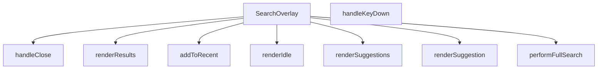

## Genel Bakış
Bu modül, kullanıcıya tam ekran veya katmanlı bir arayüz üzerinden arama yapma imkanı sunan React bileşenidir. Kullanıcı girdilerini dinleyerek eşzamanlı arama işlemlerini yönetir, arama geçmişini günceller ve sonuçları farklı görsel durumlar halinde sunar.

## Fonksiyon Grupları

### Bileşen Yapısı ve Durum Yönetimi
Ana bileşenin tanımlanmasını ve arama geçmişine yeni terimler eklenerek yerel durumun güncellenmesini sağlar.
- SearchOverlay, addToRecent

### Kullanıcı Etkileşimi
Klavye navigasyonunu ve pencerenin kapatılma isteğini gibi kullanıcı aksiyonlarını ele alır.
- handleClose, handleKeyDown

### Veri İşlemleri
Kullanıcının sorgusuna göre arama sonuçlarını asenkron olarak getirir.
- performFullSearch

### Arayüz Görselleştirme
Arama penceresinin boş durum, öneri listesi ve sonuç listesi gibi farklı görsel durumlarını oluşturur.
- renderIdle, renderSuggestions, renderResults, renderSuggestion

---

## AXIOMS – Mimari Varsayımlar
Bu modül için özel aksiyom tanımlanmamıştır.

---

## FONKSİYON DETAYLARI

### SearchOverlay
**Ne yapar**: Arama çubuğu için üst katman (overlay) bileşenini tanımlar ve `open` ve `onClose` prop’larıyla görünürlüğünü kontrol eder.  
**Nasıl yapar**: React fonksiyonel bileşeni olarak `SearchOverlayProps` tipinde parametre alır, içindeki durum yönetimi ve olay işleyicileriyle arama önerileri, sonuçları ve klavye etkileşimlerini yönetir.  
**Parametreler**:
- `open`: boolean — Overlay’ın açık olup olmadığını belirten flag.
- `onClose`: () => void — Overlay kapatıldığında tetiklenen geri çağırma fonksiyonu.  
**Dönüş**: React.FC\<SearchOverlayProps\> — Tanımlanan overlay bileşenini döndürür.

### handleClose
**Ne yapar**: Overlay’ı kapatmak için kullanılan yardımcı fonksiyondur.  
**Nasıl yapar**: `onClose` geri çağırmasını çalıştırarak overlay’ın kapanmasını sağlar.  
**Parametreler**: Yok.  
**Dönüş**: void

### addToRecent
**Ne yapar**: Kullanıcının arama terimini son aramalara ekler.  
**Nasıl yapar**: Verilen terimi (örnek kodda `q`) son arama listesine ekleyerek gelecekte hızlı erişim sağlar.  
**Parametreler**:
- `term`: string — Son aramalara eklenmek istenen arama terimi.  
**Dönüş**: void

### performFullSearch
**Ne yapar**: Kullanıcı tarafından girilen terimle tam metin araması başlatır.  
**Nasıl yapar**: `setQ` ile arama sorgusunu günceller ve aynı terimle `performFullSearch` fonksiyonunu (muhtemelen bir API çağrısı) tetikler.  
**Parametreler**:
- `term`: string — Aranacak tam metin sorgusu.  
**Dönüş**: void

### handleKeyDown
**Ne yapar**: Klavye tuşlarına (Escape, ArrowDown, ArrowUp, Enter) göre arama overlay’ının davranışlarını yönetir.  
**Nasıl yapar**:  
- Escape tuşu basıldığında `handleClose` çağrılır.  
- ArrowDown/ArrowUp tuşlarıyla aktif öneri/sonuç indeksi güncellenir.  
- Enter tuşu basıldığında seçili öğe varsa ilgili sayfaya yönlendirme yapılır, yoksa tam arama (`performFullSearch`) başlatılır.  
**Parametreler**:
- `e`: React.KeyboardEvent — Klavye olayı nesnesi.  
**Dönüş**: void

### renderSuggestion
**Ne yapar**: Tek bir arama önerisini UI’da göstermek için render fonksiyonunu çağırır.  
**Nasıl yapar**: Gelen öneri nesnesi `s` ve indeks `idx` parametrelerini `renderSuggestion` (muhtemelen bir JSX bileşeni) ile işler.  
**Parametreler**:
- `s`: SearchSuggestion — Görüntülenecek öneri nesnesi.  
- `idx`: number — Önerinin listedeki sırası.  
**Dönüş**: void

### renderIdle
**Ne yapar**: Arama overlay’ı boş (idle) durumundayken gösterilecek içeriği üretir.  
**Nasıl yapar**: Boş durum UI’sını döndürmek için ilgili render mantığını uygular.  
**Parametreler**: Yok.  
**Dönüş**: void

### renderSuggestions
**Ne yapar**: Arama önerileri listesini UI’da gösterir.  
**Nasıl yapar**: `suggestions` dizisini dolaşarak her bir öğeyi `renderSuggestion` ile render eder.  
**Parametreler**: Yok.  
**Dönüş**: void

### renderResults
**Ne yapar**: Arama sonuçlarını UI’da gösterir.  
**Nasıl yapar**: `results` dizisini işleyerek her bir sonuç öğesini uygun bir bileşenle render eder.  
**Parametreler**: Yok.  
**Dönüş**: void

---

## INTERFACES

### SearchOverlayProps
- `open: boolean`
- `onClose: () => void`

---

## TYPE ALIASES

### ViewState
```typescript
type ViewState = 'IDLE' | 'SUGGESTING' | 'RESULTS'
```

---

## AST POINTERS

### [N1_NASIL] AST Pointer: src/components/SearchOverlay.tsx::SearchOverlay
- **params**: `open`, `onClose`
- **ic_degiskenler**:
  - `globalCategories` — dışarıdan gelen kategori listesi, üst‑kategori olmayanları filtrelemek için kullanılır.
  - `popularCategories` — `globalCategories` üzerinden alınan ilk 5 kategori, UI’da gösterilir.
  - `RECENT_SEARCHES_KEY` — localStorage’da saklanan son aramaları tutan anahtar.
  - `recentSearches` — state, en son yapılan aramaları tutar; UI’da listelenir ve `addToRecent` ile güncellenir.
  - `setRecentSearches` — `recentSearches` state’ini güncelleyen setter.
  - `q` — arama kutusundaki metin, `setQ` ile güncellenir.
  - `setQ` — arama metnini güncelleyen setter.
  - `debounced` — `q` değerinin gecikmeli (debounce) hali, arama önerileri ve sonuçları için kullanılır.
  - `setDebounced` — `debounced` state’ini güncelleyen setter.
  - `suggestions` — öneri listesi, `setSuggestions` ile güncellenir.
  - `setSuggestions` — öneri listesi state’ini güncelleyen setter.
  - `results` — tam arama sonuçları, `setResults` ile güncellenir.
  - `setResults` — sonuç listesi state’ini güncelleyen setter.
  - `viewState` — `'IDLE' | 'SUGGESTING' | 'RESULTS'` gibi UI durumunu tutar.
  - `setViewState` — `viewState`i güncelleyen setter.
  - `loading` — arama işlemi devam ederken gösterilen yükleme durumu.
  - `setLoading` — `loading` state’ini güncelleyen setter.
  - `error` — arama hatası mesajı.
  - `setError` — `error` state’ini güncelleyen setter.
  - `activeIndex` — klavye ile seçilen öneri/sonuç indeksi.
  - `setActiveIndex` — `activeIndex`i güncelleyen setter.
  - `listRef` — öneri/sonuç listesinin DOM referansı, kaydırma için kullanılır.
  - `inputRef` — arama kutusunun DOM referansı, odaklamak için kullanılır.
  - `router` — `useRouter()` ile alınan yönlendirme nesnesi, sayfa navigasyonu için.
  - `t` — `useI18n()` ile alınan çeviri fonksiyonu.
- **Dönüş**: React bileşeni JSX döndürür; yan etkileri arasında localStorage okuma/yazma, zamanlayıcı yönetimi ve router navigasyonu bulunur.

### [N2_NASIL] AST Pointer: src/components/SearchOverlay.tsx::handleClose
- **params**: (parametre yok)
- **ic_degiskenler**:
  - `setQ` — arama kutusunu boşaltır.
  - `setResults` — sonuç listesini temizler.
  - `setSuggestions` — öneri listesini temizler.
  - `setViewState` — UI durumunu `'IDLE'` yapar.
  - `setActiveIndex` — seçili indeks’i `-1` yapar.
  - `onClose` — üst bileşenden gelen kapanış callback’i, çağrılır.
- **Dönüş**: yok (yan etki: UI ve state sıfırlama).

### [N3_NASIL] AST Pointer: src/components/SearchOverlay.tsx::addToRecent
- **params**: `term: string`
- **ic_degiskenler**:
  - `recentSearches` — mevcut son arama listesi.
  - `setRecentSearches` — güncellenmiş listeyi state’e yazar.
  - `RECENT_SEARCHES_KEY` — localStorage anahtarı.
- **Dönüş**: yok (yan etki: state ve localStorage güncellenir).

### [N4_NASIL] AST Pointer: src/components/SearchOverlay.tsx::performFullSearch
- **params**: `term: string`
- **ic_degiskenler**:
  - `setLoading` — arama sırasında loading durumunu `true` yapar.
  - `setError` — hata mesajını sıfırlar.
  - `setViewState` — UI’yı `'RESULTS'` durumuna geçirir.
  - `addToRecent` — arama terimini son aramalara ekler.
  - `setActiveIndex` — seçili indeksi `-1` yapar.
  - `ftsSearchProducts` — dinamik import ile getirilen tam metin arama fonksiyonu.
  - `rows` — `ftsSearchProducts` sonucunda dönen satırlar (her satır bir ürün).
  - `setResults` — `rows`u sonuç state’ine yazar.
  - `t` — çeviri fonksiyonu, hata mesajı için kullanılır.
  - `setLoading` (finally) — loading durumunu `false` yapar.
- **Dönüş**: yok (yan etki: API çağrısı, state güncellemeleri, hata yönetimi).

### [N5_NASIL] AST Pointer: src/components/SearchOverlay.tsx::handleKeyDown
- **params**: `e: React.KeyboardEvent`
- **ic_degiskenler**:
  - `router` — sayfa yönlendirme nesnesi.
  - `viewState` — mevcut UI durumu.
  - `suggestions` — öneri listesi.
  - `results` — tam arama sonuçları.
  - `activeIndex` — şu an seçili öğe indeksi.
  - `maxIndex` — `viewState`a göre geçerli maksimum indeks.
  - `setActiveIndex` — klavye ok tuşlarıyla indeksi günceller.
  - `handleClose` — Escape tuşunda overlay’i kapatır.
  - `performFullSearch` — Enter tuşunda tam arama başlatır.
  - `addToRecent` — seçilen öneri/sonuç etiketini son aramalara ekler.
  - `router.push` — seçilen öğenin URL’sine yönlendirir.
- **Dönüş**: yok (yan etki: klavye navigasyonu, state güncelleme, yönlendirme).

### [N6_NASIL] AST Pointer: src/components/SearchOverlay.tsx::renderSuggestion
- **params**: `s: SearchSuggestion`, `idx: number`
- **ic_degiskenler**:
  - `activeIndex` — mevcut seçili indeks.
  - `isActive` — `idx === activeIndex` kontrolü.
  - `icon` — öneri tipine göre oluşturulan JSX (image veya SVG).
  - `label` — öneri etiketi, marka ön eki eklenebilir.
  - `router` — navigasyon.
  - `addToRecent` — arama terimini son aramalara ekler.
  - `handleClose` — overlay’i kapatır.
  - `setActiveIndex` — mouseEnter ile aktif öğeyi ayarlar.
  - `highlightMatch` — arama kelimesiyle eşleşen kısmı vurgulamak için kullanılan yardımcı fonksiyon.
- **Dönüş**: JSX `<button>` elementi döndürür; yan etkileri mouse olayları ve navigasyon.

### [N7_NASIL] AST Pointer: src/components/SearchOverlay.tsx::renderIdle
- **params**: (parametre yok)
- **ic_degiskenler**:
  - `recentSearches` — son arama listesi.
  - `setRecentSearches` — temizleme butonunda listeyi sıfırlar.
  - `RECENT_SEARCHES_KEY` — localStorage’dan silinir.
  - `popularCategories` — popüler kategori listesi.
  - `router` — kategori butonlarıyla yönlendirme.
  - `Routes.category` — kategori URL’si üretir.
  - `getCategoryIcon` — kategori ikonu JSX’i.
  - `t` — çeviri fonksiyonu.
- **Dönüş**: JSX; UI’da son aramalar ve popüler kategorileri gösterir.

### [N8_NASIL] AST Pointer: src/components/SearchOverlay.tsx::renderSuggestions
- **params**: (parametre yok)
- **ic_degiskenler**:
  - `suggestions` — öneri dizisi.
  - `renderSuggestion` — her öneri için JSX üretir.
  - `listRef` — öneri listesinin DOM referansı.
  - `performFullSearch` — “Tüm sonuçları göster” butonunda tam arama başlatır.
  - `debounced` — mevcut arama terimi, buton metninde gösterilir.
  - `t` — çeviri fonksiyonu.
- **Dönüş**: JSX; öneri listesi ve “Tüm sonuçları göster” butonu.

### [N9_NASIL] AST Pointer: src/components/SearchOverlay.tsx::renderResults
- **params**: (parametre yok)
- **ic_degiskenler**:
  - `results` — tam arama sonuçları.
  - `activeIndex` — seçili sonuç indeksi.
  - `setActiveIndex` — mouseEnter ile aktif indeksi ayarlar.
  - `router` — ürün detay sayfasına yönlendirme.
  - `Routes.product` — ürün URL’si üretir.
  - `handleClose` — overlay’i kapatır.
  - `highlightMatch` — ürün adı, marka ve sku vurgulama.
  - `listRef` — sonuç listesinin DOM referansı.
  - `t` — çeviri fonksiyonu.
  - `hasFuzzy` — sonuçlarda fuzzy eşleşme olup olmadığını belirler.
- **Dönüş**: JSX; sonuç listesi ve fuzzy eşleşme uyarısı.

### [N10_NASIL] AST Pointer: src/components/SearchOverlay.tsx::renderIdle (no‑results placeholder)
- **params**: (parametre yok)
- **ic_degiskenler**:
  - `t` — çeviri fonksiyonu.
  - `performFullSearch` — “Detaylı arama” butonunda tam arama başlatır.
  - `debounced` — arama terimi, buton metninde gösterilir.
- **Dönüş**: JSX; öneri yokken gösterilen “sonuç yok” mesajı.

### [N11_NASIL] AST Pointer: src/components/SearchOverlay.tsx::renderResults (no‑results placeholder)
- **params**: (parametre yok)
- **ic_degiskenler**:
  - `t` — çeviri fonksiyonu.
- **Dönüş**: JSX; sonuç yokken gösterilen mesaj.

---


## MERMAID CALL GRAPH


## NODE ID STANDARD

  file: src\components\SearchOverlay.tsx
  function: src\components\SearchOverlay.tsx::SearchOverlay
  function: src\components\SearchOverlay.tsx::handleClose
  function: src\components\SearchOverlay.tsx::addToRecent
  function: src\components\SearchOverlay.tsx::performFullSearch
  function: src\components\SearchOverlay.tsx::handleKeyDown
  function: src\components\SearchOverlay.tsx::renderSuggestion
  function: src\components\SearchOverlay.tsx::renderIdle
  function: src\components\SearchOverlay.tsx::renderSuggestions
  function: src\components\SearchOverlay.tsx::renderResults

---

## DISA AKTARILANLAR (EXPORTS)
  export: SearchOverlay

---

## STİL TOKENLERİ

### Arbitrary Değerler (token'a geçirilmemiş)
Yok — tüm stiller token'a geçirilmiş. ✅

### Kullanılan Token'lar (zaten token'a geçirilmiş)
- (yok)

### Tailwind Sınıf Özeti
- **Renkler:** `bg-air-blue/10`, `bg-amber-50`, `bg-gray-100`, `bg-gray-50`, `bg-red-50`, `bg-slate-50`, `bg-slate-900/40`, `bg-transparent`, `bg-white`, `border-amber-100`, `border-b`, `border-gray-100`, `border-gray-200`, `border-primary-ocean/30`, `border-slate-100`
- **Layout:** `absolute`, `backdrop-blur-sm`, `custom-scrollbar`, `fixed`, `flex`, `flex-1`, `flex-col`, `flex-shrink-0`, `flex-wrap`, `gap-1`, `gap-1.5`, `gap-2`, `gap-3`, `gap-4`, `group-hover:bg-white`
- **Responsive:** `sm:` prefix kullanımları