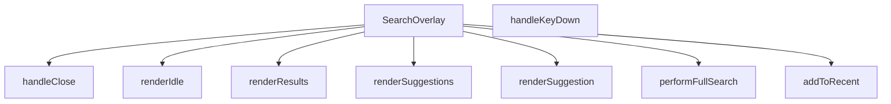

## Genel Bakış
SearchOverlay, uygulama genelinde arama işlevselliğini sağlayan tam kapsamlı bir React bileşenidir. Kullanıcıdan arama terimini alır, öneriler ve sonuçlar sunar, geçmiş aramaları takip eder. Modül, arama akışının tüm durumlarını (boş, öneri listesi, sonuç ekranı) yönetir.

## Fonksiyon Grupları

### Ana Bileşen ve Görünürlük Kontrolü
Bileşenin açılıp kapanmasını sağlayan ve üst düzey yaşam döngüsünü yöneten fonksiyonları barındırır.
- SearchOverlay, handleClose

### Arama İşlemleri ve Veri Yönetimi
Kullanıcının arama terimini işleyen, arama geçmişini tutan ve asenkron arama operasyonlarını yürüten fonksiyonları kapsar.
- performFullSearch, addToRecent

### Kullanıcı Girişi ve Olay Yönetimi
Klavye olaylarını dinleyerek kullanıcı eylemlerini arama tetikleme gibi işlevlere bağlayan yardımcı fonksiyondur.
- handleKeyDown

### Arayüz Görüntüleme Katmanı
Bileşenin farklı durumlarını (boş ekran, öneriler listesi, sonuç görünümü) oluşturan render fonksiyonlarıdır.
- renderSuggestion, renderIdle, renderSuggestions, renderResults

---

## AXIOMS – Mimari Varsayımlar

Bu modül, arama arayüzü akışını yöneten React bileşenidir. Aşağıdaki mimari varsayımlar, fonksiyon imzalarından türetilmiştir.

---

## FONKSİYON DETAYLARI

### SearchOverlay
**Ne yapar**: Arama çubuğu için bir üst katman (overlay) bileşeni oluşturur ve `open` durumu ile `onClose` geri çağrısını yönetir.  
**Nasıl yapar**: React fonksiyonel bileşeni olarak tanımlanır; `open` prop’u overlay’in görünürlüğünü kontrol eder, `onClose` ise kapanma eylemini tetikler. İçerik ve etkileşim mantığı diğer yardımcı fonksiyonlar tarafından sağlanır.  
**Parametreler**:
- `open`: boolean — Overlay’in açık/kapalı durumunu belirler.  
- `onClose`: () => void — Overlay kapandığında çalıştırılacak geri çağrı fonksiyonu.  
**Dönüş**: React.FC\<SearchOverlayProps\> — Belirtilen props tipine sahip bir React fonksiyonel bileşeni döndürür.

### handleClose
**Ne yapar**: Klavye olaylarını dinleyerek arama overlay’ini kapatır ve gezinme/arama akışını yönetir.  
**Nasıl yapar**: Gelen `React.KeyboardEvent` nesnesinin `key` özelliğine bakar; `Escape` tuşu basıldığında overlay’i kapatır, `ArrowDown` ve `ArrowUp` tuşlarıyla aktif öneri indeksini günceller, `Enter` tuşu ile seçili öneri ya da sonuç üzerinden yönlendirme yapar ya da tam arama başlatır.  
**Parametreler**:
- `e`: React.KeyboardEvent — Kullanıcıdan gelen klavye olayı.  
**Dönüş**: void — İşlevi tamamladıktan sonra bir değer döndürmez.

### addToRecent
**Ne yapar**: Kullanıcının arama terimini son aramalara ekler.  
**Nasıl yapar**: Verilen terimi (örnek kodda `q`) alır ve muhtemelen bir geçmiş listesine kaydeder; aynı zamanda ilgili yönlendirme ve kapanma işlemlerini tetikler.  
**Parametreler**:
- `term`: string — Son aramalara eklenmek istenen arama ifadesi.  
**Dönüş**: void — İşlem tamamlandığında bir değer döndürmez.

### performFullSearch
**Ne yapar**: Tam metin araması başlatır.  
**Nasıl yapar**: Gelen arama terimini durum (`q`) olarak ayarlar ve aynı terimle tam arama fonksiyonunu (muhtemelen kendisini) çağırır.  
**Parametreler**:
- `term`: string — Aranacak tam metin ifadesi.  
**Dönüş**: void — İşlev bir sonuç döndürmez.

### handleKeyDown
**Ne yapar**: Klavye tuşlarına göre arama overlay’inde gezinme ve eylem tetikleme sorumluluğu taşır.  
**Nasıl yapar**: (Kod içeriği verilmemiştir; genellikle `handleClose` benzeri bir mantıkla tuşları kontrol eder.)  
**Parametreler**:
- `e`: React.KeyboardEvent — Kullanıcıdan gelen klavye olayı.  
**Dönüş**: void — İşlem sonrası bir değer döndürmez.

### renderSuggestion
**Ne yapar**: Tek bir arama önerisini görsel olarak oluşturur.  
**Nasıl yapar**: (Kod içinde aynı fonksiyona yeniden çağrı yapılmış; gerçek render mantığı burada tanımlanmamış.)  
**Parametreler**:
- `s`: SearchSuggestion — Görüntülenecek öneri nesnesi.  
- `idx`: number — Önerinin listedeki indeksi.  
**Dönüş**: void — Görsel çıktı üretir, ancak dönüş değeri yoktur.

### renderIdle
**Ne yapar**: Arama overlay’i boş (idle) durumundayken gösterilecek içeriği üretir.  
**Nasıl yapar**: (Kod içeriği sağlanmamıştır.)  
**Parametreler**: Yok.  
**Dönüş**: void — Görsel bir eleman döndürür.

### renderSuggestions
**Ne yapar**: Öneri listesini (suggestions) render eder.  
**Nasıl yapar**: (Kod içeriği eksiktir; muhtemelen `renderSuggestion` fonksiyonunu döngü içinde çağırır.)  
**Parametreler**: Yok.  
**Dönüş**: void — Öneri elemanlarını ekrana yerleştirir.

### renderResults
**Ne yapar**: Arama sonuçlarını (results) ekranda gösterir.  
**Nasıl yapar**: (Kod içeriği verilmemiştir; genellikle sonuç dizisini map ederek her birini render eder.)  
**Parametreler**: Yok.  
**Dönüş**: void — Sonuç elemanlarını üretir.

---

## INTERFACES

### SearchOverlayProps
- `open: boolean`
- `onClose: () => void`

---

## TYPE ALIASES

### ViewState
```typescript
type ViewState = 'IDLE' | 'SUGGESTING' | 'RESULTS'
```

---

## AST POINTERS

### [N1_NASIL] AST Pointer: src/components/SearchOverlay.tsx::SearchOverlay
- **params**: `{ open, onClose }` — overlay açılır/kapalı durumu ve kapanma callback'i
- **ic_degiskenler**:
  - `router` — Next.js navigation hook'u, sayfa yönlendirme için
  - `t` — useI18n() hook'undan gelen çeviri fonksiyonu
  - `listRef` — useRef ile oluşturulan liste DOM referansı, scroll kontrolü için
  - `inputRef` — useRef ile oluşturulan input DOM referansı, otomatik odaklama için
  - `q` — useState, kullanıcının arama giriş değeri
  - `debounced` — useState, gecikmeli arama terimi (200ms debounce)
  - `viewState` — useState<'IDLE' | 'SUGGESTING' | 'RESULTS'>, mevcut görünüm durumu
  - `suggestions` — useState<SearchSuggestion[]>[], öneri listesi
  - `results` — useState<FtsProductResult[]>[], tam arama sonuçları
  - `recentSearches` — useState<string>[], son arama terimleri listesi
  - `loading` — useState<boolean>, yükleme durumu
  - `error` — useState<string | null>, hata mesajı
  - `activeIndex` — useState<number>, klavye ile seçili öğe indeksi (-1 = hiçbirini seçili değil)
  - `globalCategories` — useCategories() hook'undan gelen tüm kategoriler
  - `supabaseBrowserClient` — Supabase istemci instance'ı
  - `RECENT_SEARCHES_KEY` — localStorage anahtarı sabiti
  - `popularCategories` — useMemo ile hesaplanan, parent_id olmayan ilk 5 kategori
  - `handleClose` — inner fonksiyon, state sıfırlar ve onClose çağırır
  - `addToRecent` — inner fonksiyon, arama terimini recent listesine ekler
  - `performFullSearch` — inner async fonksiyon, tam FTS araması yapar
  - `handleKeyDown` — inner fonksiyon, klavye olaylarını yönetir
  - `renderSuggestion` — inner fonksiyon, tek bir suggestion öğesi render eder
  - `renderIdle` — inner fonksiyon, boş durum görünümünü render eder
  - `renderSuggestions` — inner fonksiyon, öneri listesi görünümünü render eder
  - `renderResults` — inner fonksiyon, sonuç listesi görünümünü render eder
- **Dönüş**: React.FC<SearchOverlayProps> — SearchOverlay bileşeni JSX

### [N2_NASIL] AST Pointer: src/components/SearchOverlay.tsx::handleClose
- **params**: yok
- **ic_degiskenler**:
  - `q` — setQ('') ile sıfırlanan arama giriş değeri
  - `results` — setResults([]) ile sıfırlanan sonuç listesi
  - `suggestions` — setSuggestions([]) ile sıfırlanan öneri listesi
  - `viewState` — setViewState('IDLE') ile idle durumuna ayarlanan görünüm
  - `activeIndex` — setActiveIndex(-1) ile sıfırlanan seçili indeks
  - `onClose` — prop'tan gelen kapanma callback'i
- **Dönüş**: yok — overlay'i kapatır ve tüm state'i sıfırlar

### [N3_NASIL] AST Pointer: src/components/SearchOverlay.tsx::addToRecent
- **params**: `(term: string)` — eklenecek arama terimi
- **ic_degiskenler**:
  - `term` — parametre, eklenecek arama terimi
  - `recentSearches` — mevcut son aramalar listesi
  - `next` — term'i başa ekleyen, mükerrerleri temizleyen ve 5 ile sınırlayan filtrelenmiş liste
  - `RECENT_SEARCHES_KEY` — localStorage anahtarı
  - `setRecentSearches` — state güncelleme fonksiyonu
- **Dönüş**: yok — term'i localStorage'a ve state'e kaydeder

### [N4_NASIL] AST Pointer: src/components/SearchOverlay.tsx::performFullSearch
- **params**: `(term: string)` — aranacak terim
- **ic_degiskenler**:
  - `term` — parametre, arama terimi
  - `setLoading` — yükleme durumunu true yapan state setter
  - `setError` — hata durumunu null yapan state setter
  - `setViewState` — viewState'i 'RESULTS' yapan state setter
  - `setActiveIndex` — activeIndex'i -1 yapan state setter
  - `ftsSearchProducts` — dinamik import ile yüklenen FTS arama servisi fonksiyonu
  - `supabaseBrowserClient` — Supabase istemci instance'ı
  - `rows` — ftsSearchProducts() çağrısından dönen arama sonuçları
  - `setResults` — sonuçları state'e yazan setter
  - `addToRecent` — inner fonksiyon, terimi son aramalara ekler
  - `t` — çeviri fonksiyonu, hata mesajı için
- **Dönüş**: yok — tam metin araması yapar, sonuçları state'e yazar

### [N5_NASIL] AST Pointer: src/components/SearchOverlay.tsx::handleKeyDown
- **params**: `(e: React.KeyboardEvent)` — klavye olay nesnesi
- **ic_degiskenler**:
  - `e` — parametre, KeyboardEvent nesnesi
  - `suggestions` — mevcut öneriler listesi
  - `results` — mevcut sonuçlar listesi
  - `viewState` — mevcut görünüm durumu
  - `maxIndex` — hesaplanan maksimum indeks (suggestions veya results uzunluğuna göre)
  - `activeIndex` — mevcut seçili indeks
  - `s` — Enter tuşunda suggestions[activeIndex] ile alınan seçili öneri
  - `res` — Enter tuşunda results[activeIndex] ile alınan seçili sonuç
  - `router` — Next.js yönlendirme fonksiyonu
  - `addToRecent` — inner fonksiyon
  - `handleClose` — inner fonksiyon
  - `performFullSearch` — inner async fonksiyon
  - `q` — mevcut arama terimi
  - `Routes` — rota yardımcı fonksiyonları
- **Dönüş**: yok — Escape ile kapatma, ok tuşlarıyla gezinme, Enter ile seçim/arama

### [N6_NASIL] AST Pointer: src/components/SearchOverlay.tsx::renderSuggestion
- **params**: `(s: SearchSuggestion, idx: number)` — öneri nesnesi ve listedeki indeksi
- **ic_degiskenler**:
  - `s` — parametre, SearchSuggestion nesnesi
  - `idx` — parametre, listenin sırası
  - `isActive` — idx === activeIndex hesaplanan boolean, öğe seçili mi
  - `icon` — s.type'a göre render edilen SVG veya Image bileşeni (product/category/brand)
  - `label` — brand ise t('search.brandPrefix') eklenen, diğer durumlarda s.label
  - `s.metadata` — Record<string, string> olarak cast edilen metadata (image_url, sku, brand)
  - `debounced` — highlightMatch için kullanılan gecikmeli arama terimi
  - `highlightMatch` — import edilen vurgulama yardımcı fonksiyonu
  - `router` — Next.js yönlendirme
  - `addToRecent` — inner fonksiyon
  - `handleClose` — inner fonksiyon
- **Dönüş**: yok (JSX — <button> elemanı render eder)

### [N7_NASIL] AST Pointer: src/components/SearchOverlay.tsx::renderIdle
- **params**: yok
- **ic_degiskenler**:
  - `recentSearches` — son arama terimleri listesi, length kontrolü ve map için
  - `t` — çeviri fonksiyonu (search.recentSearches, search.clearRecent, search.popularCategories)
  - `setRecentSearches` —_recentSearches'i [] ile sıfırlayan setter
  - `RECENT_SEARCHES_KEY` — localStorage.removeItem için anahtar
  - `setQ` — q state'ini term yapan setter (recentSearch tıklamasında)
  - `performFullSearch` — inner async fonksiyon (recentSearch tıklamasında)
  - `term` — map callback parametresi, her bir recent arama terimi
  - `popularCategories` — popüler kategoriler listesi (length kontrolü ve map için)
  - `router` — Next.js yönlendirme
  - `handleClose` — inner fonksiyon
  - `cat` — map callback parametresi, her bir kategori nesnesi
  - `getCategoryIcon` — import edilen kategori ikon yardımcı fonksiyonu
  - `String(cat.id)` — kategori ID'si (key için)
  - `String(cat.slug)` — kategori slug'ı (routelama ve ikon için)
  - `String(cat.name)` — kategori adı (görünen metin)
  - `Routes` — rota yardımcı fonksiyonları (Routes.category)
- **Dönüş**: yok (JSX — idle durum görünümünü render eder)

### [N8_NASIL] AST Pointer: src/components/SearchOverlay.tsx::renderSuggestions
- **params**: yok
- **ic_degiskenler**:
  - `suggestions` — öneriler listesi (length kontrolü ve map için)
  - `t` — çeviri fonksiyonu (search.noResults, search.detailedSearch, search.allResults)
  - `debounced` — vurgulama ve "aramaya devam et" butonu için gecikmeli terim
  - `performFullSearch` — inner async fonksiyon (buton onClick için)
  - `listRef` — ref={listRef} ile bağlanan DOM referansı
  - `s` — suggestions.map callback parametresi, tek bir SearchSuggestion
  - `idx` — suggestions.map callback indeks parametresi
  - `renderSuggestion` — inner fonksiyon, tek suggestion render eder
- **Dönüş**: yok (JSX — öneri listesi görünümünü render eder)

### [N9_NASIL] AST Pointer: src/components/SearchOverlay.tsx::renderResults
- **params**: yok
- **ic_degiskenler**:
  - `results` — arama sonuçları listesi (length kontrolü, some() ve map için)
  - `t` — çeviri fonksiyonu (search.noResults, search.noResultsAdvice, search.fuzzyMatchNotice)
  - `hasFuzzy` — results.some(r => r.is_fuzzy_match) hesaplanan boolean, fuzzy eşleşme var mı
  - `listRef` — ref={listRef} ile bağlanan DOM referansı
  - `r` — results.map callback parametresi, tek bir FtsProductResult
  - `idx` — results.map callback indeks parametresi
  - `isActive` — idx === activeIndex hesaplanan boolean, öğe seçili mi
  - `highlightMatch` — import edilen vurgulama yardımcı fonksiyonu
  - `debounced` — highlightMatch için gecikmeli arama terimi
  - `r.id` — ürün ID'si (key için)
  - `r.name` — ürün adı (görünen metin ve vurgulama için)
  - `r.brand` — ürün markası (opsiyonel, vurgulama için)
  - `r.sku` — ürün SKU'su (görünen metin ve vurgulama için)
  - `r.slug` — ürün slug'ı (Routes.product için, ! ile non-null assertion)
  - `r.image_url` — ürün görsel URL'i (opsiyonel, Image component için)
  - `r.is_fuzzy_match` — fuzzy eşleşme bayrağı (hasFuzzy hesaplaması için)
  - `router` — Next.js yönlendirme
  - `handleClose` — inner fonksiyon
  - `Routes` — rota yardımcı fonksiyonları (Routes.product)
- **Dönüş**: yok (JSX — sonuç listesi görünümünü render eder)

---


## MERMAID CALL GRAPH


## NODE ID STANDARD

  file: src\components\SearchOverlay.tsx
  function: src\components\SearchOverlay.tsx::SearchOverlay
  function: src\components\SearchOverlay.tsx::handleClose
  function: src\components\SearchOverlay.tsx::addToRecent
  function: src\components\SearchOverlay.tsx::performFullSearch
  function: src\components\SearchOverlay.tsx::handleKeyDown
  function: src\components\SearchOverlay.tsx::renderSuggestion
  function: src\components\SearchOverlay.tsx::renderIdle
  function: src\components\SearchOverlay.tsx::renderSuggestions
  function: src\components\SearchOverlay.tsx::renderResults

---

## DISA AKTARILANLAR (EXPORTS)
  export: SearchOverlay

---

## STİL TOKENLERİ

### Arbitrary Değerler (token'a geçirilmemiş)
Yok — tüm stiller token'a geçirilmiş. ✅

### Kullanılan Token'lar (zaten token'a geçirilmiş)
- (yok)

### Tailwind Sınıf Özeti
- **Renkler:** `bg-air-blue/10`, `bg-amber-50`, `bg-gray-100`, `bg-gray-50`, `bg-red-50`, `bg-slate-50`, `bg-slate-900/40`, `bg-transparent`, `bg-white`, `border-amber-100`, `border-b`, `border-gray-100`, `border-gray-200`, `border-primary-ocean/30`, `border-slate-100`
- **Layout:** `absolute`, `backdrop-blur-sm`, `custom-scrollbar`, `fixed`, `flex`, `flex-1`, `flex-col`, `flex-shrink-0`, `flex-wrap`, `gap-1`, `gap-1.5`, `gap-2`, `gap-3`, `gap-4`, `h-10`
- **Varyant/Responsive:** `:`, `focus-visible:`, `focus:`, `group-hover:`, `hover:`, `placeholder:`, `sm:`, `xs:` önekleri
- **Yardımcı Sınıflar:** `${isActive`, `:`, `animate-in`, `animate-spin`, `border`, `cursor-pointer`, `divide-gray-100`, `divide-y`, `duration-200`, `duration-300`, `fade-in`, `focus-visible:outline-none`, `focus-visible:ring-2`, `focus-visible:ring-primary-navy`, `font-bold`