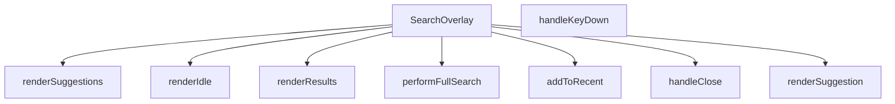

## Genel Bakış
SearchOverlay, arama işlevselliği için bir arayüz katmanı (overlay) sunan bir React bileşenidir. Kullanıcının arama terimi girmesini sağlar, gerçek zamanlı öneriler sunar, son aramaları hatırlar ve tam arama sonuçlarını gösterir. Modül, arama sürecinin tüm aşamalarını, kullanıcı etkileşimlerini ve ilgili arayüz durumlarını yönetir.

## Fonksiyon Grupları
### Ana Bileşen ve Görünürlük Yönetimi
Bu grup, arama arayüzünün açılıp kapanmasını ve genel bileşen yaşam döngüsünü kontrol eder.
- SearchOverlay, handleClose

### Arama İşlemleri ve Mantık
Kullanıcının arama girişini işleyen, arama sonuçlarını getiren ve arama geçmişini güncelleyen fonksiyonları içerir.
- performFullSearch, addToRecent

### Kullanıcı Etkileşimi ve Olay Yönetimi
Kullanıcının klavye gibi giriş eylemlerini yakalayarak arama tetikleme gibi aksiyonlara yönlendiren fonksiyonları kapsar.
- handleKeyDown

### Arayüz Görüntüleme Yardımcıları
Arama arayüzünün farklı durumlarını (boş durum, öneriler, sonuç listesi) oluşturan ve sunan bileşen parçalarını yönetir.
- renderSuggestion, renderIdle, renderSuggestions, renderResults

---

## AXIOMS – Mimari Varsayımlar

Bu modül için gerekli mimari varsayımlar fonksiyon imzalarından türetilmiştir.

**[Aksiyom 1]:** Eğer `open` prop'u bileşene sağlanmazsa, SearchOverlay'ün hangi durumda render edileceği belirsiz olur ve bileşen görünürlülük kontrolünü kaybeder.

**[Aksiyom 2]:** Eğer `onClose` callback prop'u sağlanmazsa, overlay kapatılamaz ve kullanıcı arama arayüzünde sıkışık kalır.

**[Aksiyom 3]:** Eğer `addToRecent(term: string)` fonksiyonunun kullanabileceği bir depolama mekanizması (state veya external storage) yoksa, son aramalar saklanamaz ve renderIdle() fonksiyonu geçmiş arama önerilerini gösteremez.

**[Aksiyom 4]:** Eğer `performFullSearch(term: string)` tarafından çağrılabilir bir arama servisi/API'si yoksa, tam arama sonuçları oluşturulamaz ve renderResults() boş veya hatalı sonuç döndürür.

**[Aksiyom 5]:** Eğer `SearchSuggestion` tipi (renderSuggestion parametresinde beklenen) tanımlı değilse veya gerekli alanları içermiyorsa, renderSuggestion() fonksiyonu öneri öğelerini doğru şekilde render edemez.

**[Aksiyom 6]:** Eğer `handleKeyDown(e: React.KeyboardEvent)` bir klavye etkileşimine sahip DOM elemanına (input vs.) bağlanmazsa, tuş olayları yakalanamaz ve arama tetikleme/kapatma işlemleri çalışmaz.

**[Aksiyom 7]:** Eğer `performFullSearch` ve `addToRecent` aynı terim formatında çalışamazsa (örn: boş string kontrolü), geçersiz arama terimleri sisteme kaydedilir veya işlenir.

---

## FONKSİYON DETAYLARI

### SearchOverlay
**Ne yapar**: Arama çubuğu için bir üst katman (overlay) bileşeni oluşturur ve `open` durumu ile `onClose` geri çağrısını yönetir.  
**Nasıl yapar**: React fonksiyonel bileşeni olarak tanımlanır; `open` prop’u overlay’in görünürlüğünü kontrol eder, `onClose` ise kapanma eylemini tetikler. İçerik ve etkileşim mantığı diğer yardımcı fonksiyonlar tarafından sağlanır.  
**Parametreler**:
- `open`: boolean — Overlay’in açık/kapalı durumunu belirler.  
- `onClose`: () => void — Overlay kapandığında çalıştırılacak geri çağrı fonksiyonu.  
**Dönüş**: React.FC\<SearchOverlayProps\> — Belirtilen props tipine sahip bir React fonksiyonel bileşeni döndürür.

### handleClose
**Ne yapar**: Klavye olaylarını dinleyerek arama overlay’ini kapatır ve gezinme/arama akışını yönetir.  
**Nasıl yapar**: Gelen `React.KeyboardEvent` nesnesinin `key` özelliğine bakar; `Escape` tuşu basıldığında overlay’i kapatır, `ArrowDown` ve `ArrowUp` tuşlarıyla aktif öneri indeksini günceller, `Enter` tuşu ile seçili öneri ya da sonuç üzerinden yönlendirme yapar ya da tam arama başlatır.  
**Parametreler**:
- `e`: React.KeyboardEvent — Kullanıcıdan gelen klavye olayı.  
**Dönüş**: void — İşlevi tamamladıktan sonra bir değer döndürmez.

### addToRecent
**Ne yapar**: Kullanıcının arama terimini son aramalara ekler.  
**Nasıl yapar**: Verilen terimi (örnek kodda `q`) alır ve muhtemelen bir geçmiş listesine kaydeder; aynı zamanda ilgili yönlendirme ve kapanma işlemlerini tetikler.  
**Parametreler**:
- `term`: string — Son aramalara eklenmek istenen arama ifadesi.  
**Dönüş**: void — İşlem tamamlandığında bir değer döndürmez.

### performFullSearch
**Ne yapar**: Tam metin araması başlatır.  
**Nasıl yapar**: Gelen arama terimini durum (`q`) olarak ayarlar ve aynı terimle tam arama fonksiyonunu (muhtemelen kendisini) çağırır.  
**Parametreler**:
- `term`: string — Aranacak tam metin ifadesi.  
**Dönüş**: void — İşlev bir sonuç döndürmez.

### handleKeyDown
**Ne yapar**: Klavye tuşlarına göre arama overlay’inde gezinme ve eylem tetikleme sorumluluğu taşır.  
**Nasıl yapar**: (Kod içeriği verilmemiştir; genellikle `handleClose` benzeri bir mantıkla tuşları kontrol eder.)  
**Parametreler**:
- `e`: React.KeyboardEvent — Kullanıcıdan gelen klavye olayı.  
**Dönüş**: void — İşlem sonrası bir değer döndürmez.

### renderSuggestion
**Ne yapar**: Tek bir arama önerisini görsel olarak oluşturur.  
**Nasıl yapar**: (Kod içinde aynı fonksiyona yeniden çağrı yapılmış; gerçek render mantığı burada tanımlanmamış.)  
**Parametreler**:
- `s`: SearchSuggestion — Görüntülenecek öneri nesnesi.  
- `idx`: number — Önerinin listedeki indeksi.  
**Dönüş**: void — Görsel çıktı üretir, ancak dönüş değeri yoktur.

### renderIdle
**Ne yapar**: Arama overlay’i boş (idle) durumundayken gösterilecek içeriği üretir.  
**Nasıl yapar**: (Kod içeriği sağlanmamıştır.)  
**Parametreler**: Yok.  
**Dönüş**: void — Görsel bir eleman döndürür.

### renderSuggestions
**Ne yapar**: Öneri listesini (suggestions) render eder.  
**Nasıl yapar**: (Kod içeriği eksiktir; muhtemelen `renderSuggestion` fonksiyonunu döngü içinde çağırır.)  
**Parametreler**: Yok.  
**Dönüş**: void — Öneri elemanlarını ekrana yerleştirir.

### renderResults
**Ne yapar**: Arama sonuçlarını (results) ekranda gösterir.  
**Nasıl yapar**: (Kod içeriği verilmemiştir; genellikle sonuç dizisini map ederek her birini render eder.)  
**Parametreler**: Yok.  
**Dönüş**: void — Sonuç elemanlarını üretir.

---

## INTERFACES

### SearchOverlayProps
- `open: boolean`
- `onClose: () => void`

---

## TYPE ALIASES

### ViewState
```typescript
type ViewState = 'IDLE' | 'SUGGESTING' | 'RESULTS'
```

---

## AST POINTERS

### [N1_NASIL] AST Pointer: src/components/SearchOverlay.tsx::SearchOverlay
- **params**: `{ open, onClose }` — `open` modal'ın açık olup olmadığını belirtir (boolean), `close` modal'ı kapatmak için callback
- **ic_degiskenler**:
  - `q` — kullanıcının arama inputuna yazdığı ham metin (useState)
  - `debounced` — `q`'nun 200ms gecikmeli hali, debounce amaçlı kullanılır (useState)
  - `recentSearches` — localStorage'dan yüklenen son arama terimleri listesi (useState)
  - `activeIndex` — klavye navigasyonunda seçili olan öneri/sonuç indeksi, -1 hiçbir şey seçilmediğini gösterir (useState)
  - `viewState` — mevcut görünüm modu: `'IDLE'`, `'SUGGESTING'` veya `'RESULTS'` (useState)
  - `suggestions` — arama önerileri listesi, `getSearchSuggestions` API'sinden dönen veriler (useState)
  - `results` — tam arama sonuçları listesi, `ftsSearchProducts` API'sinden dönen FTSProductResult[] (useState)
  - `loading` — arama isteği sırasında true olan yükleme durumu flag'i (useState)
  - `error` — arama sırasında oluşan hata mesajı (useState)
  - `inputRef` — arama inputuna programatik odaklanmak için ref
  - `listRef` — öneri/sonuç listesinin DOM referansı, `scrollIntoView` için kullanılır
  - `globalCategories` — `useCategories()` context'inden gelen tüm kategoriler listesi
  - `popularCategories` — `globalCategories` içinden `parent_id`'si olmayan ilk 5 üst kategori, Idle ekranında gösterilir
  - `t` — `useI18n()` hook'undan dönen çeviri fonksiyonu
  - `router` — `useRouter()` hook'undan dönen Next.js router nesnesi, sayfa yönlendirmeleri için
- **Dönüş**: `React.FC<SearchOverlayProps>` — SearchOverlay modal bileşeninin JSX yapısı

---

### [N2_NASIL] AST Pointer: src/components/SearchOverlay.tsx::handleClose
- **params**: (yok)
- **ic_degiskenler**: (yok)
- **Dönüş**: yok — tüm state'leri sıfırlar (`setQ`, `setResults`, `setSuggestions`, `setViewState`, `setActiveIndex`) ve `onClose()` callback'ini çağırarak modal'ı kapatır

---

### [N3_NASIL] AST Pointer: src/components/SearchOverlay.tsx::addToRecent
- **params**: `term: string` — kaydedilecek arama terimi
- **ic_degiskenler**:
  - `next` — terimi başa ekleyip duplicate'leri filtreleyen ve en fazla 5 eleman tutan güncellenmiş arama terimleri dizisi
- **Dönüş**: yok — `recentSearches` state'ini günceller ve `localStorage.setItem` ile `RECENT_SEARCHES_KEY` altına JSON olarak kalıcı olarak saklar

---

### [N4_NASIL] AST Pointer: src/components/SearchOverlay.tsx::performFullSearch
- **params**: `term: string` — aranacak tam arama terimi
- **ic_degiskenler**:
  - `rows` — `ftsSearchProducts(term, 20)` API çağrısından dönen tam arama sonuçları dizisi (FtsProductResult[])
- **Dönüş**: yok — `setLoading(true)` ile yükleme başlatır, `setError(null)` ile hatayı temizler, `setViewState('RESULTS')` ile görünümü sonuç moduna alır, `addToRecent(term)` ile terimi son aramalara ekler, `setActiveIndex(-1)` ile seçimi sıfırlar, dinamik import ile `ftsSearchProducts` servisini yükler, sonuçları `setResults(rows)` ile state'e yazar, hata durumunda `setError(...)` ile hata mesajı ayarlar, finally bloğunda `setLoading(false)` ile yükleme bitirir

---

### [N5_NASIL] AST Pointer: src/components/SearchOverlay.tsx::handleKeyDown
- **params**: `e: React.KeyboardEvent` — tuş basma olayı nesnesi
- **ic_degiskenler**:
  - `maxIndex` — navigasyon yapılabilecek son indeks, `viewState`'e göre `suggestions.length - 1` veya `results.length - 1` veya `-1` olarak hesaplanır
- **Dönüş**: yok — `Escape` tuşunda `handleClose()` çağırır, `ArrowDown` ile `activeIndex`'i artırır, `ArrowUp` ile azaltır, `Enter` tuşunda seçili öğe varsa ilgili URL'e `router.push` ile navigasyon yapar (`suggestions` durumunda `s.url`, `results` durumunda `Routes.product(res.slug!)`), öğe seçilmediyse `performFullSearch(q)` çağırarak tam arama başlatır

---

### [N6_NASIL] AST Pointer: src/components/SearchOverlay.tsx::renderSuggestion
- **params**: `s: SearchSuggestion` — tek bir arama önerisi nesnesi, `idx: number` — önerinin listedeki indeksi
- **ic_degiskenler**:
  - `isActive` — `idx === activeIndex` karşılaştırmasıyla hesaplanan bu önerinin seçili olup olmadığını belirten boolean
  - `icon` — `s.type`'a (`'product'`, `'category'`, `'brand'`) göre JSX ile oluşturulmuş ikon bileşeni; ürün tipinde `image_url` varsa `<Image>` ile görsel, yoksa SVG kutu ikonu; kategori tipinde grid ikonu; marka tipinde tag ikonu
  - `label` — marka ise `t('search.brandPrefix')` prefix'i eklenmiş, diğer tiplerde doğrudan `s.label` olan gösterilecek metin
- **Dönüş**: yok (JSX döndürür) — `<button>` JSX'i döndürür; `onMouseEnter` ile `setActiveIndex(idx)` çağırır, `onClick` ile `router.push(s.url)` ve `addToRecent(q)` ve `handleClose()` çağırır; `highlightMatch(label, debounced)` ile arama terimini vurgular; ürün tipinde `(s.metadata as Record<string, string>)?.sku` ve `brand` bilgilerini gösterir

---

### [N7_NASIL] AST Pointer: src/components/SearchOverlay.tsx::renderIdle
- **params**: (yok)
- **ic_degiskenler**: (yok)
- **Dönüş**: yok (JSX döndürür) — Boş arama ekranını render eder; `recentSearches` listesi varsa her terimi `<button>` olarak gösterir, tıklandığında `setQ(term)` ve `performFullSearch(term)` çağırır; "Temizle" butonu `setRecentSearches([])` ve `localStorage.removeItem(RECENT_SEARCHES_KEY)` ile geçmişi siler; `popularCategories` listesini `cat.id`, `cat.slug`, `cat.name` erişimleriyle buton olarak gösterir, fallback olarak hardcoded dizin (`fans`, `air-curtains`, `heat-recovery-units`) kullanır; her kategori butonu `getCategoryIcon(cat.slug)` ve `Routes.category(cat.slug)` ile ikon ve yönlendirme sağlar

---

### [N8_NASIL] AST Pointer: src/components/SearchOverlay.tsx::renderSuggestions
- **params**: (yok)
- **ic_degiskenler**: (yok)
- **Dönüş**: yok (JSX döndürür) — `suggestions.length === 0` ise "Sonuç bulunamadı" ekranı render eder, `performFullSearch(debounced)` butonu sunar; aksi halde `listRef` reference'ına bağlı `<div>` içinde `suggestions.map((s, idx) => renderSuggestion(s, idx))` ile her öneriyi render eder, altına `performFullSearch(debounced)` ile tüm sonuçları görme butonu ekler

---

### [N9_NASIL] AST Pointer: src/components/SearchOverlay.tsx::renderResults
- **params**: (yok)
- **ic_degiskenler**:
  - `hasFuzzy` — `results.some(r => r.is_fuzzy_match)` ile hesaplanan, sonuçların arasında fuzzy eşleşme olup olmadığını belirten boolean
- **Dönüş**: yok (JSX döndürür) — `results.length === 0` ise "Sonuç bulunamadı" ekranı render eder; `hasFuzzy` true ise sarı arka planlı fuzzy eşleşme uyarısı banner'ı gösterir; `results.map((r, idx) => {...})` ile her sonucu render eder; her sonuç butonunda `r.image_url` varsa `<Image>` ile görsel, yoksa placeholder SVG; `r.name`, `r.brand`, `r.sku` alanlarını `highlightMatch` ile vurgulanmış şekilde gösterir; `isActive` durumuna göre stil değişikliği uygular; `onClick` ile `router.push(Routes.product(r.slug!))` ve `handleClose()` çağırır; `onMouseEnter` ile `setActiveIndex(idx)` navigasyonunu tetikler

---


## MERMAID CALL GRAPH


## NODE ID STANDARD

  file: src\components\SearchOverlay.tsx
  function: src\components\SearchOverlay.tsx::SearchOverlay
  function: src\components\SearchOverlay.tsx::handleClose
  function: src\components\SearchOverlay.tsx::addToRecent
  function: src\components\SearchOverlay.tsx::performFullSearch
  function: src\components\SearchOverlay.tsx::handleKeyDown
  function: src\components\SearchOverlay.tsx::renderSuggestion
  function: src\components\SearchOverlay.tsx::renderIdle
  function: src\components\SearchOverlay.tsx::renderSuggestions
  function: src\components\SearchOverlay.tsx::renderResults

---

## DISA AKTARILANLAR (EXPORTS)
  export: SearchOverlay

---

## STİL TOKENLERİ

### Arbitrary Değerler (token'a geçirilmemiş)
Yok — tüm stiller token'a geçirilmiş. ✅

### Kullanılan Token'lar (zaten token'a geçirilmiş)
- (yok)

### Tailwind Sınıf Özeti
- **Renkler:** `bg-air-blue/10`, `bg-amber-50`, `bg-gray-100`, `bg-gray-50`, `bg-red-50`, `bg-slate-50`, `bg-slate-900/40`, `bg-transparent`, `bg-white`, `border-amber-100`, `border-b`, `border-gray-100`, `border-gray-200`, `border-primary-ocean/30`, `border-slate-100`
- **Layout:** `absolute`, `backdrop-blur-sm`, `custom-scrollbar`, `fixed`, `flex`, `flex-1`, `flex-col`, `flex-shrink-0`, `flex-wrap`, `gap-1`, `gap-1.5`, `gap-2`, `gap-3`, `gap-4`, `h-10`
- **Varyant/Responsive:** `:`, `focus-visible:`, `focus:`, `group-hover:`, `hover:`, `placeholder:`, `sm:`, `xs:` önekleri
- **Yardımcı Sınıflar:** `${isActive`, `:`, `animate-in`, `animate-spin`, `border`, `cursor-pointer`, `divide-gray-100`, `divide-y`, `duration-200`, `duration-300`, `fade-in`, `focus-visible:outline-none`, `focus-visible:ring-2`, `focus-visible:ring-primary-navy`, `font-bold`