## Genel Bakış
SearchOverlay, kullanıcının arama terimi girdiği, önerileri ve sonuçları görüntülediği, klavye ile gezindiği ve son aramalarını takip ettiği tam ekran veya modal bir arama arayüzü bileşenidir. Bileşen, `open` ve `onClose` props ile kontrol edilir ve farklı UI durumlarını (boşta, öneriler, sonuçlar) render fonksiyonları aracılığıyla yönetir. Arama işlemleri asenkron olarak gerçekleştirilir ve kullanıcı etkileşimleri olay yönetimi ile ele alınır.

## Fonksiyon Grupları

### Ana Bileşen ve Yaşam Döngüsü
Bileşenin dış dünya ile etkileşimini ve kapatma mantığını yönetir.
- SearchOverlay, handleClose

### Arama ve Navigasyon
Arama sorgusunun yürütülmesi, sonuçlara ve önerilere yönlendirme ve son aramaların kaydedilmesinden sorumludur. `performFullSearch` asenkron olarak tam metin araması yapar; `addToRecent` arama terimini son aramalar listesine ekler; `goToResult` ve `goToSuggestion` ise ilgili sonuç veya öneriyi seçerek navigasyon sağlar.
- performFullSearch, addToRecent, goToResult, goToSuggestion

### Olay Yönetimi
Klavye olaylarını dinleyerek kullanıcı etkileşimlerini (örneğin Enter ile arama, Escape ile kapatma) işler.
- handleKeyDown

### UI Durum Renderları
Bileşenin farklı durumlarını (boşta bekleme, önerilerin listelenmesi, arama sonuçlarının gösterilmesi) görsel olarak oluşturur. `renderSuggestion` tek bir öneriyi, diğerleri ise ilg

---

## AXIOMS – Mimari Varsayımlar

Bu modül, `open` ve `onClose` props ile kontrol edilen bir arama overlay bileşenidir; farklı UI durumlarını (boşta, öneriler, sonuçlar) yönetir.

**[Aksiyom 1]**: Eğer `open` prop'u sağlanmazsa, bileşenin görünürlük durumu belirlenemez; overlay'in açık/kapalı kontrolü çalışmaz.

**[Aksiyom 2]**: Eğer `onClose` prop'u sağlanmazsa, `handleClose` fonksiyonu overlay'i kapatamaz; kullanıcı modal'dan çıkamaz.

**[Aksiyom 3]**: Eğer `FtsProductResult` tipinde veri yoksa, `goToResult` fonksiyonu bir arama sonucuna yönlendirme yapamaz.

**[Aksiyom 4]**: Eğer `SearchSuggestion` tipinde veri yoksa, `goToSuggestion` ve `renderSuggestion` fonksiyonları öneri görüntüleme ve yönlendirme işlemini gerçekleştiremez.

**[Aksiyom 5]**: Eğer `performFullSearch` fonksiyonu için bir arama veri kaynağı (API endpoint veya servis) yoksa, async tam arama işlemi sonuç döndüremez.

**[Aksiyom 6]**: Eğer `addToRecent` fonksiyonu için bir son aramaları saklama mekanizması yoksa, kullanıcının arama geçmişi kaydedilemez.

**[Aksiyom 7]**: Eğer `handleKeyDown` fonksiyonu için `React.KeyboardEvent` olay kaynağı yoksa, klavye ile gezinme (ok tuşları, Enter, Escape) çalışmaz.

**[Aksiyom 8]**: Eğer `renderIdle`, `renderSuggestions` ve `renderResults` fonksiyonları için gerekli state verileri yoksa, bileşen hangi UI durumunu göstereceğini belirleyemez.

---

## FONKSİYON DETAYLARI

### SearchOverlay
**Ne yapar**: Arama katmanı (overlay) bileşenidir. Kullanıcıya arama arayüzü sunar ve belirtilen durumda açılıp kapatılabilir.
**Nasıl yapar**: `open` ve `onClose` olmak üzere iki prop alır. Bileşen, `open` prop'unun değerine göre görünür/görünmez durumda olur. `onClose` fonksiyonu, katmanın kapatılması gerektiğinde çağrılır. Bileşen içinde durum yönetimi (viewState, suggestions, results, activeIndex, q) ve çeşitli render fonksiyonları (renderIdle, renderSuggestions, renderResults) barındırır.
**Parametreler**:
- open: boolean — Arama overlay'inin açık/kapalı durumunu belirler
- onClose: () => void — Overlay kapatıldığında çağrılacak geri çağırım fonksiyonu
**Dönüş**: React.FC<SearchOverlayProps> — React fonksiyonel bileşeni döndürür

### handleClose
**Ne yapar**: Klavye olaylarını işleyerek arama overlay'inde gezinme ve seçim işlemlerini yönetir. Escape tuşuyla overlay'i kapatır, ok tuşlarıyla öneriler veya sonuçlar arasında gezinmeyi sağlar, Enter tuşuyla mevcut seçimi onaylar veya tam arama gerçekleştirir.

**Nasıl yapar**: `React.KeyboardEvent` parametresi alarak tuş bazlı dallanma yapar. Escape tuşunda `handleClose()` fonksiyonunu çağırır. Ok tuşlarında `viewState` durumuna göre üst sınır belirler: durum `'SUGGESTING'` ise `suggestions.length - 1`, durum `'RESULTS'` ise `results.length - 1`, diğer durumlarda `-1` değerini kullanır. ArrowDown tuşunda `activeIndex` değerini bir artırır (üst sınıra ulaşılmadıysa), ArrowUp tuşunda bir azaltır (`-1`'in altına düşmez). Enter tuşunda `activeIndex` sıfırdan büyükse ilgili duruma göre `goToSuggestion` veya `goToResult` fonksiyonunu çağırır; `activeIndex` `-1` ise `performFullSearch` fonksiyonunu çalıştırır.

**Parametreler**:
- e: React.KeyboardEvent — tetiklenen klavye olayını temsil eder; `e.key` değeri hangi tuşa basıldığını belirler

**Dönüş**: Bilinmiyor — kaynakta dönüş tipi belirtilmemiş.

### goToResult
**Ne yapar**: Geliştirildi ancak detay üretilemedi.

### addToRecent
**Ne yapar**: Geliştirildi ancak detay üretilemedi.

### goToSuggestion
**Ne yapar**: Geliştirildi ancak detay üretilemedi.

### performFullSearch
**Ne yapar**: Geliştirildi ancak detay üretilemedi.

### handleKeyDown
**Ne yapar**: Geliştirildi ancak detay üretilemedi.

### renderSuggestion
**Ne yapar**: Geliştirildi ancak detay üretilemedi.

### renderIdle
**Ne yapar**: Geliştirildi ancak detay üretilemedi.

### renderSuggestions
**Ne yapar**: Geliştirildi ancak detay üretilemedi.

### renderResults
**Ne yapar**: Geliştirildi ancak detay üretilemedi.

---

## İTHALATLAR (IMPORTS)
- import: ../contexts/CategoryContext::useCategories
- import: ../hooks/useLocalizedRoutes::useLocalizedRoutes
- import: ../i18n/I18nProvider::useI18n
- import: ../lib/images/productImage::resolveProductImageUrl
- import: ../lib/supabase/client::supabaseBrowserClient
- import: ../types/db-rows::type { DbCategory }
- import: ../utils/categoryHelpers::getLocalizedCategorySlug
- import: ../utils/getCategoryIcon::getCategoryIcon
- import: ../utils/routes::localizedHref
- import: ../utils/searchHighlight::highlightMatch
- import: @/types/ui-models::type { FtsProductResult, SearchSuggestion }
- import: next/image::Image
- import: next/navigation::useRouter
- import: react::React

---

## INTERFACES

### SearchOverlayProps
- `open: boolean`
- `onClose: () => void`

---

## TYPE ALIASES

### ViewState
```typescript
type ViewState = 'IDLE' | 'SUGGESTING' | 'RESULTS'
```

---

## AST POINTERS

### [N1_NASIL] AST Pointer: src/components/SearchOverlay.tsx::SearchOverlay
- **params**: `open` — arama overlay'inin açık/kapalı durumu, `onClose` — kapatma callback fonksiyonu
- **ic_degiskenler**:
  - `globalCategories` — `useCategories` hook'undan gelen tüm kategoriler listesi
  - `router` — `useRouter` hook'undan gelen Next.js router nesnesi
  - `Routes` — `useLocalizedRoutes` hook'undan gelen rota yardımcı fonksiyonları
  - `localizedHref` — `useLocalizedRoutes` hook'undan gelen yerelleştirilmiş URL çözümleyici
  - `lang` — `useLocalizedRoutes` hook'undan gelen mevcut dil kodu
  - `t` — `useI18n` hook'undan gelen çeviri fonksiyonu
  - `getCategoryIcon` — `useLocalizedRoutes` hook'undan gelen kategori ikon yardımcısı
  - `getLocalizedCategorySlug` — `useLocalizedRoutes` hook'undan gelen yerelleştirilmiş kategori slug yardımcısı
  - `RECENT_SEARCHES_KEY` — localStorage anahtar sabiti (kaynakta tanımlı değil, dışarıdan geliyor)
  - `recentSearches`, `setRecentSearches` — son aramalar state'i ve setter'ı
  - `q`, `setQ` — arama sorgusu state'i ve setter'ı
  - `debounced`, `setDebounced` — debounce edilmiş sorgu state'i ve setter'ı
  - `viewState`, `setViewState` — görünüm durumu state'i ('IDLE', 'SUGGESTING', 'RESULTS')
  - `suggestions`, `setSuggestions` — öneriler listesi state'i ve setter'ı
  - `results`, `setResults` — arama sonuçları listesi state'i ve setter'ı
  - `loading`, `setLoading` — yükleme durumu state'i ve setter'ı
  - `error`, `setError` — hata mesajı state'i ve setter'ı
  - `activeIndex`, `setActiveIndex` — aktif seçili indeks state'i ve setter'ı
  - `inputRef` — arama input elementine referans
  - `listRef` — sonuç listesi elementine referans
  - `popularCategories` — üst kategorilerden ilk 5 tanesini filtreleyen hesaplanmış değer
  - `handleClose` — overlay'i kapatıp tüm state'leri sıfırlayan fonksiyon
  - `goToResult` — ürün sonucuna yönlendiren fonksiyon
  - `addToRecent` — arama terimini son aramalara ekleyen fonksiyon
  - `goToSuggestion` — öneriye tıklandığında yönlendirme yapan fonksiyon
  - `performFullSearch` — tam metin araması gerçekleştiren async fonksiyon
  - `handleKeyDown` — klavye olaylarını işleyen fonksiyon
  - `renderSuggestion` — tek bir öneriyi render eden fonksiyon
  - `renderIdle` — boş durum ekranını render eden fonksiyon
  - `renderSuggestions` — öneriler listesini render eden fonksiyon
  - `renderResults` — arama sonuçlarını render eden fonksiyon
  - `highlightMatch` — metin eşleşmelerini vurgulayan yardımcı fonksiyon (kaynakta tanımlı değil, dışarıdan geliyor)
  - `active` — useEffect cleanup için bayrak değişkeni
  - `t_id` — setTimeout ID'si (debounce için)
  - `stored` — localStorage'dan okunan ham string
  - `next` — güncellenmiş son aramalar dizisi
  - `maxIndex` — klavye navigasyonu için maksimum indeks değeri
  - `s` — suggestions dizisinden seçilen eleman
  - `res` — results dizisinden seçilen eleman
  - `isActive` — render fonksiyonlarında aktif indeks kontrolü
  - `icon` — öneri tipine göre SVG ikon JSX'i
  - `label` — marka önerisi için önek eklenmiş etiket
  - `hasFuzzy` — sonuçlarda bulanık eşleşme olup olmadığını gösteren boolean
  - `rImgUrl` — `resolveProductImageUrl` ile çözümlenmiş ürün görsel URL'i
- **Dönüş**: JSX elementi (React.FC)

### [N2_NASIL] AST Pointer: src/components/SearchOverlay.tsx::handleClose
- **params**: yok
- **ic_degiskenler**: yok
- **Dönüş**: yok — `setQ('')`, `setResults([])`, `setSuggestions([])`, `setViewState('IDLE')`, `setActiveIndex(-1)` ve `onClose()` çağırır

### [N3_NASIL] AST Pointer: src/components/SearchOverlay.tsx::goToResult
- **params**: `res` — FtsProductResult tipinde arama sonucu nesnesi
- **ic_degiskenler**: yok
- **Dönüş**: yok — `res.family_slug` varsa `Routes.product(res.family_slug, res.sku)` ile, yoksa `Routes.products()` ile `router.push` çağırır, ardından `handleClose()` çağırır

### [N4_NASIL] AST Pointer: src/components/SearchOverlay.tsx::addToRecent
- **params**: `term` — string tipinde arama terimi
- **ic_degiskenler**:
  - `next` — mevcut `recentSearches` dizisinden `term` filtrelenip başına eklenerek ve 5 elemana kesilerek oluşturulan yeni dizi
- **Dönüş**: yok — `setRecentSearches(next)` çağırır ve `localStorage.setItem` ile `RECENT_SEARCHES_KEY` anahtarına JSON.stringify(next) yazar

### [N5_NASIL] AST Pointer: src/components/SearchOverlay.tsx::goToSuggestion
- **params**: `s` — SearchSuggestion tipinde öneri nesnesi, `term` — string tipinde arama terimi
- **ic_degiskenler**: yok
- **Dönüş**: yok — `s.url` varsa `localizedHref(s.url, lang)` ile `router.push` çağırır, ardından `addToRecent(term)` ve `handleClose()` çağırır

### [N6_NASIL] AST Pointer: src/components/SearchOverlay.tsx::performFullSearch
- **params**: `term` — string tipinde arama terimi
- **ic_degiskenler**:
  - `ftsSearchProducts` — dinamik import ile `../lib/services/product.service` modülünden alınan tam metin arama fonksiyonu
  - `rows` — `ftsSearchProducts(supabaseBrowserClient, term, 20)` çağrısından dönen arama sonuçları dizisi
- **Dönüş**: yok — `setLoading(true)`, `setError(null)`, `setViewState('RESULTS')`, `addToRecent(term)`, `setActiveIndex(-1)` çağırır; başarılıysa `setResults(rows)`, hatada `setError(t('search.noResults') || 'Arama sırasında hata oluştu.')` çağırır; finally bloğunda `setLoading(false)` çağırır

### [N7_NASIL] AST Pointer: src/components/SearchOverlay.tsx::handleKeyDown
- **params**: `e` — React.KeyboardEvent tipinde klavye olayı
- **ic_degiskenler**:
  - `maxIndex` — `viewState` 'SUGGESTING' ise `suggestions.length - 1`, 'RESULTS' ise `results.length - 1`, değilse `-1`
  - `s` — `viewState` 'SUGGESTING' olduğunda `suggestions[activeIndex]` elemanı
  - `res` — `viewState` 'RESULTS' olduğunda `results[activeIndex]` elemanı
- **Dönüş**: yok — Escape tuşunda `handleClose()` çağırır; ArrowDown/ArrowUp ile `setActiveIndex` günceller; Enter tuşunda aktif indeks varsa ilgili öneri/sonuç fonksiyonunu, yoksa `performFullSearch(q)` çağırır

### [N8_NASIL] AST Pointer: src/components/SearchOverlay.tsx::renderSuggestion
- **params**: `s` — SearchSuggestion tipinde öneri nesnesi, `idx` — number tipinde indeks
- **ic_degiskenler**:
  - `isActive` — `idx === activeIndex` karşılaştırması sonucu boolean
  - `icon` — `s.type` değerine göre ('product', 'category', 'brand') seçilen SVG ikon JSX'i; ürün tipinde `s.metadata.image_url` varsa Image bileşeni kullanılır
  - `label` — `s.type` 'brand' ise `t('search.brandPrefix')` + `s.label`, değilse `s.label`
- **Dönüş**: JSX elementi (button)

### [N9_NASIL] AST Pointer: src/components/SearchOverlay.tsx::renderIdle
- **params**: yok
- **ic_degiskenler**: yok
- **Dönüş**: JSX elementi — son aramalar listesini ve popüler kategorileri gösteren boş durum ekranı

### [N10_NASIL] AST Pointer: src/components/SearchOverlay.tsx::renderSuggestions
- **params**: yok
- **ic_degiskenler**: yok
- **Dönüş**: JSX elementi — `suggestions` boşsa "sonuç yok" mesajı ve detaylı arama butonu; değilse öneri listesi ve "tüm sonuçlar" butonu

### [N11_NASIL] AST Pointer: src/components/SearchOverlay.tsx::renderResults
- **params**: yok
- **ic_degiskenler**:
  - `hasFuzzy` — `results.some(r => r.is_fuzzy_match)` sonucu boolean; bulanık eşleşme uyarısı gösterilip gösterilmeyeceğini belirler
  - `isActive` — her sonuç elemanı için `idx === activeIndex` karşılaştırması
  - `rImgUrl` — `resolveProductImageUrl(r)` ile çözümlenmiş ürün görsel URL'i
- **Dönüş**: JSX elementi — sonuçlar boşsa "sonuç yok" mesajı; değilse bulanık eşleşme uyarısı ve sonuç listesi

---


## MERMAID CALL GRAPH

```mermaid
graph TD
    SearchOverlay_tsx__SearchOverlay["SearchOverlay"]
    SearchOverlay_tsx__addToRecent["addToRecent"]
    SearchOverlay_tsx__goToResult["goToResult"]
    SearchOverlay_tsx__goToSuggestion["goToSuggestion"]
    SearchOverlay_tsx__handleClose["handleClose"]
    SearchOverlay_tsx__handleKeyDown["handleKeyDown"]
    SearchOverlay_tsx__performFullSearch["performFullSearch"]
    SearchOverlay_tsx__renderIdle["renderIdle"]
    SearchOverlay_tsx__renderResults["renderResults"]
    SearchOverlay_tsx__renderSuggestion["renderSuggestion"]
    SearchOverlay_tsx__renderSuggestions["renderSuggestions"]
    SearchOverlay_tsx__SearchOverlay --> SearchOverlay_tsx__goToResult
    SearchOverlay_tsx__SearchOverlay --> SearchOverlay_tsx__renderIdle
    SearchOverlay_tsx__SearchOverlay --> SearchOverlay_tsx__renderSuggestion
    SearchOverlay_tsx__SearchOverlay --> SearchOverlay_tsx__addToRecent
    SearchOverlay_tsx__SearchOverlay --> SearchOverlay_tsx__goToSuggestion
    SearchOverlay_tsx__SearchOverlay --> SearchOverlay_tsx__renderResults
    SearchOverlay_tsx__SearchOverlay --> SearchOverlay_tsx__handleClose
    SearchOverlay_tsx__SearchOverlay --> SearchOverlay_tsx__renderSuggestions
    SearchOverlay_tsx__SearchOverlay --> SearchOverlay_tsx__performFullSearch
```


## NODE ID STANDARD

  file: src\components\SearchOverlay.tsx
  function: src\components\SearchOverlay.tsx::SearchOverlay
  function: src\components\SearchOverlay.tsx::handleClose
  function: src\components\SearchOverlay.tsx::goToResult
  function: src\components\SearchOverlay.tsx::addToRecent
  function: src\components\SearchOverlay.tsx::goToSuggestion
  function: src\components\SearchOverlay.tsx::performFullSearch
  function: src\components\SearchOverlay.tsx::handleKeyDown
  function: src\components\SearchOverlay.tsx::renderSuggestion
  function: src\components\SearchOverlay.tsx::renderIdle
  function: src\components\SearchOverlay.tsx::renderSuggestions
  function: src\components\SearchOverlay.tsx::renderResults

---

## DISA AKTARILANLAR (EXPORTS)
  export: SearchOverlay

---

## STİL TOKENLERİ

### Arbitrary Değerler (token'a geçirilmemiş)
Yok — tüm stiller token'a geçirilmiş. ✅

### Kullanılan Token'lar (zaten token'a geçirilmiş)
- (yok)

### Tailwind Sınıf Özeti
- **Renkler:** `bg-air-blue/10`, `bg-amber-50`, `bg-gray-100`, `bg-gray-50`, `bg-red-50`, `bg-slate-50`, `bg-slate-900/40`, `bg-transparent`, `bg-white`, `border-amber-100`, `border-b`, `border-gray-100`, `border-gray-200`, `border-primary-ocean/30`, `border-slate-100`
- **Layout:** `absolute`, `backdrop-blur-sm`, `custom-scrollbar`, `fixed`, `flex`, `flex-1`, `flex-col`, `flex-shrink-0`, `flex-wrap`, `gap-1`, `gap-1.5`, `gap-2`, `gap-3`, `gap-4`, `h-10`
- **Varyant/Responsive:** `:`, `focus-visible:`, `focus:`, `group-hover:`, `hover:`, `placeholder:`, `sm:`, `xs:` önekleri
- **Yardımcı Sınıflar:** `${isActive`, `:`, `animate-in`, `animate-spin`, `border`, `cursor-pointer`, `divide-gray-100`, `divide-y`, `duration-200`, `duration-300`, `fade-in`, `focus-visible:outline-none`, `focus-visible:ring-2`, `focus-visible:ring-primary-navy`, `font-bold`