## Genel Bakış
SearchOverlay, tam ekran veya modal olarak açılan bir arama arayüzü bileşenidir. Kullanıcının arama terimi girmesini, önerileri ve sonuçları görüntülemesini, klavye ile gezinmesini ve son aramalarını takip etmesini sağlar. Bileşen, `open` ve `onClose` props ile kontrol edilir ve farklı UI durumlarını (boşta, öneriler, sonuçlar) render fonksiyonları aracılığıyla yönetir.

## Fonksiyon Grupları

### Ana Bileşen ve Yaşam Döngüsü
Bileşenin dış dünya ile etkileşimini ve kapatma mantığını yönetir.
- SearchOverlay, handleClose

### Arama İşlemleri
Arama sorgusunun yürütülmesi, sonuçlara yönlendirme ve son aramaların kaydedilmesinden sorumludur. `performFullSearch` asenkron olarak tam metin araması yapar; `addToRecent` arama terimini son aramalar listesine ekler; `goToResult` seçilen bir arama sonucuna navigasyon sağlar.
- performFullSearch, addToRecent, goToResult

### Olay Yönetimi
Klavye olaylarını dinleyerek kullanıcı etkileşimlerini (örneğin Enter ile arama, Escape ile kapatma) işler.
- handleKeyDown

### UI Durum Renderları
Bileşenin farklı durumlarını (boşta bekleme, önerilerin listelenmesi, arama sonuçlarının gösterilmesi) görsel olarak oluşturur. `renderSuggestion` tek bir öneriyi, diğerleri ise ilgili durumun tamamını render eder.
- renderIdle, renderSuggestions, renderResults, renderSuggestion

---

## AXIOMS – Mimari Varsayımlar
- Bu modül davranışsal mantık içermez (salt veri / konfigürasyon / tip tanımı).
- [Aksiyom 1]: Modülün dışa açtığı yapı (anahtar kümesi / şema) bir sözleşmedir; tüketiciler bu sabit yapıya bağlıdır — kırıcı değişiklik tüm tüketicileri etkiler.
- [Aksiyom 2]: Bir öğe ekleme/çıkarma yapısal-uyumlu olmalı; ilgili tipler ve seçiciler aynı commit'te güncel tutulmalıdır.

---

## FONKSİYON DETAYLARI

### SearchOverlay
**Ne yapar**: Arama katmanı (overlay) bileşenidir. Kullanıcıya arama arayüzü sunar ve belirtilen durumda açılıp kapatılabilir.
**Nasıl yapar**: `open` ve `onClose` olmak üzere iki prop alır. Bileşen, `open` prop'unun değerine göre görünür/görünmez durumda olur. `onClose` fonksiyonu, katmanın kapatılması gerektiğinde çağrılır. Bileşen içinde durum yönetimi (viewState, suggestions, results, activeIndex, q) ve çeşitli render fonksiyonları (renderIdle, renderSuggestions, renderResults) barındırır.
**Parametreler**:
- open: boolean — Arama overlay'inin açık/kapalı durumunu belirler
- onClose: () => void — Overlay kapatıldığında çağrılacak geri çağırım fonksiyonu
**Dönüş**: React.FC<SearchOverlayProps> — React fonksiyonel bileşeni döndürür

### handleClose
**Ne yapar**: Geliştirildi ancak detay üretilemedi.

### goToResult
**Ne yapar**: Geliştirildi ancak detay üretilemedi.

### addToRecent
**Ne yapar**: Geliştirildi ancak detay üretilemedi.

### performFullSearch
**Ne yapar**: Geliştirildi ancak detay üretilemedi.

### handleKeyDown
**Ne yapar**: Geliştirildi ancak detay üretilemedi.

### renderSuggestion
**Ne yapar**: Geliştirildi ancak detay üretilemedi.

### renderIdle
**Ne yapar**: Geliştirildi ancak detay üretilemedi.

### renderSuggestions
**Ne yapar**: Geliştirildi ancak detay üretilemedi.

### renderResults
**Ne yapar**: Geliştirildi ancak detay üretilemedi.

---

## İTHALATLAR (IMPORTS)
- import: ../contexts/CategoryContext::useCategories
- import: ../hooks/useLocalizedRoutes::useLocalizedRoutes
- import: ../i18n/I18nProvider::useI18n
- import: ../lib/images/productImage::resolveProductImageUrl
- import: ../lib/supabase/client::supabaseBrowserClient
- import: ../types/db-rows::type { DbCategory }
- import: ../utils/categoryHelpers::getLocalizedCategorySlug
- import: ../utils/getCategoryIcon::getCategoryIcon
- import: ../utils/searchHighlight::highlightMatch
- import: @/types/ui-models::type { FtsProductResult, SearchSuggestion }
- import: next/image::Image
- import: next/navigation::useRouter
- import: react::React

---

## INTERFACES

### SearchOverlayProps
- `open: boolean`
- `onClose: () => void`

---

## TYPE ALIASES

### ViewState
```typescript
type ViewState = 'IDLE' | 'SUGGESTING' | 'RESULTS'
```

---

## AST POINTERS

### [N1_NASIL] AST Pointer: src/components/SearchOverlay.tsx::popularCategories (useMemo callback)
- **params**: yok
- **ic_degiskenler**:
  - `c` — globalCategories dizisindeki her bir kategori nesnesi; `c.parent_id` değeri falsy olanlar filtrelenir
- **Dönüş**: `Partial<DbCategory>[]` — üst kategorilerden en fazla 5 tanesi

### [N2_NASIL] AST Pointer: src/components/SearchOverlay.tsx::loadRecentSearches (useEffect callback)
- **params**: yok
- **ic_degiskenler**:
  - `stored` — `localStorage.getItem(RECENT_SEARCHES_KEY)` sonucu; JSON.parse ile çözülür, ilk 5 elemanı `setRecentSearches` ile state'e yazılır
- **Dönüş**: yok

### [N3_NASIL] AST Pointer: src/components/SearchOverlay.tsx::debounceEffect (useEffect callback)
- **params**: yok
- **ic_degiskenler**:
  - `t_id` — `setTimeout` ile oluşturulan zamanlayıcı kimliği; `q.trim()` değerini 200ms gecikmeyle `setDebounced` ile state'e yazar
- **Dönüş**: cleanup fonksiyonu — `clearTimeout(t_id)` çağırır

### [N4_NASIL] AST Pointer: src/components/SearchOverlay.tsx::resetActiveIndex (useEffect callback)
- **params**: yok
- **ic_degiskenler**: yok
- **Dönüş**: yok — `setActiveIndex(-1)` çağırarak aktif indeksi sıfırlar

### [N5_NASIL] AST Pointer: src/components/SearchOverlay.tsx::scrollToActive (useEffect callback)
- **params**: yok
- **ic_degiskenler**:
  - `activeEl` — `listRef.current.children[activeIndex]` elemanı; `scrollIntoView({ block: 'nearest' })` ile görünür alana kaydırılır
- **Dönüş**: yok

### [N6_NASIL] AST Pointer: src/components/SearchOverlay.tsx::fetchSuggestionsEffect (useEffect callback)
- **params**: yok
- **ic_degiskenler**:
  - `active` — cleanup bayrağı; bileşen unmount olduğunda false yapılır
  - `fetchData` — async iç fonksiyon; `open` false ise veya `debounced` boşsa erken döner
  - `getSearchSuggestions` — dinamik import ile `../lib/services/product.service` modülünden alınır
  - `items` — `getSearchSuggestions(supabaseBrowserClient, debounced, 6)` sonucu; `setSuggestions` ile state'e yazılır
  - `err` — yakalanan hata; `console.error` ile loglanır
- **Dönüş**: cleanup fonksiyonu — `active = false` yapar

### [N7_NASIL] AST Pointer: src/components/SearchOverlay.tsx::fetchData (iç fonksiyon)
- **params**: yok
- **ic_degiskenler**:
  - `open` — overlay açık mı kontrolü; false ise erken dönüş
  - `debounced` — arama terimi; boşsa `setViewState('IDLE')`, `setSuggestions([])`, `setResults([])` çağırır
  - `getSearchSuggestions` — dinamik import ile alınan servis fonksiyonu
  - `items` — `getSearchSuggestions(supabaseBrowserClient, debounced, 6)` sonucu
  - `active` — bileşen aktif mi bayrağı; true ise `setSuggestions(items)` ve `setViewState('SUGGESTING')` çağırır
  - `err` — yakalanan hata
- **Dönüş**: yok

### [N8_NASIL] AST Pointer: src/components/SearchOverlay.tsx::openEffect (useEffect callback)
- **params**: yok
- **ic_degiskenler**:
  - `open` — overlay açık mı; true ise `setQ('')` çağırır ve 50ms sonra `inputRef.current?.focus()` ile input'a odaklanır
- **Dönüş**: yok

### [N9_NASIL] AST Pointer: src/components/SearchOverlay.tsx::handleClose
- **params**: yok
- **ic_degiskenler**: yok
- **Dönüş**: yok — `setQ('')`, `setResults([])`, `setSuggestions([])`, `setViewState('IDLE')`, `setActiveIndex(-1)` ve `onClose()` çağırır

### [N10_NASIL] AST Pointer: src/components/SearchOverlay.tsx::goToResult
- **params**: `res: FtsProductResult`
- **ic_degiskenler**:
  - `res.family_slug` — ürün ailesi slug'ı; varsa `Routes.product(res.family_slug, res.sku)` ile yönlendirme yapılır, yoksa `Routes.products()` ile genel ürün sayfasına gidilir
  - `res.sku` — ürün SKU'su
- **Dönüş**: yok — `router.push` ve `handleClose()` çağırır

### [N11_NASIL] AST Pointer: src/components/SearchOverlay.tsx::addToRecent
- **params**: `term: string`
- **ic_degiskenler**:
  - `term` — arama terimi; boşsa erken dönüş
  - `next` — `term` ve mevcut `recentSearches` dizisinin birleşimi; `term` tekrarları filtrelenir, en fazla 5 eleman alınır
- **Dönüş**: yok — `setRecentSearches(next)` ve `localStorage.setItem(RECENT_SEARCHES_KEY, JSON.stringify(next))` çağırır

### [N12_NASIL] AST Pointer: src/components/SearchOverlay.tsx::performFullSearch
- **params**: `term: string`
- **ic_degiskenler**:
  - `term` — arama terimi; boşsa erken dönüş
  - `ftsSearchProducts` — dinamik import ile `../lib/services/product.service` modülünden alınır
  - `rows` — `ftsSearchProducts(supabaseBrowserClient, term, 20)` sonucu; `setResults(rows)` ile state'e yazılır
  - `t` — i18n fonksiyonu; hata durumunda `t('search.noResults')` mesajı kullanılır
- **Dönüş**: yok — `setLoading(true)`, `setError(null)`, `setViewState('RESULTS')`, `addToRecent(term)`, `setActiveIndex(-1)` çağırır; sonunda `setLoading(false)`

### [N13_NASIL] AST Pointer: src/components/SearchOverlay.tsx::handleKeyDown
- **params**: `e: React.KeyboardEvent`
- **ic_degiskenler**:
  - `e.key` — basılan tuş; 'Escape' ise `handleClose()` çağırır
  - `maxIndex` — `viewState` 'SUGGESTING' ise `suggestions.length - 1`, 'RESULTS' ise `results.length - 1`, değilse -1
  - `s` — `suggestions[activeIndex]`; Enter tuşu ve 'SUGGESTING' durumunda `router.push` ve `addToRecent` ile yönlendirme yapılır
  - `res` — `results[activeIndex]`; Enter tuşu ve 'RESULTS' durumunda `goToResult(res)` çağırılır
  - `q` — mevcut arama terimi; Enter tuşu ve aktif indeks -1 ise `performFullSearch(q)` çağırılır
- **Dönüş**: yok

### [N14_NASIL] AST Pointer: src/components/SearchOverlay.tsx::renderSuggestion
- **params**: `s: SearchSuggestion`, `idx: number`
- **ic_degiskenler**:
  - `isActive` — `idx === activeIndex` kontrolü
  - `s.type` — öneri tipi; 'product', 'category' veya 'brand' olabilir
  - `s.metadata` — `Record<string, string>` tipinde; `image_url`, `sku`, `brand` alanlarına erişilir
  - `s.label` — öneri etiketi
  - `s.url` — yönlendirme URL'i
  - `icon` — `s.type`'a göre SVG ikonu; 'product' ise ve `image_url` varsa `Image` bileşeni kullanılır
  - `label` — `s.type` 'brand' ise `t('search.brandPrefix')` ile birleştirilir
  - `debounced` — arama terimi; `highlightMatch` fonksiyonuna iletilir
- **Dönüş**: JSX — buton elementi

### [N15_NASIL] AST Pointer: src/components/SearchOverlay.tsx::suggestionOnClick (renderSuggestion içinde)
- **params**: yok
- **ic_degiskenler**:
  - `s.url` — yönlendirme URL'i; yoksa '#' kullanılır
  - `q` — mevcut arama terimi; `addToRecent(q)` çağırır
- **Dönüş**: yok — `router.push` ve `handleClose()` çağırır

### [N16_NASIL] AST Pointer: src/components/SearchOverlay.tsx::renderIdle
- **params**: yok
- **ic_degiskenler**:
  - `recentSearches` — son aramalar dizisi; boş değilse liste gösterilir
  - `popularCategories` — popüler kategoriler dizisi; boşsa fallback kategoriler gösterilir
  - `term` — recentSearches map callback'inde her bir arama terimi
  - `i` — recentSearches map callback'inde indeks
  - `cat` — popularCategories map callback'inde kategori nesnesi; `cat.id`, `cat.slug`, `cat.metadata`, `cat.name` alanlarına erişilir
  - `lang` — mevcut dil; `getLocalizedCategorySlug` fonksiyonuna iletilir
  - `t` — i18n fonksiyonu; 'search.recentSearches', 'search.clearRecent', 'search.popularCategories' anahtarlarına erişilir
- **Dönüş**: JSX — idle durumu içeriği

### [N17_NASIL] AST Pointer: src/components/SearchOverlay.tsx::clearRecentSearches (renderIdle içinde)
- **params**: yok
- **ic_degiskenler**: yok
- **Dönüş**: yok — `setRecentSearches([])` ve `localStorage.removeItem(RECENT_SEARCHES_KEY)` çağırır

### [N18_NASIL] AST Pointer: src/components/SearchOverlay.tsx::recentSearchItem (renderIdle map callback)
- **params**: `term` (string), `i` (number)
- **ic_degiskenler**:
  - `term` — arama terimi; buton içinde gösterilir
  - `i` — indeks; `key` prop'u olarak kullanılır
- **Dönüş**: JSX — liste elemanı; onClick'de `setQ(term)` ve `performFullSearch(term)` çağırır

### [N19_NASIL] AST Pointer: src/components/SearchOverlay.tsx::popularCategoryItem (renderIdle map callback)
- **params**: `cat` (Partial<DbCategory>)
- **ic_degiskenler**:
  - `cat.id` — kategori kimliği; `key` prop'u olarak `String(cat.id)` kullanılır
  - `cat.slug` — kategori slug'ı; `getLocalizedCategorySlug` fonksiyonuna iletilir
  - `cat.metadata` — kategori metadata'sı; `getLocalizedCategorySlug` fonksiyonuna iletilir
  - `cat.name` — kategori adı; buton içinde `String(cat.name)` olarak gösterilir
  - `lang` — mevcut dil
- **Dönüş**: JSX — buton elementi; onClick'de `router.push(Routes.category(...))` ve `handleClose()` çağırır

### [N20_NASIL] AST Pointer: src/components/SearchOverlay.tsx::fallbackCategoryItem (renderIdle map callback)
- **params**: `cat` ({ name: string, slug: string })
- **ic_degiskenler**:
  - `cat.name` — kategori adı; buton içinde gösterilir
  - `cat.slug` — kategori slug'ı; `Routes.category(cat.slug)` ile yönlendirme yapılır
- **Dönüş**: JSX — buton elementi; onClick'de `router.push(Routes.category(cat.slug))` ve `handleClose()` çağırır

### [N21_NASIL] AST Pointer: src/components/SearchOverlay.tsx::renderSuggestions
- **params**: yok
- **ic_degiskenler**:
  - `suggestions` — öneri dizisi; boşsa "sonuç yok" mesajı gösterilir
  - `debounced` — arama terimi; `performFullSearch(debounced)` ve `highlightMatch` fonksiyonlarına iletilir
  - `s` — `suggestions.map` callback'inde her bir öneri
  - `idx` — `suggestions.map` callback'inde indeks
  - `t` — i18n fonksiyonu; 'search.noResults', 'search.detailedSearch', 'search.overlay.allResultsFor' anahtarlarına erişilir
- **Dönüş**: JSX — öneriler listesi veya boş durum mesajı

### [N22_NASIL] AST Pointer: src/components/SearchOverlay.tsx::renderResults
- **params**: yok
- **ic_degiskenler**:
  - `results` — sonuç dizisi; boşsa "sonuç yok" mesajı gösterilir
  - `hasFuzzy` — `results.some(r => r.is_fuzzy_match)` kontrolü; true ise fuzzy match uyarısı gösterilir
  - `r` — `results.map` callback'inde her bir sonuç
  - `idx` — `results.map` callback'inde indeks
  - `isActive` — `idx === activeIndex` kontrolü
  - `rImgUrl` — `resolveProductImageUrl(r)` sonucu; ürün görsel URL'i
  - `debounced` — arama terimi; `highlightMatch` fonksiyonuna iletilir
  - `t` — i18n fonksiyonu; 'search.noResults', 'search.noResultsAdvice', 'search.fuzzyMatchNotice', 'search.overlay.enterKey' anahtarlarına erişilir
- **Dönüş**: JSX — sonuçlar listesi veya boş durum mesajı

### [N23_NASIL] AST Pointer: src/components/SearchOverlay.tsx::resultItem (renderResults map callback)
- **params**: `r` (FtsProductResult), `idx` (number)
- **ic_degiskenler**:
  - `r` — ürün sonucu; `r.id`, `r.name`, `r.brand`, `r.sku`, `r.is_fuzzy_match` alanlarına erişilir
  - `idx` — indeks
  - `isActive` — `idx === activeIndex` kontrolü
  - `rImgUrl` — `resolveProductImageUrl(r)` sonucu
  - `debounced` — arama terimi; `highlightMatch` fonksiyonuna iletilir
- **Dönüş**: JSX — liste elemanı; onClick'de `goToResult(r)` çağırır, onMouseEnter'de `setActiveIndex(idx)` çağırır

---


## MERMAID CALL GRAPH

```mermaid
graph TD
    SearchOverlay_tsx__SearchOverlay["SearchOverlay"]
    SearchOverlay_tsx__addToRecent["addToRecent"]
    SearchOverlay_tsx__goToResult["goToResult"]
    SearchOverlay_tsx__handleClose["handleClose"]
    SearchOverlay_tsx__handleKeyDown["handleKeyDown"]
    SearchOverlay_tsx__performFullSearch["performFullSearch"]
    SearchOverlay_tsx__renderIdle["renderIdle"]
    SearchOverlay_tsx__renderResults["renderResults"]
    SearchOverlay_tsx__renderSuggestion["renderSuggestion"]
    SearchOverlay_tsx__renderSuggestions["renderSuggestions"]
    SearchOverlay_tsx__SearchOverlay --> SearchOverlay_tsx__addToRecent
    SearchOverlay_tsx__SearchOverlay --> SearchOverlay_tsx__renderIdle
    SearchOverlay_tsx__SearchOverlay --> SearchOverlay_tsx__renderResults
    SearchOverlay_tsx__SearchOverlay --> SearchOverlay_tsx__goToResult
    SearchOverlay_tsx__SearchOverlay --> SearchOverlay_tsx__performFullSearch
    SearchOverlay_tsx__SearchOverlay --> SearchOverlay_tsx__renderSuggestion
    SearchOverlay_tsx__SearchOverlay --> SearchOverlay_tsx__handleClose
    SearchOverlay_tsx__SearchOverlay --> SearchOverlay_tsx__renderSuggestions
```


## NODE ID STANDARD

  file: SearchOverlay.tsx
  function: SearchOverlay.tsx::SearchOverlay
  function: SearchOverlay.tsx::handleClose
  function: SearchOverlay.tsx::goToResult
  function: SearchOverlay.tsx::addToRecent
  function: SearchOverlay.tsx::performFullSearch
  function: SearchOverlay.tsx::handleKeyDown
  function: SearchOverlay.tsx::renderSuggestion
  function: SearchOverlay.tsx::renderIdle
  function: SearchOverlay.tsx::renderSuggestions
  function: SearchOverlay.tsx::renderResults

---

## DISA AKTARILANLAR (EXPORTS)
  export: SearchOverlay

---

## STİL TOKENLERİ

### Arbitrary Değerler (token'a geçirilmemiş)
Yok — tüm stiller token'a geçirilmiş. ✅

### Kullanılan Token'lar (zaten token'a geçirilmiş)
- (yok)

### Tailwind Sınıf Özeti
- **Renkler:** `bg-air-blue/10`, `bg-amber-50`, `bg-gray-100`, `bg-gray-50`, `bg-red-50`, `bg-slate-50`, `bg-slate-900/40`, `bg-transparent`, `bg-white`, `border-amber-100`, `border-b`, `border-gray-100`, `border-gray-200`, `border-primary-ocean/30`, `border-slate-100`
- **Layout:** `absolute`, `backdrop-blur-sm`, `custom-scrollbar`, `fixed`, `flex`, `flex-1`, `flex-col`, `flex-shrink-0`, `flex-wrap`, `gap-1`, `gap-1.5`, `gap-2`, `gap-3`, `gap-4`, `h-10`
- **Varyant/Responsive:** `:`, `focus-visible:`, `focus:`, `group-hover:`, `hover:`, `placeholder:`, `sm:`, `xs:` önekleri
- **Yardımcı Sınıflar:** `${isActive`, `:`, `animate-in`, `animate-spin`, `border`, `cursor-pointer`, `divide-gray-100`, `divide-y`, `duration-200`, `duration-300`, `fade-in`, `focus-visible:outline-none`, `focus-visible:ring-2`, `focus-visible:ring-primary-navy`, `font-bold`