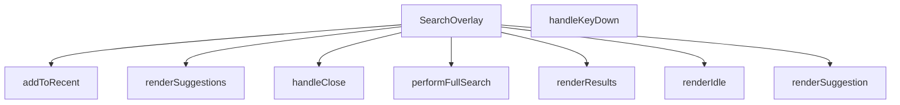

## Genel Bakış
SearchOverlay, uygulama genelinde arama işlevselliğini sağlayan tam kapsamlı bir React bileşenidir. Kullanıcıdan arama terimini alır, öneriler ve sonuçlar sunar, geçmiş aramaları takip eder. Modül, arama akışının tüm durumlarını (boş, öneri listesi, sonuç ekranı) yönetir.

## Fonksiyon Grupları

### Ana Bileşen ve Görünürlük Kontrolü
Bileşenin açılıp kapanmasını sağlayan ve üst düzey yaşam döngüsünü yöneten fonksiyonları barındırır.
- SearchOverlay, handleClose

### Arama İşlemleri ve Veri Yönetimi
Kullanıcının arama terimini işleyen, arama geçmişini tutan ve asenkron arama operasyonlarını yürüten fonksiyonları kapsar.
- performFullSearch, addToRecent

### Kullanıcı Girişi ve Olay Yönetimi
Klavye olaylarını dinleyerek kullanıcı eylemlerini arama tetikleme gibi işlevlere bağlayan yardımcı fonksiyondur.
- handleKeyDown

### Arayüz Görüntüleme Katmanı
Bileşenin farklı durumlarını (boş ekran, öneriler listesi, sonuç görünümü) oluşturan render fonksiyonlarıdır.
- renderSuggestion, renderIdle, renderSuggestions, renderResults

---

## AXIOMS – Mimari Varsayımlar

Bu modül, arama overlay'ının durum yönetimi ve arama akışını kontrol eden bir React bileşenidir.

[Aksiyom 1]: Eğer `open` prop'u verilmemiş veya `onClose` callback tanımlı değilse, SearchOverlay bileşeni arama overlay'ını gösteremez veya kapatma akışını yönetemez.

[Aksiyom 2]: Eğer `addToRecent` fonksiyonu boş bir string (`""`) ile çağrılırsa, recent arama geçmişine geçersiz bir terim eklenir.

[Aksiyom 3]: Eğer `performFullSearch` çalıştırıldığında geçerli bir `term` string'i sağlanmazsa, async arama işlemi anlamsız bir sorgu ile çalışır veya başarısız olur.

[Aksiyom 4]: Eğer `performFullSearch` sırasında network isteği veya arama motoru erişilemez durumdaysa, fonksiyon promise reject veya hata fırlatır ve bileşenin hata yönetimine devretmesi gerekir.

[Aksiyom 5]: Eğer `renderSuggestion` fonksiyonu `SearchSuggestion` tipinde geçerli bir nesne yerine `null` veya `undefined` alırsa, suggestion render edilemez ve index (`idx`) değeri anlamsız olur.

[Aksiyom 6]: Eğer `handleKeyDown` fonksiyonu geçerli bir `React.KeyboardEvent` yerine geçersiz bir event ile çağrılırsa, tuş bazlı arama akış kontrolü (Enter ile arama, Escape ile kapatma vb.) çalışamaz.

[Aksiyom 7]: Bileşenin iç durumu (idle / suggestions / results)之间 geçiş, `performFullSearch` sonucuna veya kullanıcının arama terimi girişine bağlıdır — eğer bu geçiş mekanizması bozulursa, `renderIdle`, `renderSuggestions` veya `renderResults` fonksiyonları yanlış durumda render edilir.

[Aksiyom 8]: Eğer `onClose` callback'i çalışmazsa veya bileşen bu callback'i tetiklemezse, kullanıcı arama overlay'ından çıkamaz ve bileşen açık kalır.

---

## FONKSİYON DETAYLARI

### SearchOverlay
**Ne yapar**: Arama çubuğu için bir üst katman (overlay) bileşeni oluşturur ve `open` durumu ile `onClose` geri çağrısını yönetir.  
**Nasıl yapar**: React fonksiyonel bileşeni olarak tanımlanır; `open` prop’u overlay’in görünürlüğünü kontrol eder, `onClose` ise kapanma eylemini tetikler. İçerik ve etkileşim mantığı diğer yardımcı fonksiyonlar tarafından sağlanır.  
**Parametreler**:
- `open`: boolean — Overlay’in açık/kapalı durumunu belirler.  
- `onClose`: () => void — Overlay kapandığında çalıştırılacak geri çağrı fonksiyonu.  
**Dönüş**: React.FC\<SearchOverlayProps\> — Belirtilen props tipine sahip bir React fonksiyonel bileşeni döndürür.

### handleClose
**Ne yapar**: Klavye olaylarını dinleyerek arama overlay’ini kapatır ve gezinme/arama akışını yönetir.  
**Nasıl yapar**: Gelen `React.KeyboardEvent` nesnesinin `key` özelliğine bakar; `Escape` tuşu basıldığında overlay’i kapatır, `ArrowDown` ve `ArrowUp` tuşlarıyla aktif öneri indeksini günceller, `Enter` tuşu ile seçili öneri ya da sonuç üzerinden yönlendirme yapar ya da tam arama başlatır.  
**Parametreler**:
- `e`: React.KeyboardEvent — Kullanıcıdan gelen klavye olayı.  
**Dönüş**: void — İşlevi tamamladıktan sonra bir değer döndürmez.

### addToRecent
**Ne yapar**: Kullanıcının arama terimini son aramalara ekler.  
**Nasıl yapar**: Verilen terimi (örnek kodda `q`) alır ve muhtemelen bir geçmiş listesine kaydeder; aynı zamanda ilgili yönlendirme ve kapanma işlemlerini tetikler.  
**Parametreler**:
- `term`: string — Son aramalara eklenmek istenen arama ifadesi.  
**Dönüş**: void — İşlem tamamlandığında bir değer döndürmez.

### performFullSearch
**Ne yapar**: Tam metin araması başlatır.  
**Nasıl yapar**: Gelen arama terimini durum (`q`) olarak ayarlar ve aynı terimle tam arama fonksiyonunu (muhtemelen kendisini) çağırır.  
**Parametreler**:
- `term`: string — Aranacak tam metin ifadesi.  
**Dönüş**: void — İşlev bir sonuç döndürmez.

### handleKeyDown
**Ne yapar**: Klavye tuşlarına göre arama overlay’inde gezinme ve eylem tetikleme sorumluluğu taşır.  
**Nasıl yapar**: (Kod içeriği verilmemiştir; genellikle `handleClose` benzeri bir mantıkla tuşları kontrol eder.)  
**Parametreler**:
- `e`: React.KeyboardEvent — Kullanıcıdan gelen klavye olayı.  
**Dönüş**: void — İşlem sonrası bir değer döndürmez.

### renderSuggestion
**Ne yapar**: Tek bir arama önerisini görsel olarak oluşturur.  
**Nasıl yapar**: (Kod içinde aynı fonksiyona yeniden çağrı yapılmış; gerçek render mantığı burada tanımlanmamış.)  
**Parametreler**:
- `s`: SearchSuggestion — Görüntülenecek öneri nesnesi.  
- `idx`: number — Önerinin listedeki indeksi.  
**Dönüş**: void — Görsel çıktı üretir, ancak dönüş değeri yoktur.

### renderIdle
**Ne yapar**: Arama overlay’i boş (idle) durumundayken gösterilecek içeriği üretir.  
**Nasıl yapar**: (Kod içeriği sağlanmamıştır.)  
**Parametreler**: Yok.  
**Dönüş**: void — Görsel bir eleman döndürür.

### renderSuggestions
**Ne yapar**: Öneri listesini (suggestions) render eder.  
**Nasıl yapar**: (Kod içeriği eksiktir; muhtemelen `renderSuggestion` fonksiyonunu döngü içinde çağırır.)  
**Parametreler**: Yok.  
**Dönüş**: void — Öneri elemanlarını ekrana yerleştirir.

### renderResults
**Ne yapar**: Arama sonuçlarını (results) ekranda gösterir.  
**Nasıl yapar**: (Kod içeriği verilmemiştir; genellikle sonuç dizisini map ederek her birini render eder.)  
**Parametreler**: Yok.  
**Dönüş**: void — Sonuç elemanlarını üretir.

---

## İTHALATLAR (IMPORTS)
- import: ../contexts/CategoryContext::useCategories
- import: ../hooks/useLocalizedRoutes::useLocalizedRoutes
- import: ../i18n/I18nProvider::useI18n
- import: ../lib/supabase/client::supabaseBrowserClient
- import: ../types/db-rows::type { DbCategory }
- import: ../utils/getCategoryIcon::getCategoryIcon
- import: ../utils/searchHighlight::highlightMatch
- import: @/types/ui-models::type { FtsProductResult, SearchSuggestion }
- import: next/image::Image
- import: next/navigation::useRouter
- import: react::React

---

## INTERFACES

### SearchOverlayProps
- `open: boolean`
- `onClose: () => void`

---

## TYPE ALIASES

### ViewState
```typescript
type ViewState = 'IDLE' | 'SUGGESTING' | 'RESULTS'
```

---

## AST POINTERS

### [N1_NASIL] AST Pointer: SearchOverlay.tsx::SearchOverlay
- **params**: `{ open, onClose }`
- **ic_degiskenler**:
  - `open` — overlay'in açılıp açılmadığını kontrol eden boolean prop
  - `onClose` — overlay kapatma callback'i prop
  - `router` — `useRouter()` hook'tan gelen Next.js router örneği, sayfa yönlendirmeleri için
  - `categories` — `useCategories()` hook'tan gelen tüm kategoriler dizisi
  - `t` — `useI18n()` hook'tan gelen çeviri fonksiyonu
  - `localizedRoutes` — `useLocalizedRoutes()` hook'tan gelen lokalize rota yardımcıları
  - `q` — kullanıcının arama inputuna yazdığı ham arama metni (state)
  - `debounced` — `q`'nun debounce edilmiş hali, API çağrıları için kullanılır
  - `recentSearches` — localStorage'dan yüklenen son arama terimleri dizisi (state)
  - `suggestions` — arama önerileri dizisi, `getSearchSuggestions` API sonucu (state)
  - `results` — tam arama sonuçları dizisi, `ftsSearchProducts` API sonucu (state)
  - `viewState` — mevcut görünüm durumu: `'IDLE'` | `'SUGGESTING'` | `'RESULTS'` (state)
  - `activeIndex` — klavye navigasyonunda aktif öğe indeksi, `-1` ise none (state)
  - `loading` — API isteği sırasında true olan yükleme durumu flag'i (state)
  - `error` — arama sırasında oluşan hata mesajı veya null (state)
  - `inputRef` — arama input elementine ref, odaklama için (`inputRef.current?.focus()`)
  - `listRef` — öneri/sonuç listesi container elementine ref, scrollIntoView için
  - `RECENT_SEARCHES_KEY` — localStorage anahtarı sabiti, son aramaları saklar
  - `popularCategories` — useMemo ile `globalCategories.filter(c => !c.parent_id).slice(0, 5)` hesaplanan ilk 5 üst kategori
  - `globalCategories` — `categories`'den türetilen tüm kategoriler (useCategories'ten)
  - `supabaseBrowserClient` — import edilen Supabase istemci örneği, tüm veritabanı sorgularında kullanılır
  - `getCategoryIcon` — import edilen kategori ikonu yardımcı fonksiyonu
  - `highlightMatch` — arama terimini sonuçlarda vurgulayan helper fonksiyonu
  - `Routes` — lokalize rota yardımcı objesi (`Routes.product()`, `Routes.category()`)
  - `FtsProductResult` — arama sonuçlarının tipi (import edilen)
  - `SearchSuggestion` — arama önerilerinin tipi (import edilen)
  - `DbCategory` — kategori satır tipi (import edilen)
- **Dönüş**: `React.FC<SearchOverlayProps>` — JSX markup döndürür, search overlay UI'ını render eder

### [N2_NASIL] AST Pointer: SearchOverlay.tsx::SearchOverlay::useEffect_debounce
- **params**: yok
- **ic_degiskenler**:
  - `t_id` — `setTimeout` dönüş değeri, temizlik için `clearTimeout(t_id)` çağrılır
  - `q` — inputtaki ham arama metni, debounce kaynağını oluşturur
  - `setDebounced` — debounce sonucunu state'e yazan setter
- **Dönüş**: cleanup fonksiyonu döndürür → `() => clearTimeout(t_id)`

### [N3_NASIL] AST Pointer: SearchOverlay.tsx::SearchOverlay::useEffect_suggestions
- **params**: yok
- **ic_degiskenler**:
  - `active` — cleanup ile `false` yapılan flag, bileşen unmount sonrası state güncellemelerini engeller
  - `open` — overlay açıkken arama yapılması kontrolü
  - `debounced` — arama yapılacak terim, boşsa state'leri temizler
  - `setViewState` — görünüm durumunu `'SUGGESTING'` yapan setter
  - `setSuggestions` — API'den dönen önerileri state'e yazan setter
  - `setResults` — temizlik için results'ı boş diziye ayarlayan setter
  - `setLoading` — yükleme durumunu true/false yapan setter
  - `getSearchSuggestions` — **dinamik import**: `'../lib/services/product.service'` modülünden lazy import edilen arama önerisi API fonksiyonu
  - `supabaseBrowserClient` — Supabase istemci, API fonksiyonuna parametre olarak verilir
  - `debounced` — API'ye gönderilen arama terimi
  - `6` — öneri sayısı limiti (sabit)
  - `err` — catch bloğunda yakalanan hata, `console.error(err)` ile loglanır
- **Dönüş**: cleanup fonksiyonu → `() => { active = false }`

### [N4_NASIL] AST Pointer: SearchOverlay.tsx::SearchOverlay::useEffect_focus
- **params**: yok
- **ic_degiskenler**:
  - `open` — overlay açıldığında input'a odaklanma tetikleyicisi
  - `setQ` — input değerini sıfırlayan setter
  - `inputRef` — input element ref'i, `inputRef.current?.focus()` ile 50ms gecikmeyle odaklanır
- **Dönüş**: yok

### [N5_NASIL] AST Pointer: SearchOverlay.tsx::SearchOverlay::useEffect_resetActiveIndex
- **params**: yok
- **ic_degiskenler**:
  - `setActiveIndex` — aktif indeksi `-1`'e sıfırlayan setter (arama terimi değiştiğinde tetiklenir)
- **Dönüş**: yok

### [N6_NASIL] AST Pointer: SearchOverlay.tsx::SearchOverlay::useEffect_scrollSync
- **params**: yok
- **ic_degiskenler**:
  - `activeIndex` — şu anki aktif öğe indeksi, `-1`den büyükse scroll tetiklenir
  - `listRef` — list container ref'i, `listRef.current.children[activeIndex]` ile aktif element alınır
  - `activeEl` — `listRef.current.children[activeIndex]` olarak elde edilen aktif HTML elementi
- **Dönüş**: yok (yan etki: `activeEl.scrollIntoView({ block: 'nearest' })` çağrısı)

### [N7_NASIL] AST Pointer: SearchOverlay.tsx::handleClose
- **params**: yok
- **ic_degiskenler**:
  - `setQ` — arama inputunu boş string'e sıfırlayan setter
  - `setResults` — sonuçları boş diziye sıfırlayan setter
  - `setSuggestions` — önerileri boş diziye sıfırlayan setter
  - `setViewState` — görünüm durumunu `'IDLE'` yapan setter
  - `setActiveIndex` — aktif indeksi `-1`'e sıfırlayan setter
  - `onClose` — prop'tan gelen kapatma callback'i, overlay'in ana bileşeni tarafından yönetilir
- **Dönüş**: yok (yan etki: tüm state'leri sıfırlar ve `onClose()` çağırır)

### [N8_NASIL] AST Pointer: SearchOverlay.tsx::addToRecent
- **params**: `(term: string)`
- **ic_degiskenler**:
  - `term` — kaydedilecek arama terimi, trim edilmiş hali boşsa fonksiyon erken return eder
  - `recentSearches` — mevcut son aramalar dizisi, terim bu diziden filtrelenerek tekrar önlenir
  - `next` — `[term, ...recentSearches.filter(x => x !== term)].slice(0, 5)` ile hesaplanan güncellenmiş liste, en fazla 5 öğe
  - `RECENT_SEARCHES_KEY` — localStorage anahtarı sabiti
  - `JSON.stringify(next)` — diziyi JSON string'e çevirerek localStorage'a yazılır
- **Dönüş**: yok (yan etki: state günceller ve localStorage'a yazar)

### [N9_NASIL] AST Pointer: SearchOverlay.tsx::performFullSearch
- **params**: `(term: string)`
- **ic_degiskenler**:
  - `term` — aranacak terim, trim edilmiş hali boşsa erken return
  - `setLoading` — yükleme durumunu true yapan setter
  - `setError` — hata durumunu temizleyen setter (başlangıçta `null`)
  - `setViewState` — görünüm durumunu `'RESULTS'` yapan setter
  - `addToRecent` — bu terimi son aramalara ekleyen iç fonksiyon çağrısı
  - `setActiveIndex` — aktif indeksi `-1`'e sıfırlayan setter
  - `ftsSearchProducts` — **dinamik import**: `'../lib/services/product.service'` modülünden lazy import edilen FTS arama API fonksiyonu
  - `supabaseBrowserClient` — Supabase istemci, API fonksiyonuna parametre olarak verilir
  - `term` — API'ye gönderilen arama terimi
  - `20` — sonuç sayısı limiti (sabit)
  - `setResults` — API'den dönen sonuçları state'e yazan setter
  - `t` — çeviri fonksiyonu, hata mesajı için `t('search.noResults')` çağrısı
- **Dönüş**: Promise<void> (async fonksiyon, doğrudan değer döndürmez)

### [N10_NASIL] AST Pointer: SearchOverlay.tsx::handleKeyDown
- **params**: `(e: React.KeyboardEvent)`
- **ic_degiskenler**:
  - `e` — klavye olayı objesi, `e.key` ile tuş adı, `e.preventDefault()` ile varsayılan davranış engellenir
  - `viewState` — mevcut görünüm durumu, `suggestions` veya `results` listesinin uzunluğunu belirler
  - `maxIndex` — navigasyon yapılabilecek maksimum indeks: `viewState === 'SUGGESTING' ? suggestions.length - 1 : viewState === 'RESULTS' ? results.length - 1 : -1`
  - `suggestions` — mevcut arama önerileri dizisi, `viewState === 'SUGGESTING'` olduğunda kullanılır
  - `results` — mevcut arama sonuçları dizisi, `viewState === 'RESULTS'` olduğunda kullanılır
  - `activeIndex` — şu anki aktif öğe indeksi
  - `setActiveIndex` — aktif indeksi güncelleyen setter, `prev => (prev < maxIndex ? prev + 1 : prev)` formunda
  - `s` — `suggestions[activeIndex]` ile elde edilen aktif suggestion objesi (Enter + SUGGESTING durumunda)
  - `s.url` — suggestion'ın yönlendirme URL'i, `'#'` fallback ile
  - `s.label` — suggestion etiketi, `addToRecent`'e gönderilir
  - `router` — Next.js router, `router.push()` ile sayfa yönlendirmesi yapılır
  - `res` — `results[activeIndex]` ile elde edilen aktif sonuç objesi (Enter + RESULTS durumunda)
  - `res.slug` — ürün slug'ı, `Routes.product(res.slug!)` ile ürün sayfasına yönlendirme yapılır
  - `addToRecent` — son aramalara terimi ekleyen fonksiyon
  - `handleClose` — overlay'i kapatan fonksiyon
  - `q` — mevcut arama inputu metni, `performFullSearch(q)` ile tam arama tetiklenir
  - `performFullSearch` — tam arama fonksiyonu, Enter basıldığında aktif öğe yoksa çağrılır
- **Dönüş**: yok (yan etki: state günceller, router.push çağırır, handleClose çağırır)

### [N11_NASIL] AST Pointer: SearchOverlay.tsx::renderSuggestion
- **params**: `(s: SearchSuggestion, idx: number)`
- **ic_degiskenler**:
  - `s` — tek bir arama önerisi objesi, `type`, `label`, `url`, `metadata` alanlarını içerir
  - `idx` — bu suggestion'ın listedeki indeksi
  - `activeIndex` — mevcut aktif indeks, `idx === activeIndex` karşılaştırması ile aktiflik belirlenir
  - `isActive` — `idx === activeIndex` hesaplanan boolean, aktif öğenin stilini belirler
  - `debounced` — arama terimi, `highlightMatch` fonksiyonuna gönderilerek eşleşmeler vurgulanır
  - `s.type` — suggestion tipi: `'product'` | `'category'` | `'brand'`, ikon seçimini belirler
  - `s.metadata` — product tipi için ek alanlar: `image_url`, `sku`, `brand` (Record<string, string> olarak cast edilir)
  - `s.metadata.image_url` — ürün görseli URL'i, Image bileşeninde kullanılır (yoksa fallback SVG gösterilir)
  - `s.metadata.sku` — ürün SKU kodu, `highlightMatch` ile vurgulanır
  - `s.metadata.brand` — ürün markası, `highlightMatch` ile vurgulanır
  - `icon` — `s.type`'a göre koşullu JSX: product için görsel veya kutu ikonu, category için grid ikonu, brand için etiket ikonu
  - `label` — `s.type === 'brand'` ise `t('search.brandPrefix') + s.label`, değilse `s.label`
  - `t` — çeviri fonksiyonu, `t('search.brandPrefix')` ve `t('search.overlay.enterKey')` çağrılır
  - `highlightMatch` — arama terimini label, brand, SKU içinde vurgulayan fonksiyon
  - `setActiveIndex` — `onMouseEnter` ile `setActiveIndex(idx)` çağrılır
  - `router` — suggestion tıklanınca `router.push(s.url)` ile yönlendirme yapılır
  - `addToRecent` — tıklanınca `addToRecent(q)` ile son aramalara eklenir
  - `handleClose` — tıklanınca overlay kapatılır
  - `q` — mevcut arama terimi, `addToRecent`'e gönderilir
- **Dönüş**: JSX element (buton bileşeni)

### [N12_NASIL] AST Pointer: SearchOverlay.tsx::renderIdle
- **params**: yok
- **ic_degiskenler**:
  - `recentSearches` — son aramalar dizisi, `recentSearches.length > 0` kontrolü ile gösterilir
  - `setRecentSearches` — son aramaları temizleyen setter, "Temizle" butonunda çağrılır
  - `RECENT_SEARCHES_KEY` — localStorage anahtarı, temizleme但onunda `localStorage.removeItem` ile silinir
  - `t` — çeviri fonksiyonu: `t('search.recentSearches')`, `t('search.clearRecent')`, `t('search.popularCategories')`, `t('home.hero.quickChips.fans')`, `t('home.hero.quickChips.airCurtains')`, `t('home.hero.quickChips.heatRecovery')`
  - `term` — `recentSearches.map` callback'indeki her bir arama terimi
  - `setQ` — arama inputunu terimle dolduran setter
  - `performFullSearch` — terimle tam arama başlatan fonksiyon
  - `popularCategories` — useMemo ile hesaplanan üst kategoriler dizisi
  - `cat` — `popularCategories.map` callback'indeki her bir kategori objesi (`id`, `slug`, `name` alanları)
  - `cat.id` — kategori ID'si, `String(cat.id)` ile key olarak kullanılır
  - `cat.slug` — kategori slug'ı, `Routes.category(String(cat.slug))` ile rota oluşturulur
  - `cat.name` — kategori adı, buton içinde gösterilir
  - `router` — `router.push(Routes.category(...))` ile kategori sayfasına yönlendirme yapılır
  - `handleClose` — kategori tıklanınca overlay kapatılır
  - `getCategoryIcon` — `getCategoryIcon(String(cat.slug), { size: 14 })` ile kategori ikonu render edilir
  - `Routes` — rota yardımcı objesi, `Routes.category()` kullanılır
- **Dönüş**: JSX element (idle durumu UI'ı: son aramalar + popüler kategoriler)

### [N13_NASIL] AST Pointer: SearchOverlay.tsx::renderSuggestions
- **params**: yok
- **ic_degiskenler**:
  - `suggestions` — arama önerileri dizisi, `suggestions.length === 0` kontrolü ile boş durum yönetilir
  - `t` — çeviri fonksiyonu: `t('search.noResults')`, `t('search.detailedSearch')`, `t('search.overlay.allResultsFor')`
  - `debounced` — debounce edilmiş arama terimi, boş durum但onunda ve tüm sonuçlar但onunda gösterilir
  - `performFullSearch` — "tüm sonuçları ara" butonunda tam arama tetiklenir
  - `listRef` — liste container ref'i, `<div ref={listRef}>` ile bağlanır
  - `renderSuggestion` — her bir suggestion'ı render eden iç fonksiyon, `suggestions.map((s, idx) => renderSuggestion(s, idx))` çağrılır
- **Dönüş**: JSX element (öneri listesi veya boş durum mesajı)

### [N14_NASIL] AST Pointer: SearchOverlay.tsx::renderResults
- **params**: yok
- **ic_degiskenler**:
  - `results` — tam arama sonuçları dizisi, `results.length === 0` kontrolü ile boş durum yönetilir
  - `t` — çeviri fonksiyonu: `t('search.noResults')`, `t('search.noResultsAdvice')`, `t('search.fuzzyMatchNotice')`, `t('search.overlay.enterKey')`
  - `hasFuzzy` — `results.some(r => r.is_fuzzy_match)` ile hesaplanan boolean, fuzzy eşleşme uyarısı gösterilip gösterilmeyeceğini belirler
  - `listRef` — liste container ref'i, `<div ref={listRef}>` ile bağlanır
  - `r` — `results.map` callback'indeki her bir `FtsProductResult` sonucu
  - `r.id` — sonucun benzersiz ID'si, `key` prop'u olarak kullanılır
  - `r.slug` — ürün slug'ı, `Routes.product(r.slug!)` ile rota oluşturulur
  - `r.name` — ürün adı, `highlightMatch(r.name, debounced)` ile vurgulanır
  - `r.image_url` — ürün görseli URL'i, Image bileşeninde kullanılır (yoksa fallback SVG)
  - `r.brand` — ürün markası, `highlightMatch(r.brand, debounced)` ile vurgulanır
  - `r.sku` — ürün SKU kodu, `highlightMatch(r.sku, debounced)` ile vurgulanır
  - `r.is_fuzzy_match` — fuzzy eşleşme flag'i, `hasFuzzy` hesaplamasında kullanılır
  - `idx` — sonuç indeksi, `results.map` callback'inde
  - `activeIndex` — mevcut aktif indeks, `idx === activeIndex` karşılaştırması ile aktiflik belirlenir
  - `isActive` — `idx === activeIndex` boolean değeri
  - `debounced` — highlightMatch için arama terimi
  - `highlightMatch` — arama terimini sonuç alanlarında vurgulayan fonksiyon
  - `router` — `router.push(Routes.product(r.slug!))` ile ürün sayfasına yönlendirme
  - `handleClose` — tıklanınca overlay kapatılır
  - `setActiveIndex` — `onMouseEnter` ile aktif indeks güncellenir
  - `Routes` — `Routes.product()` rota yardımcı fonksiyonu
- **Dönüş**: JSX element (sonuç listesi veya boş durum mesajı, fuzzy uyarı banner'ı dahil)

---


## MERMAID CALL GRAPH


## NODE ID STANDARD

  file: src\components\SearchOverlay.tsx
  function: src\components\SearchOverlay.tsx::SearchOverlay
  function: src\components\SearchOverlay.tsx::handleClose
  function: src\components\SearchOverlay.tsx::addToRecent
  function: src\components\SearchOverlay.tsx::performFullSearch
  function: src\components\SearchOverlay.tsx::handleKeyDown
  function: src\components\SearchOverlay.tsx::renderSuggestion
  function: src\components\SearchOverlay.tsx::renderIdle
  function: src\components\SearchOverlay.tsx::renderSuggestions
  function: src\components\SearchOverlay.tsx::renderResults

---

## DISA AKTARILANLAR (EXPORTS)
  export: SearchOverlay

---

## STİL TOKENLERİ

### Arbitrary Değerler (token'a geçirilmemiş)
Yok — tüm stiller token'a geçirilmiş. ✅

### Kullanılan Token'lar (zaten token'a geçirilmiş)
- (yok)

### Tailwind Sınıf Özeti
- **Renkler:** `bg-air-blue/10`, `bg-amber-50`, `bg-gray-100`, `bg-gray-50`, `bg-red-50`, `bg-slate-50`, `bg-slate-900/40`, `bg-transparent`, `bg-white`, `border-amber-100`, `border-b`, `border-gray-100`, `border-gray-200`, `border-primary-ocean/30`, `border-slate-100`
- **Layout:** `absolute`, `backdrop-blur-sm`, `custom-scrollbar`, `fixed`, `flex`, `flex-1`, `flex-col`, `flex-shrink-0`, `flex-wrap`, `gap-1`, `gap-1.5`, `gap-2`, `gap-3`, `gap-4`, `h-10`
- **Varyant/Responsive:** `:`, `focus-visible:`, `focus:`, `group-hover:`, `hover:`, `placeholder:`, `sm:`, `xs:` önekleri
- **Yardımcı Sınıflar:** `${isActive`, `:`, `animate-in`, `animate-spin`, `border`, `cursor-pointer`, `divide-gray-100`, `divide-y`, `duration-200`, `duration-300`, `fade-in`, `focus-visible:outline-none`, `focus-visible:ring-2`, `focus-visible:ring-primary-navy`, `font-bold`