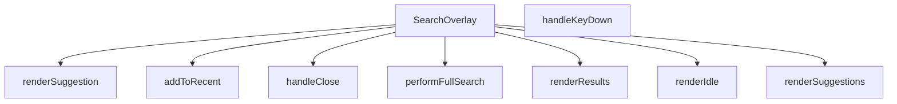

## Genel Bakış  
SearchOverlay bileşeni, kullanıcı arayüzünde arama çubuğu açıldığında gösterilen bir üst katman (overlay) sağlar. Arama terimleri girildiğinde anlık öneriler sunar, son aramaları saklar ve tam arama sonuçlarını görüntüler. Bileşen, açılış/kapama, tuş olayları ve arama mantığını yöneten yardımcı fonksiyonları içerir.

## Fonksiyon Grupları  

### Arayüz ve Durum Yönetimi  
Bu grup, bileşenin görünürlüğünü ve kapanış davranışını kontrol eder.  
- `SearchOverlay`  
- `handleClose`  

### Arama İşlemleri  
Arama terimlerini işleyip sonuçları elde eden fonksiyonlar.  
- `performFullSearch`  
- `addToRecent`  

### Kullanıcı Etkileşimi  
Kullanıcının tuş basımlarını yakalayıp uygun aksiyonları tetikleyen fonksiyonlar.  
- `handleKeyDown`  

### Görüntüleme (Render) Yardımcıları  
Arama önerileri, boş durum ve sonuçların ekranda gösterilmesini sağlayan fonksiyonlar.  
- `renderSuggestion`  
- `renderIdle`  
- `renderSuggestions`  
- `renderResults`

---

## AXIOMS – Mimari Varsayımlar
Bu modül için özel aksiyom tanımlanmamıştır.

---

## FONKSİYON DETAYLARI

### SearchOverlay
**Ne yapar**: Arama çubuğu için bir üst katman (overlay) bileşeni oluşturur ve `open` durumu ile `onClose` geri çağrısını yönetir.  
**Nasıl yapar**: React fonksiyonel bileşeni olarak tanımlanır; `open` prop’u overlay’in görünürlüğünü kontrol eder, `onClose` ise kapanma eylemini tetikler. İçerik ve etkileşim mantığı diğer yardımcı fonksiyonlar tarafından sağlanır.  
**Parametreler**:
- `open`: boolean — Overlay’in açık/kapalı durumunu belirler.  
- `onClose`: () => void — Overlay kapandığında çalıştırılacak geri çağrı fonksiyonu.  
**Dönüş**: React.FC\<SearchOverlayProps\> — Belirtilen props tipine sahip bir React fonksiyonel bileşeni döndürür.

### handleClose
**Ne yapar**: Klavye olaylarını dinleyerek arama overlay’ini kapatır ve gezinme/arama akışını yönetir.  
**Nasıl yapar**: Gelen `React.KeyboardEvent` nesnesinin `key` özelliğine bakar; `Escape` tuşu basıldığında overlay’i kapatır, `ArrowDown` ve `ArrowUp` tuşlarıyla aktif öneri indeksini günceller, `Enter` tuşu ile seçili öneri ya da sonuç üzerinden yönlendirme yapar ya da tam arama başlatır.  
**Parametreler**:
- `e`: React.KeyboardEvent — Kullanıcıdan gelen klavye olayı.  
**Dönüş**: void — İşlevi tamamladıktan sonra bir değer döndürmez.

### addToRecent
**Ne yapar**: Kullanıcının arama terimini son aramalara ekler.  
**Nasıl yapar**: Verilen terimi (örnek kodda `q`) alır ve muhtemelen bir geçmiş listesine kaydeder; aynı zamanda ilgili yönlendirme ve kapanma işlemlerini tetikler.  
**Parametreler**:
- `term`: string — Son aramalara eklenmek istenen arama ifadesi.  
**Dönüş**: void — İşlem tamamlandığında bir değer döndürmez.

### performFullSearch
**Ne yapar**: Tam metin araması başlatır.  
**Nasıl yapar**: Gelen arama terimini durum (`q`) olarak ayarlar ve aynı terimle tam arama fonksiyonunu (muhtemelen kendisini) çağırır.  
**Parametreler**:
- `term`: string — Aranacak tam metin ifadesi.  
**Dönüş**: void — İşlev bir sonuç döndürmez.

### handleKeyDown
**Ne yapar**: Klavye tuşlarına göre arama overlay’inde gezinme ve eylem tetikleme sorumluluğu taşır.  
**Nasıl yapar**: (Kod içeriği verilmemiştir; genellikle `handleClose` benzeri bir mantıkla tuşları kontrol eder.)  
**Parametreler**:
- `e`: React.KeyboardEvent — Kullanıcıdan gelen klavye olayı.  
**Dönüş**: void — İşlem sonrası bir değer döndürmez.

### renderSuggestion
**Ne yapar**: Tek bir arama önerisini görsel olarak oluşturur.  
**Nasıl yapar**: (Kod içinde aynı fonksiyona yeniden çağrı yapılmış; gerçek render mantığı burada tanımlanmamış.)  
**Parametreler**:
- `s`: SearchSuggestion — Görüntülenecek öneri nesnesi.  
- `idx`: number — Önerinin listedeki indeksi.  
**Dönüş**: void — Görsel çıktı üretir, ancak dönüş değeri yoktur.

### renderIdle
**Ne yapar**: Arama overlay’i boş (idle) durumundayken gösterilecek içeriği üretir.  
**Nasıl yapar**: (Kod içeriği sağlanmamıştır.)  
**Parametreler**: Yok.  
**Dönüş**: void — Görsel bir eleman döndürür.

### renderSuggestions
**Ne yapar**: Öneri listesini (suggestions) render eder.  
**Nasıl yapar**: (Kod içeriği eksiktir; muhtemelen `renderSuggestion` fonksiyonunu döngü içinde çağırır.)  
**Parametreler**: Yok.  
**Dönüş**: void — Öneri elemanlarını ekrana yerleştirir.

### renderResults
**Ne yapar**: Arama sonuçlarını (results) ekranda gösterir.  
**Nasıl yapar**: (Kod içeriği verilmemiştir; genellikle sonuç dizisini map ederek her birini render eder.)  
**Parametreler**: Yok.  
**Dönüş**: void — Sonuç elemanlarını üretir.

---

## INTERFACES

### SearchOverlayProps
- `open: boolean`
- `onClose: () => void`

---

## TYPE ALIASES

### ViewState
```typescript
type ViewState = 'IDLE' | 'SUGGESTING' | 'RESULTS'
```

---

## AST POINTERS

### [N1_NASIL] AST Pointer: src/components/SearchOverlay.tsx::SearchOverlay
- **params**: `open, onClose`
- **ic_degiskenler**:
  - `open` — overlay’ın açık/kapalı durumunu belirten boolean prop.
  - `onClose` — overlay kapatıldığında çağrılan fonksiyon prop.
  - `router` — `useRouter()` ile alınan Next.js router, sayfa yönlendirmeleri için kullanılır.
  - `t` — `useI18n()` ile alınan çeviri fonksiyonu, UI metinlerini yerelleştirir.
  - `RECENT_SEARCHES_KEY` — localStorage’da saklanan son aramaları tutan anahtar.
  - `recentSearches` — state, son arama terimlerinin dizisi.
  - `setRecentSearches` — `recentSearches` state’ini güncelleyen setter.
  - `popularCategories` — state, popüler kategori listesi.
  - `setPopularCategories` — `popularCategories` state’ini güncelleyen setter.
  - `globalCategories` — `useCategories()` bağlamından gelen tüm kategori listesi.
  - `q` — arama kutusundaki metni tutan state.
  - `setQ` — `q` state’ini güncelleyen setter.
  - `debounced` — `q` değerinin gecikmeli (debounce) hali, arama tetikleme için kullanılır.
  - `setDebounced` — `debounced` değerini güncelleyen setter.
  - `suggestions` — öneri sonuçlarını tutan state.
  - `setSuggestions` — `suggestions` state’ini güncelleyen setter.
  - `results` — tam arama sonuçlarını tutan state.
  - `setResults` — `results` state’ini güncelleyen setter.
  - `viewState` — `'IDLE' | 'SUGGESTING' | 'RESULTS'` gibi UI durumunu tutan state.
  - `setViewState` — `viewState` state’ini güncelleyen setter.
  - `loading` — arama sırasında gösterilen yükleme durumu.
  - `setLoading` — `loading` state’ini güncelleyen setter.
  - `error` — arama hatası mesajı.
  - `setError` — `error` state’ini güncelleyen setter.
  - `activeIndex` — klavye ile seçilen öneri/sonuç indeksini tutan state.
  - `setActiveIndex` — `activeIndex` state’ini güncelleyen setter.
  - `listRef` — öneri/sonuç listesinin DOM referansı.
  - `inputRef` — arama kutusunun DOM referansı.
- **Dönüş**: React bileşeni JSX döndürür; yan etkileri (localStorage okuma/yazma, router yönlendirmeleri) vardır.

### [N2_NASIL] AST Pointer: src/components/SearchOverlay.tsx::handleClose
- **params**: *(parametre yok)*
- **ic_degiskenler**:
  - `setQ` — arama kutusunu boş stringe sıfırlar.
  - `setResults` — sonuç listesini temizler.
  - `setSuggestions` — öneri listesini temizler.
  - `setViewState` — UI durumunu `'IDLE'` yapar.
  - `setActiveIndex` — seçili indeks’i `-1` yapar.
  - `onClose` — dışarıdan gelen kapanış callback’i çağırır.
- **Dönüş**: `void` (yan etkileri vardır).

### [N3_NASIL] AST Pointer: src/components/SearchOverlay.tsx::addToRecent
- **params**: `term: string`
- **ic_degiskenler**:
  - `term` — eklenmek istenen arama terimi.
  - `recentSearches` — mevcut son arama dizisi.
  - `setRecentSearches` — güncellenmiş diziyle state’i değiştirir.
  - `RECENT_SEARCHES_KEY` — localStorage anahtarı.
- **Dönüş**: `void` (state ve localStorage güncellenir).

### [N4_NASIL] AST Pointer: src/components/SearchOverlay.tsx::performFullSearch
- **params**: `term: string`
- **ic_degiskenler**:
  - `term` — tam arama yapılacak metin.
  - `setLoading` — arama sırasında loading durumunu `true` yapar.
  - `setError` — hata mesajını sıfırlar.
  - `setViewState` — UI durumunu `'RESULTS'` yapar.
  - `addToRecent` — arama terimini son aramalara ekler.
  - `setActiveIndex` — seçili indeksi `-1` yapar.
  - `ftsSearchProducts` — dinamik import ile `../lib/supabase`’dan alınan tam‑metin arama fonksiyonu.
  - `rows` — `ftsSearchProducts` çağrısından dönen ürün satırları.
  - `setResults` — arama sonuçlarını state’e koyar.
  - `t` — çeviri fonksiyonu, hata mesajı için kullanılır.
  - `setLoading` (finally) — loading durumunu `false` yapar.
- **Dönüş**: `void` (state güncellenir, olası hata yakalanır).

### [N5_NASIL] AST Pointer: src/components/SearchOverlay.tsx::handleKeyDown
- **params**: `e: React.KeyboardEvent`
- **ic_degiskenler**:
  - `e` — klavye olayı.
  - `viewState` — mevcut UI durumu.
  - `suggestions` — öneri dizisi.
  - `results` — tam sonuç dizisi.
  - `maxIndex` — geçerli listede (öneri veya sonuç) en yüksek seçilebilir indeks.
  - `activeIndex` — şu an seçili indeks.
  - `setActiveIndex` — indeks’i artırıp azaltır veya `-1` yapar.
  - `router` — yönlendirme için.
  - `suggestions[activeIndex]` (`s`) — seçili öneri.
  - `results[activeIndex]` (`res`) — seçili sonuç.
  - `addToRecent` — seçili öğeyi son aramalara ekler.
  - `handleClose` — overlay’ı kapatır.
  - `performFullSearch` — `q` (debounced) ile tam arama başlatır.
- **Dönüş**: `void` (state ve router yönlendirmeleri).

### [N6_NASIL] AST Pointer: src/components/SearchOverlay.tsx::renderSuggestion
- **params**: `s: SearchSuggestion, idx: number`
- **ic_degiskenler**:
  - `s` — tek bir öneri nesnesi.
  - `idx` — önerinin listedeki indeksi.
  - `activeIndex` — şu anki seçili indeks.
  - `isActive` — `idx === activeIndex` kontrolü.
  - `icon` — öneri tipine göre oluşturulan JSX (resim veya SVG).
  - `label` — öneri etiketi, marka ön eki eklenebilir.
  - `router` — yönlendirme.
  - `addToRecent` — arama terimini kaydeder.
  - `handleClose` — overlay’ı kapatır.
  - `setActiveIndex` — mouse‑enter ile aktif indeksi ayarlar.
  - `highlightMatch` — arama kelimesiyle eşleşen kısmı vurgulamak için kullanılan yardımcı fonksiyon.
- **Dönüş**: JSX `<button>` elementi (render edilen öneri satırı).

### [N7_NASIL] AST Pointer: src/components/SearchOverlay.tsx::renderIdle
- **params**: *(parametre yok)*
- **ic_degiskenler**:
  - `recentSearches` — son arama terimleri dizisi.
  - `setRecentSearches` — temizleme butonunda kullanılan setter.
  - `RECENT_SEARCHES_KEY` — localStorage’dan silmek için kullanılan anahtar.
  - `t` — çeviri fonksiyonu.
  - `router` — kategori butonları için yönlendirme.
  - `Routes` — kategori URL’lerini oluşturur.
  - `getCategoryIcon` — kategori ikonunu döndürür.
  - `popularCategories` — dinamik olarak getirilen popüler kategori listesi.
  - `setPopularCategories` — (kod içinde doğrudan kullanılmaz, dışarıdan set edilir).
- **Dönüş**: JSX – boş durum, son aramalar ve popüler kategori butonlarını gösterir.

### [N8_NASIL] AST Pointer: src/components/SearchOverlay.tsx::renderSuggestions
- **params**: *(parametre yok)*
- **ic_degiskenler**:
  - `suggestions` — öneri dizisi.
  - `debounced` — arama kelimesinin gecikmeli hali.
  - `renderSuggestion` — her öneri satırını oluşturmak için kullanılan fonksiyon.
  - `listRef` — öneri listesinin DOM referansı.
  - `performFullSearch` — “Tüm sonuçları göster” butonunda çağrılır.
  - `t` — çeviri fonksiyonu.
- **Dönüş**: JSX – öneri listesi veya “sonuç yok” mesajı.

### [N9_NASIL] AST Pointer: src/components/SearchOverlay.tsx::renderResults
- **params**: *(parametre yok)*
- **ic_degiskenler**:
  - `results` — tam arama sonuçları dizisi.
  - `debounced` — arama kelimesi.
  - `activeIndex` — klavye ile seçili sonuç indeksi.
  - `setActiveIndex` — mouse‑enter ile aktif indeksi ayarlar.
  - `router` — ürün sayfasına yönlendirme.
  - `handleClose` — overlay’ı kapatır.
  - `highlightMatch` — ürün adı, marka ve SKU vurgulama.
  - `listRef` — sonuç listesinin DOM referansı.
  - `t` — çeviri fonksiyonu.
  - `hasFuzzy` — sonuçların içinde fuzzy eşleşme olup olmadığını belirten boolean.
- **Dönüş**: JSX – sonuç listesi veya “sonuç bulunamadı” mesajı.

---


## MERMAID CALL GRAPH


## NODE ID STANDARD

  file: src\components\SearchOverlay.tsx
  function: src\components\SearchOverlay.tsx::SearchOverlay
  function: src\components\SearchOverlay.tsx::handleClose
  function: src\components\SearchOverlay.tsx::addToRecent
  function: src\components\SearchOverlay.tsx::performFullSearch
  function: src\components\SearchOverlay.tsx::handleKeyDown
  function: src\components\SearchOverlay.tsx::renderSuggestion
  function: src\components\SearchOverlay.tsx::renderIdle
  function: src\components\SearchOverlay.tsx::renderSuggestions
  function: src\components\SearchOverlay.tsx::renderResults

---

## DISA AKTARILANLAR (EXPORTS)
  export: SearchOverlay

---

## STİL TOKENLERİ

### Arbitrary Değerler (token'a geçirilmemiş)
Yok — tüm stiller token'a geçirilmiş. ✅

### Kullanılan Token'lar (zaten token'a geçirilmiş)
- (yok)

### Tailwind Sınıf Özeti
- **Renkler:** `bg-air-blue/10`, `bg-amber-50`, `bg-gray-100`, `bg-gray-50`, `bg-red-50`, `bg-slate-50`, `bg-slate-900/40`, `bg-transparent`, `bg-white`, `border-amber-100`, `border-b`, `border-gray-100`, `border-gray-200`, `border-primary-ocean/30`, `border-slate-100`
- **Layout:** `absolute`, `backdrop-blur-sm`, `custom-scrollbar`, `fixed`, `flex`, `flex-1`, `flex-col`, `flex-shrink-0`, `flex-wrap`, `gap-1`, `gap-1.5`, `gap-2`, `gap-3`, `gap-4`, `h-10`
- **Varyant/Responsive:** `:`, `focus-visible:`, `focus:`, `group-hover:`, `hover:`, `placeholder:`, `sm:`, `xs:` önekleri
- **Yardımcı Sınıflar:** `${isActive`, `:`, `animate-in`, `animate-spin`, `border`, `cursor-pointer`, `divide-gray-100`, `divide-y`, `duration-200`, `duration-300`, `fade-in`, `focus-visible:outline-none`, `focus-visible:ring-2`, `focus-visible:ring-primary-navy`, `font-bold`