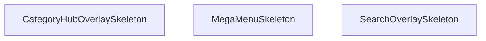

## Genel Bakış
StickyHeader.tsx modülü, yapışkan üst bilgi (sticky header) bileşeninin yükleme durumlarında gösterilen iskelet (skeleton) yer tutucularını tanımlar. Bu bileşenler, içerik henüz yüklenmediğinde kullanıcıya görsel bir geri bildirim sağlamak amacıyla kullanılır.

## Fonksiyon Grupları

### İskelet Yükleme Bileşenleri
Bu fonksiyonlar, StickyHeader altındaki farklı alt bileşenlerin yüklenme sırasında gösterilecek iskelet görünümlerini oluşturur. Her biri, ilgili bileşenin düzenini ve boyutlarını yansıtan animasyonlu yer tutucular sunar.
- SearchOverlaySkeleton, MegaMenuSkeleton, CategoryHubOverlaySkeleton

---

## AXIOMS – Mimari Varsayımlar

Bu modül için fonksiyon gövdeleri verilmediğinden, davranışsal aksiyom üretilememektedir.

[Aksiyom 1]: Eğer `SearchOverlaySkeleton` fonksiyonu mevcut değilse, SearchOverlay bileşeni yüklenirken iskelet (skeleton) placeholder gösterilemez.

[Aksiyom 2]: Eğer `MegaMenuSkeleton` fonksiyonu mevcut değilse, MegaMenu bileşeni yüklenirken iskelet placeholder gösterilemez.

[Aksiyom 3]: Eğer `CategoryHubOverlaySkeleton` fonksiyonu mevcut değilse, CategoryHubOverlay bileşeni yüklenirken iskelet placeholder gösterilemez.

[Aksiyom 4]: Eğer `StickyHeader` bileşeni mevcut değilse, yapışkan başlık alanı render edilemez.

**Not:** Fonksiyon gövdeleri sağlanmadığından, bu fonksiyonların hangi DOM elemanlarını döndürdüğü, hangi state veya effect kullandığı, eşik değerleri veya koşullu render kuralları bilinmemektedir. Yukarıdaki aksiyomlar yalnızca fonksiyon isimleri ve modül sabit listesinden çıkarılan bağımlılık ilişkilerine dayanmaktadır.

---

## FONKSİYON DETAYLARI

### SearchOverlaySkeleton
**Ne yapar**: Arama overlay'i yüklenirken gösterilen iskelet (skeleton) bileşenini render eder. Kullanıcıya içeriğin yüklendiğine dair görsel geri bildirim sağlamak amacıyla kullanılan bir placeholder bileşendir.
**Nasıl yapar**: Fonksiyonun iç mantığı verilen kaynakta belirtilmemiştir. "Skeleton" adlandırması, bileşenin yükleme durumunda gösterilen animasyonlu gri kutucuklardan oluşan bir iskelet yapı oluşturduğunu gösterir. StickyHeader bileşeninin bir parçası olarak, arama overlay'i henüz hazır olmadığında bu iskelet görünüm kullanıcıya sunulur.
**Parametreler**:
- Parametre bilgisi verilen kaynakta yer almamaktadır.
**Dönüş**: Dönüş tipi verilen kaynakta belirtilmemiştir; bilinmiyor.

### MegaMenuSkeleton
**Ne yapar**: Geliştirildi ancak detay üretilemedi.

### CategoryHubOverlaySkeleton
**Ne yapar**: Geliştirildi ancak detay üretilemedi.

---

## İTHALATLAR (IMPORTS)
- import: ../contexts/CategoryContext::useCategories
- import: ../hooks/useAuth::useAuth
- import: ../hooks/useCartHook::useCart
- import: ../hooks/useHideOnScroll::useHideOnScroll
- import: ../hooks/useIsMounted::useIsMounted
- import: ../hooks/useLocalizedRoutes::useLocalizedRoutes
- import: ../hooks/useNavigationState::useNavigationState
- import: ../i18n/I18nProvider::useI18n
- import: ../i18n/currency::SYSTEM_CURRENCY
- import: ../i18n/format::formatCurrency
- import: ../utils/analytics::trackEvent
- import: ../utils/navigationConfig::NAVIGATION_PRIMARY_ITEMS
- import: ../utils/navigationConfig::NAVIGATION_SECONDARY_ITEMS
- import: ../utils/prefetch::prefetchProductsPage
- import: ../utils/routes::localizedHref
- import: ./navigation/NavActionButton::NavActionButton
- import: ./navigation/NavBrand::NavBrand
- import: ./navigation/NavPrimaryRail::NavPrimaryRail
- import: ./navigation/NavSearchTrigger::NavSearchTrigger
- import: ./navigation/NavSecondaryRail::NavSecondaryRail
- import: ./navigation/NavShell::NavShell
- import: ./navigation/NavUtilityRail::NavUtilityRail
- import: next/dynamic::dynamic
- import: next/link::Link
- import: next/navigation::useRouter
- import: react::React
- import: react::useCallback
- import: react::useEffect
- import: react::useMemo
- import: react::useRef
- import: react::useState

---

## INTERFACES

### StickyHeaderProps
- `isScrolled: boolean`

---

## SABİTLER
- **SearchOverlay** (call) — `dynamic(() => import('./SearchOverlay'), { ssr: false })`
- **MegaMenu** (call) — `dynamic(() => import('./MegaMenu'), { ssr: false })`
- **CategoryHubOverlay** (call) — `dynamic(() => import('./navigation/CategoryHubOverlay'), { ssr: false })`
- **StickyHeader** (call) — `React.memo(function StickyHeader({ isScrolled }) {
  const { t, lang } = use...`

---

## AST POINTERS

### [N1_NASIL] AST Pointer: src/components/StickyHeader.tsx::SearchOverlaySkeleton
- **params**: (parametre yok)
- **ic_degiskenler**: yok
- **Dönüş**: JSX element — sabit bir `div` (fixed konumlu, yarı saydam arka plan, blur, z-modal, animate-pulse)

### [N2_NASIL] AST Pointer: src/components/StickyHeader.tsx::MegaMenuSkeleton
- **params**: (parametre yok)
- **ic_degiskenler**: yok
- **Dönüş**: JSX element — sabit bir `div` (absolute konumlu, beyaz arka plan, üst kenarlık, gölge, animate-pulse)

### [N3_NASIL] AST Pointer: src/components/StickyHeader.tsx::CategoryHubOverlaySkeleton
- **params**: (parametre yok)
- **ic_degiskenler**: yok
- **Dönüş**: JSX element — sabit bir `div` (fixed konumlu, koyu yarı saydam arka plan, blur, z-modal, animate-pulse)

### [N4_NASIL] AST Pointer: src/components/StickyHeader.tsx::useEffect (localStorage okuma)
- **params**: (parametre yok)
- **ic_degiskenler**:
  - `raw` — `window.localStorage.getItem('recentProducts')` sonucu; string veya null. `JSON.parse` ile ayrıştırılarak `setRecentProducts`'a aktarılır
- **Dönüş**: yok
- **Yan etki**: `setRecentProducts` çağrılır; `raw` değeri varsa JSON.parse ile ayrıştırılır

### [N5_NASIL] AST Pointer: src/components/StickyHeader.tsx::useEffect (handleClickOutside)
- **params**: (parametre yok)
- **ic_degiskenler**:
  - `handleClickOutside` — MouseEvent parametresi alan fonksiyon; `userMenuRef.current` dışına tıklanırsa `closeUserMenu()` çağırır
- **Dönüş**: cleanup fonksiyonu — `document.removeEventListener('mousedown', handleClickOutside)`

### [N6_NASIL] AST Pointer: src/components/StickyHeader.tsx::handleClickOutside
- **params**: `event` — MouseEvent; tıklama olayını temsil eder
- **ic_degiskenler**: yok
- **Dönüş**: yok
- **Yan etki**: `userMenuRef.current` varsa ve tıklama hedefi bu ref'in içinde değilse `closeUserMenu()` çağrılır

### [N7_NASIL] AST Pointer: src/components/StickyHeader.tsx::roleLabel
- **params**: `role` — string; kullanıcı rolü adı
- **ic_degiskenler**: yok
- **Dönüş**: string — `t()` fonksiyonundan dönen çevrilmiş rol etiketi. `role` değerine göre switch-case ile `'superadmin'`/`'super_admin'`, `'admin'`, `'moderator'`, `'warehouse'`, `'sales'`, `'viewer'` durumları eşleştirilir; eşleşmezse varsayılan olarak `t('roles.user')` döner

### [N8_NASIL] AST Pointer: src/components/StickyHeader.tsx::useEffect (scroll progress)
- **params**: (parametre yok)
- **ic_degiskenler**:
  - `ticking` — boolean; `requestAnimationFrame` throttle bayrağı, aynı kare içinde birden fazla hesaplamayı önler
  - `handleScroll` — scroll olayını işleyen fonksiyon; `ticking` false ise `requestAnimationFrame` ile `setScrollProgress` çağırır
- **Dönüş**: cleanup fonksiyonu — `window.removeEventListener('scroll', handleScroll)`
- **Yan etki**: `isScrolled` true ise scroll dinleyicisi eklenir ve ilk hesaplama yapılır; `setScrollProgress` çağrılır

### [N9_NASIL] AST Pointer: src/components/StickyHeader.tsx::handleScroll
- **params**: (parametre yok)
- **ic_degiskenler**:
  - `winScroll` — `document.documentElement.scrollTop`; dikey scroll pozisyonu (piksel)
  - `height` — `document.documentElement.scrollHeight - document.documentElement.clientHeight`; toplam kaydırılabilir yükseklik
  - `scrolled` — yüzde cinsinden scroll ilerlemesi; `height > 0` ise `(winScroll / height) * 100`, değilse `0`
- **Dönüş**: yok
- **Yan etki**: `setScrollProgress(scrolled)` çağrılır; `ticking` false yapılır

### [N10_NASIL] AST Pointer: src/components/StickyHeader.tsx::requestAnimationFrame callback
- **params**: (parametre yok)
- **ic_degiskenler**:
  - `winScroll` — `document.documentElement.scrollTop`; dikey scroll pozisyonu
  - `height` — `document.documentElement.scrollHeight - document.documentElement.clientHeight`; toplam kaydırılabilir yükseklik
  - `scrolled` — yüzde cinsinden scroll ilerlemesi; `height > 0` ise `(winScroll / height) * 100`, değilse `0`
- **Dönüş**: yok
- **Yan etki**: `setScrollProgress(scrolled)` çağrılır; `ticking = false` yapılır

### [N11_NASIL] AST Pointer: src/components/StickyHeader.tsx::useEffect (global keydown)
- **params**: (parametre yok)
- **ic_degiskenler**:
  - `handleGlobalKeyDown` — KeyboardEvent parametresi alan fonksiyon; `/` tuşu veya `Ctrl/Cmd+K` kombinasyonunda arama overlay'ini açar
- **Dönüş**: cleanup fonksiyonu — `document.removeEventListener('keydown', handleGlobalKeyDown)`

### [N12_NASIL] AST Pointer: src/components/StickyHeader.tsx::handleGlobalKeyDown
- **params**: `event` — KeyboardEvent; klavye olayını temsil eder
- **ic_degiskenler**: yok
- **Dönüş**: yok
- **Yan etki**: `document.activeElement` bir INPUT veya TEXTAREA ise hiçbir şey yapmaz. Aksi halde `event.key === '/'` veya `event.key === 'k'` (metaKey veya ctrlKey ile) durumunda `event.preventDefault()` çağrılır ve `openSearchOverlay()` tetiklenir

### [N13_NASIL] AST Pointer: src/components/StickyHeader.tsx::kategori hub açma fonksiyonu
- **params**: (parametre yok)
- **ic_degiskenler**: yok
- **Dönüş**: yok
- **Yan etki**: `trackEvent('nav_click', { target: 'categories', mode })` ve `openCategoryHub()` çağrılır

### [N14_NASIL] AST Pointer: src/components/StickyHeader.tsx::handleSignOut
- **params**: (parametre yok)
- **ic_degiskenler**: yok
- **Dönüş**: yok (async fonksiyon)
- **Yan etki**: `await signOut()` çağrılır, ardından `setManualLogout(true)`, `closeUserMenu()` ve `router.push(Routes.home())` sırayla çalıştırılır

### [N15_NASIL] AST Pointer: src/components/StickyHeader.tsx::prefetch fonksiyonu
- **params**: `itemId` — string; menü öğesi kimliği
- **ic_degiskenler**: yok
- **Dönüş**: yok
- **Yan etki**: `itemId === 'products'` ise `prefetchProductsPage()` çağrılır

### [N16_NASIL] AST Pointer: src/components/StickyHeader.tsx::user menu render fonksiyonu
- **params**: (parametre yok)
- **ic_degiskenler**: yok (tüm değerler JSX içinde doğrudan kullanılır)
- **Dönüş**: JSX element — iki farklı durum:
  1. `!user && !isDevBypass` ise: giriş/kayıt Link'leri ve mobil NavActionButton (gizli/görünür varyantlar)
  2. aksi halde: `userMenuRef` ile referanslanan relative kapsayıcı; avatar butonu (`toggleUserMenu` ile), `isUserMenuOpen` true ise dropdown menü (hesap linki, admin panel linki eğer `finalIsAdmin` true ise, çıkış butonu `handleSignOut` ile)
- **Kullanılan bağlam değerleri**: `user`, `isDevBypass`, `Routes`, `t`, `userMenuRef`, `toggleUserMenu`, `isUserMenuOpen`, `finalUserDisplayName`, `finalHasPrivilegedRole`, `roleLabel`, `userRole`, `finalIsAdmin`, `handleSignOut`, `closeUserMenu`

---

## MERMAID CALL GRAPH

## NODE ID STANDARD

  file: src\components\StickyHeader.tsx
  function: src\components\StickyHeader.tsx::SearchOverlaySkeleton
  function: src\components\StickyHeader.tsx::MegaMenuSkeleton
  function: src\components\StickyHeader.tsx::CategoryHubOverlaySkeleton

---

## DISA AKTARILANLAR (EXPORTS)
  export: CategoryHubOverlaySkeleton
  export: MegaMenuSkeleton
  export: SearchOverlaySkeleton

---

## STİL TOKENLERİ

### Arbitrary Değerler (token'a geçirilmemiş)
Yok — tüm stiller token'a geçirilmiş. ✅

### Kullanılan Token'lar (zaten token'a geçirilmiş)
- (yok)

### Tailwind Sınıf Özeti
- **Renkler:** `bg-gradient-to-r`, `bg-slate-900/50`, `bg-slate-950/70`, `bg-white`, `bg-white/95`, `border-b`, `border-slate-100`, `border-slate-200`, `border-t`, `from-primary-navy`, `hover:bg-air-blue/20`, `hover:bg-air-blue/25`, `hover:bg-red-50`, `hover:text-primary-navy`, `hover:text-red-600`
- **Layout:** `-right-2`, `-top-2`, `absolute`, `backdrop-blur-md`, `backdrop-blur-sm`, `block`, `fixed`, `flex`, `flex-1`, `from-primary-navy`, `gap-1.5`, `gap-2.5`, `gap-3`, `h-16`, `h-5`
- **Varyant/Responsive:** `:`, `hover:`, `lg:`, `md:`, `sm:`, `xl:` önekleri
- **Yardımcı Sınıflar:** `${isUserMenuOpen`, `:`, `animate-pulse`, `border`, `duration-300`, `font-bold`, `font-medium`, `font-semibold`, `group`, `hover:-translate-y-0.5`, `inset-0`, `md:px-4`, `mt-3`, `opacity-100`, `px-2`