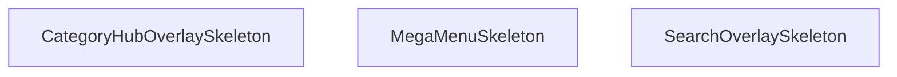

## Genel Bakış
StickyHeader bileşeninin üst menü katmanlarında (search overlay, mega menü, kategori hub) kullanılacak geçici yükleme durumu göstergelerini tanımlayan yardımcı bir modüldür. Modül, kullanıcının karşısına çıkan açılır pencerelerin henüz veriyle doldurulamadığı kısa sürede animasyonlu iskelet arayüzler sunarak geçiş sürecini yumuşatır.

## Fonksiyon Grupları

### Skeleton (Yükleme İskeleti) Bileşenleri
Farklı üst menü overlay'lerinin yüklenme aşamasında kullanıcıya boş sayfa yerine yapısal bir önizleme gösteren, bağımsız ve parametresiz React bileşenleridir.
- SearchOverlaySkeleton — Arama overlay'i yüklenirken gösterilen iskelet görünümü.
- MegaMenuSkeleton — Mega menü açılırken gösterilen iskelet görünümü.
- CategoryHubOverlaySkeleton — Kategori hub overlay'i yüklenirken gösterilen iskelet görünümü.

## Mimari Notlar

- **Dış bağımlılık:** Modülün kendi iç bağımlılığı bulunmamakla birlikte, skeleton kartlarının görünümünü tanımlamak üzere bir stil kaynağına (CSS modülü veya tema token'ı) ihtiyaç duyar; stil sağlanmazsa bileşenler biçimlendirilmemiş hâilde render edilir.
- **Dinamik yükleme:** Modül kendi başına lazy yüklenen bir modül değil, doğrudan StickyHeader bileşeni içinde statik olarak import edilir.
- **Yerleşim:** Her üç skeleton da aynı modül dosyasında tanımlıdır; bu, ilgili skeleton bileşenlerinin bir arada tutulmasını ve üst menü sistemiyle olan eşleşme ilişkinin tek noktadan yönetilmesini sağlar.

---

## AXIOMS – Mimari Varsayımlar

Bu modül, StickyHeader bileşeninin farklı overlay'leri için skeleton ( yükleme durumu ) UI bileşenleri içerir. Üç skeleton fonksiyonu da parametresiz olarak tanımlanmıştır.

---

[Aksiyom 1]: Eğer `SearchOverlaySkeleton`, `MegaMenuSkeleton` veya `CategoryHubOverlaySkeleton` fonksiyonlarından herhangi biri çağrılmazsa, ilgili overlay için yükleme durumu göstergesi (skeleton UI) oluşturulmaz ve kullanıcı yükleme sırasında boş/bozuk bir arayüz görebilir.

---

[Aksiyom 2]: Eğer skeleton fonksiyonları parametre almıyorsa (tümü boş imza ile tanımlıdır: `()`), her skeleton bileşeninin görünümü statik/kabul kriterlerine bağlı olarak sabittir ve çalışma zamanında (runtime) özelleştirilemez.

---

[Aksiyom 3]: Eğer `SearchOverlaySkeleton` fonksiyonu `SearchOverlay` ile, `MegaMenuSkeleton` fonksiyonu `MegaMenu` ile veya `CategoryHubOverlaySkeleton` fonksiyonu `CategoryHubOverlay` ile eşleşmezse (naming mismatch), skeleton yüklenme durumu yanlış overlay için gösterilir veya hiçbir skeleton gösterilmez.

---

[Aksiyom 4]: Eğer StickyHeader bileşeni (`StickyHeader`) modülde çağrı olarak (call) tanımlıysa ve skeleton fonksiyonları da aynı modülde bulunuyorsa, `StickyHeader`'ın ilgili overlay'leri yüklenirken bu skeleton fonksiyonlarından birini rendersa (kullanırsa), bileşen ağacı (component tree) doğru sırada render edilmelidir.

---

[Aksiyom 5]: Eğer skeleton bileşenleri React JSX/TSX döndürüyorsa (modülün `.tsx` uzantılı ve React bileşen yapısında olduğu belirtilmiştir), her skeleton fonksiyonunun geçerli bir React elementi döndürmesi gerekir; aksi halde React render hatası oluşur.

---

**Not:** Fonksiyon gövdeleri (implementation body) paylaşılmadığından, JSX içeriği, animasyon yapıları, className değerleri veya state kullanımı gibi iç detaylar hakkında aksiyom türetilmemiştir.

---

## FONKSİYON DETAYLARI

### SearchOverlaySkeleton
**Ne yapar**: Arama overlay bileşeninin yüklenme sırasında gösterilecek iskelet (skeleton) yükleme durumu placeholder'ını render eder.

**Nasıl yapar**: Arama overlay'ı veriler yüklenene kadar beklerken kullanıcıya görsel bir geri bildirim sunmak amacıyla animasyonlu placeholder elementleri oluşturur. Bu sayede kullanıcı arama arayüzünün yakında görüneceğine dair ipucu alır.

**Parametreler**:
- Bu fonksiyon herhangi bir parametre almaz.

**Dönüş**: JSX.Element — Arama overlay'ı için skeleton yükleme durumu bileşeni döndürür.

### MegaMenuSkeleton
**Ne yapar**: Geliştirildi ancak detay üretilemedi.

### CategoryHubOverlaySkeleton
**Ne yapar**: Geliştirildi ancak detay üretilemedi.

---

## İTHALATLAR (IMPORTS)
- import: ../contexts/CategoryContext::useCategories
- import: ../hooks/useAuth::useAuth
- import: ../hooks/useCartHook::useCart
- import: ../hooks/useHideOnScroll::useHideOnScroll
- import: ../hooks/useIsMounted::useIsMounted
- import: ../hooks/useLocalizedRoutes::useLocalizedRoutes
- import: ../hooks/useNavigationState::useNavigationState
- import: ../i18n/I18nProvider::useI18n
- import: ../i18n/format::formatCurrency
- import: ../utils/analytics::trackEvent
- import: ../utils/navigationConfig::NAVIGATION_PRIMARY_ITEMS
- import: ../utils/navigationConfig::NAVIGATION_SECONDARY_ITEMS
- import: ../utils/prefetch::prefetchProductsPage
- import: ../utils/routes::localizedHref
- import: ./navigation/NavActionButton::NavActionButton
- import: ./navigation/NavBrand::NavBrand
- import: ./navigation/NavPrimaryRail::NavPrimaryRail
- import: ./navigation/NavSearchTrigger::NavSearchTrigger
- import: ./navigation/NavSecondaryRail::NavSecondaryRail
- import: ./navigation/NavShell::NavShell
- import: ./navigation/NavUtilityRail::NavUtilityRail
- import: next/dynamic::dynamic
- import: next/link::Link
- import: next/navigation::useRouter
- import: react::React
- import: react::useCallback
- import: react::useEffect
- import: react::useMemo
- import: react::useRef
- import: react::useState

---

## INTERFACES

### StickyHeaderProps
- `isScrolled: boolean`

---

## SABİTLER
- **SearchOverlay** (call) — `dynamic(() => import('./SearchOverlay'), { ssr: false })`
- **MegaMenu** (call) — `dynamic(() => import('./MegaMenu'), { ssr: false })`
- **CategoryHubOverlay** (call) — `dynamic(() => import('./navigation/CategoryHubOverlay'), { ssr: false })`
- **StickyHeader** (call) — `React.memo(function StickyHeader({ isScrolled }) {
  const { t, lang } = use...`

---

## AST POINTERS

### [N1_NASIL] AST Pointer: components/StickyHeader.tsx::SearchOverlaySkeleton
- **params**: ()
- **ic_degiskenler**: yok
- **Dönüş**: JSX element — tam ekran覆盖 overlay, `bg-slate-900/50 backdrop-blur-sm z-modal animate-pulse` sınıfıyla loading skeleton gösterimi

---

### [N2_NASIL] AST Pointer: components/StickyHeader.tsx::MegaMenuSkeleton
- **params**: ()
- **ic_degiskenler**: yok
- **Dönüş**: JSX element — `absolute top-full left-0 right-0` konumunda, `min-h-hvac-section bg-white border-t border-slate-200 shadow-xl animate-pulse` ile mega menü skeleton'u

---

### [N3_NASIL] AST Pointer: components/StickyHeader.tsx::CategoryHubOverlaySkeleton
- **params**: ()
- **ic_degiskenler**: yok
- **Dönüş**: JSX element — tam ekran覆盖 overlay, `bg-slate-950/70 backdrop-blur-md z-modal animate-pulse` ile category hub skeleton'u

---

### [N4_NASIL] AST Pointer: components/StickyHeader.tsx::useEffect_recentProducts
- **params**: ()
- **ic_degiskenler**:
  - `raw` — `window.localStorage.getItem('recentProducts')` sonucu, ham JSON string; parse edilip `setRecentProducts` ile state'e yazılır
- **Dönüş**: yok (useEffect side-effect callback; `setRecentProducts(JSON.parse(raw))` çağrısıyla state güncellenir)

---

### [N5_NASIL] AST Pointer: components/StickyHeader.tsx::useEffect_clickOutside
- **params**: ()
- **ic_degiskenler**:
  - `handleClickOutside` — mousedown event handler; `userMenuRef.current` dışına tıklanırsa `closeUserMenu()` çağırır
- **Dönüş**: cleanup fonksiyonu — `document.removeEventListener('mousedown', handleClickOutside)` ile listener kaldırılır

---

### [N6_NASIL] AST Pointer: components/StickyHeader.tsx::handleClickOutside
- **params**: `(event: MouseEvent)`
- **ic_degiskenler**: yok
- **Dönüş**: yok (void) — `userMenuRef.current` varsa ve event target içeride değilse `closeUserMenu()` çağırır

---

### [N7_NASIL] AST Pointer: components/StickyHeader.tsx::roleLabel
- **params**: `(role: string)`
- **ic_degiskenler**: yok
- **Dönüş**: `string` — role değerine göre `t()` ile çevrilmiş Türkçe rol etiketi; `'superadmin'`/`'super_admin'` → `t('roles.super_admin') || t('roles.superadmin')`, `'admin'` → `t('roles.admin')`, `'moderator'` → `t('roles.moderator')`, `'warehouse'` → `t('roles.warehouse')`, `'sales'` → `t('roles.sales')`, `'viewer'` → `t('roles.viewer')`, default → `t('roles.user')`

---

### [N8_NASIL] AST Pointer: components/StickyHeader.tsx::useEffect_scrollProgress
- **params**: ()
- **ic_degiskenler**:
  - `ticking` — `boolean`, `requestAnimationFrame` debounce flag; true iken yeni handler çağrısı yok sayılır
  - `handleScroll` — scroll event handler; `document.documentElement.scrollTop`, `document.documentElement.scrollHeight`, `document.documentElement.clientHeight` değerlerinden scroll yüzdesini hesaplar
- **Dönüş**: cleanup fonksiyonu — `window.removeEventListener('scroll', handleScroll)` ile listener kaldırılır; ayrıca `handleScroll()` ilk çağrılarak başlangıç değeri hesaplanır

---

### [N9_NASIL] AST Pointer: components/StickyHeader.tsx::handleScroll
- **params**: ()
- **ic_degiskenler**:
  - `winScroll` — `document.documentElement.scrollTop`, mevcut dikey kaydırma miktarı piksel cinsinden
  - `height` — `document.documentElement.scrollHeight - document.documentElement.clientHeight`, toplam kaydırılabilir piksel yüksekliği
  - `scrolled` — `(winScroll / height) * 100` hesaplaması ile scroll yüzdesi; `height > 0` koşulu ile sıfıra bölmeyi engeller
- **Dönüş**: yok (void) — `setScrollProgress(scrolled)` ile state güncellenir, `ticking` false yapılır

---

### [N10_NASIL] AST Pointer: components/StickyHeader.tsx::handleScroll_requestAnimationFrame
- **params**: ()
- **ic_degiskenler**:
  - `winScroll` — `document.documentElement.scrollTop`, mevcut dikey kaydırma miktarı piksel cinsinden
  - `height` — `document.documentElement.scrollHeight - document.documentElement.clientHeight`, toplam kaydırılabilir piksel yüksekliği
  - `scrolled` — `(winScroll / height) * 100` hesaplaması ile scroll yüzdesi; `height > 0` koşulu ile sıfıra bölmeyi engeller
- **Dönüş**: yok (void) — `setScrollProgress(scrolled)` ile state güncellenir, `ticking` false yapılır

---

### [N11_NASIL] AST Pointer: components/StickyHeader.tsx::useEffect_globalKeydown
- **params**: ()
- **ic_degiskenler**:
  - `handleGlobalKeyDown` — keydown event handler; aktif element INPUT veya TEXTAREA değilse ve tuş `'/'` veya `Cmd+K`/`Ctrl+K` ise `event.preventDefault()` çağırıp `openSearchOverlay()` tetikler
- **Dönüş**: cleanup fonksiyonu — `document.removeEventListener('keydown', handleGlobalKeyDown)` ile listener kaldırılır

---

### [N12_NASIL] AST Pointer: components/StickyHeader.tsx::handleGlobalKeyDown
- **params**: `(event: KeyboardEvent)`
- **ic_degiskenler**: yok
- **Dönüş**: yok (void) — `document.activeElement.tagName` `'INPUT'` veya `'TEXTAREA'` ise return; `'/'` tuşuna basılmışsa veya `Cmd+K`/`Ctrl+K` kombinasyonu ise `event.preventDefault()` + `openSearchOverlay()` çağrılır

---

### [N13_NASIL] AST Pointer: components/StickyHeader.tsx::handleCategoriesClick
- **params**: ()
- **ic_degiskenler**: yok
- **Dönüş**: yok (void) — `trackEvent('nav_click', { target: 'categories', mode })` ile analitik event gönderimi, ardından `openCategoryHub()` ile category hub overlay açılır

---

### [N14_NASIL] AST Pointer: components/StickyHeader.tsx::handleSignOut
- **params**: ()
- **ic_degiskenler**: yok
- **Dönüş**: yok (async void) — `await signOut()` ile oturum kapatılır, `setManualLogout(true)` ile manuel çıkış flag'ı set edilir, `closeUserMenu()` ile menü kapatılır, `router.push(Routes.home())` ile ana sayfaya yönlendirme yapılır

---

### [N15_NASIL] AST Pointer: components/StickyHeader.tsx::handleNavItemHover
- **params**: `(itemId: string)`
- **ic_degiskenler**: yok
- **Dönüş**: yok (void) — `itemId === '159products'` ise `prefetchProductsPage()` ile ürünler sayfası prefetch edilir

---

### [N16_NASIL] AST Pointer: components/StickyHeader.tsx::renderAuthSection
- **params**: ()
- **ic_degiskenler**:
  - `user` — useAuth'tan gelen mevcut kullanıcı nesnesi; null ise giriş yapılmamış demektir
  - `isDevBypass` — geliştirici modu bypass flag'ı; true ise giriş yapılmamış olsa bile user menüsü gösterilir
  - `userMenuRef` — `useRef`, user menu container DOM referansı; click outside kontrolünde kullanılır
  - `toggleUserMenu` — user menüsünü açıp kapatan fonksiyon
  - `isUserMenuOpen` — boolean, user menüsünün açık olup olmadığını belirtir
  - `finalUserDisplayName` — kullanıcının display name'i; truncated olarak gösterilir
  - `finalHasPrivilegedRole` — boolean, kullanıcının privileged rolü olup olmadığını belirtir; true ise `roleLabel(userRole)` gösterilir
  - `userRole` — kullanıcının rolü string olarak
  - `roleLabel` — rol string'ini çevrilmiş label'a dönüştüren fonksiyon
  - `finalIsAdmin` — boolean, kullanıcının admin olup olmadığını belirtir; true ise admin panel linki gösterilir
  - `closeUserMenu` — menüyü kapatma fonksiyonu
  - `handleSignOut` — çıkış yapma fonksiyonu
- **Dönüş**: JSX element — `!user && !isDevBypass` koşulunda giriş/kayıt butonları (`Link` ile `Routes.auth.login()` ve `Routes.auth.register()`); aksi halde user menüsü但tonu + dropdown menü (`Routes.account.overview()`, `Routes.admin.dashboard()`, çıkış butonu)

---

## MERMAID CALL GRAPH

## NODE ID STANDARD

  file: src\components\StickyHeader.tsx
  function: src\components\StickyHeader.tsx::SearchOverlaySkeleton
  function: src\components\StickyHeader.tsx::MegaMenuSkeleton
  function: src\components\StickyHeader.tsx::CategoryHubOverlaySkeleton

---

## DISA AKTARILANLAR (EXPORTS)
  export: CategoryHubOverlaySkeleton
  export: MegaMenuSkeleton
  export: SearchOverlaySkeleton

---

## STİL TOKENLERİ

### Arbitrary Değerler (token'a geçirilmemiş)
Yok — tüm stiller token'a geçirilmiş. ✅

### Kullanılan Token'lar (zaten token'a geçirilmiş)
- (yok)

### Tailwind Sınıf Özeti
- **Renkler:** `bg-gradient-to-r`, `bg-slate-900/50`, `bg-slate-950/70`, `bg-white`, `bg-white/95`, `border-b`, `border-slate-100`, `border-slate-200`, `border-t`, `from-primary-navy`, `hover:bg-air-blue/20`, `hover:bg-air-blue/25`, `hover:bg-red-50`, `hover:text-primary-navy`, `hover:text-red-600`
- **Layout:** `-right-2`, `-top-2`, `absolute`, `backdrop-blur-md`, `backdrop-blur-sm`, `block`, `fixed`, `flex`, `flex-1`, `from-primary-navy`, `gap-1.5`, `gap-2.5`, `gap-3`, `h-16`, `h-5`
- **Varyant/Responsive:** `:`, `hover:`, `lg:`, `md:`, `sm:`, `xl:` önekleri
- **Yardımcı Sınıflar:** `${isUserMenuOpen`, `:`, `animate-pulse`, `border`, `duration-300`, `font-bold`, `font-medium`, `font-semibold`, `group`, `hover:-translate-y-0.5`, `inset-0`, `md:px-4`, `mt-3`, `opacity-100`, `px-2`