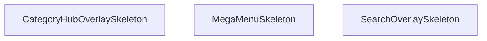

## Genel Bakış
Bu modül, StickyHeader bileşeninin farklı açılır pencereleri (overlay) için yükleme durumu göstergeleri (skeleton UI) sağlayan bir yardımcı modüldür. Her bir skeleton, ilgili asıl bileşen yüklenirken kullanıcıya geçici ve animasyonlu bir arayüz sunarak daha akıcı bir deneyim elde edilmesini sağlar.

## Fonksiyon Grupları
### Skeleton (Yükleme Durumu) Bileşenleri
Modüldeki tüm fonksiyonlar, farklı üst menü bileşenlerinin yüklenme sırasındaki iskelet (skeleton) görünümünü oluşturan React bileşenleridir.
- SearchOverlaySkeleton, MegaMenuSkeleton, CategoryHubOverlaySkeleton

---

## AXIOMS – Mimari Varsayımlar

Bu modül, üç skeleton (iskelet/Yükleniyor) yükleme bileşeni ve dört asıl bileşen çağrısından oluşur. Aksiyomlar yalnızca fonksiyon imzaları ve modül sabitleri temel alınarak türetilmiştir.

[Aksiyom 1]: Eğer `SearchOverlaySkeleton`, `MegaMenuSkeleton` veya `CategoryHubOverlaySkeleton` fonksiyonları çağrıldığında JSX döndürmek yerine `undefined` veya `null` döndürürse, arama mega menü ve kategori hub overlay'lerinin yükleme (loading) durumunda iskelet UI'ı gösterilmeyerek kullanıcıya boş bir alan sunulur.

[Aksiyom 2]: Eğer üç skeleton fonksiyonunun hiçbir parametresi (`()`) olmadığı halde dış bağımlılık olarak bir CSS modülü veya style token'ı bekleniyorsa ve bu stil kaynağı sağlanmamışsa, skeleton bileşenleri görünür ancak biçimsiz (unstyled) render edilir.

[Aksiyom 3]: Eğer `SearchOverlay`, `MegaMenu`, `CategoryHubOverlay` veya `StickyHeader` modül sabitleri olarak tanımlanmış bileşen çağrıları (call) mevcut değilse veya bunların import'ları kırılmışsa, ilgili overlay açma ve başlık bileşeni render işlemleri başarısız olur.

[Aksiyom 4]: Eğer skeleton fonksiyonları asıl overlay bileşenleriyle (`SearchOverlay`, `MegaMenu`, `CategoryHubOverlay`) aynı layout bağlamında (mount noktası) render edilmiyorsa, yüklenme süresince UI geçişi (transition) bozulur.

[Aksiyom 5]: Eğer `StickyHeader` bileşeni modülün ana ihracatı (export) olarak kullanılmıyorsa veya çağrılmıyorsa, sayfa üst kısmında sabit başlık alanı oluşturulmaz.

---

## FONKSİYON DETAYLARI

### SearchOverlaySkeleton
**Ne yapar**: Arama overlay bileşeninin yüklenme sırasında gösterilecek iskelet (skeleton) yükleme durumu placeholder'ını render eder.

**Nasıl yapar**: Arama overlay'ı veriler yüklenene kadar beklerken kullanıcıya görsel bir geri bildirim sunmak amacıyla animasyonlu placeholder elementleri oluşturur. Bu sayede kullanıcı arama arayüzünün yakında görüneceğine dair ipucu alır.

**Parametreler**:
- Bu fonksiyon herhangi bir parametre almaz.

**Dönüş**: JSX.Element — Arama overlay'ı için skeleton yükleme durumu bileşeni döndürür.

### MegaMenuSkeleton
**Ne yapar**: Geliştirildi ancak detay üretilemedi.

### CategoryHubOverlaySkeleton
**Ne yapar**: Geliştirildi ancak detay üretilemedi.

---

## INTERFACES

### StickyHeaderProps
- `isScrolled: boolean`

---

## SABİTLER
- **SearchOverlay** (call) — `dynamic(() => import('./SearchOverlay'), { ssr: false })`
- **MegaMenu** (call) — `dynamic(() => import('./MegaMenu'), { ssr: false })`
- **CategoryHubOverlay** (call) — `dynamic(() => import('./navigation/CategoryHubOverlay'), { ssr: false })`
- **StickyHeader** (call) — `React.memo(function StickyHeader({ isScrolled }) {

  const { t, lang } = use...`

---

## AST POINTERS

### [N1_NASIL] AST Pointer: `src/components/StickyHeader.tsx`::SearchOverlaySkeleton
- **params**: ()
- **ic_degiskenler**: yok
- **Dönüş**: JSX (tam ekran karartmalı loading skeleton div'i)

### [N2_NASIL] AST Pointer: `src/components/StickyHeader.tsx`::MegaMenuSkeleton
- **params**: ()
- **ic_degiskenler**: yok
- **Dönüş**: JSX (absolutely positioned mega menu skeleton div'i)

### [N3_NASIL] AST Pointer: `src/components/StickyHeader.tsx`::CategoryHubOverlaySkeleton
- **params**: ()
- **ic_degiskenler**: yok
- **Dönüş**: JSX (tam ekran koyu arka planlı loading skeleton div'i)

### [N4_NASIL] AST Pointer: `src/components/StickyHeader.tsx`::recentProductsLoader
- **params**: ()
- **ic_degiskenler**:
  - `raw` — localStorage'dan çekilen ham JSON string verisi, parse edilmeden önceki hali
- **Dönüş**: yok (yan etki: setRecentProducts ile state'i günceller)

### [N5_NASIL] AST Pointer: `src/components/StickyHeader.tsx`::useClickOutsideEffect
- **params**: ()
- **ic_degiskenler**:
  - `handleClickOutside` — MouseEvent callback, userMenuRef dışına tıklanırsa closeUserMenu çağırır
- **Dönüş**: Cleanup fonksiyonu (mousedown event listener'ı kaldırır)

### [N6_NASIL] AST Pointer: `src/components/StickyHeader.tsx`::handleClickOutside
- **params**: (event: MouseEvent)
- **ic_degiskenler**: yok
- **Dönüş**: yok (yan etki: closeUserMenu çağırır)

### [N7_NASIL] AST Pointer: `src/components/StickyHeader.tsx`::roleLabel
- **params**: (role: string)
- **ic_degiskenler**: yok
- **Dönüş**: string (t() ile çevrilmiş rol etiketi)

### [N8_NASIL] AST Pointer: `src/components/StickyHeader.tsx`::useScrollProgressEffect
- **params**: ()
- **ic_degiskenler**:
  - `ticking` — requestAnimationFrame için debounce flag, true ise yeni hesaplama yapılmaz
  - `handleScroll` — scroll event handler, sayfa kaydırma yüzdesini hesaplar
- **Dönüş**: Cleanup fonksiyonu (scroll event listener'ı kaldırır)

### [N9_NASIL] AST Pointer: `src/components/StickyHeader.tsx`::scrollAnimationFrameCallback
- **params**: ()
- **ic_degiskenler**:
  - `winScroll` — document.documentElement.scrollTop ile mevcut dikey kaydırma miktarı
  - `height` — toplam kaydırılabilir sayfa yüksekliği (scrollHeight - clientHeight)
  - `scrolled` — yüzdelik kaydırma oranı (winScroll / height * 100)
- **Dönüş**: yok (yan etki: setScrollProgress ile state'i günceller, ticking'i false yapar)

### [N10_NASIL] AST Pointer: `src/components/StickyHeader.tsx`::useGlobalKeydownEffect
- **params**: ()
- **ic_degiskenler**:
  - `handleGlobalKeyDown` — KeyboardEvent handler, / veya Cmd+K ile search overlay açar
- **Dönüş**: Cleanup fonksiyonu (keydown event listener'ı kaldırır)

### [N11_NASIL] AST Pointer: `src/components/StickyHeader.tsx`::globalKeydownHandler
- **params**: (event: KeyboardEvent)
- **ic_degiskenler**: yok
- **Dönüş**: yok (yan etki: event.preventDefault ve openSearchOverlay çağırabilir)

### [N12_NASIL] AST Pointer: `src/components/StickyHeader.tsx`::handleCategoryClick
- **params**: ()
- **ic_degiskenler**: yok
- **Dönüş**: yok (yan etki: trackEvent ve openCategoryHub çağırır)

### [N13_NASIL] AST Pointer: `src/components/StickyHeader.tsx`::handleSignOut
- **params**: ()
- **ic_degiskenler**: yok
- **Dönüş**: Promise<void> (async fonksiyon, signOut bekler)

### [N14_NASIL] AST Pointer: `src/components/StickyHeader.tsx`::handleItemClick
- **params**: (itemId: string)
- **ic_degiskenler**: yok
- **Dönüş**: yok (yan etki: itemId === 'products' ise prefetchProductsPage çağırır)

### [N15_NASIL] AST Pointer: `src/components/StickyHeader.tsx`::renderUserMenu
- **params**: ()
- **ic_degiskenler**: yok (tüm değişkenler üst kapsamdan geliyor)
- **Dönüş**: JSX (kullanıcı giriş durumuna göre sign-in/sign-up butonları veya user menu)

---

## MERMAID CALL GRAPH

## NODE ID STANDARD

  file: src\components\StickyHeader.tsx
  function: src\components\StickyHeader.tsx::SearchOverlaySkeleton
  function: src\components\StickyHeader.tsx::MegaMenuSkeleton
  function: src\components\StickyHeader.tsx::CategoryHubOverlaySkeleton

---

## DISA AKTARILANLAR (EXPORTS)
  export: CategoryHubOverlaySkeleton
  export: MegaMenuSkeleton
  export: SearchOverlaySkeleton

---

## STİL TOKENLERİ

### Arbitrary Değerler (token'a geçirilmemiş)
Yok — tüm stiller token'a geçirilmiş. ✅

### Kullanılan Token'lar (zaten token'a geçirilmiş)
- (yok)

### Tailwind Sınıf Özeti
- **Renkler:** `bg-gradient-to-r`, `bg-slate-900/50`, `bg-slate-950/70`, `bg-white`, `bg-white/95`, `border-b`, `border-slate-100`, `border-slate-200`, `border-t`, `from-primary-navy`, `hover:bg-air-blue/20`, `hover:bg-air-blue/25`, `hover:bg-red-50`, `hover:text-primary-navy`, `hover:text-red-600`
- **Layout:** `-right-2`, `-top-2`, `absolute`, `backdrop-blur-md`, `backdrop-blur-sm`, `block`, `fixed`, `flex`, `flex-1`, `from-primary-navy`, `gap-1.5`, `gap-2.5`, `gap-3`, `h-16`, `h-5`
- **Varyant/Responsive:** `:`, `hover:`, `lg:`, `md:`, `sm:`, `xl:` önekleri
- **Yardımcı Sınıflar:** `${isUserMenuOpen`, `:`, `animate-pulse`, `border`, `duration-300`, `font-bold`, `font-medium`, `font-semibold`, `group`, `hover:-translate-y-0.5`, `inset-0`, `md:px-4`, `mt-3`, `opacity-100`, `px-2`