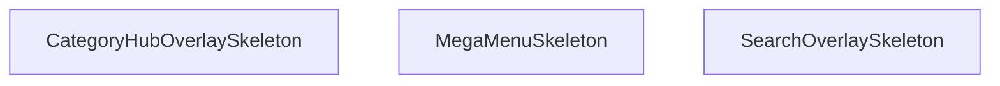

## Genel Bakış
StickyHeader bileşeninin üst menü katmanlarında (search overlay, mega menü, kategori hub) kullanılacak geçici yükleme durumu göstergelerini tanımlayan yardımcı bir modüldür. Modül, kullanıcının karşısına çıkan açılır pencerelerin henüz veriyle doldurulamadığı kısa sürede animasyonlu iskelet arayüzler sunarak geçiş sürecini yumuşatır.

## Fonksiyon Grupları

### Skeleton (Yükleme İskeleti) Bileşenleri
Farklı üst menü overlay'lerinin yüklenme aşamasında kullanıcıya boş sayfa yerine yapısal bir önizleme gösteren, bağımsız ve parametresiz React bileşenleridir.
- SearchOverlaySkeleton — Arama overlay'i yüklenirken gösterilen iskelet görünümü.
- MegaMenuSkeleton — Mega menü açılırken gösterilen iskelet görünümü.
- CategoryHubOverlaySkeleton — Kategori hub overlay'i yüklenirken gösterilen iskelet görünümü.

## Mimari Notlar

- **Dış bağımlılık:** Modülün kendi iç bağımlılığı bulunmamakla birlikte, skeleton kartlarının görünümünü tanımlamak üzere bir stil kaynağına (CSS modülü veya tema token'ı) ihtiyaç duyar; stil sağlanmazsa bileşenler biçimlendirilmemiş hâilde render edilir.
- **Dinamik yükleme:** Modül kendi başına lazy yüklenen bir modül değil, doğrudan StickyHeader bileşeni içinde statik olarak import edilir.
- **Yerleşim:** Her üç skeleton da aynı modül dosyasında tanımlıdır; bu, ilgili skeleton bileşenlerinin bir arada tutulmasını ve üst menü sistemiyle olan eşleşme ilişkinin tek noktadan yönetilmesini sağlar.

---

## AXIOMS – Mimari Varsayımlar

Bu modül, StickyHeader bileşeninin farklı overlay'leri için skeleton ( yükleme durumu ) UI bileşenleri içerir. Üç skeleton fonksiyonu da parametresiz olarak tanımlanmıştır.

---

## FONKSİYON DETAYLARI

### SearchOverlaySkeleton
**Ne yapar**: Arama overlay bileşeninin yüklenme sırasında gösterilecek iskelet (skeleton) yükleme durumu placeholder'ını render eder.

**Nasıl yapar**: Arama overlay'ı veriler yüklenene kadar beklerken kullanıcıya görsel bir geri bildirim sunmak amacıyla animasyonlu placeholder elementleri oluşturur. Bu sayede kullanıcı arama arayüzünün yakında görüneceğine dair ipucu alır.

**Parametreler**:
- Bu fonksiyon herhangi bir parametre almaz.

**Dönüş**: JSX.Element — Arama overlay'ı için skeleton yükleme durumu bileşeni döndürür.

### MegaMenuSkeleton
**Ne yapar**: Geliştirildi ancak detay üretilemedi.

### CategoryHubOverlaySkeleton
**Ne yapar**: Geliştirildi ancak detay üretilemedi.

---

## İTHALATLAR (IMPORTS)
- import: ../contexts/CategoryContext::useCategories
- import: ../hooks/useAuth::useAuth
- import: ../hooks/useCartHook::useCart
- import: ../hooks/useHideOnScroll::useHideOnScroll
- import: ../hooks/useIsMounted::useIsMounted
- import: ../hooks/useLocalizedRoutes::useLocalizedRoutes
- import: ../hooks/useNavigationState::useNavigationState
- import: ../i18n/I18nProvider::useI18n
- import: ../i18n/format::formatCurrency
- import: ../utils/analytics::trackEvent
- import: ../utils/navigationConfig::NAVIGATION_PRIMARY_ITEMS
- import: ../utils/navigationConfig::NAVIGATION_SECONDARY_ITEMS
- import: ../utils/prefetch::prefetchProductsPage
- import: ../utils/routes::localizedHref
- import: ./navigation/NavActionButton::NavActionButton
- import: ./navigation/NavBrand::NavBrand
- import: ./navigation/NavPrimaryRail::NavPrimaryRail
- import: ./navigation/NavSearchTrigger::NavSearchTrigger
- import: ./navigation/NavSecondaryRail::NavSecondaryRail
- import: ./navigation/NavShell::NavShell
- import: ./navigation/NavUtilityRail::NavUtilityRail
- import: next/dynamic::dynamic
- import: next/link::Link
- import: next/navigation::useRouter
- import: react::React
- import: react::useCallback
- import: react::useEffect
- import: react::useMemo
- import: react::useRef
- import: react::useState

---

## INTERFACES

### StickyHeaderProps
- `isScrolled: boolean`

---

## SABİTLER
- **SearchOverlay** (call) — `dynamic(() => import('./SearchOverlay'), { ssr: false })`
- **MegaMenu** (call) — `dynamic(() => import('./MegaMenu'), { ssr: false })`
- **CategoryHubOverlay** (call) — `dynamic(() => import('./navigation/CategoryHubOverlay'), { ssr: false })`
- **StickyHeader** (call) — `React.memo(function StickyHeader({ isScrolled }) {
  const { t, lang } = use...`

---

## AST POINTERS

### [N1_NASIL] AST Pointer: components/StickyHeader.tsx::SearchOverlaySkeleton
- **params**: ()
- **ic_degiskenler**: yok
- **Dönüş**: JSX element — tam ekran覆盖 overlay, `bg-slate-900/50 backdrop-blur-sm z-modal animate-pulse` sınıfıyla loading skeleton gösterimi

---

## MERMAID CALL GRAPH

## NODE ID STANDARD

  file: src\components\StickyHeader.tsx
  function: src\components\StickyHeader.tsx::SearchOverlaySkeleton
  function: src\components\StickyHeader.tsx::MegaMenuSkeleton
  function: src\components\StickyHeader.tsx::CategoryHubOverlaySkeleton

---

## DISA AKTARILANLAR (EXPORTS)
  export: CategoryHubOverlaySkeleton
  export: MegaMenuSkeleton
  export: SearchOverlaySkeleton

---

## STİL TOKENLERİ

### Arbitrary Değerler (token'a geçirilmemiş)
Yok — tüm stiller token'a geçirilmiş. ✅

### Kullanılan Token'lar (zaten token'a geçirilmiş)
- (yok)

### Tailwind Sınıf Özeti
- **Renkler:** `bg-gradient-to-r`, `bg-slate-900/50`, `bg-slate-950/70`, `bg-white`, `bg-white/95`, `border-b`, `border-slate-100`, `border-slate-200`, `border-t`, `from-primary-navy`, `hover:bg-air-blue/20`, `hover:bg-air-blue/25`, `hover:bg-red-50`, `hover:text-primary-navy`, `hover:text-red-600`
- **Layout:** `-right-2`, `-top-2`, `absolute`, `backdrop-blur-md`, `backdrop-blur-sm`, `block`, `fixed`, `flex`, `flex-1`, `from-primary-navy`, `gap-1.5`, `gap-2.5`, `gap-3`, `h-16`, `h-5`
- **Varyant/Responsive:** `:`, `hover:`, `lg:`, `md:`, `sm:`, `xl:` önekleri
- **Yardımcı Sınıflar:** `${isUserMenuOpen`, `:`, `animate-pulse`, `border`, `duration-300`, `font-bold`, `font-medium`, `font-semibold`, `group`, `hover:-translate-y-0.5`, `inset-0`, `md:px-4`, `mt-3`, `opacity-100`, `px-2`