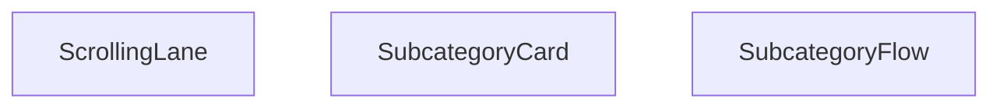

## Genel Bakış
VentHub HVAC platformunda ana kategorilere bağlı alt kategorileri etkileşimli bir akış (kaydırılabilir kartlar) olarak sunan React modülüdür. Modül, alt kategorileri bireysel kartlar halinde gösteren ve bu kartları belirli bir yönde kaydıran bileşenlerden oluşur. Kullanıcılar, bu akış sayesinde ilgili alt kategorilere kolayca göz atabilir ve erişebilir.

## Fonksiyon Grupları
### Akış Kontrolcüsü
Modülün üst düzey bileşeni olarak, tüm alt kategori akışının yapılandırmasını ve başlık gibi genel ayarlarını yönetir. Diğer alt bileşenleri bir araya getirerek tutarlı bir arayüz sunar.
- SubcategoryFlow

### Kaydırma ve Kart Gösterimi
Alt kategorilerin kaydırılabilir bir şerit (kanal) içinde düzenlenmesini ve her bir alt kategorinin kart olarak görselleştirilmesini sağlar. Kaydırma yönü ve hızı gibi parametrelerle akışın akıcılığı ve kullanıcı deneyimi kontrol edilebilir.
- ScrollingLane, SubcategoryCard

---

## AXIOMS – Mimari Varsayımlar

Bu modül için temel mimari varsayımlar, bileşenlerin doğru veri tiplerine ve işlevsel parametrelere dayanır.

**[Aksiyom 1]:** `SubcategoryCard` bileşeni için `subcategory` prop'u sağlanmazsa, bileşen düzgün render edilemez ve olası bir hataya yol açar (bu durum, parent bileşenin `subcategories` dizisindeki her eleman için bu bileşeni çağırmasıyla yönetilir).

**[Aksiyom 2]:** `ScrollingLane` bileşeni için `direction` parametresi `'left'` veya `'right'` değerlerinden biri olarak belirtilmezse, bileşen beklenmeyen bir yönde kaydırma yaparak kullanıcı arayüzünde tutarsızlığa neden olur.

**[Aksiyom 3]:** `ScrollingLane` bileşeni için `speed` parametresi, kaydırma hızını belirleyen pozitif bir sayısal değer olarak sağlanmazsa, animasyonun süresi veya hızı tanımsız olur ve kaydırma efekti çalışmaz.

**[Aksiyom 4]:** `SubcategoryFlow` ana bileşeni, `SubcategoryCard` bileşenini çağırırken her bir `subcategory` objesinin `ScrollingLane` bileşeninin beklediği `DomainCategory` tipine uygun verileri içermesi gerekir; aksi halde bileşenler arası veri akışı bozulur.

**[Aksiyom 5]:** `SubcategoryFlow` bileşeni, `title` prop'u verilmediğinde varsayılan `'Alt Kategoriler'` değerini kullanır; bu değer, akışın üst kısmında görüntülenecek metin için bir gerekliliktir.

---

## FONKSİYON DETAYLARI

### SubcategoryCard
**Ne yapar**: Tek bir alt kategoriyi tıklanabilir bir kart olarak render eder. Kullanıcı bu karta tıklandığında ilgili kategori sayfasına yönlendirilir. Kart, ikon, başlık ve hover durumunda ok ikonu gibi görsel elemanları içerir.

**Nasıl yapar**: `Link` bileşeni içinde `div` yapısı oluşturarak kartı tasarlar. Hover durumunda ölçeklendirme, gölge ve renk geçiş efektleri uygulanır. `getCategoryDisplayName` fonksiyonu ile kategorinin gösterilecek adını alır ve ilk harfi ikon dairesinde, tamamı başlık alanında gösterilir.

**Parametreler**:
- subcategory: `DomainCategory` — Gösterilecek alt kategori nesnesi, id ve slug gibi bilgileri içerir
- parentSlug: `string` — Üst kategorinin URL slug'ı, link oluşturma için kullanılır

**Dönüş**: `React.JSX.Element` — Oluşturulan kart JSX'i döner

### ScrollingLane
**Ne yapar**: Birden fazla alt kategori öğesini kaydırılabilir bir yatay şerit içinde sunan React bileşenidir. Kullanıcıların çok sayıda alt kategori arasında kolayca gezinebilmesini sağlar, kaydırma yönü ve hızı gibi özellikler isteğe bağlı olarak özelleştirilebilir. Genellikle ekran alanını verimli kullanmak için yatay kaydırılabilir liste ihtiyacını karşılar.
**Nasıl yapar**: Aldığı alt kategori dizisindeki her bir öğe için SubcategoryCard bileşenini çağırarak şerit içinde sırayla listeler. Tanımlanan kaydırma yönü ve hız değerlerine göre içindeki kaydırma mantığını çalıştırır, hem otomatik kaydırma hem de kullanıcı sürüklemesi ile kaydırma desteğini sağlar. Tüm alt kategori kartlarına parentSlug değerini ileterek her karttaki navigasyon bağlantılarının doğru çalışmasını garanti eder.
**Parametreler**:
- subcategories: DomainCategory[] — Şerit içinde gösterilecek tüm alt kategorilerin metaverilerini içeren nesne dizisidir, listedeki her öğe tek bir alt kategoriyi temsil eder.
- parentSlug: string — Tüm alt kategorilerin ait olduğu ortak ana kategorinin URL dostu benzersiz kimliğidir, alt kategori kartlarındaki navigasyon rotalarının oluşturulmasında kullanılır.
- direction?: 'left' | 'right' — Kaydırma şeridinin hareket yönünü belirten isteğe bağlı parametredir, varsayılan değeri 'left' olarak atanmıştır, istenirse sağa doğru kaydırma ayarlanabilir.
- speed?: number — Kaydırma hareketinin hızını belirten isteğe bağlı sayısal parametredir, varsayılan değeri 25 olarak tanımlanmıştır, ihtiyaca göre hız ayarı yapılabilir.
**Dönüş**: Belirtilmiş resmi bir dönüş tipi paylaşılmamıştır, React bileşeni olarak kaydırılabilir şerit arayüzünü JSX formatında üretir.

### SubcategoryFlow
**Ne yapar**: Tüm alt kategori akışını bir arada yöneten ana kapsayıcı React bileşenidir. Altında yer alan ScrollingLane ve SubcategoryCard gibi alt bileşenleri birleştirerek bütüncül bir alt kategori listeleme arayüzü sunar. Bölüm başlığının özelleştirilebilmesini sağlayarak farklı kullanım senaryolarına uyum sağlar.
**Nasıl yapar**: Varsayılan olarak 'Alt Kategoriler' olarak tanımlanan bölüm başlığını alır, arayüzünün üst kısmında bu başlığı gösterir. Başlığın hemen altına ScrollingLane bileşenini yerleştirerek tüm alt kategorilerin kaydırılabilir bir şerit içinde sunulmasını sağlar. Tüm alt kategori akışının genel düzenini, stilini ve işlevselliğini tek merkezden yöneterek tutarlılık sağlar.
**Parametreler**:
- title?: string — Alt kategori akış bölümünün en üstünde gösterilecek başlığı belirten isteğe bağlı parametredir, varsayılan değeri 'Alt Kategoriler' olarak atanmıştır, istenirse özel bir başlık tanımlanabilir.
**Dönüş**: SubcategoryFlowProps tipinde prop alan bir React Fonksiyonel Bileşeni (React.FC) döndürür. Bu dönen bileşen, tüm alt kategori akış arayüzünü ekranda render ederek kullanıcıya sunar.

---

## INTERFACES

### SubcategoryCardProps
- `subcategory: DomainCategory`
- `parentSlug: string`

### SubcategoryFlowProps
- `title?: string`

---

## AST POINTERS

### [N1_NASIL] AST Pointer: SubcategoryFlow.tsx::SubcategoryCard
- **params**: `(subcategory: SubcategoryCardProps['subcategory'], parentSlug: string)`
- **ic_degiskenler**: (yok — saf render fonksiyonu, yerel değişken yok)
- **Dönüş**: JSX (Link bileşeni sarmaladığı bir div kart yapısı)

### [N2_NASIL] AST Pointer: SubcategoryFlow.tsx::ScrollingLane
- **params**: `(subcategories: DomainCategory[], parentSlug: string, direction: 'left' | 'right' (varsayılan 'left'), speed: number (varsayılan 25))`
- **ic_degiskenler**:
  - `items` — `subcategories` dizisinin 3 kez tekrarlanarak birleştirilmiş hali (`[...subcategories, ...subcategories, ...subcategories]`); kesintisiz döngüsel kaydırma animasyonu sağlamak için kullanılır
- **Dönüş**: JSX (overflow-hidden container içinde `flex gap-3` ile kaydırma animasyonlu `SubcategoryCard` listesi)

### [N3_NASIL] AST Pointer: SubcategoryFlow.tsx::SubcategoryFlow
- **params**: `(title: string (varsayılan 'Alt Kategoriler'))`
- **ic_degiskenler**:
  - `allCategories` — `useCategories()` hook'undan gelen tüm kategoriler dizisi (`categories` destructured alanı)
  - `loading` — `useCategories()` hook'undan gelen yükleme durumu boolean değeri
  - `subcategoriesWithParent` — `useMemo` ile hesaplanan; her alt kategorinin `parentSlug` eşlik ettiği `{ subcategory, parentSlug }` nesnelerinden oluşan dizi; `allCategories` bağımlılığı ile memoize edilir
  - `mainCategories` — (useMemo içi) `parent_id`'si olmayan üst kategoriler (`allCategories.filter(c => !c.parent_id)`)
  - `subCategories` — (useMemo içi) `parent_id`'si olan alt kategoriler (`allCategories.filter(c => !!c.parent_id)`)
  - `mainCategoryMap` — (useMemo içi) üst kategorilerin `id` Anahtarlı `Map` yapısı; alt kategorilerin parent'ını bulmak için kullanılır
  - `sub` — (useMemo map callback'i) o an işlenen alt kategori nesnesi
  - `parent` — (useMemo map callback'i) `mainCategoryMap.get(sub.parent_id || '')` ile bulunan üst kategori nesnesi; `parent?.slug` değeri `parentSlug` olarak döndürülür
  - `s` — (useMemo filter callback'i) her bir `{ subcategory, parentSlug }` çifti; `s.parentSlug` dolu olan ve `s.subcategory.slug !== s.parentSlug` koşulunu sağlayanlar filtrelenir
  - `lane1` — `useMemo` ile `subcategoriesWithParent` dizisinin çift indeksli (`i % 2 === 0`) elemanları; birinci kaydırma şeridi için kullanılır
  - `lane2` — `useMemo` ile `subcategoriesWithParent` dizisinin tek indeksli (`i % 2 === 1`) elemanları; ikinci kaydırma şeridi için kullanılır
- **Dönüş**: `React.FC<SubcategoryFlowProps>` — JSX (`<section>` içinde başlık, animasyon `<style>` bloğu, iki adet `ScrollingLane` ve gradient overlay'ler) veya `loading` durumunda skeleton placeholder JSX'i veya `subcategoriesWithParent.length < 4` koşulunda `null`

---

## MERMAID CALL GRAPH

## NODE ID STANDARD

  file: src\components\SubcategoryFlow.tsx
  function: src\components\SubcategoryFlow.tsx::SubcategoryCard
  function: src\components\SubcategoryFlow.tsx::ScrollingLane
  function: src\components\SubcategoryFlow.tsx::SubcategoryFlow

---

## DISA AKTARILANLAR (EXPORTS)
  export: ScrollingLane
  export: SubcategoryCard
  export: SubcategoryFlow

---

## STİL TOKENLERİ

### Arbitrary Değerler (token'a geçirilmemiş)
Yok — tüm stiller token'a geçirilmiş. ✅

### Kullanılan Token'lar (zaten token'a geçirilmiş)
- (yok)

### Tailwind Sınıf Özeti
- **Renkler:** `bg-gradient-to-br`, `bg-gradient-to-l`, `bg-gradient-to-r`, `bg-gray-50`, `bg-white`, `border-gray-200`, `from-blue-50`, `from-white`, `group-hover:from-blue-100`, `group-hover:text-blue-700`, `group-hover:to-blue-200`, `hover:border-blue-300`, `sm:text-xl`, `text-blue-500`, `text-blue-600`
- **Layout:** `absolute`, `bottom-3`, `flex`, `flex-shrink-0`, `from-blue-50`, `from-white`, `gap-3`, `group-hover:from-blue-100`, `h-10`, `h-24`, `hover:shadow-md`, `items-center`, `justify-center`, `left-0`, `left-1/2`
- **Varyant/Responsive:** `:`, `group-hover:`, `hover:`, `lg:`, `md:`, `sm:` önekleri
- **Yardımcı Sınıflar:** `${direction`, `-translate-x-1/2`, `:`, `===`, `animate-pulse`, `animate-subcat-scroll-left`, `animate-subcat-scroll-right`, `border`, `duration-300`, `font-bold`, `font-semibold`, `group`, `group-hover:opacity-100`, `hover:scale-105`, `inset-y-0`