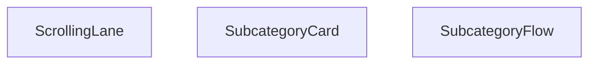

## Genel Bakış
Bu React modülü, VentHub HVAC platformunda ana kategorilere bağlı alt kategorileri etkileşimli bir akış halinde kullanıcıya sunmak üzere geliştirilmiştir. Modül, alt kategorileri düzenleyip görüntülemekten sorumlu üç temel bileşeni barındırarak kullanıcıların ilgili kategorilere kolayca erişmesini sağlar.

## Fonksiyon Grupları
### Ana Akış Sarmalayıcı Bileşeni
Tüm alt kategori akışının temel giriş noktası olarak çalışan bu grup, akışın genel yapılandırmasını ve başlık gibi varsayılan ayarlarını yönetir. Tüm alt bileşenleri bir araya getirerek tek bir bütün halinde kullanıcıya sunulacak hale getirir.
- SubcategoryFlow

### Alt Görsel ve Etkileşim Bileşenleri
Ana akış içinde kullanılan, tekil alt kategorileri temsil eden kartları ve bu kartları kaydırılabilir bir sıraya dizen kanalı barındıran gruptur. Kullanıcı deneyimini iyileştirmek için kaydırma yönü ve hızı gibi ayarları yapılandırmaya olanak tanır.
- SubcategoryCard, ScrollingLane

---

## AXIOMS – Mimari Varsayımlar
Bu modül, ana kategorilere bağlı alt kategorileri kaydırılabilir bir UI akışı olarak sunan React bileşenler bütünüdür, tüm alt bileşenlerin sorunsuz çalışması için zorunlu prop'ların doğru türde ve tanımlı olması gereklidir.

[Aksiyom 1]: Eğer ScrollingLane bileşenine iletilmesi zorunlu olan subcategories (DomainCategory tipinde dizi) prop'u tanımlı değilse, hiçbir alt kategori kartı render edilemez, kaydırma işlevi çalışmaz.
[Aksiyom 2]: Eğer ScrollingLane ve SubcategoryCard bileşenlerine iletilmesi zorunlu olan parentSlug string prop'u tanımlı değilse, alt kategorilerin ana kategorilerle olan ilişkisi kurulamaz, bileşen içi yönlendirmeler hatalı çalışır.
[Aksiyom 3]: Eğer SubcategoryCard bileşenine iletilmesi zorunlu olan subcategory nesnesi tanımlı değilse, ilgili alt kategori kartı boş olarak veya hata fırlatarak render edilir.
[Aksiyom 4]: Eğer ScrollingLane bileşenine iletilen direction opsiyonel prop'u 'left' ya da 'right' dışında bir değer alırsa, kaydırma yönü tanımlanamaz, bileşen beklenmedik şekilde davranır.
[Aksiyom 5]: Eğer ScrollingLane bileşenine iletilen speed opsiyonel prop'u sıfırdan küçük veya sıfıra eşit bir sayısal değer alırsa, varsayılan 25 birimlik otomatik kaydırma işlevi devre dışı kalır veya beklenmedik şekilde çalışır.

---

## FONKSIYON DETAYLARI

### SubcategoryCard
**Ne yapar**: Tek bir alt kategori bilgisini kart formatında kullanıcıya sunan React bileşenidir. Bağlı olduğu ana kategorinin slug değeri ile birlikte alt kategorinin gezilebilmesi için gerekli navigasyon altyapısını sağlar. Kullanıcı arayüzünde tekil alt kategori öğelerinin tutarlı bir şekilde gösterilmesini sağlar.
**Nasıl yapar**: Aldığı alt kategori nesnesi ve ana kategori slug değerini kullanarak kendi içindeki arayüzü yapılandırır. Alt kategorinin isim, görsel ve ilgili diğer temel bilgilerini kart üzerinde sergilerken, parentSlug değerini kullanarak alt kategoriye yönlendirme yapacak rotaları oluşturur. Tüm alt kategori kartlarının aynı tasarım dilinde olmasını tek merkezden sağlar.
**Parametreler**:
- subcategory: SubcategoryCardProps içinde tanımlı tip — Kart üzerinde gösterilecek alt kategorinin tüm metaverilerini içeren nesnedir, alt kategorinin kimliği, ismi, görseli ve ilgili diğer alanlarını barındırır.
- parentSlug: string — Alt kategorinin ait olduğu ana kategorinin URL dostu benzersiz kimliğidir, navigasyon rotalarının oluşturulması sırasında kullanılır.
**Dönüş**: Belirtilmiş resmi bir dönüş tipi paylaşılmamıştır, React bileşeni olarak ekranda gösterilecek JSX arayüzünü üretir.

### ScrollingLane
**Ne yapar**: Birden fazla alt kategori öğesini kaydırılabilir bir yatay şerit içinde sunan React bileşenidir. Kullanıcıların çok sayıda alt kategori arasında kolayca gezinebilmesini sağlar, kaydırma yönü ve hızı gibi özellikler isteğe bağlı olarak özelleştirilebilir. Genellikle ekran alanını verimli kullanmak için yatay kaydırılabilir liste ihtiyacını karşılar.
**Nasıl yapar**: Aldığı alt kategori dizisindeki her bir öğe için SubcategoryCard bileşenini çağırarak şerit içinde sırayla listeler. Tanımlanan kaydırma yönü ve hız değerlerine göre içindeki kaydırma mantığını çalıştırır, hem otomatik kaydırma hem de kullanıcı sürüklemesi ile kaydırma desteğini sağlar. Tüm alt kategori kartlarına parentSlug değerini ileterek her karttaki navigasyon bağlantılarının doğru çalışmasını garanti eder.
**Parametreler**:
- subcategories: DomainCategory[] — Şerit içinde gösterilecek tüm alt kategorilerin metaverilerini içeren nesne dizisidir, listedeki her öğe tek bir alt kategoriyi temsil eder.
- parentSlug: string — Tüm alt kategorilerin ait olduğu ortak ana kategorinin URL dostu benzersiz kimliğidir, alt kategori kartlarındaki navigasyon rotalarının oluşturulmasında kullanılır.
- direction?: 'left' | 'right' — Kaydırma şeridinin hareket yönünü belirten isteğe bağlı parametredir, varsayılan değeri 'left' olarak atanmıştır, istenirse sağa doğru kaydırma ayarlanabilir.
- speed?: number — Kaydırma hareketinin hızını belirten isteğe bağlı sayısal parametredir, varsayılan değeri 25 olarak tanımlanmıştır, ihtiyaca göre hız ayarı yapılabilir.
**Dönüş**: Belirtilmiş resmi bir dönüş tipi paylaşılmamıştır, React bileşeni olarak kaydırılabilir şerit arayüzünü JSX formatında üretir.

### SubcategoryFlow
**Ne yapar**: Tüm alt kategori akışını bir arada yöneten ana kapsayıcı React bileşenidir. Altında yer alan ScrollingLane ve SubcategoryCard gibi alt bileşenleri birleştirerek bütüncül bir alt kategori listeleme arayüzü sunar. Bölüm başlığının özelleştirilebilmesini sağlayarak farklı kullanım senaryolarına uyum sağlar.
**Nasıl yapar**: Varsayılan olarak 'Alt Kategoriler' olarak tanımlanan bölüm başlığını alır, arayüzünün üst kısmında bu başlığı gösterir. Başlığın hemen altına ScrollingLane bileşenini yerleştirerek tüm alt kategorilerin kaydırılabilir bir şerit içinde sunulmasını sağlar. Tüm alt kategori akışının genel düzenini, stilini ve işlevselliğini tek merkezden yöneterek tutarlılık sağlar.
**Parametreler**:
- title?: string — Alt kategori akış bölümünün en üstünde gösterilecek başlığı belirten isteğe bağlı parametredir, varsayılan değeri 'Alt Kategoriler' olarak atanmıştır, istenirse özel bir başlık tanımlanabilir.
**Dönüş**: SubcategoryFlowProps tipinde prop alan bir React Fonksiyonel Bileşeni (React.FC) döndürür. Bu dönen bileşen, tüm alt kategori akış arayüzünü ekranda render ederek kullanıcıya sunar.

---

## INTERFACES

### SubcategoryCardProps
- `subcategory: DomainCategory`
- `parentSlug: string`

### SubcategoryFlowProps
- `title?: string`

---

## AST POINTERS

### [N1_NASIL] AST Pointer: C:\Users\alize\venthub-hvac\src\components\SubcategoryFlow.tsx::SubcategoryCard
- **params**: subcategory, parentSlug
- **ic_degiskenler**:
  - `subcategory` — parametreden gelen alt kategori DomainCategory nesnesi, kart içeriğini oluşturmak için kullanılır
  - `parentSlug` — parametreden gelen üst kategorinin URL slug değeri, kategori linki oluşturulurken kullanılır
  - `Routes.category` — kategori detay sayfası için URL üreten rota fonksiyonu, Link bileşeninin href değeri için çağrılır
  - `getCategoryDisplayName` — kategori nesnesinden kullanıcıya gösterilecek okunabilir isim çıkaran yardımcı fonksiyon, ikonun ilk harfi ve kart başlığı için kullanılır
- **Dönüş**: JSX React elementi, alt kategori kartı çıktısı

---

### [N2_NASIL] AST Pointer: C:\Users\alize\venthub-hvac\src\components\SubcategoryFlow.tsx::ScrollingLane
- **params**: subcategories, parentSlug, direction?, speed?
- **ic_degiskenler**:
  - `subcategories` — parametreden gelen şerit içine yerleştirilecek tüm alt kategoriler DomainCategory dizisi
  - `parentSlug` — parametreden gelen üst kategori URL slug değeri, şerit içindeki kartların linkleri için kullanılır
  - `direction` — kaydırma yönü, varsayılan 'left', animasyon sınıfını belirlemek için kullanılır
  - `speed` — kaydırma animasyonunun saniye cinsinden süresi, varsayılan 25, inline style'a animasyon süresi olarak atanır
  - `items` — 3 kere kopyalanan alt kategori listesi, kesintisiz döngüsel kaydırma animasyonu için oluşturulur
  - `subcat` — map fonksiyonunda dönen mevcut alt kategori nesnesi, SubcategoryCard'a aktarılır
  - `idx` — map fonksiyonunda dönen mevcut öğe indeksi, benzersiz key değeri oluşturmak için kullanılır
  - `SubcategoryCard` — her alt kategori için render edilen kart bileşeni, şerit içindeki her öğe için çağrılır
- **Dönüş**: JSX React elementi, kaydırılabilir alt kategori şeridi çıktısı

---

### [N3_NASIL] AST Pointer: C:\Users\alize\venthub-hvac\src\components\SubcategoryFlow.tsx::SubcategoryFlow
- **params**: title?
- **ic_degiskenler**:
  - `title` — bölüm başlığı, varsayılan 'Alt Kategoriler', section başlığında kullanıcıya gösterilir
  - `useCategories` — kategori bağlamını sağlayan custom hook, tüm kategoriler ve yükleme durumu almak için çağrılır
  - `allCategories` — CategoryContext'ten gelen tüm DomainCategory nesneleri listesi, alt/ana kategori ayrımı yapmak için kullanılır
  - `loading` — kategorilerin yüklenme durumu, yükleniyorsa skeleton ekranı göstermek için kullanılır
  - `useMemo` — React memoization hook'u, hesaplamaları önbelleğe alır, alt kategori işleme ve şerit ayırma işlemleri için kullanılır
  - `subcategoriesWithParent` — üst kategorileri ile eşleştirilmiş tüm geçerli alt kategoriler listesi, kaydırma şeritleri oluşturmak için kullanılır
  - `mainCategories` — allCategories'den filtrelenen ana kategoriler (parent_id'si olmayanlar), üst kategori eşleştirmesi için kullanılır
  - `subCategories` — allCategories'den filtrelenen alt kategoriler (parent_id'si olanlar), işlenmek üzere ayrılır
  - `mainCategoryMap` — ana kategorileri id'leri ile eşleyen Map nesnesi, her alt kategorinin üst kategorisini hızlıca bulmak için kullanılır
  - `sub` — map fonksiyonunda dönen mevcut alt kategori nesnesi, üst kategori ile eşleştirmek için kullanılır
  - `parent` — mainCategoryMap'ten alınan mevcut alt kategorinin üst kategori nesnesi, parentSlug oluşturmak için kullanılır
  - `lane1` — çift indeksli alt kategorilerden oluşan ilk kaydırma şeridi listesi, ilk ScrollingLane'e aktarılır
  - `lane2` — tek indeksli alt kategorilerden oluşan ikinci kaydırma şeridi listesi, ikinci ScrollingLane'e aktarılır
  - `lane1[0]` — ilk şeritin ilk öğesi, şeritin ortak parentSlug değerini almak için kullanılır
  - `lane2[0]` — ikinci şeritin ilk öğesi, şeritin ortak parentSlug değerini almak için kullanılır
  - `ScrollingLane` — kaydırılabilir alt kategori şeridi bileşeni, bölüm içinde iki adet olarak render edilir
- **Dönüş**: JSX React elementi, tüm alt kategori akışı bölümünün çıktısı, yetersiz alt kategori varsa null dönebilir

---

## MERMAID CALL GRAPH

## NODE ID STANDARD

  file: src\components\SubcategoryFlow.tsx
  function: src\components\SubcategoryFlow.tsx::SubcategoryCard
  function: src\components\SubcategoryFlow.tsx::ScrollingLane
  function: src\components\SubcategoryFlow.tsx::SubcategoryFlow

---

## DISA AKTARILANLAR (EXPORTS)
  export: ScrollingLane
  export: SubcategoryCard
  export: SubcategoryFlow

---

## STİL TOKENLERİ

### Arbitrary Değerler (token'a geçirilmemiş)
Yok — tüm stiller token'a geçirilmiş. ✅

### Kullanılan Token'lar (zaten token'a geçirilmiş)
- (yok)

### Tailwind Sınıf Özeti
- **Renkler:** `bg-gradient-to-br`, `bg-gradient-to-l`, `bg-gradient-to-r`, `bg-gray-50`, `bg-white`, `border-gray-200`, `from-blue-50`, `from-white`, `sm:text-xl`, `text-blue-500`, `text-blue-600`, `text-center`, `text-gray-800`, `text-lg`, `text-sm`
- **Layout:** `absolute`, `bottom-3`, `flex`, `flex-shrink-0`, `from-blue-50`, `from-white`, `gap-3`, `group-hover:from-blue-100`, `group-hover:opacity-100`, `group-hover:text-blue-700`, `group-hover:to-blue-200`, `h-10`, `h-24`, `hover:shadow-md`, `items-center`
- **Responsive:** `lg:`, `md:`, `sm:` prefix kullanımları
