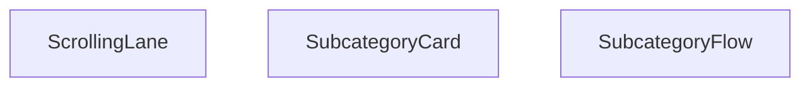

## Genel Bakış
VentHub HVAC platformunda, ana kategorilere bağlı alt kategorileri etkileşimli bir kaydırılabilir akış olarak sunan React modülüdür. Modül, alt kategorileri bireysel kartlar halinde görselleştirir ve bu kartları belirli bir yönde ve hızda kaydırarak kullanıcıların ilgili ürünlere kolayca göz atmasını sağlar. Üst düzey yapılandırma ve başlık gibi genel ayarları merkezi bir bileşen üzerinden yönetir.

## Fonksiyon Grupları
### Akış Yapısı ve Konfigürasyonu
Modülün üst düzey giriş bileşeni olarak, tüm akışın başlığını ve yapılandırmasını yönetir. Diğer alt bileşenleri bir araya getirerek veri akışını ve genel görünümü koordine eder.
- SubcategoryFlow

### Görsel Kartlar ve Kaydırma Mekanizması
Alt kategorilerin bireysel kartlar olarak görselleştirilmesini ve bu kartların otomatik kaydırılan bir şerit içinde sunulmasını sağlar. Kaydırma yönü ve hızı gibi dinamik parametrelerle kullanıcı deneyimini özelleştirir.
- SubcategoryCard, ScrollingLane

---

## AXIOMS – Mimari Varsayımlar

Bu modül, bir kart gösterim sistemi ve üzerinde kaydırma sağlayan bir lane yapısından oluşur. Aşağıdaki varsayımlar fonksiyon imzalarından türetilmiştir.

[Aksiyom 1]: Eğer `SubcategoryCard` bileşenine `subcategory` prop'u sağlanmazsa, kart doğru bilgi gösteremez.

[Aksiyom 2]: Eğer `SubcategoryCard` bileşenine `parentSlug` prop'u sağlanmazsa, üst kategori referansı kaybolur ve navigasyon tutarsız olur.

[Aksiyom 3]: Eğer `ScrollingLane` bileşenine `subcategories` prop'u (`DomainCategory[]` dizisi) sağlanmazsa, kaydırılacak kart oluşturulamaz.

[Aksiyom 4]: Eğer `ScrollingLane` bileşenine `parentSlug` prop'u sağlanmazsa, lane içindeki kartlar üst kategori bağlamından kopuk kalır.

[Aksiyom 5]: Eğer `ScrollingLane` bileşenine `direction` prop'u sağlanmazsa, varsayılan olarak `'left'` yönünde kaydırma uygulanır.

[Aksiyom 6]: Eğer `ScrollingLane` bileşenine `speed` prop'u sağlanmazsa, varsayılan olarak `25` hız değerinde kaydırma uygulanır.

[Aksiyom 7]: Eğer `SubcategoryFlow` bileşenine `title` prop'u sağlanmazsa, başlık olarak `'Alt Kategoriler'` metni kullanılır.

[Aksiyom 8]: Eğer `ScrollingLane`'e geçilen `direction` değeri `'left'` veya `'right'` değerlerinden biri değilse, kaydırma yönü tanımsız olur.

---

## FONKSİYON DETAYLARI

### SubcategoryCard

**Ne yapar**: Bu bileşen, bir alt kategoriyi kart olarak görsel şekilde sunar. Kullanıcı bu karta tıkladığında ilgili alt kategorinin detay sayfasına yönlendirilir. Kart içinde kategorinin baş harfi bir daire içinde gösterilir ve kategorinin tam adı altında yer alır.

**Nasıl yapar**: Bileşen, `useLocalizedRoutes` hook'unu kullanarak yerelleştirilmiş rota nesnesini alır ve `Routes.category` metoduyla parent slug ile alt kategori slug'ını birleştirerek dinamik bir URL oluşturur. Oluşturulan URL, Next.js'in `Link` bileşeni ile sarmalanır. Kartın görsel tasarımı tamamen Tailwind CSS sınıflarıyla yapılır; hover durumunda ölçeklenme (`hover:scale-105`), gölge artışı ve kenarlık rengi değişimi ile interaktif bir deneyim sunulur. Kategorinin.display adının ilk harfi, gradient arka planlı dairesel bir ikon alanında render edilir. `getCategoryDisplayName` yardımcı fonksiyonu ile kategorinin kullanıcıya gösterilecek metin adı alınır. Kartın sağ alt köşesinde, fare üzerine gelindiğinde beliren bir ok ikonu ile navigasyon ipucu verilir.

**Parametreler**:
- `subcategory` — `Subcategory` tipinde (SubcategoryCardProps interface'i içinden) — Görsel olarak sunulacak alt kategori nesnesi. İçerisinde `slug` gibi rota oluşturmada kullanılan ve `getCategoryDisplayName` fonksiyonuna gerekli bilgileri sağlayan alanları barındırır.
- `parentSlug` — `string` tipinde (SubcategoryCardProps interface'i içinden) — Alt kategorinin bağlı olduğu üst kategorinin URL parçacığı. Rota oluştururken `Routes.category` metoduna birinci parametre olarak geçilir ve tam navigasyon yolunun bir parçası olur.

**Dönüş**: `JSX.Element` — Bileşen, bir `Link` içinde sarılmış bir `div` yapısını döndürür. Bu yapı, tıklanabilir bir kart layout'u oluşturur ve alt kategoriyi temsil eden görsel kartı render eder.

### ScrollingLane
**Ne yapar**: Birden fazla alt kategori öğesini kaydırılabilir bir yatay şerit içinde sunan React bileşenidir. Kullanıcıların çok sayıda alt kategori arasında kolayca gezinebilmesini sağlar, kaydırma yönü ve hızı gibi özellikler isteğe bağlı olarak özelleştirilebilir. Genellikle ekran alanını verimli kullanmak için yatay kaydırılabilir liste ihtiyacını karşılar.
**Nasıl yapar**: Aldığı alt kategori dizisindeki her bir öğe için SubcategoryCard bileşenini çağırarak şerit içinde sırayla listeler. Tanımlanan kaydırma yönü ve hız değerlerine göre içindeki kaydırma mantığını çalıştırır, hem otomatik kaydırma hem de kullanıcı sürüklemesi ile kaydırma desteğini sağlar. Tüm alt kategori kartlarına parentSlug değerini ileterek her karttaki navigasyon bağlantılarının doğru çalışmasını garanti eder.
**Parametreler**:
- subcategories: DomainCategory[] — Şerit içinde gösterilecek tüm alt kategorilerin metaverilerini içeren nesne dizisidir, listedeki her öğe tek bir alt kategoriyi temsil eder.
- parentSlug: string — Tüm alt kategorilerin ait olduğu ortak ana kategorinin URL dostu benzersiz kimliğidir, alt kategori kartlarındaki navigasyon rotalarının oluşturulmasında kullanılır.
- direction?: 'left' | 'right' — Kaydırma şeridinin hareket yönünü belirten isteğe bağlı parametredir, varsayılan değeri 'left' olarak atanmıştır, istenirse sağa doğru kaydırma ayarlanabilir.
- speed?: number — Kaydırma hareketinin hızını belirten isteğe bağlı sayısal parametredir, varsayılan değeri 25 olarak tanımlanmıştır, ihtiyaca göre hız ayarı yapılabilir.
**Dönüş**: Belirtilmiş resmi bir dönüş tipi paylaşılmamıştır, React bileşeni olarak kaydırılabilir şerit arayüzünü JSX formatında üretir.

### SubcategoryFlow
**Ne yapar**: Tüm alt kategori akışını bir arada yöneten ana kapsayıcı React bileşenidir. Altında yer alan ScrollingLane ve SubcategoryCard gibi alt bileşenleri birleştirerek bütüncül bir alt kategori listeleme arayüzü sunar. Bölüm başlığının özelleştirilebilmesini sağlayarak farklı kullanım senaryolarına uyum sağlar.
**Nasıl yapar**: Varsayılan olarak 'Alt Kategoriler' olarak tanımlanan bölüm başlığını alır, arayüzünün üst kısmında bu başlığı gösterir. Başlığın hemen altına ScrollingLane bileşenini yerleştirerek tüm alt kategorilerin kaydırılabilir bir şerit içinde sunulmasını sağlar. Tüm alt kategori akışının genel düzenini, stilini ve işlevselliğini tek merkezden yöneterek tutarlılık sağlar.
**Parametreler**:
- title?: string — Alt kategori akış bölümünün en üstünde gösterilecek başlığı belirten isteğe bağlı parametredir, varsayılan değeri 'Alt Kategoriler' olarak atanmıştır, istenirse özel bir başlık tanımlanabilir.
**Dönüş**: SubcategoryFlowProps tipinde prop alan bir React Fonksiyonel Bileşeni (React.FC) döndürür. Bu dönen bileşen, tüm alt kategori akış arayüzünü ekranda render ederek kullanıcıya sunar.

---

## İTHALATLAR (IMPORTS)
- import: ../contexts/CategoryContext::useCategories
- import: ../hooks/useLocalizedRoutes::useLocalizedRoutes
- import: ../lib/type-converters::DomainCategory
- import: ../utils/categoryHelpers::getCategoryDisplayName
- import: next/link::Link
- import: react::React
- import: react::useMemo

---

## INTERFACES

### SubcategoryCardProps
- `subcategory: DomainCategory`
- `parentSlug: string`

### SubcategoryFlowProps
- `title?: string`

---

## AST POINTERS

### [N1_NASIL] AST Pointer: SubcategoryFlow.tsx::SubcategoryCard
- **params**:
  - `subcategory` — Tek bir alt kategorinin DomainCategory verisi, kart üzerinde ad ve ikon bilgisi olarak kullanılır
  - `parentSlug` — Üst kategorinin URL slug'ı, Link href oluşturmak için kullanılır
- **ic_degiskenler**:
  - `Routes` — `useLocalizedRoutes()` hook çağrısından dönen lokalize rota yardımcı nesnesi; `Routes.category(parentSlug, subcategory.slug)` ile Link href'i üretilir
- **Dönüş**: yok (JSX döner — Link > div yapısı içinde kategori kartı render eder; ikon dairesi, başlık ve hover ok göstergesi)

---

### [N2_NASIL] AST Pointer: SubcategoryFlow.tsx::ScrollingLane
- **params**:
  - `subcategories` — `DomainCategory[]` türünde alt kategori dizisi, lane içindeki kartlar olarak render edilir
  - `parentSlug` — Üst kategorinin URL slug'ı, her SubcategoryCard'a prop olarak iletilir
  - `direction` — `'left'` veya `'right'` (varsayılan `'left'`); hangi yönde kaydırma animasyonu uygulanacağını belirler
  - `speed` — `number` türünde (varsayılan `25`); kaydırma animasyon süresini saniye cinsinden belirler
- **ic_degiskenler**:
  - `items` — `subcategories` dizisinin 3 kez tekrarıyla oluşturulur (`[...subcategories, ...subcategories, ...subcategories]`); sonsuz döngü kaydırma efekti için seamless loop sağlar
- **Dönüş**: yok (JSX döner — overflow-hidden container içinde `items.map()` ile SubcategoryCard bileşenlerini render eder; animasyon sınıfı ve süresi direction/speed'e göre ayarlanır)

---

### [N3_NASIL] AST Pointer: SubcategoryFlow.tsx::SubcategoryFlow
- **params**:
  - `title` — `string` (varsayılan `'Alt Kategoriler'`); bölüm başlığında gösterilecek metin
- **ic_degiskenler**:
  - `allCategories` — `useCategories()` hook'undan `{ categories, loading }` destructuring ile alınan tüm kategoriler dizisi; alt ve üst kategorileri ayırmak için kullanılır
  - `loading` — `useCategories()` hook'undan gelen boolean; true ise skeleton/pulse placeholder render edilir
  - `subcategoriesWithParent` — `useMemo` ile hesaplanan `{ subcategory: DomainCategory, parentSlug: string }[]` dizisi; parent_id'si olmayanları (main) Map'e koyup, parent_id'si olanları (sub) parent slug eşleştirmesiyle birleştirir, `parentSlug` boş olanları ve kendi slug'ını parent slug olarak kullananları filtreler
  - `mainCategories` — `subcategoriesWithParent` memo içinde: `allCategories.filter(c => !c.parent_id)` ile elde edilen üst kategoriler dizisi
  - `subCategories` — `subcategoriesWithParent` memo içinde: `allCategories.filter(c => !!c.parent_id)` ile elde edilen alt kategoriler dizisi
  - `mainCategoryMap` — `mainCategories` dizisinden oluşturulan `Map<string|number, DomainCategory>`; `id` -> kategori eşlemesi yaparak parent slug lookup'ını hızlandırır
  - `lane1` — `useMemo` ile `subcategoriesWithParent`'ın çift indekslilerini (`i % 2 === 0`) içeren ilk şerit dizisi
  - `lane2` — `useMemo` ile `subcategoriesWithParent`'ın tek indekslilerini (`i % 2 === 1`) içeren ikinci şerit dizisi
- **Dönüş**: `React.FC<SubcategoryFlowProps>` — loading ise skeleton pulse div döner; `subcategoriesWithParent.length < 4` ise `null` döner (yeterli alt kategori yoksa render etmez); aksi halde `<style>` (inline CSS keyframe animasyonları: `subcat-scroll-left`, `subcat-scroll-right`, hover'da `animation-play-state: paused`) ve `<section>` (başlık + gradient overlay'ler + iki adet `ScrollingLane` bileşeni, lane2 varsa ikinci lane de eklenir) JSX'i döner

---

## MERMAID CALL GRAPH

## NODE ID STANDARD

  file: src\components\SubcategoryFlow.tsx
  function: src\components\SubcategoryFlow.tsx::SubcategoryCard
  function: src\components\SubcategoryFlow.tsx::ScrollingLane
  function: src\components\SubcategoryFlow.tsx::SubcategoryFlow

---

## DISA AKTARILANLAR (EXPORTS)
  export: ScrollingLane
  export: SubcategoryCard
  export: SubcategoryFlow

---

## STİL TOKENLERİ

### Arbitrary Değerler (token'a geçirilmemiş)
Yok — tüm stiller token'a geçirilmiş. ✅

### Kullanılan Token'lar (zaten token'a geçirilmiş)
- (yok)

### Tailwind Sınıf Özeti
- **Renkler:** `bg-gradient-to-br`, `bg-gradient-to-l`, `bg-gradient-to-r`, `bg-gray-50`, `bg-white`, `border-gray-200`, `from-blue-50`, `from-white`, `group-hover:from-blue-100`, `group-hover:text-blue-700`, `group-hover:to-blue-200`, `hover:border-blue-300`, `sm:text-xl`, `text-blue-500`, `text-blue-600`
- **Layout:** `absolute`, `bottom-3`, `flex`, `flex-shrink-0`, `from-blue-50`, `from-white`, `gap-3`, `group-hover:from-blue-100`, `h-10`, `h-24`, `hover:shadow-md`, `items-center`, `justify-center`, `left-0`, `left-1/2`
- **Varyant/Responsive:** `:`, `group-hover:`, `hover:`, `lg:`, `md:`, `sm:` önekleri
- **Yardımcı Sınıflar:** `${direction`, `-translate-x-1/2`, `:`, `===`, `animate-pulse`, `animate-subcat-scroll-left`, `animate-subcat-scroll-right`, `border`, `duration-300`, `font-bold`, `font-semibold`, `group`, `group-hover:opacity-100`, `hover:scale-105`, `inset-y-0`