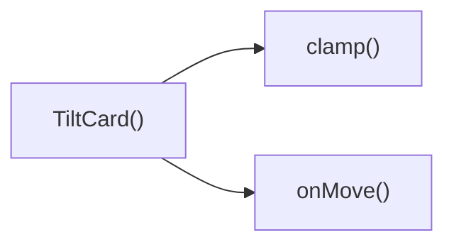

## Genel Bakış
Bu modül, React tabanlı VentHub HVAC projesinde kullanılan, fare etkileşimleriyle 3D eğilme (tilt) efekti sunan TiltCard UI bileşenini barındırır. Kart bileşeni, içerdiği herhangi bir içeriği sararak kullanıcı etkileşimlerine duyarlı modern bir görsel deneyim sunar, maksimum eğilme açısı gibi temel ayarlar özelleştirilebilir.

## Fonksiyon Grupları
### Ana Bileşen
TiltCard'ın temel yapısını oluşturur, gelen özelleştirme parametrelerini alır ve eğilme efektinin çalışması için gerekli ortamı hazırlar.
- TiltCard

### Yardımcı Sınırlama Fonksiyonu
Eğilme açısı gibi sayısal değerleri belirlenen minimum ve maksimum aralıkta tutmak için kullanılır, aşırı değerlerin efektin bozulmasına neden olmasını engeller.
- clamp

### Fare Olayı İşleyicileri
Kullanıcının kart üzerindeki fare hareketlerini takip eder; fare kart üzerine girdiğinde, kart üzerinde hareket ettiğinde ve karttan ayrıldığında tetiklenerek 3D eğilme efektinin anlık olarak çalışmasını sağlar.
- onMove, onEnter, onLeave

---

## AXIOMS – Mimari Varsayımlar
Bu client tarafında çalışan UI bileşeni, fare etkileşimleriyle kartın belirtilen maksimum açıda eğilmesini sağlar, doğru çalışması için tarayıcı DOM ortamının ve içerdiği olay işleyicilerinin sorunsuz çalışması zorunludur.

[Aksiyom 1]: Eğer sayısal değerleri sınırlamak için kullanılan clamp() fonksiyonu çalışmıyorsa, kartın eğilme açısı tanımlı maxTilt sınırını aşar, görsel bozulmalar meydana gelir.
[Aksiyom 2]: Eğer tarayıcı DOM'ında fare hareketi, fare öğe üzerine girme ve fare öğeden çıkma olayları tetiklenemiyorsa, TiltCard bileşeninin eğilme etkisi hiç devreye girmez, statik bir kart olarak kalır.
[Aksiyom 3]: Eğer TiltCard bileşenine aktarılan maxTilt parametresi geçerli bir sayısal değer değilse, eğilme açısı hesaplamaları başarısız olur, kartın konumunda görsel hatalar oluşur.
[Aksiyom 4]: Eğer TiltCard bileşenine children prop'u aktarılmazsa, kart içinde hiçbir içerik görüntülenmez, boş bir eğilebilir alan ortaya çıkar.
[Aksiyom 5]: Eğer onMove(), onEnter() ve onLeave() olay işleyicileri DOM olaylarına bağlanamıyorsa, fare etkileşimleri algılanamaz, eğilme işlevi tamamen devre dışı kalır.

---

## FONKSIYON DETAYLARI

### clamp
**Ne yapar**: Girdi olarak alınan sayısal bir değeri, belirtilen minimum ve maksimum sayısal sınırlar arasına sığdırmak üzere tasarlanmış yardımcı bir fonksiyondur. Değerin sınırların dışına çıkmasını engelleyerek tüm hesaplamalarda tutarlı bir aralıkta kalmasını sağlar.
**Nasıl yapar**: Gelen orijinal değeri önce minimum sınırla, sonra maksimum sınırla karşılaştırır. Eğer değer minimum değerden küçükse minimum değeri, maksimum değerden büyükse maksimum değeri kullanır, değer aralıktaysa orijinal değerini korur. Bu işlemi tüm hesaplamalarda sınır kontrolü sağlamak için kullanır.
**Parametreler**:
- name: v — type: number — Sınırlandırılmak istenen orijinal sayısal değer, herhangi bir sayısal giriş olabilir.
- name: min — type: number — Değerin alabileceği en düşük kabul edilebilir sınır değeri.
- name: max — type: number — Değerin alabileceği en yüksek kabul edilebilir sınır değeri.
**Dönüş**: Kayıtlarda dönüş tipi void veya bilinmiyor olarak işaretlenmiştir, işlevi gereği aralığa sığdırılmış sayısal değeri döndürmesi beklenir.

### TiltCard
**Ne yapar**: Fare hareketlerine göre eğme (tilt) efekti uygulayan, tekrarlanabilir bir React bileşenidir. İçerisindeki tüm çocuk içerikleri sarmalayarak, kullanıcı kartla etkileşime girdiğinde 3D benzeri eğim efekti sunar. Maksimum eğme açısı dışarıdan yapılandırılabilir, varsayılan bir değerle kullanıma hazırdır.
**Nasıl yapar**: Kendi bünyesinde fare olaylarını izleyen onMove, onEnter, onLeave işleyicilerini barındırır, bu işleyicileri ana kapsayıcı div elementine bağlar. Eğme hesaplamalarında clamp fonksiyonunu kullanarak açının sınırları aşmasını engeller, aldığı maxTilt değerini tüm eğme hesaplamalarında temel alır. İçerisine gelen children prop'unu kendi içindeki kapsayıcıda render ederek efekti içeriğe uygular.
**Parametreler**:
- name: children — type: React.ReactNode — Bileşen içerisinde gösterilecek, eğme efekti uygulanacak tüm içerik, her türlü React tarafından desteklenen iç öğe olabilir.
- name: maxTilt — type: number — Kartın uygulayabileceği maksimum eğme açısı, isteğe bağlı olarak dışarıdan değer geçirilebilir, varsayılan olarak 18 derece olarak ayarlanmıştır.
**Dönüş**: React.FC<React.PropsWithChildren<{ maxTilt?: number }>> tipinde bir React bileşeni döndürür, çocuklu yapıyı destekler, maxTilt prop'unu opsiyonel olarak kabul eden tür yapısına sahiptir.

### onMove
**Ne yapar**: TiltCard bileşeninin alanı üzerinde fare hareket ettiğinde tetiklenen olay işleyicisidir, anlık fare konumuna göre kartın eğme miktarını hesaplayıp günceller. Kullanıcının fare hareketlerini eğme açısına dönüştürerek akıcı bir 3D efekti sağlar.
**Nasıl yapar**: Fare olayından gelen konum verilerini alır, TiltCard'ın boyutlarını ve sayfa üzerindeki konumunu hesaplar, elde edilen koordinatları eğme açısına çevirir. Hesaplanan açının maxTilt sınırını aşmasını clamp fonksiyonuyla engeller, sürekli güncellenen değerle kartın eğimini akıcı bir şekilde değiştirir.
**Parametreler**:
- name: e — type: React.MouseEvent<HTMLDivElement> — Tetiklenen fare hareketi olayının tüm detaylarını içeren nesne, fare konumu, hedef element gibi tüm gerekli verilere erişim sağlar.
**Dönüş**: HTMLDivElement elementleri için uyumlu React.MouseEventHandler<HTMLDivElement> tipinde bir olay işleyicisi döndürür, fare hareketi olaylarını yakalayıp işlemek üzere yapılandırılmıştır.

### onEnter
**Ne yapar**: TiltCard bileşeninin kapsama alanına fare ilk girdiğinde tetiklenen olay işleyicisidir, eğme efektinin başlatılmasını ve gerekli tüm başlangıç durumlarının ayarlanmasını sağlar. Kullanıcının kartla etkileşime geçtiğini algılayarak efekti aktif hale getirir.
**Nasıl yapar**: Fare kartın alanına girdiğinde animasyon geçişlerini aktif eder, eğme hesaplamaları için gereken ilk konum ve durum değerlerini ayarlar, olası gecikmeleri önlemek için gerekli ön yüklemeleri yapar, kullanıcının ilk etkileşimini algılayarak efektin sorunsuz başlamasını sağlar.
**Parametreler**:
- name: e — type: React.MouseEvent<HTMLDivElement> — Fare giriş olayının tüm detaylarını içeren, hedef element ve olay metriklerini barındıran React fare olay nesnesi.
**Dönüş**: HTMLDivElement elementleri için uyumlu React.MouseEventHandler<HTMLDivElement> tipinde bir olay işleyicisi döndürür, fare element alanına giriş olayını yakalamak üzere yapılandırılmıştır.

### onLeave
**Ne yapar**: TiltCard bileşeninin kapsama alanından fare çıkış yaptığında tetiklenen olay işleyicisidir, eğme efektinin sonlandırılıp kartın orijinal varsayılan konumuna dönmesini sağlar. Kullanıcının kartla etkileşimini bitirdiğini algılayarak tüm geçici durumları temizler.
**Nasıl yapar**: Fare kartın alanından çıktığında mevcut eğme açılarını sıfırlar, animasyonlu bir geçişle kartın orijinal konumuna dönmesini sağlar, etkileşim sırasında oluşturulan tüm geçici durum değerlerini temizler, bir sonraki etkileşime hazır hale getirir.
**Parametreler**: Herhangi bir harici parametre almaz, iç mantığında olay nesnesini kullanarak işlemlerini gerçekleştirir.
**Dönüş**: HTMLDivElement elementleri için uyumlu React.MouseEventHandler<HTMLDivElement> tipinde bir olay işleyicisi döndürür, fare element alanından çıkış olayını yakalamak üzere yapılandırılmıştır.

---

## AST POINTERS

### [N1_NASIL] AST Pointer: C:\Users\alize\venthub-hvac\src\components\TiltCard.tsx::clamp
- **params**: v: number, min: number, max: number
- **ic_degiskenler**: yok (sadece parametreler kullanılıyor)
- **Dönüş**: yok

### [N2_NASIL] AST Pointer: C:\Users\alize\venthub-hvac\src\components\TiltCard.tsx::TiltCard
- **params**: children, maxTilt?: number (varsayılan değer: 18)
- **ic_degiskenler**:
  - `wrapperRef` — HTMLDivElement tipinde ana sarmalayıcı div'e referans tutan React useRef nesnesi
  - `innerRef` — HTMLDivElement tipinde iç kart div'ine referans tutan React useRef nesnesi
  - `mounted` — Componentin DOM'a mount olup olmadığını takip eden boolean state değişkeni
  - `setMounted` — mounted state'ini güncellemek için kullanılan useState setter fonksiyonu
  - `hover` — Farenin kart üzerinde olup olmadığını takip eden boolean state değişkeni
  - `setHover` — hover state'ini güncellemek için kullanılan useState setter fonksiyonu
  - `supportsTilt` — Tarayıcının hassas imleç ve hover desteği olup olmadığını kontrol eden boolean değişken
  - `prefersReduced` — Kullanıcının azaltılmış hareket tercihinin aktif olup olmadığını kontrol eden boolean değişken
  - `shouldSkip` — Tilt efektini atlayıp basit sarmalayıcı döndürme kararını veren boolean değişken
  - `onMove` — Farenin kart üzerinde hareket etmesiyle tetiklenen React.MouseEventHandler fonksiyonu
  - `onEnter` — Farenin karta girmesiyle tetiklenen React.MouseEventHandler fonksiyonu
  - `onLeave` — Farenin karttan çıkmasıyla tetiklenen React.MouseEventHandler fonksiyonu
- **Dönüş**: React JSX elementi

### [N3_NASIL] AST Pointer: C:\Users\alize\venthub-hvac\src\components\TiltCard.tsx::onMove
- **params**: e: React.MouseEvent<HTMLDivElement>
- **ic_degiskenler**:
  - `container` — wrapperRef.current ile alınan ana sarmalayıcı div DOM elementi
  - `el` — innerRef.current ile alınan iç kart div DOM elementi
  - `rect` — container div'in ekran konum ve boyutlarını içeren DOMRect nesnesi
  - `x` — Fare konumunun container genişliği üzerinden normalize edilmiş 0-1 arası x koordinatı
  - `y` — Fare konumunun container yüksekliği üzerinden normalize edilmiş 0-1 arası y koordinatı
  - `rx` — Kartın 3D rotateX açısını hesaplayan sayısal değer
  - `ry` — Kartın 3D rotateY açısını hesaplayan sayısal değer
  - `sx` — Kart gölgesinin x ofsetini piksel cinsinden hesaplayan değer
  - `sy` — Kart gölgesinin y ofsetini piksel cinsinden hesaplayan değer
- **Dönüş**: yok (void)

### [N4_NASIL] AST Pointer: C:\Users\alize\venthub-hvac\src\components\TiltCard.tsx::onEnter
- **params**: e: React.MouseEvent<HTMLDivElement>
- **ic_degiskenler**:
  - `setHover` — Üst kapsamdaki hover state'ini true yapmak için kullanılan state setter
  - `onMove` — Fare karta girer girmez konum hesaplaması yapmak için çağrılan üst kapsamdaki onMove işleyicisi
- **Dönüş**: yok (void)

### [N5_NASIL] AST Pointer: C:\Users\alize\venthub-hvac\src\components\TiltCard.tsx::onLeave
- **params**: (kullanılan parametre yok)
- **ic_degiskenler**:
  - `setHover` — Üst kapsamdaki hover state'ini false yapmak için kullanılan state setter
  - `el` — innerRef.current ile alınan iç kart div DOM elementi
- **Dönüş**: yok (void)

---

## ÇAĞRI HARİTASI

### Disariya Cagrilar (Outgoing)
TiltCard() ana fonksiyonu, değerleri izin verilen aralıkta tutmak için clamp fonksiyonunu, kullanıcı hareketlerini yönetmek içinse onMove fonksiyonunu çağırır.

### Disaridan Cagrilanlar (Incoming)
Sağlanan veride bu modülü kullanan herhangi bir dış dosya veya fonksiyon bilgisi bulunmamaktadır.

### Ic Ice Fonksiyonlar (Nested)
Yok

---

## DOSYA-İÇİ ÇAĞRI GRAFİĞİ
  TiltCard() → clamp()
  TiltCard() → onMove()

---

## NODE ID STANDARD

  file: src\components\TiltCard.tsx
  function: src\components\TiltCard.tsx::clamp
  function: src\components\TiltCard.tsx::TiltCard
  function: src\components\TiltCard.tsx::onMove
  function: src\components\TiltCard.tsx::onEnter
  function: src\components\TiltCard.tsx::onLeave

---

## DISA AKTARILANLAR (EXPORTS)
  export: TiltCard
  export: clamp

---

## STİL TOKENLERİ

### Arbitrary Değerler (token'a geçirilmemiş)
Yok — tüm stiller token'a geçirilmiş. ✅

### Kullanılan Token'lar (zaten token'a geçirilmiş)
- (yok)

### Tailwind Sınıf Özeti
- **Renkler:** (yok)
- **Layout:** `absolute`, `group-hover:opacity-100`, `relative`
- **Responsive:** (yok)
