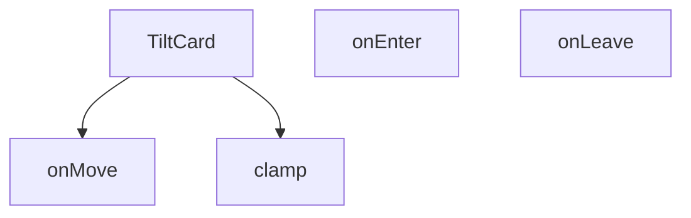

## Genel Bakış

TiltCard, fare hareketlerine tepki vererek kart benzeri bir bileşene üç boyutlu eğim efekti uygulayan bir React bileşenidir. Kullanıcının fare konumuna göre bileşenin X ve Y eksenlerinde belirli bir dereceye kadar (varsayılan 18) eğilmesini sağlar. Bu tür etkileşim, genellikle kart tabanlı arayüzlerde derinlik hissi ve görsel geri bildirim oluşturmak için kullanılır.

## Fonksiyon Grupları

### Yardımcı Fonksiyonlar
Sayısal değerlerin belirli bir aralıkta kalmasını sağlayan temel yardımcı işlemler.
- clamp

### Fare Olay İşleyicileri
Bileşen üzerindeki fare hareketlerini izleyerek eğim efektini tetikleyen, duraklatan ve sıfırlayan olay yöneticileri. `onMove` fare konumunu hesaplayarak eğim değerlerini günceller, `onEnter` efekti aktif hale getirir, `onLeave` bileşeni varsayılan durumuna döndürür.
- onMove, onEnter, onLeave

### Ana Bileşen
Tüm alt fonksiyonları bir araya getirerek çocuk bileşenleri sarar ve eğim efektini uygular. `maxTilt` parametresi ile maksimum eğim derecesi özelleştirilebilir.
- TiltCard

---

## AXIOMS – Mimari Varsayımlar

[Aksiyom 1]: Eğer `maxTilt` parametresi sağlanmazsa, varsayılan değer 18 olarak kullanılır.

[Aksiyom 2]: Eğer `clamp` fonksiyonu yoksa, `maxTilt` değeri ve hesaplanan eğim değerleri uygun aralıkta tutulamaz; bileşen beklenmedik dönüş açıları üretebilir.

[Aksiyom 3]: Eğer `children` prop'u yoksa, `TiltCard` bileşeni eğim efekti uygulayacak bir içerik öğesi alamaz; bileşen içeriği boş render edilir.

[Aksiyom 4]: Eğer fare olayları (`onMove`, `onEnter`, `onLeave`) bağlı oldukları DOM öğesine doğru şekilde atanmazsa, eğim efekti tetiklenemez.

[Aksiyom 5]: Eğer `onLeave` fonksiyonu parametre almıyorsa, fare bileşenden ayrıldığında eğim durumunu sıfırlamak için ek bir referansa (state veya ref) ihtiyaç duyar; bu referans yoksa sıfırlama yapılamaz.

---

## FONKSİYON DETAYLARI

### clamp
**Ne yapar**: Verilen bir sayısal değeri belirli bir alt ve üst sınır arasında sınırlayan yardımcı fonksiyondur. Değerin belirlenen aralığın dışına çıkmasını engelleyerek, UI bileşenlerinde hesaplanan eğim veya dönüş değerlerinin makul sınırlar içinde kalmasını sağlar.

**Nasıl yapar**: Fonksiyonun iç mantığı verilen kaynakta belirtilmemiştir. Parametre olarak aldığı `v` değerini `min` ve `max` arasında bir değere dönüştürmesi beklenir.

**Parametreler**:
- v: number — Sınırlandırılacak sayısal değer
- min: number — İzin verilen alt sınır değeri
- max: number — İzin verilen üst sınır değeri

**Dönüş**: Return tipi kaynakta açıkça belirtilmemiştir; bilinmiyor.

### TiltCard
**Ne yapar**: Geliştirildi ancak detay üretilemedi.

### onMove
**Ne yapar**: Geliştirildi ancak detay üretilemedi.

### onEnter
**Ne yapar**: Geliştirildi ancak detay üretilemedi.

### onLeave
**Ne yapar**: Geliştirildi ancak detay üretilemedi.

---

## İTHALATLAR (IMPORTS)
- import: react::React
- import: react::useRef
- import: react::useState

---

## AST POINTERS

### [N1_NASIL] AST Pointer: TiltCard.tsx::clamp
- **params**: `v` (number), `min` (number), `max` (number)
- **ic_degiskenler**: (gövde verilmemiş)
- **Dönüş**: yok

### [N2_NASIL] AST Pointer: TiltCard.tsx::TiltCard
- **params**: `children` (React.ReactNode), `maxTilt` (number, varsayılan 18)
- **ic_degiskenler**:
  - `wrapperRef` — `useRef<HTMLDivElement | null>(null)` ile oluşturulmuş; dış sarmalayıcı div'e referans tutar
  - `innerRef` — `useRef<HTMLDivElement | null>(null)` ile oluşturulmuş; 3B dönüş uygulanan iç div'e referans tutar
  - `mounted` — `useState(false)` ile oluşturulmuş boolean; bileşenin monte edilip edilmediğini belirtir
  - `setMounted` — `mounted` durumunu güncelleyen setter fonksiyonu
  - `hover` — `useState(false)` ile oluşturulmuş boolean; fare öğenin üzerindeyken true olur
  - `setHover` — `hover` durumunu güncelleyen setter fonksiyonu
  - `supportsTilt` — `mounted && typeof window !== 'undefined' && window.matchMedia && window.matchMedia('(hover: hover) and (pointer: fine)').matches` ifadesiyle hesaplanan boolean; cihazın tilt desteğini belirtir
  - `prefersReduced` — `mounted && typeof window !== 'undefined' && window.matchMedia && window.matchMedia('(prefers-reduced-motion: reduce)').matches` ifadesiyle hesaplanan boolean; kullanıcının azaltılmış hareket tercihini belirtir
  - `shouldSkip` — `!supportsTilt || prefersReduced` ifadesiyle hesaplanan boolean; tilt efektinin atlanıp atlanmayacağını belirler
  - `onMove` — fare hareket olayını işleyen `React.MouseEventHandler<HTMLDivElement>`; imleç pozisyonuna göre 3B dönüş ve gölge uygular
  - `onEnter` — fare giriş olayını işleyen `React.MouseEventHandler<HTMLDivElement>`; `setHover(true)` çağırır ve `onMove`'u tetikler
  - `onLeave` — fare çıkış olayını işleyen `React.MouseEventHandler<HTMLDivElement>`; `setHover(false)` çağırır ve dönüşü sıfırlar
- **Dönüş**: `shouldSkip` true ise `
{children}
`, aksi halde `wrapperRef`'li sarmalayıcı div, `innerRef`'li iç div ve shine overlay içeren JSX

### [N3_NASIL] AST Pointer: TiltCard.tsx::onMove
- **params**: `e` (fare olayı — `React.MouseEvent<HTMLDivElement>`)
- **ic_degiskenler**:
  - `container` — `wrapperRef.current`; dış sarmalayıcı div elementi, null ise fonksiyon erken döner
  - `el` — `innerRef.current`; 3B dönüş uygulanan iç div elementi, null ise fonksiyon erken döner
  - `rect` — `container.getBoundingClientRect()` sonucu; sarmalayıcının ekran üzerindeki konum ve boyut bilgisi
  - `x` — `(e.clientX - rect.left) / rect.width` ifadesiyle hesaplanan number; imlecin yatayda 0-1 arası normalize pozisyonu
  - `y` — `(e.clientY - rect.top) / rect.height` ifadesiyle hesaplanan number; imlecin dikeyde 0-1 arası normalize pozisyonu
  - `rx` — `clamp((0.5 - y) * maxTilt, -maxTilt, maxTilt)` ifadesiyle hesaplanan number; X ekseni etrafında dönüş açısı (derece)
  - `ry` — `clamp((x - 0.5) * maxTilt, -maxTilt, maxTilt)` ifadesiyle hesaplanan number; Y ekseni etrafında dönüş açısı (derece)
  - `sx` — `(x - 0.5) * 16` ifadesiyle hesaplanan number; gölgenin yatay ofseti (piksel)
  - `sy` — `(y - 0.5) * 16` ifadesiyle hesaplanan number; gölgenin dikey ofseti (piksel)
- **Dönüş**: yok
- **Yan etkiler**: `container.style.setProperty('--px', ...)` ve `container.style.setProperty('--py', ...)` ile CSS özel değişkenleri ayarlanır; `el.style.transform` ile 3B dönüş ve ölçekleme uygulanır; `el.style.boxShadow` ile gölge uygulanır

### [N4_NASIL] AST Pointer: TiltCard.tsx::onEnter
- **params**: `e` (fare olayı — `React.MouseEvent<HTMLDivElement>`)
- **ic_degiskenler**: yok
- **Dönüş**: yok
- **Yan etkiler**: `setHover(true)` çağırarak `hover` durumunu true yapar; ardından `onMove(e)` çağırarak anında dönüş efektini tetikler

### [N5_NASIL] AST Pointer: TiltCard.tsx::onLeave
- **params**: yok
- **ic_degiskenler**:
  - `el` — `innerRef.current`; 3B dönüş uygulanan iç div elementi, null ise fonksiyon erken döner
- **Dönüş**: yok
- **Yan etkiler**: `setHover(false)` çağırarak `hover` durumunu false yapar; `el.style.transform` sıfırlanır (`perspective(800px) rotateX(0deg) rotateY(0deg) translateZ(0) scale(1)`); `el.style.boxShadow` sıfırlanır (`0 0 0 rgba(0,0,0,0)`)

---

## MERMAID CALL GRAPH

## NODE ID STANDARD

  file: src\components\TiltCard.tsx
  function: src\components\TiltCard.tsx::clamp
  function: src\components\TiltCard.tsx::TiltCard
  function: src\components\TiltCard.tsx::onMove
  function: src\components\TiltCard.tsx::onEnter
  function: src\components\TiltCard.tsx::onLeave

---

## DISA AKTARILANLAR (EXPORTS)
  export: TiltCard
  export: clamp

---

## STİL TOKENLERİ

### Arbitrary Değerler (token'a geçirilmemiş)
Yok — tüm stiller token'a geçirilmiş. ✅

### Kullanılan Token'lar (zaten token'a geçirilmiş)
- (yok)

### Tailwind Sınıf Özeti
- **Renkler:** (yok)
- **Layout:** `absolute`, `relative`
- **Varyant/Responsive:** `group-hover:` önekleri
- **Yardımcı Sınıflar:** `duration-200`, `group`, `group-hover:opacity-100`, `inset-0`, `opacity-0`, `pointer-events-none`, `rounded-xl`, `transition-opacity`, `transition-transform`, `will-change-transform`