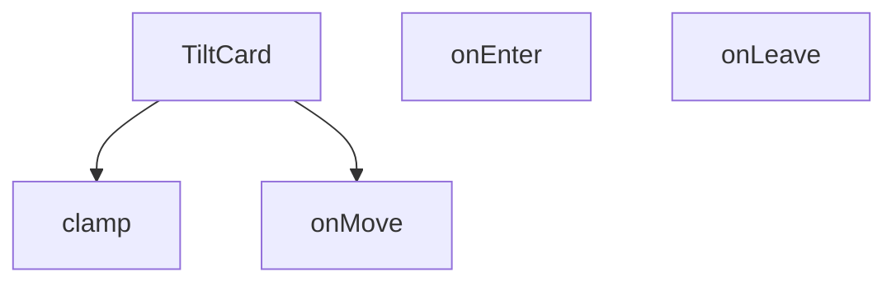

## Genel Bakış
TiltCard, fare etkileşimleriyle üç boyutlu eğilme efekti sunan interaktif bir React kart bileşenidir. Kullanıcı faresini kart üzerinde hareket ettirdiğinde, kart真实世界'deki bir nesne gibi eğilerek modern ve dinamik bir görsel deneyim yaratır. Maksimum eğilme açısı dışarıdan özelleştirilebilir.

## Fonksiyon Grupları
### Ana Bileşen
TiltCard'ın temel yapısını oluşturarak içeriği sarar ve eğilme efekti için yapılandırma parametrelerini tanımlar. Bu grup, bileşenin dışarıya açılan arayüzünü ve yaşam döngüsünü yönetir.
- TiltCard

### Fare Etkileşim Yöneticileri
Kullanıcının kart üzerindeki fare hareketlerini yakalayarak eğilme hesaplamalarını tetikler. Fare kart üzerine geldiğinde, hareket ettiğinde ve ayrıldığında分别 ilgili efekt başlangıç, güncelleme ve bitiş işlemlerini yürütür.
- onMove, onEnter, onLeave

### Değer Sınırlandırma Aracı
Eğilme açısı gibi hesaplanan sayısal değerleri tanımlı minimum ve maksimum aralıkta tutarak efektin kontrollü çalışmasını garanti eder. Aşırı değerlerin önüne geçerek görsel tutarlılığı korur.
- clamp

---

---

## FONKSİYON DETAYLARI

### clamp
**Ne yapar**: Bir sayısal değeri, belirtilen minimum ve maximum sınırlar arasında sıkıştırır (clipping). Değer aralık dışındaysa en yakın sınaira sabitlenir.

**Nasıl yapar**: Fonksiyon, verilen `v` değerini `min` ve `max` değerleri ile karşılaştırır. `v`, `min` değerinden küçükse `min` değerini, `max` değerinden büyükse `max` değerini, aksi halde `v` değerinin kendisini döndürür. Bu, genellikle mouse hareketi veya animasyon hesaplamalarında değerin kontrollü kalmasını sağlamak için kullanılır.

**Parametreler**:
- v: number — Sınırlanacak olan sayısal değer
- min: number — İzin verilen değer aralığının alt sınırı
- max: number — İzin verilen değer aralığının üst sınırı

**Dönüş**: Fonksiyonun dönüş tipi sağlanan bilgide açıkça belirtilmemiştir. Ancak bu tür clamp fonksiyonları genellikle number tipinde değer döndürür.

### TiltCard
**Ne yapar**: Fare hareketlerine göre eğme (tilt) efekti uygulayan, tekrarlanabilir bir React bileşenidir. İçerisindeki tüm çocuk içerikleri sarmalayarak, kullanıcı kartla etkileşime girdiğinde 3D benzeri eğim efekti sunar. Maksimum eğme açısı dışarıdan yapılandırılabilir, varsayılan bir değerle kullanıma hazırdır.
**Nasıl yapar**: Kendi bünyesinde fare olaylarını izleyen onMove, onEnter, onLeave işleyicilerini barındırır, bu işleyicileri ana kapsayıcı div elementine bağlar. Eğme hesaplamalarında clamp fonksiyonunu kullanarak açının sınırları aşmasını engeller, aldığı maxTilt değerini tüm eğme hesaplamalarında temel alır. İçerisine gelen children prop'unu kendi içindeki kapsayıcıda render ederek efekti içeriğe uygular.
**Parametreler**:
- name: children — type: React.ReactNode — Bileşen içerisinde gösterilecek, eğme efekti uygulanacak tüm içerik, her türlü React tarafından desteklenen iç öğe olabilir.
- name: maxTilt — type: number — Kartın uygulayabileceği maksimum eğme açısı, isteğe bağlı olarak dışarıdan değer geçirilebilir, varsayılan olarak 18 derece olarak ayarlanmıştır.
**Dönüş**: React.FC<React.PropsWithChildren<{ maxTilt?: number }>> tipinde bir React bileşeni döndürür, çocuklu yapıyı destekler, maxTilt prop'unu opsiyonel olarak kabul eden tür yapısına sahiptir.

### onMove
**Ne yapar**: TiltCard bileşeninin alanı üzerinde fare hareket ettiğinde tetiklenen olay işleyicisidir, anlık fare konumuna göre kartın eğme miktarını hesaplayıp günceller. Kullanıcının fare hareketlerini eğme açısına dönüştürerek akıcı bir 3D efekti sağlar.
**Nasıl yapar**: Fare olayından gelen konum verilerini alır, TiltCard'ın boyutlarını ve sayfa üzerindeki konumunu hesaplar, elde edilen koordinatları eğme açısına çevirir. Hesaplanan açının maxTilt sınırını aşmasını clamp fonksiyonuyla engeller, sürekli güncellenen değerle kartın eğimini akıcı bir şekilde değiştirir.
**Parametreler**:
- name: e — type: React.MouseEvent<HTMLDivElement> — Tetiklenen fare hareketi olayının tüm detaylarını içeren nesne, fare konumu, hedef element gibi tüm gerekli verilere erişim sağlar.
**Dönüş**: HTMLDivElement elementleri için uyumlu React.MouseEventHandler<HTMLDivElement> tipinde bir olay işleyicisi döndürür, fare hareketi olaylarını yakalayıp işlemek üzere yapılandırılmıştır.

### onEnter
**Ne yapar**: TiltCard bileşeninin kapsama alanına fare ilk girdiğinde tetiklenen olay işleyicisidir, eğme efektinin başlatılmasını ve gerekli tüm başlangıç durumlarının ayarlanmasını sağlar. Kullanıcının kartla etkileşime geçtiğini algılayarak efekti aktif hale getirir.
**Nasıl yapar**: Fare kartın alanına girdiğinde animasyon geçişlerini aktif eder, eğme hesaplamaları için gereken ilk konum ve durum değerlerini ayarlar, olası gecikmeleri önlemek için gerekli ön yüklemeleri yapar, kullanıcının ilk etkileşimini algılayarak efektin sorunsuz başlamasını sağlar.
**Parametreler**:
- name: e — type: React.MouseEvent<HTMLDivElement> — Fare giriş olayının tüm detaylarını içeren, hedef element ve olay metriklerini barındıran React fare olay nesnesi.
**Dönüş**: HTMLDivElement elementleri için uyumlu React.MouseEventHandler<HTMLDivElement> tipinde bir olay işleyicisi döndürür, fare element alanına giriş olayını yakalamak üzere yapılandırılmıştır.

### onLeave
**Ne yapar**: TiltCard bileşeninin kapsama alanından fare çıkış yaptığında tetiklenen olay işleyicisidir, eğme efektinin sonlandırılıp kartın orijinal varsayılan konumuna dönmesini sağlar. Kullanıcının kartla etkileşimini bitirdiğini algılayarak tüm geçici durumları temizler.
**Nasıl yapar**: Fare kartın alanından çıktığında mevcut eğme açılarını sıfırlar, animasyonlu bir geçişle kartın orijinal konumuna dönmesini sağlar, etkileşim sırasında oluşturulan tüm geçici durum değerlerini temizler, bir sonraki etkileşime hazır hale getirir.
**Parametreler**: Herhangi bir harici parametre almaz, iç mantığında olay nesnesini kullanarak işlemlerini gerçekleştirir.
**Dönüş**: HTMLDivElement elementleri için uyumlu React.MouseEventHandler<HTMLDivElement> tipinde bir olay işleyicisi döndürür, fare element alanından çıkış olayını yakalamak üzere yapılandırılmıştır.

---

## AST POINTERS

### [N1_NASIL] AST Pointer: TiltCard.tsx::clamp
- **params**: `(v: number, min: number, max: number)`
- **ic_degiskenler**: (fonksiyon gövdesi verilmemiş, çağrı侧dan çağrılmış)
- **Dönüş**: number — v değerini min ve max arasında sıkıştırılmış olarak döndürür

---

### [N2_NASIL] AST Pointer: TiltCard.tsx::TiltCard
- **params**: `({ children, maxTilt = 18 })` — children: kart içeriği, maxTilt: eğim açısı üst limiti (derece)
- **ic_degiskenler**:
  - `wrapperRef` — useRef, dış sarmalayıcı div referansı
  - `innerRef` — useRef, iç div referansı (transform uygulanan eleman)
  - `mounted` — useState, bileşenin mount olup olmadığını takip eder
  - `hover` — useState, mouse'un kart üzerinde olup olmadığını belirtir
  - `supportsTilt` — boolean, cihazın hover ve fine pointer destekleyip desteklemediğini kontrol eder
  - `prefersReduced` — boolean, kullanıcının reduced-motion tercihi olup olmadığını kontrol eder
  - `shouldSkip` — boolean, tilt efektinin atlanıp atlanmayacağını belirler (supportsTilt veya prefersReduced durumuna göre)
  - `onMove` — React.MouseEventHandler, mouse hareketi handler'ı
  - `onEnter` — React.MouseEventHandler, mouse giriş handler'ı
  - `onLeave` — React.MouseEventHandler, mouse çıkış handler'ı
- **Dönüş**: JSX Element — shouldSkip true ise basit div, değil ise tilt efektli div yapısı

---

### [N3_NASIL] AST Pointer: TiltCard.tsx::onMove
- **params**: `(e: React.MouseEvent<HTMLDivElement>)` — mouse hareket olayı
- **ic_degiskenler**:
  - `container` — wrapperRef.current, dış sarmalayıcı div DOM elemanı
  - `el` — innerRef.current, iç div DOM elemanı (transform uygulanacak)
  - `rect` — container.getBoundingClientRect(), container'ın ekran koordinatları ve boyutları
  - `x` — mouse'un container içindeki yatay pozisyonu (0-1 arası oran)
  - `y` — mouse'un container içindeki dikey pozisyonu (0-1 arası oran)
  - `rx` — X ekseni dönüş açısı (derece), clamp ile -maxTilt ile maxTilt arasında sınırlanmış
  - `ry` — Y ekseni dönüş açısı (derece), clamp ile -maxTilt ile maxTilt arasında sınırlanmış
  - `sx` — gölge yatay ofseti (piksel), x pozisyonuna göre hesaplanır
  - `sy` — gölge dikey ofseti (piksel), y pozisyonuna göre hesaplanır
- **Kullanılan dış değişkenler**: wrapperRef, innerRef, maxTilt, hover, clamp
- **Dönüş**: yok — container CSS değişkenlerini (--px, --py) ve el transform/shadow değerlerini yan etki olarak değiştirir

---

### [N4_NASIL] AST Pointer: TiltCard.tsx::onEnter
- **params**: `(e: React.MouseEvent<HTMLDivElement>)` — mouse giriş olayı
- **ic_degiskenler**: (yok)
- **Kullanılan dış değişkenler**: setHover (true yapar), onMove (e ile çağrılarak başlangıç transform'u uygulanır)
- **Dönüş**: yok — hover durumunu true yapar ve onMove'u tetikler

---

### [N5_NASIL] AST Pointer: TiltCard.tsx::onLeave
- **params**: `(parametre yok)`
- **ic_degiskenler**:
  - `el` — innerRef.current, iç div DOM elemanı (transform sıfırlanacak)
- **Kullanılan dış değişkenler**: setHover (false yapar), innerRef
- **Dönüş**: yok — hover durumunu false yapar, el transform ve box-shadow değerlerini sıfırlar

---

## MERMAID CALL GRAPH

## NODE ID STANDARD

  file: src\components\TiltCard.tsx
  function: src\components\TiltCard.tsx::clamp
  function: src\components\TiltCard.tsx::TiltCard
  function: src\components\TiltCard.tsx::onMove
  function: src\components\TiltCard.tsx::onEnter
  function: src\components\TiltCard.tsx::onLeave

---

## DISA AKTARILANLAR (EXPORTS)
  export: TiltCard
  export: clamp

---

## STİL TOKENLERİ

### Arbitrary Değerler (token'a geçirilmemiş)
Yok — tüm stiller token'a geçirilmiş. ✅

### Kullanılan Token'lar (zaten token'a geçirilmiş)
- (yok)

### Tailwind Sınıf Özeti
- **Renkler:** (yok)
- **Layout:** `absolute`, `relative`
- **Varyant/Responsive:** `group-hover:` önekleri
- **Yardımcı Sınıflar:** `duration-200`, `group`, `group-hover:opacity-100`, `inset-0`, `opacity-0`, `pointer-events-none`, `rounded-xl`, `transition-opacity`, `transition-transform`, `will-change-transform`