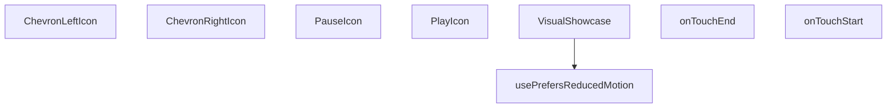

## Genel Bakış
`VisualShowcase` modülü, kaydırılabilir görsel içerikleri sunan bir React bileşenidir. Kullanıcıların hareket azaltma tercihine duyarlı olup, dokunmatik ve fare etkileşimlerini yönetir; aynı zamanda gezinme ve medya kontrolü için özelleştirilebilir ikon bileşenleri sağlar.

## Fonksiyon Grupları
### Erişilebilirlik ve Bileşen Koordinasyonu  
Bu grup, bileşenin genel davranışını yöneten ve kullanıcı tercihlerini (reduced motion) dikkate alan yardımcı fonksiyonları içerir.  
- usePrefersReducedMotion, VisualShowcase  

### Dokunmatik Etkileşim İşleyicileri  
Mobil cihazlarda kaydırma ve dokunma hareketlerini algılayarak slayt geçişlerini kontrol eden olay yöneticileri.  
- onTouchStart, onTouchEnd  

### UI İkon Bileşenleri  
Gezinme ve oynatma/duraklatma kontrolleri için kullanılan, boyut ve stil özelleştirmesine izin veren yeniden kullanılabilir ikon bileşenleri.  
- ChevronLeftIcon, ChevronRightIcon, PauseIcon, PlayIcon

---

## AXIOMS – Mimari Varsayımlar
(Sentez hatası)

---

## FONKSİYON DETAYLARI

### usePrefersReducedMotion
**Ne yapar**: Kullanıcının “reduce motion” tercihini izler ve bu tercihe göre bir boolean değer döndürür.  
**Nasıl yapar**: `useState` ile `reduced` adında bir durum oluşturur, `useEffect` içinde `window.matchMedia('(prefers-reduced-motion: reduce)')` sorgusunu dinler, değişiklik olduğunda `setReduced` ile günceller ve bileşen unmount olduğunda dinleyiciyi temizler.  
**Parametreler**:  
- *yok*  
**Dönüş**: `boolean` – `true` ise kullanıcı hareketi azaltmayı tercih eder, `false` ise tercih etmez.

### VisualShowcase
**Ne yapar**: Projenin görsel gösterim bileşenini tanımlar; dışarıdan bir React fonksiyonel bileşen (FC) olarak kullanılabilir.  
**Nasıl yapar**: Kaynak kodu verilmemiştir; ancak isimlendirmeden ve dosya yolundan, UI içinde çeşitli ikon ve dokunma olaylarını yöneten bir gösterim bileşeni olduğu anlaşılır.  
**Parametreler**:  
- *yok*  
**Dönüş**: `React.FC` – bir React fonksiyonel bileşenidir.

### onTouchStart
**Ne yapar**: Dokunma (touch) başlangıç olayını yakalar; genellikle kaydırma veya sürükleme gibi etkileşimlerin başlangıcını işaret eder.  
**Nasıl yapar**: Fonksiyon gövdesi sağlanmamış olsa da, parametre olarak gelen `React.TouchEvent` nesnesini alır ve ilgili mantığı yürütür.  
**Parametreler**:  
- `e`: `React.TouchEvent` — Dokunma başlangıç olayının detaylarını içerir.  
**Dönüş**: Belirtilmemiş; tipik olarak `void`.

### onTouchEnd
**Ne yapar**: Dokunma (touch) bitiş olayını yakalar; kaydırma veya sürükleme gibi etkileşimlerin sonlandırılmasını işaret eder.  
**Nasıl yapar**: Fonksiyon gövdesi sağlanmamış olsa da, parametre olarak gelen `React.TouchEvent` nesnesini alır ve ilgili mantığı yürütür.  
**Parametreler**:  
- `e`: `React.TouchEvent` — Dokunma bitiş olayının detaylarını içerir.  
**Dönüş**: Belirtilmemiş; tipik olarak `void`.

### ChevronLeftIcon
**Ne yapar**: Sol yönlü bir ok (chevron) SVG ikonu üretir; UI’da gezinme veya geri yönlendirme için kullanılabilir.  
**Nasıl yapar**: `size` ve `className` prop’larını alır, bu değerlerle bir `<svg>` elementi oluşturur ve içinde sol yönlü polyline çizer.  
**Parametreler**:  
- `size`: `number` — İkonun genişlik ve yükseklik değerini belirler; varsayılan 18.  
- `className`: `string` — İkonun CSS sınıflarını eklemek için kullanılır; varsayılan boş string.  
**Dönüş**: JSX içinde bir `<svg>` elementi; React bileşeni olarak render edilir.

### ChevronRightIcon
**Ne yapar**: Sağ yönlü bir ok (chevron) SVG ikonu üretir; UI’da ileri yönlendirme için kullanılabilir.  
**Nasıl yapar**: `size` ve `className` prop’larını alır, bu değerlerle bir `<svg>` elementi oluşturur ve içinde sağ yönlü polyline çizer.  
**Parametreler**:  
- `size`: `number` — İkonun genişlik ve yükseklik değerini belirler; varsayılan 18.  
- `className`: `string` — İkonun CSS sınıflarını eklemek için kullanılır; varsayılan boş string.  
**Dönüş**: JSX içinde bir `<svg>` elementi; React bileşeni olarak render edilir.

### PauseIcon
**Ne yapar**: Duraklatma (pause) durumunu temsil eden iki dikdörtgen SVG ikonu üretir.  
**Nasıl yapar**: `size` ve `className` prop’larını alır, bu değerlerle bir `<svg>` elementi oluşturur ve içinde iki dikdörtgen çizer.  
**Parametreler**:  
- `size`: `number` — İkonun genişlik ve yükseklik değerini belirler; varsayılan 18.  
- `className`: `string` — İkonun CSS sınıflarını eklemek için kullanılır; varsayılan boş string.  
**Dönüş**: JSX içinde bir `<svg>` elementi; React bileşeni olarak render edilir.

### PlayIcon
**Ne yapar**: Oynatma (play) durumunu temsil eden üçgen SVG ikonu üretir.  
**Nasıl yapar**: `size` ve `className` prop’larını alır, bu değerlerle bir `<svg>` elementi oluşturur ve içinde bir üçgen (polygon) çizer.  
**Parametreler**:  
- `size`: `number` — İkonun genişlik ve yükseklik değerini belirler; varsayılan 18.  
- `className`: `string` — İkonun CSS sınıflarını eklemek için kullanılır; varsayılan boş string.  
**Dönüş**: JSX içinde bir `<svg>` elementi; React bileşeni olarak render edilir.

---

## İTHALATLAR (IMPORTS)
- import: ../i18n/I18nProvider::useI18n
- import: react::React
- import: react::useEffect
- import: react::useMemo
- import: react::useRef
- import: react::useState

---

## AST POINTERS

### [N1_NASIL] AST Pointer: src/components/VisualShowcase.tsx::usePrefersReducedMotion
- **params**: (parametre yok)
- **ic_degiskenler**:
  - `reduced` — `useState` ile tanımlanan boolean, kullanıcının “reduce motion” tercihini tutar.
  - `setReduced` — `reduced` state'ini güncelleyen setter fonksiyonu.
  - `mq` — `window.matchMedia('(prefers-reduced-motion: reduce)')` sonucunda elde edilen MediaQueryList nesnesi.
  - `onChange` — `mq.matches` değerine göre `setReduced` çağıran callback.
- **Dönüş**: `boolean` (`reduced`)

### [N2_NASIL] AST Pointer: src/components/VisualShowcase.tsx::VisualShowcase
- **params**: (parametre yok)
- **ic_degiskenler**:
  - `t` — `useI18n` hookundan gelen çeviri fonksiyonu.
  - `index` — mevcut slide indeksini tutan state.
  - `setIndex` — `index` state'ini güncelleyen setter.
  - `playing` — otomatik oynatma (autoplay) durumunu belirten boolean state.
  - `setPlaying` — `playing` state'ini güncelleyen setter.
  - `startXRef` — dokunma başlangıç X koordinatını saklayan `useRef<number | null>`.
  - `containerRef` — carousel konteyner DOM elemanına referans veren `useRef<HTMLDivElement | null>`.
  - `reducedMotion` — `usePrefersReducedMotion` hookundan dönen değer.
  - `mounted` — bileşenin DOM'a monte edilip edilmediğini gösteren boolean state.
  - `isCoarse` — cihazın dokunmatik (coarse) işaretçi tipine sahip olup olmadığını belirten boolean.
  - `disableFancy` — reduced motion, coarse pointer veya dar ekran koşullarında fancy efektleri devre dışı bırakmak için kullanılan boolean.
  - `mouse` — `{x:number, y:number}` şeklinde fare konumunun yumuşatılmış değerlerini tutan state.
  - `setMouse` — `mouse` state'ini güncelleyen setter.
  - `slides` — `useMemo` ile oluşturulan sabit slide dizisi; her eleman `{title, subtitle, colorFrom, colorTo}` içerir.
  - `slidesCount` — `slides.length` değeri.
  - `prev` — önceki slide’a geçiş yapan `React.useCallback` fonksiyonu.
  - `next` — sonraki slide’a geçiş yapan `React.useCallback` fonksiyonu.
  - `onTouchStart` — dokunma başlangıcında `startXRef.current`'i ayarlayan fonksiyon.
  - `onTouchEnd` — dokunma bitişinde kaydırma mesafesini ölçüp `prev`/`next` çağıran fonksiyon.
  - `onKey` — klavye olaylarını dinleyen, ok tuşları ve boşluk ile kontrol sağlayan callback.
  - `el` — `containerRef.current` üzerinden elde edilen DOM elemanı (parallax hareketi için).
  - `onMove` — fare hareketlerini izleyip `mouse` state'ini yumuşak bir şekilde güncelleyen fonksiyon.
  - `canvasRef` — `<canvas>` elemanına referans veren `useRef<HTMLCanvasElement | null>`.
  - `particles` — `useMemo` ile oluşturulan 28 adet rastgele konum ve hız değerine sahip parçacık nesnesi dizisi.
  - `ctx` — `canvas.getContext('2d')` ile alınan 2D çizim bağlamı.
  - `raf` — `requestAnimationFrame` döngüsü için tutulan kimlik.
  - `render` — canvas üzerine parçacıkları çizen ve animasyonu sürdüren fonksiyon.
- **Dönüş**: `React.FC` (JSX öğesi döner; yan etkileri: DOM event listener ekleme, canvas çizimi, state güncellemeleri)

### [N3_NASIL] AST Pointer: src/components/VisualShowcase.tsx::onTouchStart
- **params**: `e: React.TouchEvent`
- **ic_degiskenler**:
  - `e` — dokunma olayı nesnesi.
- **Dönüş**: yok (sadece `startXRef.current` günceller)

### [N4_NASIL] AST Pointer: src/components/VisualShowcase.tsx::onTouchEnd
- **params**: `e: React.TouchEvent`
- **ic_degiskenler**:
  - `e` — dokunma bitiş olayı nesnesi.
  - `dx` — başlangıç X (`startXRef.current`) ile bitiş X arasındaki fark.
- **Dönüş**: yok (koşula göre `prev`/`next` çağırır ve `startXRef.current`i sıfırlar)

### [N5_NASIL] AST Pointer: src/components/VisualShowcase.tsx::ChevronLeftIcon
- **params**: `{ size = 18, className = '' }: { size?: number; className?: string }`
- **ic_degiskenler**:
  - `size` — SVG genişlik ve yükseklik değeri (default 18).
  - `className` — ek CSS sınıfları (default boş string).
- **Dönüş**: yok (JSX `<svg>` döner)

### [N6_NASIL] AST Pointer: src/components/VisualShowcase.tsx::ChevronRightIcon
- **params**: `{ size = 18, className = '' }: { size?: number; className?: string }`
- **ic_degiskenler**:
  - `size` — SVG genişlik ve yükseklik değeri (default 18).
  - `className` — ek CSS sınıfları (default boş string).
- **Dönüş**: yok (JSX `<svg>` döner)

### [N7_NASIL] AST Pointer: src/components/VisualShowcase.tsx::PauseIcon
- **params**: `{ size = 18, className = '' }: { size?: number; className?: string }`
- **ic_degiskenler**:
  - `size` — SVG genişlik ve yükseklik değeri (default 18).
  - `className` — ek CSS sınıfları (default boş string).
- **Dönüş**: yok (JSX `<svg>` döner)

### [N8_NASIL] AST Pointer: src/components/VisualShowcase.tsx::PlayIcon
- **params**: `{ size = 18, className = '' }: { size?: number; className?: string }`
- **ic_degiskenler**:
  - `size` — SVG genişlik ve yükseklik değeri (default 18).
  - `className` — ek CSS sınıfları (default boş string).
- **Dönüş**: yok (JSX `<svg>` döner)

---

## MERMAID CALL GRAPH

## NODE ID STANDARD

  file: src\components\VisualShowcase.tsx
  function: src\components\VisualShowcase.tsx::usePrefersReducedMotion
  function: src\components\VisualShowcase.tsx::VisualShowcase
  function: src\components\VisualShowcase.tsx::onTouchStart
  function: src\components\VisualShowcase.tsx::onTouchEnd
  function: src\components\VisualShowcase.tsx::ChevronLeftIcon
  function: src\components\VisualShowcase.tsx::ChevronRightIcon
  function: src\components\VisualShowcase.tsx::PauseIcon
  function: src\components\VisualShowcase.tsx::PlayIcon

---

## DISA AKTARILANLAR (EXPORTS)
  export: ChevronLeftIcon
  export: ChevronRightIcon
  export: PauseIcon
  export: PlayIcon
  export: VisualShowcase
  export: usePrefersReducedMotion

---

## STİL TOKENLERİ

### Arbitrary Değerler (token'a geçirilmemiş)
Yok — tüm stiller token'a geçirilmiş. ✅

### Kullanılan Token'lar (zaten token'a geçirilmiş)
- (yok)

### Tailwind Sınıf Özeti
- **Renkler:** `bg-gradient-to-br`, `bg-white`, `bg-white/10`, `bg-white/70`, `bg-white/80`, `hover:bg-white`, `lg:text-4xl`, `sm:text-3xl`, `sm:text-lg`, `text-2xl`, `text-base`, `text-center`, `text-industrial-gray`, `text-white`, `text-white/90`
- **Layout:** `-bottom-12`, `-left-16`, `-right-20`, `-top-10`, `absolute`, `bottom-2`, `drop-shadow-sm`, `flex`, `gap-2`, `h-10`, `h-2`, `h-48`, `h-64`, `h-80`, `h-full`
- **Varyant/Responsive:** `:`, `focus-visible:`, `hover:`, `lg:`, `sm:` önekleri
- **Yardımcı Sınıflar:** `${i`, `${s.colorFrom`, `${s.colorTo`, `-translate-x-1/2`, `:`, `===`, `blur-2xl`, `duration-700`, `ease-out`, `focus-visible:outline-none`, `focus-visible:ring-2`, `focus-visible:ring-offset-2`, `focus-visible:ring-primary-navy`, `font-bold`, `index`