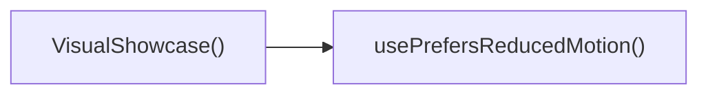

## Genel Bakış
Bu React modülü, içerikleri etkileşimli bir slayt vitrini olarak sunan VisualShowcase bileşenini barındırır. Hem masaüstü hem mobil cihazlarda kullanıcı etkileşimini destekler, erişilebilirlik standartlarına uygun olarak kullanıcıların hareket azaltma tercihini de dikkate alır. Slaytlar arasında gezinme, oynatma/duraklatma gibi temel işlevleri tek bir modül altında toplar.

## Fonksiyon Grupları
### Ana Bileşen ve Erişilebilirlik Yardımcısı
Modülün tüm işlevlerini koordine eden, alt bileşenleri bir araya getiren temel yapıdır. Kullanıcının hareket azaltma tercihini alarak erişilebilirlik gereksinimlerini karşılar.
- usePrefersReducedMotion, VisualShowcase

### Dokunmatik Etkileşim Yöneticileri
Mobil cihazlarda kullanıcıların dokunmatik hareketleriyle vitrin içindeki slaytlar arasında gezinmesini sağlayan olay işleyicileridir.
- onTouchStart, onTouchEnd

### Arayüz İkon Bileşenleri
Vitrin arayüzünde kullanılan gezinme ve medya kontrol ikonlarını oluşturan, boyut ve stil özelleştirmesini destekleyen yeniden kullanılabilir bileşenlerdir.
- ChevronLeftIcon, ChevronRightIcon, PauseIcon, PlayIcon

---

## AXIOMS – Mimari Varsayımlar
Bu React tabanlı görsel vitrin bileşeninin çalışması için bağımlı olduğu tüm React hook'ları, ikon bileşenleri ve tarayıcı ortam özelliklerinin erişilebilir, tanımlı ve çalışır durumda olması zorunludur.

[Aksiyom 1]: Eğer `usePrefersReducedMotion()` hook'u proje içinde tanımlı ve erişilebilir değilse, bileşen kullanıcının azaltılmış hareket tercihini algılayamaz, görsel animasyonlar erişilebilirlik standartlarını karşılamaz.
[Aksiyom 2]: Eğer React ortamında `React.TouchEvent` tipi tanımlı değilse, `onTouchStart` ve `onTouchEnd` dokunmatik olay işleyicileri çalışmaz, mobil cihazlarda vitrin ile kullanıcı etkileşimi kurulamaz.
[Aksiyom 3]: Eğer `ChevronLeftIcon`, `ChevronRightIcon`, `PauseIcon`, `PlayIcon` ikon bileşenleri proje içinden erişilebilir değilse, VisualShowcase bileşeni başarıyla render edilemez, derleme veya çalışma zamanı hatası fırlatır.
[Aksiyom 4]: Eğer ikon bileşenleri kendisine aktarılan `size` ve `className` parametrelerini işleyemiyorsa, ikonlar doğru şekilde görüntülenemez, VisualShowcase bileşeninin kullanıcı arayüzü bozulur.

---

## FONKSIYON DETAYLARI

### usePrefersReducedMotion
**Ne yapar**: Kullanıcının tarayıcı veya işletim sistemi seviyesindeki azaltılmış hareket tercihini tespit ederek bu bilgiyi React bileşenlerine sunan özel bir hook'tur. Animasyon yoğunluğunu kullanıcının erişilebilirlik tercihine göre ayarlamak amacıyla kullanılır.
**Nasıl yapar**: Tarayıcının standart `window.matchMedia` API'sini kullanarak `prefers-reduced-motion` medya sorgusunu çalıştırır, sorgunun sonucunu hook içindeki durumda saklar ve bu değeri kullanıma sunar. Kullanıcı tercihi değiştiğinde durumu otomatik olarak günceller.
**Parametreler**: Herhangi bir parametre almaz
**Dönüş**: Kullanıcının azaltılmış hareket tercihini belirten boolean tipinde `reduced` değeri; tercih mevcutsa `true`, aksi halde `false` döndürür.

### VisualShowcase
**Ne yapar**: Venthub HVAC projesinde sistemlerin görsel vitrinini sunan ana React bileşenidir. İnteraktif olarak havalandırma ve klima sistemlerinin demolarını, animasyonlarını kullanıcıya göstermek için tasarlanmıştır.
**Nasıl yapar**: İçerisinde hareket tercihi kontrolü için `usePrefersReducedMotion` hook'unu, dokunmatik etkileşimler için `onTouchStart` ve `onTouchEnd` olay işleyicilerini kullanır. Gezinme ve oynatma kontrolleri için ikon bileşenlerini entegre ederek eksiksiz bir interaktif vitrin deneyimi sunar.
**Parametreler**: Herhangi bir parametre almaz
**Dönüş**: React tarafından DOM'a render edilebilecek bir React.FC (React Bileşeni) olarak, vitrin içeriğini içeren JSX yapısını döndürür.

### onTouchStart
**Ne yapar**: Dokunmatik ekranlı cihazlarda kullanıcının vitrin içeriğine dokunmaya başladığında tetiklenen olay işleyicisidir. Dokunma başlangıcında animasyonları yönetmek, dokunma konumunu kaydetmek gibi işlemleri gerçekleştirir.
**Nasıl yapar**: React tarafından sarmalanmış standart `TouchEvent` nesnesini alarak olayın tüm verilerine erişir, bileşenin iç durumunu güncelleyerek dokunma işleminin başladığını kaydeder, gerektiğinde vitrin içindeki animasyonların akışını duraklatır veya yönlendirir.
**Parametreler**:
- name: e — type: React.TouchEvent — Tarayıcının tetiklediği dokunma başlangıç olayının konum, zaman ve etkileşim verilerini içeren standart React olay nesnesi
**Dönüş**: Herhangi bir değer döndürmez, yalnızca bileşenin iç durumunu etkileyen yan etkiler oluşturur, dönüş tipi `void`'tır.

### onTouchEnd
**Ne yapar**: Kullanıcının vitrin içeriğinden parmağını çektiği, dokunma işleminin sonlandığı anda tetiklenen olay işleyicisidir. Dokunma sonrası animasyonları yeniden başlatmak, kaydırma veya gezinme işlemlerini tetiklemek için kullanılır.
**Nasıl yapar**: Aldığı `TouchEvent` nesnesinin verileriyle dokunma süresini ve mesafesini hesaplar, bu hesaplamalara göre kullanıcının sola/sağa kaydırma mı yoksa basit tıklama mı yaptığını ayırt eder, tespit ettiği eyleme göre vitrin içeriğinde gezinme veya oynatma işlemlerini başlatır.
**Parametreler**:
- name: e — type: React.TouchEvent — Dokunma sonlanma anındaki tüm olay verilerini içeren React tarafından sarmalanmış standart olay nesnesi
**Dönüş**: Herhangi bir değer döndürmez, yalnızca iç durumu güncellemek ve işlemleri tetiklemek için kullanılır, dönüş tipi `void`'tır.

### ChevronLeftIcon
**Ne yapar**: Sol yönlü ok şeklinde özelleştirilebilir bir ikon bileşenidir, VisualShowcase içindeki önceki içeriğe geçme butonunda kullanılır. Yeniden kullanılabilir yapıya sahiptir.
**Nasıl yapar**: Parametre olarak aldığı boyut ve sınıf değerlerini SVG elemanına ileterek ikonun görünümünü ihtiyaca göre ayarlar, hardcoded sol ok vektör yolu üzerinden ikonu ekrana render eder, özel CSS sınıflarını kabul ederek stillendirme esnekliği sunar.
**Parametreler**:
- name: size — type: number? — İkonun piksel cinsinden genişlik ve yüksekliğini belirleyen opsiyonel sayısal değer, varsayılan değeri 18'dir
- name: className — type: string? — İkona özel stiller veya ek CSS sınıfları eklemek için kullanılan opsiyonel metin değeri, varsayılan olarak boş string'dir
**Dönüş**: Özelleştirilmiş sol ok ikonunu içeren JSX içeriği döndürür, UI'de kullanılmak üzere render edilir, herhangi bir fonksiyonel dönüş değeri yoktur.

### ChevronRightIcon
**Ne yapar**: Sağ yönlü ok şeklinde özelleştirilebilir bir ikon bileşenidir, VisualShowcase içindeki sonraki içeriğe geçme butonunda kullanılır. Tüm projede yeniden kullanılabilir yapıya sahiptir.
**Nasıl yapar**: Aldığı boyut ve sınıf parametrelerini SVG elemanının özelliklerine uygulayarak ikonun boyutlarını ve stillerini ayarlar, sağ ok vektör yolu üzerinden ikonu ekrana yazdırır, her türlü tasarıma uyum sağlayacak şekilde özelleştirilebilir.
**Parametreler**:
- name: size — type: number? — İkonun piksel cinsinden boyutunu belirleyen opsiyonel sayısal değer, varsayılan değeri 18'dir
- name: className — type: string? — İkona özel CSS sınıfları eklemek için kullanılan opsiyonel metin değeri, varsayılan olarak boş string'dir
**Dönüş**: Özelleştirilmiş sağ ok ikonunu içeren JSX içeriği döndürür, UI kontrollerinde kullanılmak üzere sunulur, herhangi bir fonksiyonel dönüş değeri yoktur.

### PauseIcon
**Ne yapar**: İki dikey çubuk şeklindeki standart duraklatma simgesini oluşturan özelleştirilebilir ikon bileşenidir, VisualShowcase içindeki animasyon veya medya oynatımını duraklatmak için kullanılan butonlarda yer alır.
**Nasıl yapar**: Parametre olarak aldığı boyut ve sınıf değerlerini SVG elemanına ileterek ikonun görünümünü ihtiyaca göre ayarlar, standart duraklatma ikonunun vektör yolunu kullanarak ekrana render eder, stillendirme esnekliği sunar.
**Parametreler**:
- name: size — type: number? — İkonun piksel cinsinden genişlik ve yüksekliğini belirleyen opsiyonel sayısal değer, varsayılan değeri 18'dir
- name: className — type: string? — İkona özel stiller veya ek sınıflar eklemek için kullanılan opsiyonel metin değeri, varsayılan olarak boş string'dir
**Dönüş**: Özelleştirilmiş duraklatma ikonunu içeren JSX içeriği döndürür, vitrinin oynatım kontrollerinde kullanılmak üzere sunulur, herhangi bir fonksiyonel dönüş değeri yoktur.

### PlayIcon
**Ne yapar**: Sağa yönlü üçgen şeklindeki standart oynatma simgesini oluşturan özelleştirilebilir ikon bileşenidir, VisualShowcase içindeki duraklatılmış animasyon veya medya içeriğini yeniden başlatmak için kullanılan butonlarda yer alır.
**Nasıl yapar**: Aldığı boyut ve sınıf parametrelerini SVG elemanının özelliklerine uygulayarak ikonun boyutlarını ve stillerini ayarlar, standart oynatma ikonunun vektör yolunu kullanarak ekrana render eder, projenin tasarım diline uyum sağlayacak şekilde özelleştirilebilir.
**Parametreler**:
- name: size — type: number? — İkonun piksel cinsinden genişlik ve yüksekliğini belirleyen opsiyonel sayısal değer, varsayılan değeri 18'dir
- name: className — type: string? — İkona özel CSS sınıfları eklemek için kullanılan opsiyonel metin değeri, varsayılan olarak boş string'dir
**Dönüş**: Özelleştirilmiş oynatma ikonunu içeren JSX içeriği döndürür, vitrinin oynatım kontrollerinde kullanılmak üzere sunulur, herhangi bir fonksiyonel dönüş değeri yoktur.

---

## AST POINTERS

### [N1_NASIL] AST Pointer: C:\Users\alize\venthub-hvac\src\components\VisualShowcase.tsx::usePrefersReducedMotion
- **params**: (yok)
- **ic_degiskenler**:
  - `reduced` — Kullanıcının azaltılmış hareket tercihini saklayan boolean state değeri
  - `setReduced` - reduced state değerini güncellemek için kullanılan React state setter fonksiyonu
  - `mq` - `(prefers-reduced-motion: reduce)` medya sorgusunu temsil eden MediaQueryList nesnesi
  - `onChange` - Medya sorgusu değeri değiştiğinde reduced state'ini güncellemek için tanımlanan event handler
- **Dönüş**: boolean (reduced state değeri)

---

### [N2_NASIL] AST Pointer: C:\Users\alize\venthub-hvac\src\components\VisualShowcase.tsx::VisualShowcase
- **params**: (yok)
- **ic_degiskenler**:
  - `t` - useI18n hook'undan alınan metinleri çevirmek için kullanılan fonksiyon
  - `index` - Aktif carousel slaytının indeksini saklayan state değeri
  - `setIndex` - index state'ini güncelleyen React state setter fonksiyonu
  - `playing` - Carousel otomatik oynatma durumunu saklayan boolean state
  - `setPlaying` - playing state'ini güncelleyen React state setter fonksiyonu
  - `startXRef` - Dokunmatik kaydırma başlangıç X koordinatını saklayan ref nesnesi
  - `containerRef` - Carousel ana kapsayıcı DOM elementine erişmek için kullanılan ref nesnesi
  - `reducedMotion` - usePrefersReducedMotion hook'undan alınan kullanıcının azaltılmış hareket tercihi
  - `mounted` - Bileşenin DOM'a mount olup olmadığını takip eden boolean state
  - `setMounted` - mounted state'ini güncelleyen React state setter fonksiyonu
  - `isCoarse` - Cihazın dokunmatik (pointer: coarse) olup olmadığını kontrol eden boolean değer
  - `disableFancy` - Gelişmiş görsel efektleri (parallax, parçacık) devre dışı bırakmak için kullanılan boolean
  - `mouse` - Parallax efektinde kullanılan fare konumunu saklayan {x: number, y: number} nesnesi
  - `setMouse` - mouse state'ini güncelleyen React state setter fonksiyonu
  - `slides` - Carousel içindeki tüm slaytların verisini tutan, useMemo ile önbelleğe alınan dizi
  - `slidesCount` - Toplam slayt sayısını saklayan sayısal değer
  - `id` - Otomatik oynatma interval ID'sini saklayan değişken
  - `prev` - Önceki slayta geçmek için useCallback ile sarmalanmış fonksiyon
  - `next` - Sonraki slayta geçmek için useCallback ile sarmalanmış fonksiyon
  - `canvasRef` - Parçacık efekti için kullanılan canvas DOM elementine erişen ref nesnesi
  - `particles` - Canvas üzerinde çizilecek 28 adet parçacığın koordinat ve hız verisini tutan, useMemo ile önbelleğe alınan dizi
  - `ctx` - Canvas'ın 2D çizim bağlamı
  - `raf` - requestAnimationFrame ID'sini saklayan değişken
  - `render` - Her karede canvas üzerinde parçacıkları çizen render fonksiyonu
- **Dönüş**: JSX.Element (React carousel bileşeni)

---

### [N3_NASIL] AST Pointer: C:\Users\alize\venthub-hvac\src\components\VisualShowcase.tsx::onTouchStart
- **params**: (e: React.TouchEvent)
- **ic_degiskenler**:
  - `e` - Dokunma başlangıç olayını temsil eden React TouchEvent nesnesi
  - `e.touches[0].clientX` - İlk temas noktasının X koordinatı
  - `startXRef.current` - Dokunma başlangıç konumunu saklamak için kullanılan ref değeri
- **Dönüş**: yok

---

### [N4_NASIL] AST Pointer: C:\Users\alize\venthub-hvac\src\components\VisualShowcase.tsx::onTouchEnd
- **params**: (e: React.TouchEvent)
- **ic_degiskenler**:
  - `e` - Dokunma bitiş olayını temsil eden React TouchEvent nesnesi
  - `startXRef.current` - Önce kaydedilen dokunma başlangıç X koordinatı
  - `e.changedTouches[0].clientX` - Dokunma sonu temas noktasının X koordinatı
  - `dx` - Başlangıç ve son X koordinatları arasındaki mesafe farkı
  - `prev` - Önceki slayta geçme fonksiyonu
  - `next` - Sonraki slayta geçme fonksiyonu
- **Dönüş**: yok

---

### [N5_NASIL] AST Pointer: C:\Users\alize\venthub-hvac\src\components\VisualShowcase.tsx::ChevronLeftIcon
- **params**: ({ size = 18, className = '' }: { size?: number; className?: string })
- **ic_degiskenler**:
  - `size` - SVG ikonunun genişlik ve yüksekliğini belirten sayısal değer
  - `className` - İkona uygulanacak özel CSS sınıfları
- **Dönüş**: JSX.Element (Sol ok simgesi SVG'i)

---

### [N6_NASIL] AST Pointer: C:\Users\alize\venthub-hvac\src\components\VisualShowcase.tsx::ChevronRightIcon
- **params**: ({ size = 18, className = '' }: { size?: number; className?: string })
- **ic_degiskenler**:
  - `size` - SVG ikonunun genişlik ve yüksekliğini belirten sayısal değer
  - `className` - İkona uygulanacak özel CSS sınıfları
- **Dönüş**: JSX.Element (Sağ ok simgesi SVG'i)

---

### [N7_NASIL] AST Pointer: C:\Users\alize\venthub-hvac\src\components\VisualShowcase.tsx::PauseIcon
- **params**: ({ size = 18, className = '' }: { size?: number; className?: string })
- **ic_degiskenler**:
  - `size` - SVG ikonunun genişlik ve yüksekliğini belirten sayısal değer
  - `className` - İkona uygulanacak özel CSS sınıfları
- **Dönüş**: JSX.Element (Duraklatma simgesi SVG'i)

---

### [N8_NASIL] AST Pointer: C:\Users\alize\venthub-hvac\src\components\VisualShowcase.tsx::PlayIcon
- **params**: ({ size = 18, className = '' }: { size?: number; className?: string })
- **ic_degiskenler**:
  - `size` - SVG ikonunun genişlik ve yüksekliğini belirten sayısal değer
  - `className` - İkona uygulanacak özel CSS sınıfları
- **Dönüş**: JSX.Element (Oynatma simgesi SVG'i)

---

## ÇAĞRI HARİTASI

### Disariya Cagrilar (Outgoing)
Dosya içindeki VisualShowcase() fonksiyonu, kullanıcıların hareket azaltma tercihini sorgulamak amacıyla usePrefersReducedMotion hook'unu çağırır.

### Disaridan Cagrilanlar (Incoming)
Sağlanan veride bu modülü kullanan herhangi bir dış dosya veya fonksiyon belirtilmemiştir.

### Ic Ice Fonksiyonlar (Nested)
Yok

---

## DOSYA-İÇİ ÇAĞRI GRAFİĞİ
  VisualShowcase() → usePrefersReducedMotion()

---

## NODE ID STANDARD

  file: src\components\VisualShowcase.tsx
  function: src\components\VisualShowcase.tsx::usePrefersReducedMotion
  function: src\components\VisualShowcase.tsx::VisualShowcase
  function: src\components\VisualShowcase.tsx::onTouchStart
  function: src\components\VisualShowcase.tsx::onTouchEnd
  function: src\components\VisualShowcase.tsx::ChevronLeftIcon
  function: src\components\VisualShowcase.tsx::ChevronRightIcon
  function: src\components\VisualShowcase.tsx::PauseIcon
  function: src\components\VisualShowcase.tsx::PlayIcon

---

## DISA AKTARILANLAR (EXPORTS)
  export: ChevronLeftIcon
  export: ChevronRightIcon
  export: PauseIcon
  export: PlayIcon
  export: VisualShowcase
  export: usePrefersReducedMotion