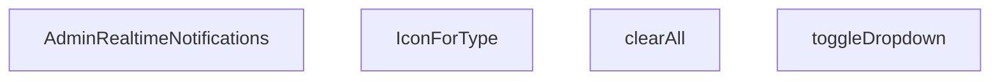

## Genel Bakış
`AdminRealtimeNotifications` bileşeni, yönetim paneline özgü gerçek zamanlı bildirimlerin görüntülenmesi, kullanıcı etkileşimlerinin yönetilmesi ve bildirim tiplerine göre görsel ikonların sağlanmasından sorumludur. Ana UI katmanı olarak görev yapar ve kullanıcının bildirimleri görüntülemesi, dropdown menüyü açıp kapatması veya tüm bildirimleri temizlemesi gibi aksiyonlara aracılık eder.

## Fonksiyon Grupları
### Ana Bileşen ve Render
Bileşenin temel JSX yapısını oluşturur, bildirim listesini render eder ve alt yardımcı fonksiyonları organize eder.
- AdminRealtimeNotifications

### Etkileşim Yönetimi
Bildirim arayüzü üzerindeki kullanıcı aksiyonlarını işler, ilgili durum değişikliklerini tetikler.
- toggleDropdown, clearAll

### Görsel Yardımcılar
Bildirim türüne bağlı olarak doğru ikon bileşenini seçer ve görsel tutarlılığı sağlar.
- IconForType

---

## AXIOMS – Mimari Varsayımlar
Bu modül için özel aksiyom tanımlanmamıştır.

---

---

## FONKSIYON DETAYLARI

### AdminRealtimeNotifications
**Ne yapar**: Admin paneline ait gerçek zamanlı bildirimleri gösteren React fonksiyonel bileşenidir.
**Nasıl yapar**: React.FC türünde bir bileşen olarak tanımlanmıştır.
**Parametreler**: Yok.
**Dönüş**: React.FC — Bir React fonksiyonel bileşeni döndürür.

### toggleDropdown
**Ne yapar**: Bildirim listesindeki dropdown menüsünün görünürlüğünü açıp kapatır.
**Nasıl yapar**: Mevcut dropdown durumunu tersine çevirerek kullanıcı etkileşimine imkan tanır.
**Parametreler**: Yok.
**Dönüş**: Belirtilmemiştir.

### clearAll
**Ne yapar**: Mevcut tüm bildirimleri temizleyerek kullanıcı arayüzünden kaldırır.
**Nasıl yapar**: İlgili state'i sıfırlayarak bildirim listesini boşaltır.
**Parametreler**: Yok.
**Dönüş**: Belirtilmemiştir.

### IconForType
**Ne yapar**: Kendisine verilen bildirim tipine göre uygun ikon component'ini seçer ve render eder.
**Nasıl yapar**: `type` parametresini kullanarak hangi ikonun gösterileceğini belirler.
**Parametreler**:
- type: string — İkonu seçilecek bildirim tipini belirten değer.
**Dönüş**: Belirtilmemiştir.

---

## INTERFACES

### AppNotification
- `id: string`
- `type: 'order' | 'stock' | 'system'`
- `title: string`
- `message: string`
- `timestamp: string`
- `isRead: boolean`
- `link?: string`

---

## AST POINTERS

### [N1_NASIL] AST Pointer: C:\Users\alize\venthub-hvac\src\components\admin\AdminRealtimeNotifications.tsx::AdminRealtimeNotifications
- **params**: (parametre yok)
- **ic_degiskenler**: 
  - `active` — componentun mount olup olmadığını takip eden bayrak; fetch sonucunda state güncellemesini önler.
  - `fetchRecentActivity` — iç fonksiyon, son sıralamaları Supabase'den alır ve bildirim listesini oluşturur.
  - `oData` — supabase'den gelenVENTHUB_ORDER tablosundaki son 5 sipariş verisi.
  - `sData` — supabase'den gelenINVENTORY_MOVEMENTS tablosundaki son 5 stok hareketi verisi (product ilişkili).
  - `combined` — oData ve sData'dan oluşturulan AppNotification dizisi, zaman damgasına göre sıralanır.
  - `o` — oData dizisindeki tek bir sipariş nesnesi.
  - `s` — sData dizisindeki tek bir stok hareketi nesnesi.
  - `products` — s.products ilişkili ürün nesnesi (name, sku) veya null.
  - `pName` — ürünün adı; ürün bilgisi yoksa 'Bilinmeyen Ürün'.
  - `pSku` — ürünün SKU kodu; yoksa boş string.
  - `delta` — stok hareketindeki miktar değişimi (pozitif giriş, negatif çıkış).
  - `movementType` — delta işaretine göre 'Giriş' veya 'Çıkış'.
  - `absQty` — mutlak değer olarak stok değişimi miktarı.
  - `ordersChannel` — supabase realtime kanalı,VENTHUB_ORDER tablosunda INSERT olaylarını dinler.
  - `stockChannel` — supabase realtime kanalı,INVENTORY_MOVEMENTS tablosunda INSERT olaylarını dinler.
  - `payload` — channels üzerinden gelen gerçek zamanlı değişiklik verisi (postgres_changes payload).
  - `newOrder` — payload.new olarak gelenVENTHUB_ORDER satırı.
  - `totalAmt` — newOrder.total_amount sayısal değeri (0 varsayılan).
  - `amt` — totalAmt'yi Türk lirası formatında biçimlendirilmiş string.
  - `orderId` — newOrder.id'nin string temsili (boş ise boş string).
  - `orderNumber` — sipariş numarası varsa onu, yoksa orderId'nin ilk 8 karakteri.
  - `notif` — oluşturulan AppNotification nesnesi (dropdown ve toast için).
  - `t` — toast.custom callback'ındaki toast nesnesi (id ve kapatma işlevleri içerir).
  - `m` — stockChannel üzerinden gelen payload.new (stok hareketi satırı).
  - `delta` (realtime) — m.delta sayısal değeri.
  - `movementType` (realtime) — delta işaretine göre 'Giriş' veya 'Çıkış'.
  - `absQty` (realtime) — mutlak stok değişimi miktarı.
  - `e` — klavye tuşu olayı (Enter veya Space) için onKeyDown handler'ı.
- **Dönüş**: React.FC

### [N2_NASIL] AST Pointer: C:\Users\alize\venthub-hvac\src\components\admin\AdminRealtimeNotifications.tsx::toggleDropdown
- **params**: (parametre yok)
- **ic_degiskenler**: 
  - `prev` — map callback'ındaki önceki bildirim dizisi; her bildirimi okundu olarak işaretlemek için kullanılır.
  - `n` — map callback'ındaki tek bir bildirim nesnesi; isRead:true yapılarak yeni nesne döndürülür.
- **Dönüş**: yok

### [N3_NASIL] AST Pointer: C:\Users\alize\venthub-hvac\src\components\admin\AdminRealtimeNotifications.tsx::clearAll
- **params**: (parametre yok)
- **ic_degiskenler**: 
- **Dönüş**: yok

### [N4_NASIL] AST Pointer: C:\Users\alize\venthub-hvac\src\components\admin\AdminRealtimeNotifications.tsx::IconForType
- **params**: ({ type }: { type: string })
- **ic_degiskenler**: 
  - `type` — bildirim tipi ('order', 'stock' veya diğer) ile ilgili ikon seçimi yapar.
- **Dönüş**: yok

---

---

## MERMAID CALL GRAPH

## NODE ID STANDARD

  file: src\components\admin\AdminRealtimeNotifications.tsx
  function: src\components\admin\AdminRealtimeNotifications.tsx::AdminRealtimeNotifications
  function: src\components\admin\AdminRealtimeNotifications.tsx::toggleDropdown
  function: src\components\admin\AdminRealtimeNotifications.tsx::clearAll
  function: src\components\admin\AdminRealtimeNotifications.tsx::IconForType

---

## DISA AKTARILANLAR (EXPORTS)
  export: AdminRealtimeNotifications

---

## STİL TOKENLERİ

### Arbitrary Değerler (token'a geçirilmemiş)
- **shadow:** (yok)
- **height:** `max-h-[70vh]`
- **width:** (yok)
- **spacing:** (yok)
- **diğer:** (yok)

### Kullanılan Token'lar (zaten token'a geçirilmiş)
- (yok)

### Tailwind Sınıf Özeti
- **Renkler:** `bg-blue-50`, `bg-blue-50/30`, `bg-emerald-50`, `bg-emerald-500/10`, `bg-primary-navy`, `bg-primary-navy/10`, `bg-rose-100`, `bg-rose-500`, `bg-slate-100`, `bg-slate-50/30`, `bg-slate-50/50`, `bg-slate-50/80`, `bg-slate-500/10`, `bg-white`, `border-2`
- **Layout:** `absolute`, `flex`, `flex-1`, `flex-col`, `flex-shrink-0`, `gap-1`, `gap-2`, `gap-3`, `h-10`, `h-12`, `h-2`, `h-2.5`, `items-center`, `justify-between`, `justify-center`
- **Responsive:** `sm:` prefix kullanımları
