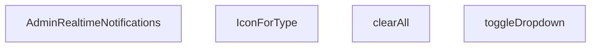

## Genel Bakış
`AdminRealtimeNotifications`, yönetim panelinde gerçek zamanlı bildirimlerin görüntülenmesini ve yönetilmesini sağlayan bir React bileşenidir. Bildirim menüsünün açılıp kapatılması, okunmamış bildirimlerin toplu olarak temizlenmesi ve bildirim türlerine göre uygun ikonların seçilmesi gibi temel işlevleri bir arada sunar. Bileşen, bildirim akışının görsel yönetimini merkezileştirerek kullanıcı deneyimini iyileştirir.

## Fonksiyon Grupları
### Ana Bileşen
Bildirim verisini alarak bileşenin genel yapısını, durum yönetimini ve render mantığını yönlendiren ana giriş noktasıdır.
- `AdminRealtimeNotifications`

### Kullanıcı Etkileşimleri
Bildirim menüsünün açık/kapalı durumunu değiştiren ve bildirimlerin toplu olarak temizlenmesini sağlayan yardımcı işlevlerdir.
- `toggleDropdown`, `clearAll`

### Görsel Eşleştirme
Bildirim türlerine göre uygun ikonları dinamik olarak belirleyerek arayüzde görsel tutarlılık sağlayan yardımcı bileşendir.
- `IconForType`

---

## AXIOMS – Mimari Varsayımlar

Bu modül, yönetim panelinde gerçek zamanlı bildirimleri gösteren bir React bileşenidir. Aşağıdaki mimari varsayımlar fonksiyon imzalarından türetilmiştir.

[Aksiyom 1]: `IconForType` fonksiyonu, `type: string` parametresine bağımlıdır. Eğer `type` parametresi `undefined` veya geçersiz bir değer olarak iletilirse, bileşen beklenmeyen bir duruma düşer veya boş/farklı bir ikon döner.

[Aksiyom 2]: `clearAll` fonksiyonu çağrıldığında, bileşenin erişebileceği bir bildirim listesi/havuzunun var olması gerekir. Eğer temizlenecek bildirim kaynağı (state veya context) mevcut değilse, fonksiyon anlamlı bir işlem yapamaz.

[Aksiyom 3]: `toggleDropdown` fonksiyonu, dropdown'ın açık/kapalı durumunu tersine çevirmek için bir toggle mekanizması (state) gerektirir. Eğer bu durum state'i tanımlı değilse, dropdown açma/kapama işlevselligi çalışmaz.

[Aksiyom 4]: `AdminRealtimeNotifications` ana bileşeni parametresiz olarak çağrılmaktadır. Eğer bileşenin çalışması için gerekli bildirim verisi (prop veya context) dışarıdan sağlanmıyorsa, bileşen boş/bozuk render edilir.

[Aksiyom 5]: `IconForType` tarafından desteklenen `type` string değerlerinin tanımlı bir kümesi olmalıdır. Eğer desteklenmeyen bir `type` değeri iletilirse, bileşenin fallback bir ikon göstermesi veya hata yönetimi yapması beklenir — aksi halde bileşen bozulur.

---

## FONKSİYON DETAYLARI

### AdminRealtimeNotifications
**Ne yapar**: Admin panelinde gerçek zamanlı bildirimleri gösteren ana React bileşenidir. Kullanıcıya anlık bildirim akışı sunar ve bildirim yönetimi için arayüz sağlar.

**Nasıl yapar**: Bileşen, gerçek zamanlı bildirimleri alır ve bunları kullanıcıya gösterir. Bildirim dropdown menüsünü, bildirim listesini ve bildirim temizleme işlevselliğini bir arada sunar. İç state'ler aracılığıyla dropdown durumunu ve bildirimleri yönetir.

**Parametreler**:
- Parametre almaz (props'suz fonksiyon bileşeni)

**Dönüş**: `React.FC` tipinde bir React bileşeni döndürür. Bileşen, admin paneline yerleştirilebilen gerçek zamanlı bildirim arayüzünü render eder.

### toggleDropdown
**Ne yapar**: Geliştirildi ancak detay üretilemedi.

### clearAll
**Ne yapar**: Geliştirildi ancak detay üretilemedi.

### IconForType
**Ne yapar**: Geliştirildi ancak detay üretilemedi.

---

## INTERFACES

### AppNotification
- `id: string`
- `type: 'order' | 'stock' | 'system'`
- `title: string`
- `message: string`
- `timestamp: string`
- `isRead: boolean`
- `link?: string`

---

## AST POINTERS

### [N1_NASIL] AST Pointer: src/components/admin/AdminRealtimeNotifications.tsx::AdminRealtimeNotifications
- **params**: (parametre yok — React bileşeni)
- **ic_degiskenler**:
  - `active` — useEffect cleanup flag'i, bileşen unmount edildiğinde async isteklerin iptal edilmesini sağlar
  - `oData` — Supabase'den çekilen son 5 sipariş verisi (venthub_orders tablosu)
  - `sData` — Supabase'den çekilen son 5 stok hareketi verisi (inventory_movements tablosu + products join)
  - `combined` — Sipariş ve stok hareketlerini birleştirip sıralanan bildirim dizisi (AppNotification[])
  - `o` — oData forEach içindeki her bir sipariş satırı objesi
  - `s` — sData forEach içindeki her bir stok hareketi satırı (Record<string, unknown>)
  - `products` — s.products join objesinin cast edilmiş hali (Record<string, unknown> | null)
  - `pName` — Ürün adı, products.name'den alınır
  - `pSku` — Ürün SKU kodu, products.sku'dan alınır
  - `delta` — Stok miktar değişim değeri (Number olarak parse edilmiş)
  - `movementType` — delta > 0 ise 'Giriş', değilse 'Çıkış' string'i
  - `absQty` — delta'nın mutlak değeri (adet gösterimi için)
  - `ordersChannel` — Supabase realtime kanalı, venthub_orders INSERT olaylarını dinler
  - `stockChannel` — Supabase realtime kanalı, inventory_movements INSERT oyunlarını dinler
  - `handleClickOutside` — Dropdown dışına tıklama handler'ı, MouseEvent alır
  - `tenantId` — useTenant hook'undan gelen kiracı ID'si, realtime kanallarının filtresinde kullanılır
  - `dropdownRef` — Dropdown DOM elementine referans (useRef)
  - `isOpen` — Dropdown menüsünün açık/kapalı durumu (state)
  - `notifications` — Bildirim listesi state'i (AppNotification[])
  - `unreadCount` — Okunmamış bildirim sayısı state'i
  - `router` — Next.js router, sayfa yönlendirmeleri için
  - `newOrder` — Realtime payload.new, yeni sipariş objesi (Record<string, unknown>)
  - `totalAmt` — Sipariş toplam tutarı (Number)
  - `amt` — Türk Lirası formatında tutar string'i (Intl.NumberFormat ile)
  - `orderId` — Sipariş ID'si (String cast)
  - `orderNumber` — Sipariş numarası veya ID'nin ilk 8 karakteri
  - `notif` — Oluşturulan bildirim objesi (AppNotification)
  - `m` — Realtime payload.new, yeni stok hareketi objesi (Record<string, unknown>)
- **Dönüş**: React.FC — Bildirim dropdown bileşeni, sipariş ve stok realtime dinleyicileri kurar

---

### [N2_NASIL] AST Pointer: src/components/admin/AdminRealtimeNotifications.tsx::toggleDropdown
- **params**: (parametre yok)
- **ic_degiskenler**:
  - `isOpen` — Mevcut dropdown durumu, !isOpen ile toggle edilir
  - `unreadCount` — Okunmamış bildirim sayısı, dropdown açılırken sıfırlanır
  - `notifications` — Bildirim listesi, açılırken tüm isRead alanları true yapılır
- **Dönüş**: yok — Dropdown açma/kapama durumunu toggle eder, açılırken tüm bildirimleri okundu olarak işaretler

---

### [N3_NASIL] AST Pointer: src/components/admin/AdminRealtimeNotifications.tsx::clearAll
- **params**: (parametre yok)
- **ic_degiskenler**:
  - `notifications` — setNotifications([]) ile boş diziye set edilir
  - `unreadCount` — setUnreadCount(0) ile sıfırlanır
- **Dönüş**: yok — Tüm bildirimleri temizler ve okunmamış sayacını sıfırlar

---

### [N4_NASIL] AST Pointer: src/components/admin/AdminRealtimeNotifications.tsx::IconForType
- **params**: `{ type }` — Bildirim türü ('order', 'stock' veya diğerleri)
- **ic_degiskenler**:
  - `type` — string, bildirim türüne göre farklı ikon döndürür
- **Dönüş**: JSX Element — type='order' için ShoppingBag ikonu (mavi), type='stock' için Box ikonu (yeşil), diğerleri için Activity ikonu (gri)

---

### [N5_NASIL] AST Pointer: src/components/admin/AdminRealtimeNotifications.tsx::useEffect_cleanup_wrapper
- **params**: (parametre yok — arrow function)
- **ic_degiskenler**:
  - `active` — boolean flag, cleanup'ta false yapılır, async fetch'in state güncellemesini engeller
- **Dönüş**: cleanup fonksiyonu döndürür — `active = false` set eder

---

### [N6_NASIL] AST Pointer: src/components/admin/AdminRealtimeNotifications.tsx::fetchRecentActivity
- **params**: (parametre yok — async inner function)
- **ic_degiskenler**:
  - `oData` — Supabase sorgusundan dönen sipariş verisi, null olabilir
  - `sData` — Supabase sorgusundan dönen stok hareketi verisi, null olabilir
  - `combined` — AppNotification[] dizisi, tüm bildirimler burada birleştirilir
  - `products` — s.products join'inin cast edilmiş hali (Record<string, unknown> | null)
  - `pName` — Ürün adı veya 'Bilinmeyen Ürün' fallback'i
  - `pSku` — Ürün SKU kodu veya boş string
  - `delta` — Stok değişim miktarı (Number)
  - `movementType` — 'Giriş' veya 'Çıkış' stringi
  - `absQty` — Mutlak stok değişim miktarı
  - `err` — catch bloğundaki hata objesi
- **Dönüş**: yok — setNotifications ile son 10 bildirimi state'e yazar

---

### [N7_NASIL] AST Pointer: src/components/admin/AdminRealtimeNotifications.tsx::realtime_setup
- **params**: (parametre yok — useEffect callback arrow function)
- **ic_degiskenler**:
  - `ordersChannel` — Supabase realtime kanalı, `admin-orders-realtime-${tenantId}` isimli private kanal
  - `stockChannel` — Supabase realtime kanalı, `admin-stock-realtime-${tenantId}` isimli private kanal
  - `tenantId` — Kiracı ID'si, kanal isimlerinde ve filter parametrelerinde kullanılır
- **Dönüş**: cleanup fonksiyonu — her iki kanalı da removeChannel ile temizler

---

### [N8_NASIL] AST Pointer: src/components/admin/AdminRealtimeNotifications.tsx::order_realtime_handler
- **params**: `payload` — Supabase realtime payload objesi
- **ic_degiskenler**:
  - `newOrder` — payload.new'ın Record<string, unknown> cast'i, yeni sipariş verisi
  - `totalAmt` — newOrder.total_amount'tan parse edilen toplam tutar (Number)
  - `amt` — Intl.NumberFormat ile TR-TRY formatına çevrilmiş tutar stringi
  - `orderId` — newOrder.id'nin String hali
  - `orderNumber` — newOrder.order_number veya orderId'nin ilk 8 karakteri
  - `notif` — Oluşturulan AppNotification objesi, id: `order_rt_${orderId}`
- **Dönüş**: yok — notifications state'ine ekler, unreadCount artırır, toast bildirimi gösterir

---

### [N9_NASIL] AST Pointer: src/components/admin/AdminRealtimeNotifications.tsx::stock_realtime_handler
- **params**: `payload` — Supabase realtime payload objesi
- **ic_degiskenler**:
  - `m` — payload.new'ın Record<string, unknown> cast'i, yeni stok hareketi verisi
  - `delta` — m.delta'dan parse edilen stok değişim miktarı (Number)
  - `movementType` — delta > 0 ise 'Giriş', değilse 'Çıkış'
  - `absQty` — delta'nın Math.abs ile mutlak değeri
  - `notif` — Oluşturulan AppNotification objesi, id: `stock_rt_${String(m.id)}`
- **Dönüş**: yok — notifications state'ine ekler, unreadCount artırır, toast bildirimi gösterir

---

### [N10_NASIL] AST Pointer: src/components/admin/AdminRealtimeNotifications.tsx::toast_click_handler_order
- **params**: `id` — toast ID'si
- **ic_degiskenler**:
  - `id` — toast.dismiss(id) ile kapatılacak toast'un identifier'ı
- **Dönüş**: yok — toast'u kapatır ve notif.link üzerinden router.push ile ilgili sayfaya yönlendirir

---

### [N11_NASIL] AST Pointer: src/components/admin/AdminRealtimeNotifications.tsx::toast_keydown_handler_order
- **params**: `e` — KeyboardEvent
- **ic_degiskenler**:
  - `e.key` — Tuş değeri, 'Enter' veya ' ' kontrol edilir
  - `id` — toast ID'si, dismiss ve yönlendirme için kullanılır
- **Dönüş**: yok — e.preventDefault() çağırır, toast'u kapatır ve sayfaya yönlendirir

---

### [N12_NASIL] AST Pointer: src/components/admin/AdminRealtimeNotifications.tsx::toast_click_handler_stock
- **params**: `id` — toast ID'si
- **ic_degiskenler**:
  - `id` — toast.dismiss(id) ile kapatılacak toast'un identifier'ı
- **Dönüş**: yok — toast'u kapatır ve notif.link üzerinden router.push ile ilgili sayfaya yönlendirir

---

### [N13_NASIL] AST Pointer: src/components/admin/AdminRealtimeNotifications.tsx::toast_keydown_handler_stock
- **params**: `e` — KeyboardEvent
- **ic_degiskenler**:
  - `e.key` — Tuş değeri, 'Enter' veya ' ' kontrol edilir
  - `id` — toast ID'si
- **Dönüş**: yok — e.preventDefault() çağırır, toast'u kapatır ve sayfaya yönlendirir

---

### [N14_NASIL] AST Pointer: src/components/admin/AdminRealtimeNotifications.tsx::realtime_cleanup
- **params**: (parametre yok)
- **ic_degiskenler**:
  - `ordersChannel` — Temizlenecek sipariş realtime kanalı referansı
  - `stockChannel` — Temizlenecek stok realtime kanalı referansı
- **Dönüş**: yok — supabase.removeChannel ile her iki kanalı kapatır

---

### [N15_NASIL] AST Pointer: src/components/admin/AdminRealtimeNotifications.tsx::useClickOutside
- **params**: (parametre yok — useEffect callback)
- **ic_degiskenler**:
  - `handleClickOutside` — MouseEvent handler, dropdownRef.contains kontrolü ile dropdown dışına tıklama algılar
  - `dropdownRef` — Dropdown DOM referansı, contains() ile hedef element kontrolü yapılır
- **Dönüş**: cleanup fonksiyonu — document.removeEventListener ile mousedown listener'ı temizler

---

### [N16_NASIL] AST Pointer: src/components/admin/AdminRealtimeNotifications.tsx::handleClickOutside
- **params**: `event` — MouseEvent
- **ic_degiskenler**:
  - `dropdownRef.current` — Dropdown DOM elementi, null olabilir
  - `event.target` — Tıklanan element (Node'a cast edilir)
- **Dönüş**: yok — dropdownRef.contains(event.target) false ise setIsOpen(false) çağırır

---

### [N17_NASIL] AST Pointer: src/components/admin/AdminRealtimeNotifications.tsx::notification_list_item_click
- **params**: `notif` — AppNotification objesi
- **ic_degiskenler**:
  - `notif.link` — Bildirim linki, varsa router.push ile yönlendirme yapılır
  - `notif.id` — React key olarak kullanılır
  - `notif.isRead` — Okunma durumu, CSS class belirlemede kullanılır
  - `notif.type` — Bildirim türü, IconForType'a parametre olarak geçilir
  - `notif.title` — Bildirim başlığı, JSX'te gösterilir
  - `notif.message` — Bildirim mesajı, JSX'te gösterilir
  - `notif.timestamp` — Zaman damgası, formatDateTime ile formatlanır
- **Dönüş**: JSX Element — Bildirim satırı, tıklanınca sayfa yönlendirmesi yapar

---

### [N18_NASIL] AST Pointer: src/components/admin/AdminRealtimeNotifications.tsx::notification_item_click_handler
- **params**: (parametre yok — onClick callback)
- **ic_degiskenler**:
  - `notif.link` — Navigate linki, varsa router.push çağrılır
  - `notif.link as import('next').Route` — Next.js Route tipine cast edilir
- **Dönüş**: yok — dropdown'ı kapatır ve ilgili sayfaya yönlendirir

---

### [N19_NASIL] AST Pointer: src/components/admin/AdminRealtimeNotifications.tsx::notification_item_keydown_handler
- **params**: `e` — KeyboardEvent
- **ic_degiskenler**:
  - `e.key` — Tuş değeri, 'Enter' veya ' ' kontrolü
  - `notif.link` — Navigate linki
- **Dönüş**: yok — e.preventDefault(), dropdown kapatma ve router.push yönlendirmesi

---

## MERMAID CALL GRAPH

## NODE ID STANDARD

  file: src\components\admin\AdminRealtimeNotifications.tsx
  function: src\components\admin\AdminRealtimeNotifications.tsx::AdminRealtimeNotifications
  function: src\components\admin\AdminRealtimeNotifications.tsx::toggleDropdown
  function: src\components\admin\AdminRealtimeNotifications.tsx::clearAll
  function: src\components\admin\AdminRealtimeNotifications.tsx::IconForType

---

## DISA AKTARILANLAR (EXPORTS)
  export: AdminRealtimeNotifications

---

## STİL TOKENLERİ

### Arbitrary Değerler (token'a geçirilmemiş)
Yok — tüm stiller token'a geçirilmiş. ✅

### Kullanılan Token'lar (zaten token'a geçirilmiş)
- (yok)

### Tailwind Sınıf Özeti
- **Renkler:** `bg-blue-50`, `bg-blue-50/30`, `bg-emerald-50`, `bg-emerald-500/10`, `bg-primary-navy`, `bg-primary-navy/10`, `bg-rose-100`, `bg-rose-500`, `bg-slate-100`, `bg-slate-50/30`, `bg-slate-50/50`, `bg-slate-50/80`, `bg-slate-500/10`, `bg-white`, `border-2`
- **Layout:** `absolute`, `flex`, `flex-1`, `flex-col`, `flex-shrink-0`, `gap-1`, `gap-2`, `gap-3`, `h-10`, `h-12`, `h-2`, `h-2.5`, `items-center`, `justify-between`, `justify-center`
- **Varyant/Responsive:** `:`, `hover:`, `sm:` önekleri
- **Yardımcı Sınıflar:** `${!notif.isRead`, `${notif.link`, `:`, `animate-in`, `animate-pulse`, `border`, `cursor-pointer`, `duration-300`, `fade-in`, `font-bold`, `font-medium`, `hover:shadow`, `leading-relaxed`, `mb-3`, `ml-3`