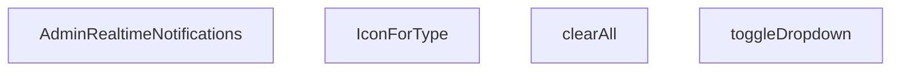

## Genel Bakış
Bu modül, yönetim panelinde gerçek zamanlı bildirimlerin görüntülenmesini ve yönetilmesini sağlayan bir React bileşeni içerir. Bileşen, bildirim menüsünün açılıp kapatılması, tüm bildirimlerin temizlenmesi ve bildirim türlerine göre uygun ikonun seçilmesi gibi temel etkileşimleri kontrol eder.

## Fonksiyon Grupları
### Ana Bileşen
Tüm bildirim mantığını ve durum yönetimini üstlenen ana React bileşenidir.
- AdminRealtimeNotifications

### Etkileşim Yardımcıları
Bildirim menüsünün durumunu değiştiren ve bildirim listesini temizleyen yardımcı fonksiyonlardır.
- toggleDropdown, clearAll

### Görsel Eşleştirme
Bildirim türüne göre uygun ikon bileşenini seçen yardımcı bileşendir.
- IconForType

---

## AXIOMS – Mimari Varsayımlar
- Bu modül davranışsal mantık içermez (salt veri / konfigürasyon / tip tanımı).
- [Aksiyom 1]: Modülün dışa açtığı yapı (anahtar kümesi / şema) bir sözleşmedir; tüketiciler bu sabit yapıya bağlıdır — kırıcı değişiklik tüm tüketicileri etkiler.
- [Aksiyom 2]: Bir öğe ekleme/çıkarma yapısal-uyumlu olmalı; ilgili tipler ve seçiciler aynı commit'te güncel tutulmalıdır.

---

## FONKSİYON DETAYLARI

### AdminRealtimeNotifications
**Ne yapar**: Admin panelinde gerçek zamanlı bildirimleri gösteren ana React bileşenidir. Kullanıcıya anlık bildirim akışı sunar ve bildirim yönetimi için arayüz sağlar.

**Nasıl yapar**: Bileşen, gerçek zamanlı bildirimleri alır ve bunları kullanıcıya gösterir. Bildirim dropdown menüsünü, bildirim listesini ve bildirim temizleme işlevselliğini bir arada sunar. İç state'ler aracılığıyla dropdown durumunu ve bildirimleri yönetir.

**Parametreler**:
- Parametre almaz (props'suz fonksiyon bileşeni)

**Dönüş**: `React.FC` tipinde bir React bileşeni döndürür. Bileşen, admin paneline yerleştirilebilen gerçek zamanlı bildirim arayüzünü render eder.

### toggleDropdown
**Ne yapar**: Geliştirildi ancak detay üretilemedi.

### clearAll
**Ne yapar**: Geliştirildi ancak detay üretilemedi.

### IconForType
**Ne yapar**: Geliştirildi ancak detay üretilemedi.

---

## İTHALATLAR (IMPORTS)
- import: ../../hooks/useTenant::useTenant
- import: ../../i18n/I18nProvider::useI18n
- import: ../../i18n/datetime::formatDateTime
- import: ../../i18n/format::formatCurrency
- import: @/hooks/useRole::useRole
- import: @/lib/admin/inboxCounts::InboxCounts
- import: @/lib/admin/inboxCounts::fetchInboxCounts
- import: @/lib/supabase/client::supabaseBrowserClient
- import: next/navigation::useRouter
- import: react::React
- import: react::useEffect
- import: react::useRef
- import: react::useState
- import: sonner::toast

---

## INTERFACES

### AppNotification
- `id: string`
- `type: 'order' | 'stock' | 'system'`
- `title: string`
- `message: string`
- `timestamp: string`
- `isRead: boolean`
- `link?: string`

---

## AST POINTERS

### [N1_NASIL] AST Pointer: src/components/admin/AdminRealtimeNotifications.tsx::AdminRealtimeNotifications
- **params**: (parametre yok)
- **ic_degiskenler**:
  - `isOpen` — dropdown menüsünün açık/kapalı durumunu tutan state
  - `setIsOpen` — isOpen state'ini güncelleyen setter fonksiyonu
  - `notifications` — bildirim listesini tutan state (AppNotification[])
  - `setNotifications` — notifications state'ini güncelleyen setter fonksiyonu
  - `unreadCount` — okunmamış bildirim sayısını tutan state
  - `setUnreadCount` — unreadCount state'ini güncelleyen setter fonksiyonu
  - `inboxCounts` — gelen kutusu sayımlarını tutan state (InboxCounts)
  - `setInboxCounts` — inboxCounts state'ini güncelleyen setter fonksiyonu
  - `dropdownRef` — dropdown DOM elemanına referans veren useRef
  - `router` — Next.js useRouter ile alınan router nesnesi
  - `canWrite` — useRole hook'undan gelen yetki kontrol fonksiyonu
  - `tenantId` — useTenant hook'undan gelen kiracı kimliği
  - `lang` — useTenant hook'undan gelen dil kodu
  - `t` — çeviri fonksiyonu (useTenant veya i18n'den)
  - `loadInboxCounts` — gelen kutusu sayımlarını yükleyen async fonksiyon
  - `toggleDropdown` — dropdown açma/kapama fonksiyonu
  - `clearAll` — tüm bildirimleri temizleyen fonksiyon
  - `fetchRecentActivity` — son aktiviteleri Supabase'den çeken async fonksiyon
  - `hasAnyAccess` — kullanıcının herhangi bir modüle yazma yetkisi olup olmadığını gösteren boolean
  - `counts` — fetchInboxCounts sonucu dönen InboxCounts verisi
  - `err` — yakalanan hata nesnesi
  - `interval` — setInterval referansı
  - `handleClickOutside` — dışarı tıklama olayını yakalayan fonksiyon
  - `handleKeyDown` — klavye olayını yakalayan fonksiyon
  - `active` — bileşen hâlâ aktif mi bilgisini tutan boolean flag
  - `oData` — venthub_orders tablosundan çekilen son 5 sipariş verisi
  - `sData` — inventory_movements tablosundan çekilen son 5 stok hareketi verisi
  - `combined` — sipariş ve stok hareketlerinin birleştirildiği bildirim dizisi
  - `ordersChannel` — Supabase realtime sipariş kanalı
  - `stockChannel` — Supabase realtime stok hareketi kanalı
  - `inboxMenuItems` — gelen kutusu menü öğeleri dizisi (sayım ve ikon bilgileriyle)
- **Dönüş**: JSX.Element (React.FC)

### [N2_NASIL] AST Pointer: src/components/admin/AdminRealtimeNotifications.tsx::loadInboxCounts
- **params**: (parametre yok)
- **ic_degiskenler**:
  - `hasAnyAccess` — canWrite('returns'), canWrite('orders'), canWrite('inventory'), canWrite('error_groups') kontrollerinin OR sonucu; kullanıcı en az bir modüle yazabiliyorsa true
  - `counts` — fetchInboxCounts(supabase) çağrısından dönen InboxCounts verisi
  - `err` — try-catch bloğunda yakalanan hata nesnesi; console.error ile loglanır
- **Dönüş**: yok (void, async fonksiyon; yan etki olarak setInboxCounts çağırır)

### [N3_NASIL] AST Pointer: src/components/admin/AdminRealtimeNotifications.tsx::toggleDropdown
- **params**: (parametre yok)
- **ic_degiskenler**: (yok)
- **Dönüş**: yok (void; isOpen state'ini tersine çevirir, isOpen false iken açılıyorsa tüm bildirimleri okundu olarak işaretler ve unreadCount'ı sıfırlar)

### [N4_NASIL] AST Pointer: src/components/admin/AdminRealtimeNotifications.tsx::clearAll
- **params**: (parametre yok)
- **ic_degiskenler**: (yok)
- **Dönüş**: yok (void; notifications dizisini boşaltır ve unreadCount'ı sıfırlar)

### [N5_NASIL] AST Pointer: src/components/admin/AdminRealtimeNotifications.tsx::IconForType
- **params**: `{ type: string }` — bildirim tipi ('order', 'stock' veya diğer)
- **ic_degiskenler**: (yok)
- **Dönüş**: JSX.Element — tip 'order' ise ShoppingBag ikonu, 'stock' ise Box ikonu, diğer durumlarda Activity ikonu döndürür

### [N6_NASIL] AST Pointer: src/components/admin/AdminRealtimeNotifications.tsx::fetchRecentActivity
- **params**: (parametre yok)
- **ic_degiskenler**:
  - `oData` — supabase.from('venthub_orders') sorgusundan dönen veri; id, total_amount, created_at, order_number alanlarını içerir, created_at'e göre azalan sırada ilk 5 kayıt
  - `sData` — supabase.from('inventory_movements') sorgusundan dönen veri; id, delta, reason, created_at ve products (join ile name, sku) alanlarını içerir, created_at'e göre azalan sırada ilk 5 kayıt
  - `combined` — AppNotification tipinde birleştirilmiş bildirim dizisi
  - `o` — oData dizisindeki her bir sipariş objesi
  - `formattedAmount` — formatCurrency(o.total_amount || 0, lang, { currency: 'TRY' }) ile formatlanmış sipariş tutarı
  - `s` — sData dizisindeki her bir stok hareketi objesi (Record<string, unknown>)
  - `products` — s.products alanından türetilen ürün bilgisi (Record<string, unknown> | null)
  - `pName` — products?.name veya t('admin.dashboard.unknownProduct') ile elde edilen ürün adı
  - `pSku` — products?.sku veya boş string ile elde edilen ürün SKU'su
  - `delta` — Number(s.delta || 0) ile elde edilen stok değişim miktarı
  - `movementType` — delta > 0 ise 'incomingLabel', değilse 'outgoingLabel' çeviri anahtarı
  - `absQty` — Math.abs(delta) ile elde edilen mutlak miktar
  - `err` — yakalanan hata nesnesi; console.error ile loglanır
- **Dönüş**: yok (void, async fonksiyon; yan etki olarak setNotifications çağırır, combined dizisini tarihe göre sıralayıp ilk 10 kaydı alır)

### [N7_NASIL] AST Pointer: src/components/admin/AdminRealtimeNotifications.tsx::ordersChannel.on callback
- **params**: `payload` — Supabase postgres_changes olay payload'ı; INSERT olayında yeni sipariş verisini içerir
- **ic_degiskenler**:
  - `newOrder` — payload.new alanından türetilen yeni sipariş verisi (Record<string, unknown>)
  - `totalAmt` — Number(newOrder.total_amount || 0) ile elde edilen toplam tutar
  - `amt` — formatCurrency(totalAmt, lang, { currency: 'TRY' }) ile formatlanmış tutar
  - `orderId` — String(newOrder.id || '') ile elde edilen sipariş kimliği
  - `orderNumber` — newOrder.order_number varsa onu kullanır, yoksa orderId'nin ilk 8 karakteri
  - `notif` — oluşturulan AppNotification nesnesi; id 'order_rt_' ön ekiyle başlar, type 'order', isRead false, link sipariş sayfasına yönlendirir
  - `id` — toast.custom callback'indeki toast kimliği
  - `e` — onKeyDown olayındaki KeyboardEvent nesnesi
- **Dönüş**: yok (void; yan etki olarak setNotifications, setUnreadCount, loadInboxCounts ve toast.custom çağırır)

### [N8_NASIL] AST Pointer: src/components/admin/AdminRealtimeNotifications.tsx::stockChannel.on callback
- **params**: `payload` — Supabase postgres_changes olay payload'ı; INSERT olayında yeni stok hareketi verisini içerir
- **ic_degiskenler**:
  - `m` — payload.new alanından türetilen stok hareketi verisi (Record<string, unknown>)
  - `delta` — Number(m.delta || 0) ile elde edilen stok değişim miktarı
  - `movementType` — delta > 0 ise 'incomingLabel', değilse 'outgoingLabel' çeviri anahtarı
  - `absQty` — Math.abs(delta) ile elde edilen mutlak miktar
  - `notif` — oluşturulan AppNotification nesnesi; id 'stock_rt_' ön ekiyle başlar, type 'stock', isRead false, link '/admin/products' sayfasına yönlendirir
  - `id` — toast.custom callback'indeki toast kimliği
  - `e` — onKeyDown olayındaki KeyboardEvent nesnesi
- **Dönüş**: yok (void; yan etki olarak setNotifications, setUnreadCount, loadInboxCounts ve toast.custom çağırır)

### [N9_NASIL] AST Pointer: src/components/admin/AdminRealtimeNotifications.tsx::useEffect (realtime subscriptions)
- **params**: (parametre yok; useEffect bağımlılık dizisi: [tenantId, lang])
- **ic_degiskenler**:
  - `ordersChannel` — supabase.channel ile oluşturulan sipariş realtime kanalı; 'admin-orders-realtime-{tenantId}' adıyla, private config ile, venthub_orders tablosundaki INSERT olaylarını dinler, tenant_id filtresi uygular
  - `stockChannel` — supabase.channel ile oluşturulan stok hareketi realtime kanalı; 'admin-stock-realtime-{tenantId}' adıyla, private config ile, inventory_movements tablosundaki INSERT olaylarını dinler, tenant_id filtresi uygular
- **Dönüş**: cleanup fonksiyonu (supabase.removeChannel(ordersChannel) ve supabase.removeChannel(stockChannel) çağırır)

### [N10_NASIL] AST Pointer: src/components/admin/AdminRealtimeNotifications.tsx::useEffect (fetchRecentActivity)
- **params**: (parametre yok; useEffect bağımlılık dizisi: [lang])
- **ic_degiskenler**:
  - `active` — bileşen hâlâ aktif mi bilgisini tutan boolean; cleanup fonksiyonunda false yapılır
  - `fetchRecentActivity` — son sipariş ve stok hareketlerini Supabase'den çekip combined dizisine dönüştüren async fonksiyon
- **Dönüş**: cleanup fonksiyonu (active = false atar)

### [N11_NASIL] AST Pointer: src/components/admin/AdminRealtimeNotifications.tsx::useEffect (interval)
- **params**: (parametre yok; useEffect bağımlılık dizisi: [])
- **ic_degiskenler**:
  - `interval` — setInterval ile her 30000 milisaniyede (30 saniye) bir loadInboxCounts() çağıran interval referansı
- **Dönüş**: cleanup fonksiyonu (clearInterval(interval) çağırır)

### [N12_NASIL] AST Pointer: src/components/admin/AdminRealtimeNotifications.tsx::useEffect (click outside)
- **params**: (parametre yok; useEffect bağımlılık dizisi: [])
- **ic_degiskenler**:
  - `handleClickOutside` — document üzerindeki mousedown olayını dinleyen fonksiyon; dropdownRef.current varsa ve tıklanan hedef dropdown içinde değilse setIsOpen(false) çağırır
  - `event` — MouseEvent nesnesi; tıklanan hedef elemanı içerir
- **Dönüş**: cleanup fonksiyonu (document.removeEventListener('mousedown', handleClickOutside) çağırır)

### [N13_NASIL] AST Pointer: src/components/admin/AdminRealtimeNotifications.tsx::useEffect (keydown)
- **params**: (parametre yok; useEffect bağımlılık dizisi: [isOpen])
- **ic_degiskenler**:
  - `handleKeyDown` — document üzerindeki keydown olayını dinleyen fonksiyon; Escape tuşuna basıldığında setIsOpen(false) çağırır
  - `event` — KeyboardEvent nesnesi; basılan tuşu içerir
- **Dönüş**: cleanup fonksiyonu (document.removeEventListener('keydown', handleKeyDown) çağırır; sadece isOpen true iken listener eklenir)

### [N14_NASIL] AST Pointer: src/components/admin/AdminRealtimeNotifications.tsx::useEffect (initial load)
- **params**: (parametre yok; useEffect bağımlılık dizisi: [])
- **ic_degiskenler**: (yok)
- **Dönüş**: yok (void; mount anında loadInboxCounts() çağırır)

### [N15_NASIL] AST Pointer: src/components/admin/AdminRealtimeNotifications.tsx::useEffect (isOpen load)
- **params**: (parametre yok; useEffect bağımlılık dizisi: [isOpen])
- **ic_degiskenler**: (yok)
- **Dönüş**: yok (void; isOpen true olduğunda loadInboxCounts() çağırır)

### [N16_NASIL] AST Pointer: src/components/admin/AdminRealtimeNotifications.tsx::useEffect (visibilitychange)
- **params**: (parametre yok; useEffect bağımlılık dizisi: [])
- **ic_degiskenler**: (yok)
- **Dönüş**: yok (void; sayfa görünürlüğü değiştiğinde loadInboxCounts() çağırır)

---

## MERMAID CALL GRAPH

## NODE ID STANDARD

  file: src\components\admin\AdminRealtimeNotifications.tsx
  function: src\components\admin\AdminRealtimeNotifications.tsx::AdminRealtimeNotifications
  function: src\components\admin\AdminRealtimeNotifications.tsx::toggleDropdown
  function: src\components\admin\AdminRealtimeNotifications.tsx::clearAll
  function: src\components\admin\AdminRealtimeNotifications.tsx::IconForType

---

## DISA AKTARILANLAR (EXPORTS)
  export: AdminRealtimeNotifications

---

## STİL TOKENLERİ

### Arbitrary Değerler (token'a geçirilmemiş)
Yok — tüm stiller token'a geçirilmiş. ✅

### Kullanılan Token'lar (zaten token'a geçirilmiş)
- (yok)

### Tailwind Sınıf Özeti
- **Renkler:** `bg-admin-accent`, `bg-admin-accent-weak`, `bg-admin-danger`, `bg-admin-success`, `bg-admin-success-weak`, `bg-admin-surface`, `bg-admin-surface-2`, `bg-admin-surface-3`, `bg-primary-navy/10`, `border-2`, `border-admin-border`, `border-admin-success`, `border-b`, `border-l-4`, `border-primary-navy`
- **Layout:** `absolute`, `flex`, `flex-1`, `flex-col`, `flex-shrink-0`, `gap-1`, `gap-1.5`, `gap-2`, `gap-2.5`, `gap-3`, `grid`, `grid-cols-1`, `h-10`, `h-12`, `h-2`
- **Varyant/Responsive:** `:`, `focus-visible:`, `group-hover:`, `hover:`, `sm:` önekleri
- **Yardımcı Sınıflar:** `${!notif.isRead`, `${item.bgColor`, `${notif.link`, `:`, `animate-in`, `animate-pulse`, `border`, `cursor-pointer`, `duration-300`, `fade-in`, `focus-visible:outline-none`, `focus-visible:ring-2`, `focus-visible:ring-primary-navy/20`, `font-bold`, `font-medium`