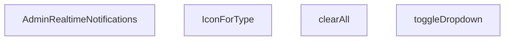

## Genel Bakış
`AdminRealtimeNotifications` bileşeni, yönetim panelinde gerçek zamanlı bildirimleri görsel olarak sunan ve bunlarla etkileşime girilmesini sağlayan bir React UI modülüdür. Bildirimleri listeleme, bildirim menüsünü açma/kapama, tüm bildirimleri temizleme ve bildirim türlerine göre ikon atama gibi temel sorumlulukları barındırır. Bileşen, bildirimlerin durumunu ve kullanıcının bu bildirimler üzerindeki aksiyonlarını yönetir.

## Fonksiyon Grupları
### Ana Bileşen ve Render
Modülün ana giriş noktasıdır; bildirim verisini alır, durumunu yönetir ve bileşenin nihai görünümünü (JSX) render eder.
- `AdminRealtimeNotifications`

### Bildirim Etkileşimleri
Kullanıcının bildirimler üzerindeki temel eylemlerini işler; bildirim panelinin açılıp kapatılması ve tüm bildirilerin temizlenmesi gibi durum değişikliklerini tetikler.
- `toggleDropdown`, `clearAll`

### Görsel Yardımcılar
Bildirim türlerine (örneğin, uyarı, başarı, bilgi) göre uygun ikonları eşleştirerek arayüzde görsel tutarlılık ve tanımlanabilirlik sağlar.
- `IconForType`

---

## AXIOMS – Mimari Varsayımlar

[Modül, fonksiyon gövdeleri paylaşılmadığı için yalnızca imza analizine dayalı minimal varsayımlar içermektedir.]

[Aksiyom 1]: Eğer `IconForType` fonksiyonuna `type` parametresi olarak geçerli bir `string` değeri sağlanmazsa (undefined veya boş string), bileşen için uygun ikon belirlenemez ve render davranışı belirsiz olur.

[Aksiyom 2]: Eğer `AdminRealtimeNotifications` ana bileşeni hiç parametre almıyorsa (props yoksa), bildirim verisi fonksiyon gövdesinde erişilen bir dış bağımlılık (React Context, global state vb.) aracılığıyla temin edilmelidir; aksi halde gösterilecek bildirim listesi boş veya tanımsız kalır.

[Aksiyom 3]: Eğer `toggleDropdown` ve `clearAll` fonksiyonları hiç parametre almıyorsa, bu fonksiyonların etkilediği durum (dropdown açık/kapalı durumu, bildirim listesi) modül içindeki bir state (useState/useRef) veya dış bir state yönetimi ile tutulmalıdır; aksi halde eylemlerin etkisi hiçbir veri üzerinde gerçekleşmez.

[Aksiyom 4]: Eğer `IconForType` fonksiyonu tarafından desteklenmeyen bir `type` string'i geçilirse (örneğin bilinmeyen bir bildirim türü), varsayılan/fallback bir ikon gösterilmeli ya da bileşen kırılmalı; bu davranış fonksiyon gövdesinde tanımlı değilse uygulama hata verebilir.

---

## FONKSİYON DETAYLARI

### AdminRealtimeNotifications
**Ne yapar**: Admin panelinde gerçek zamanlı bildirimleri gösteren ana React bileşenidir. Kullanıcıya anlık bildirim akışı sunar ve bildirim yönetimi için arayüz sağlar.

**Nasıl yapar**: Bileşen, gerçek zamanlı bildirimleri alır ve bunları kullanıcıya gösterir. Bildirim dropdown menüsünü, bildirim listesini ve bildirim temizleme işlevselliğini bir arada sunar. İç state'ler aracılığıyla dropdown durumunu ve bildirimleri yönetir.

**Parametreler**:
- Parametre almaz (props'suz fonksiyon bileşeni)

**Dönüş**: `React.FC` tipinde bir React bileşeni döndürür. Bileşen, admin paneline yerleştirilebilen gerçek zamanlı bildirim arayüzünü render eder.

### toggleDropdown
**Ne yapar**: Geliştirildi ancak detay üretilemedi.

### clearAll
**Ne yapar**: Geliştirildi ancak detay üretilemedi.

### IconForType
**Ne yapar**: Geliştirildi ancak detay üretilemedi.

---

## INTERFACES

### AppNotification
- `id: string`
- `type: 'order' | 'stock' | 'system'`
- `title: string`
- `message: string`
- `timestamp: string`
- `isRead: boolean`
- `link?: string`

---

## AST POINTERS

### [N1_NASIL] AST Pointer: AdminRealtimeNotifications.tsx::useEffect_InitialFetch
- **params**: () — useCallback/arrow fonksiyonu, parametre yok
- **ic_degiskenler**:
  - `active` — asenkron işlemlerin hâlâ geçerli olup olmadığını kontrol eden bayrak; temizleme fonksiyonunda `false` yapılır
  - `fetchRecentActivity` — inner async fonksiyon; siparişleri ve stok hareketlerini Supabase'den çeker, birleştirir
  - `oData` — `supabase.from('venthub_orders').select(...)` sonucundan dönen sipariş veri dizisi
  - `sData` — `supabase.from('inventory_movements').select(...)` sonucundan dönen stok hareketi veri dizisi
  - `combined` — `AppNotification[]` tipinde; sipariş ve stok bildirimlerinin birleştirildiği dizi
  - `o` — `oData.forEach` iterasyonunda her bir sipariş satırı; `o.id`, `o.total_amount`, `o.created_at`, `o.order_number` erişimleri yapılır
  - `s` — `sData.forEach` iterasyonunda her bir stok hareketi satırı (`Record<string, unknown>`)
  - `products` — `s.products` cast edilmiş nesne; `products?.name` ve `products?.sku` erişimleri yapılır
  - `pName` — `products?.name` değeri veya fallback `'Bilinmeyen Ürün'`
  - `pSku` — `products?.sku` değeri veya boş string
  - `delta` — `s.delta` sayısına dönüştürülmüş stok değişim miktarı
  - `movementType` — `delta > 0` ise `'Giriş'`, değilse `'Çıkış'`
  - `absQty` — `Math.abs(delta)` ile mutlak değer
  - `err` — catch bloğunda yakalanan hata nesnesi
- **Dönüş**: cleanup fonksiyonu `() => { active = false }` döner

### [N2_NASIL] AST Pointer: AdminRealtimeNotifications.tsx::fetchRecentActivity
- **params**: () — inner async fonksiyon, parametre yok
- **ic_degiskenler**:
  - `oData` — `supabase.from('venthub_orders').select('id, total_amount, created_at, order_number').order('created_at', { ascending: false }).limit(5)` sonucu; `oData.forEach` ile `o.id`, `o.total_amount`, `o.created_at`, `o.order_number` alanları okunur
  - `sData` — `supabase.from('inventory_movements').select('id, delta, reason, created_at, products!product_id(name, sku)').order(...).limit(5)` sonucu
  - `combined` — `AppNotification[]` tipinde boş dizi; bildirimler buraya push edilir
  - `o` — `oData.forEach` callback parametresi; her sipariş kaydı
  - `s` — `sData.forEach` callback parametresi; `Record<string, unknown>` tipinde stok hareketi kaydı
  - `products` — `s.products` alanının `Record<string, unknown> | null` cast'i
  - `pName` — `products?.name || 'Bilinmeyen Ürün'` — ürün adı
  - `pSku` — `products?.sku || ''` — ürün SKU kodu
  - `delta` — `Number(s.delta || 0)` — stok değişim miktarı
  - `movementType` — `delta > 0 ? 'Giriş' : 'Çıkış'` hareket yönü etiketi
  - `absQty` — `Math.abs(delta)` — mutlak stok miktarı
  - `a`, `b` — `combined.sort` callback parametreleri; sıralama için bildirim nesneleri
  - `err` — catch bloğundaki hata nesnesi
- **Dönüş**: yok; `setNotifications(combined.slice(0, 10))` ile yan etki

### [N3_NASIL] AST Pointer: AdminRealtimeNotifications.tsx::useEffect_RealtimeSubscriptions
- **params**: () — useCallback/arrow fonksiyonu, parametre yok
- **ic_degiskenler**:
  - `ordersChannel` — `supabase.channel('admin-orders-realtime')` ile oluşturulan sipariş gerçek zamanlı kanalı; `.on('postgres_changes', ...)` ve `.subscribe()` zincirlenir
  - `stockChannel` — `supabase.channel('admin-stock-realtime')` ile oluşturulan stok gerçek zamanlı kanalı; `.on('postgres_changes', ...)` ve `.subscribe()` zincirlenir
  - `newOrder` — sipariş INSERT callback'inde `payload.new as Record<string, unknown>` cast edilmiş yeni sipariş nesnesi; `newOrder.id`, `newOrder.total_amount`, `newOrder.order_number`, `newOrder.created_at` alanları okunur
  - `totalAmt` — `Number(newOrder.total_amount || 0)` — sipariş tutarı
  - `amt` — `Intl.NumberFormat('tr-TR', ...).format(totalAmt)` ile formatlanmış para birimi stringi
  - `orderId` — `String(newOrder.id || '')` — sipariş ID'si string karşılığı
  - `orderNumber` — `newOrder.order_number` varsa String, yoksa `orderId.slice(0, 8)` — sipariş numarası
  - `notif` — `AppNotification` tipinde; realtime sipariş bildirim nesnesi (`id`, `type`, `title`, `message`, `timestamp`, `isRead`, `link`)
  - `m` — stok INSERT callback'inde `payload.new as Record<string, unknown>` cast edilmiş stok hareketi nesnesi; `m.id`, `m.delta`, `m.reason`, `m.created_at` alanları okunur
  - `delta` — `Number(m.delta || 0)` — stok değişim miktarı
  - `movementType` — `delta > 0 ? 'Giriş' : 'Çıkış'`
  - `absQty` — `Math.abs(delta)` — mutlak stok miktarı
  - `id` — `toast.custom` callback parametresi; toast ID'si
- **Dönüş**: cleanup fonksiyonu `supabase.removeChannel(ordersChannel)` ve `supabase.removeChannel(stockChannel)` çalıştırır

### [N4_NASIL] AST Pointer: AdminRealtimeNotifications.tsx::useEffect_ClickOutside
- **params**: () — useCallback/arrow fonksiyonu, parametre yok
- **ic_degiskenler**:
  - `handleClickOutside` — `(event: MouseEvent) => void` tipinde inner fonksiyon; `event.target`'in `dropdownRef.current` içinde olup olmadığını kontrol eder
  - `event` — `handleClickOutside` callback parametresi; `MouseEvent` tipinde; `event.target as Node` cast edilir
- **Dönüş**: cleanup fonksiyonu `document.removeEventListener('mousedown', handleClickOutside)` döner

### [N5_NASIL] AST Pointer: AdminRealtimeNotifications.tsx::toggleDropdown
- **params**: () — parametre yok
- **ic_degiskenler**: (yok)
- **Dönüş**: yok; `setOpen(!isOpen)`, `setNotifications(prev => prev.map(...))`, `setUnreadCount(0)` ile yan etki

### [N6_NASIL] AST Pointer: AdminRealtimeNotifications.tsx::clearAll
- **params**: () — parametre yok
- **ic_degiskenler**: (yok)
- **Dönüş**: yok; `setNotifications([])` ve `setUnreadCount(0)` ile yan etki

### [N7_NASIL] AST Pointer: AdminRealtimeNotifications.tsx::IconForType
- **params**: `{ type }` — `type: string` — bildirim türü (`'order'`, `'stock'` veya diğer)
- **ic_degiskenler**: (yok)
- **Dönüş**: JSX — `type === 'order'` ise `ShoppingBag` ikonlu mavi daire, `type === 'stock'` ise `Box` ikonlu yeşil daire, aksi halde `Activity` ikonlu gri daire

---

## MERMAID CALL GRAPH

## NODE ID STANDARD

  file: src\components\admin\AdminRealtimeNotifications.tsx
  function: src\components\admin\AdminRealtimeNotifications.tsx::AdminRealtimeNotifications
  function: src\components\admin\AdminRealtimeNotifications.tsx::toggleDropdown
  function: src\components\admin\AdminRealtimeNotifications.tsx::clearAll
  function: src\components\admin\AdminRealtimeNotifications.tsx::IconForType

---

## DISA AKTARILANLAR (EXPORTS)
  export: AdminRealtimeNotifications

---

## STİL TOKENLERİ

### Arbitrary Değerler (token'a geçirilmemiş)
Yok — tüm stiller token'a geçirilmiş. ✅

### Kullanılan Token'lar (zaten token'a geçirilmiş)
- (yok)

### Tailwind Sınıf Özeti
- **Renkler:** `bg-blue-50`, `bg-blue-50/30`, `bg-emerald-50`, `bg-emerald-500/10`, `bg-primary-navy`, `bg-primary-navy/10`, `bg-rose-100`, `bg-rose-500`, `bg-slate-100`, `bg-slate-50/30`, `bg-slate-50/50`, `bg-slate-50/80`, `bg-slate-500/10`, `bg-white`, `border-2`
- **Layout:** `absolute`, `flex`, `flex-1`, `flex-col`, `flex-shrink-0`, `gap-1`, `gap-2`, `gap-3`, `h-10`, `h-12`, `h-2`, `h-2.5`, `items-center`, `justify-between`, `justify-center`
- **Varyant/Responsive:** `:`, `hover:`, `sm:` önekleri
- **Yardımcı Sınıflar:** `${!notif.isRead`, `${notif.link`, `:`, `animate-in`, `animate-pulse`, `border`, `cursor-pointer`, `duration-300`, `fade-in`, `font-bold`, `font-medium`, `hover:shadow`, `leading-relaxed`, `mb-3`, `ml-3`