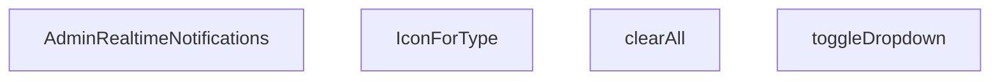

## Genel Bakış
`AdminRealtimeNotifications` bileşeni, yönetim panelinde gerçek zamanlı bildirimlerin görüntülenmesini ve yönetilmesini sağlayan bir React modülüdür. Bildirim panelinin açılıp kapatılması, bildirimlerin temizlenmesi ve türlerine göre ikon eşleştirme gibi işlevsellikleri sunar. Modül, bildirimlerin görsel sunumunu ve kullanıcı etkileşimlerini tek bir bileşen altında merkezileştirir.

## Fonksiyon Grupları
### Ana Bileşen
Bildirim verisini alarak bileşenin genel yapısını ve render mantığını yöneten ana giriş noktasıdır.
- `AdminRealtimeNotifications`

### Etkileşim İşleyicileri
Kullanıcı eylemlerine yanıt veren; bildirim menüsünün durumunu değiştiren ve toplu temizleme işlemini gerçekleştiren yardımcı işlevlerdir.
- `toggleDropdown`, `clearAll`

### Görsel Eşleştirme
Bildirim türlerine göre uygun ikonları dinamik olarak belirleyerek arayüzde tutarlılık sağlayan bileşen içi yardımcı fonksiyondur.
- `IconForType`

---

## AXIOMS – Mimari Varsayımlar

Bu modül için fonksiyon gövdeleri paylaşılmadığı için, yalnızca fonksiyon imzalarından ve modül amacından çıkarılabilecek minimum aksiyomlar tanımlanmıştır.

**[Aksiyom 1]:** Eğer `AdminRealtimeNotifications` bileşeni herhangi bir prop almıyorsa, bildirim verilerinin bileşen dışından (Context, global state vb.) erişilebilir olması gerekir; aksi halde bildirim listesi boş rendered olur.

**[Aksiyom 2]:** Eğer `type` parametresi `IconForType` fonksiyonuna geçilmemişse veya geçersiz bir değerse, varsayılan/bilinmeyen bir ikon gösterimi yapılması beklenir; aksi halde render hatası oluşur.

**[Aksiyom 3]:** Eğer `clearAll` çağrıldığında bildirim listesi zaten boşsa, fonksiyon herhangi bir hata vermeden sessizce çalışmalıdır; aksi halde kullanıcı tarafında beklenmeyen davranış oluşur.

**[Aksiyom 4]:** Eğer `toggleDropdown` çağrıldığında dropdown durumu (açık/kapalı) terslenmeli; bu durum bileşenin dahili state'inde tutulmalıdır, aksi halde menü açılıp kapanamaz.

---

## FONKSİYON DETAYLARI

### AdminRealtimeNotifications
**Ne yapar**: Admin panelinde gerçek zamanlı bildirimleri gösteren ana React bileşenidir. Kullanıcıya anlık bildirim akışı sunar ve bildirim yönetimi için arayüz sağlar.

**Nasıl yapar**: Bileşen, gerçek zamanlı bildirimleri alır ve bunları kullanıcıya gösterir. Bildirim dropdown menüsünü, bildirim listesini ve bildirim temizleme işlevselliğini bir arada sunar. İç state'ler aracılığıyla dropdown durumunu ve bildirimleri yönetir.

**Parametreler**:
- Parametre almaz (props'suz fonksiyon bileşeni)

**Dönüş**: `React.FC` tipinde bir React bileşeni döndürür. Bileşen, admin paneline yerleştirilebilen gerçek zamanlı bildirim arayüzünü render eder.

### toggleDropdown
**Ne yapar**: Geliştirildi ancak detay üretilemedi.

### clearAll
**Ne yapar**: Geliştirildi ancak detay üretilemedi.

### IconForType
**Ne yapar**: Geliştirildi ancak detay üretilemedi.

---

## INTERFACES

### AppNotification
- `id: string`
- `type: 'order' | 'stock' | 'system'`
- `title: string`
- `message: string`
- `timestamp: string`
- `isRead: boolean`
- `link?: string`

---

## AST POINTERS

### [N1_NASIL] AST Pointer: C:\Users\alize\venthub-hvac\src\components\admin\AdminRealtimeNotifications.tsx::AdminRealtimeNotifications
- **params**: (parametre yok)
- **ic_degiskenler**:
  - `active` — Effect cleanup flag'ı, effect temizlendiğinde false yapılarak state güncellemelerini engeller
  - `fetchRecentActivity` — Son siparişleri ve stok hareketlerini Supabase'den çekip birleştiren async fonksiyon
  - `combined` — AppNotification[] tipinde, sipariş ve stok hareketlerinin birleştirildiği dizi
  - `oData` — Supabase'den çekilen son 5 siparişin verisi
  - `sData` — Supabase'den çekilen son 5 stok hareketinin verisi (products join ile)
  - `o` — forEach döngüsünde her bir sipariş nesnesi
  - `s` — forEach döngüsünde her bir stok hareketi nesnesi (Record<string, unknown> cast)
  - `products` — s.products'ın Record<string, unknown> olarak cast edilmesi, null olabilir
  - `pName` — products?.name veya 'Bilinmeyen Ürün' fallback'i ile ürün adı
  - `pSku` — products?.sku veya boş string fallback'i ile ürün SKU'su
  - `delta` — stok değişim miktarı (s.delta || 0'dan number'a çevirme)
  - `movementType` — delta > 0 ise 'Giriş', değilse 'Çıkış' string değeri
  - `absQty` — Math.abs(delta) ile mutlak stok miktarı
- **Dönüş**: React.FC (Component)

### [N2_NASIL] AST Pointer: C:\Users\alize\venthub-hvac\src\components\admin\AdminRealtimeNotifications.tsx::toggleDropdown
- **params**: (parametre yok)
- **ic_degiskenler**:
  - (fonksiyon gövdesinde yeni değişken tanımlanmamış, sadece state setter'ları kullanılıyor)
- **Dönüş**: yok (void)

### [N3_NASIL] AST Pointer: C:\Users\alize\venthub-hvac\src\components\admin\AdminRealtimeNotifications.tsx::clearAll
- **params**: (parametre yok)
- **ic_degiskenler**:
  - (fonksiyon gövdesinde yeni değişken tanımlanmamış, sadece state setter'ları kullanılıyor)
- **Dönüş**: yok (void)

### [N4_NASIL] AST Pointer: C:\Users\alize\venthub-hvac\src\components\admin\AdminRealtimeNotifications.tsx::IconForType
- **params**: { type: string }
- **ic_degiskenler**:
  - `type` — Bildirim türü (order, stock veya diğer), hangi ikonun gösterileceğini belirler
- **Dönüş**: JSX.Element (React icon component)

---

## MERMAID CALL GRAPH

## NODE ID STANDARD

  file: src\components\admin\AdminRealtimeNotifications.tsx
  function: src\components\admin\AdminRealtimeNotifications.tsx::AdminRealtimeNotifications
  function: src\components\admin\AdminRealtimeNotifications.tsx::toggleDropdown
  function: src\components\admin\AdminRealtimeNotifications.tsx::clearAll
  function: src\components\admin\AdminRealtimeNotifications.tsx::IconForType

---

## DISA AKTARILANLAR (EXPORTS)
  export: AdminRealtimeNotifications

---

## STİL TOKENLERİ

### Arbitrary Değerler (token'a geçirilmemiş)
Yok — tüm stiller token'a geçirilmiş. ✅

### Kullanılan Token'lar (zaten token'a geçirilmiş)
- (yok)

### Tailwind Sınıf Özeti
- **Renkler:** `bg-blue-50`, `bg-blue-50/30`, `bg-emerald-50`, `bg-emerald-500/10`, `bg-primary-navy`, `bg-primary-navy/10`, `bg-rose-100`, `bg-rose-500`, `bg-slate-100`, `bg-slate-50/30`, `bg-slate-50/50`, `bg-slate-50/80`, `bg-slate-500/10`, `bg-white`, `border-2`
- **Layout:** `absolute`, `flex`, `flex-1`, `flex-col`, `flex-shrink-0`, `gap-1`, `gap-2`, `gap-3`, `h-10`, `h-12`, `h-2`, `h-2.5`, `items-center`, `justify-between`, `justify-center`
- **Varyant/Responsive:** `:`, `hover:`, `sm:` önekleri
- **Yardımcı Sınıflar:** `${!notif.isRead`, `${notif.link`, `:`, `animate-in`, `animate-pulse`, `border`, `cursor-pointer`, `duration-300`, `fade-in`, `font-bold`, `font-medium`, `hover:shadow`, `leading-relaxed`, `mb-3`, `ml-3`