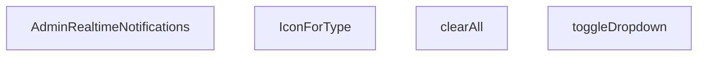

## Genel Bakış
`AdminRealtimeNotifications`, yönetim panelinde gerçek zamanlı bildirimlerin gösterilmesini ve yönetilmesini sağlayan bir React bileşenidir. Bildirim menüsünün açılıp kapatılması, tüm bildirimlerin temizlenmesi ve bildirim türlerine göre ikon seçimi gibi temel etkileşimleri merkezi olarak kontrol eder.

## Fonksiyon Grupları
### Ana Bileşen
Tüm bildirim mantığını ve durum yönetimini yöneten ana React bileşenidir.
- `AdminRealtimeNotifications`

### Etkileşim Yardımcıları
Menü durumunu değiştiren ve bildirimleri temizleyen yardımcı fonksiyonlardır.
- `toggleDropdown`, `clearAll`

### Görsel Eşleştirme
Bildirim türlerine göre ikon bileşenini belirleyen yardımcı bileşendir.
- `IconForType`

---

## AXIOMS – Mimari Varsayımlar
Bu modül, bir React bileşeni olup temel işlevselliği için aşağıdaki mimari varsayımlara bağlıdır.

[Aksiyom 1]: Eğer `AdminRealtimeNotifications` bileşenine bildirim verisi (`notifications` veya benzeri bir prop) sağlanmazsa, bileşen boş bir durum (empty state) gösterir veya hatalı bir duruma geçer.

[Aksiyom 2]: Eğer `toggleDropdown` işlevi, bileşenin iç durumunu (state) güncelleyemezse (örn: `useState` hook'u düzgün çalışmıyorsa), bildirim menüsünün açılıp kapatılması işlevi çalışmaz.

[Aksiyom 3]: Eğer `clearAll` işlevi çağrıldığında temizlenecek bildirim listesi (state) boş değilse, tüm bildirimler listeden kaldırılır. Liste zaten boşsa, işlev herhangi bir yan etki oluşturmaz.

[Aksiyom 4]: Eğer `IconForType` bileşenine `type` prop'u olarak geçerli bir bildirim türü dizesi verilmezse (örn: `undefined`, `null` veya bilinmeyen bir değer), bileşen varsayılan veya hata ikonunu render eder.

---

## FONKSİYON DETAYLARI

### AdminRealtimeNotifications
**Ne yapar**: Admin panelinde gerçek zamanlı bildirimleri gösteren ana React bileşenidir. Kullanıcıya anlık bildirim akışı sunar ve bildirim yönetimi için arayüz sağlar.

**Nasıl yapar**: Bileşen, gerçek zamanlı bildirimleri alır ve bunları kullanıcıya gösterir. Bildirim dropdown menüsünü, bildirim listesini ve bildirim temizleme işlevselliğini bir arada sunar. İç state'ler aracılığıyla dropdown durumunu ve bildirimleri yönetir.

**Parametreler**:
- Parametre almaz (props'suz fonksiyon bileşeni)

**Dönüş**: `React.FC` tipinde bir React bileşeni döndürür. Bileşen, admin paneline yerleştirilebilen gerçek zamanlı bildirim arayüzünü render eder.

### toggleDropdown
**Ne yapar**: Geliştirildi ancak detay üretilemedi.

### clearAll
**Ne yapar**: Geliştirildi ancak detay üretilemedi.

### IconForType
**Ne yapar**: Geliştirildi ancak detay üretilemedi.

---

## INTERFACES

### AppNotification
- `id: string`
- `type: 'order' | 'stock' | 'system'`
- `title: string`
- `message: string`
- `timestamp: string`
- `isRead: boolean`
- `link?: string`

---

## AST POINTERS

### [N1_NASIL] AST Pointer: AdminRealtimeNotifications.tsx::AdminRealtimeNotifications
- **params**: (parametre yok)
- **ic_degiskenler**:
  - `active` — async operasyonların devam edip etmediğini kontrol eden bayrak, component unmount olduğunda false yapılır
  - `ordersChannel` — Supabase Realtime siparişleri için abone olunan kanal
  - `stockChannel` — Supabase Realtime stok hareketleri için abone olunan kanal
  - `handleClickOutside` — Dropdown dışına tıklama olayını yöneten event handler fonksiyonu
  - `setIsOpen` — Dropdown'ın açık/kapalı durumunu güncelleyen state setter
  - `isOpen` — Dropdown'ın şu anki açık/kapalı durumunu tutan state değişkeni
  - `notifications` — Tüm bildirimleri tutan state dizisi
  - `setNotifications` — Bildirimleri güncelleyen state setter
  - `unreadCount` — Okunmamış bildirim sayısını tutan state değişkeni
  - `setUnreadCount` — Okunmamış sayısını güncelleyen state setter
  - `dropdownRef` — Dropdown elementine ref referansı
  - `router` — Next.js useRouter hook'u
  - `tenantId` — useTenant hook'undan gelen kiracı ID'si
  - `formatDateTime` — Tarih formatlama fonksiyonu importu
- **Dönüş**: React.FC (React Functional Component)

### [N2_NASIL] AST Pointer: AdminRealtimeNotifications.tsx::fetchRecentActivity (iç fonksiyon)
- **params**: (parametre yok)
- **ic_degiskenler**:
  - `oData` — Son 5 siparişin verisi (supabase.from('venthub_orders') sorgusu)
  - `sData` — Son 5 stok hareketi verisi (supabase.from('inventory_movements') sorgusu)
  - `combined` — Sipariş ve stok hareketlerinin birleştirildiği AppNotification[]
  - `products` — Stok hareketine ait ürün bilgisi (s.products olarak cast edilir)
  - `pName` — Ürün adı, products.name veya 'Bilinmeyen Ürün' fallback
  - `pSku` — Ürün SKU kodu, products.sku veya boş string
  - `delta` — Stok miktarı değişimi (Number olarak parse edilir)
  - `movementType` — Hareket türü, delta > 0 ise 'Giriş', değilse 'Çıkış'
  - `absQty` — Mutlak stok miktarı (Math.abs ile)
  - `o` — forEach ile dolaşılan her bir sipariş objesi
  - `s` — forEach ile dolaşılan her bir stok hareketi objesi
- **Dönüş**: void (Promise<void>)

### [N3_NASIL] AST Pointer: AdminRealtimeNotifications.tsx::toggleDropdown
- **params**: (parametre yok)
- **ic_degiskenler**:
  - `isOpen` — Mevcut dropdown durumu, !isOpen ile terslenir
  - `unreadCount` — Okunmamış bildirim sayısı, 0'dan büyükse okundu sayılır
- **Dönüş**: void

### [N4_NASIL] AST Pointer: AdminRealtimeNotifications.tsx::clearAll
- **params**: (parametre yok)
- **ic_degiskenler**: (yok)
- **Dönüş**: void (setNotifications([]) ve setUnreadCount(0) ile side effect)

---

## MERMAID CALL GRAPH

## NODE ID STANDARD

  file: src\components\admin\AdminRealtimeNotifications.tsx
  function: src\components\admin\AdminRealtimeNotifications.tsx::AdminRealtimeNotifications
  function: src\components\admin\AdminRealtimeNotifications.tsx::toggleDropdown
  function: src\components\admin\AdminRealtimeNotifications.tsx::clearAll
  function: src\components\admin\AdminRealtimeNotifications.tsx::IconForType

---

## DISA AKTARILANLAR (EXPORTS)
  export: AdminRealtimeNotifications

---

## STİL TOKENLERİ

### Arbitrary Değerler (token'a geçirilmemiş)
Yok — tüm stiller token'a geçirilmiş. ✅

### Kullanılan Token'lar (zaten token'a geçirilmiş)
- (yok)

### Tailwind Sınıf Özeti
- **Renkler:** `bg-blue-50`, `bg-blue-50/30`, `bg-emerald-50`, `bg-emerald-500/10`, `bg-primary-navy`, `bg-primary-navy/10`, `bg-rose-100`, `bg-rose-500`, `bg-slate-100`, `bg-slate-50/30`, `bg-slate-50/50`, `bg-slate-50/80`, `bg-slate-500/10`, `bg-white`, `border-2`
- **Layout:** `absolute`, `flex`, `flex-1`, `flex-col`, `flex-shrink-0`, `gap-1`, `gap-2`, `gap-3`, `h-10`, `h-12`, `h-2`, `h-2.5`, `items-center`, `justify-between`, `justify-center`
- **Varyant/Responsive:** `:`, `hover:`, `sm:` önekleri
- **Yardımcı Sınıflar:** `${!notif.isRead`, `${notif.link`, `:`, `animate-in`, `animate-pulse`, `border`, `cursor-pointer`, `duration-300`, `fade-in`, `font-bold`, `font-medium`, `hover:shadow`, `leading-relaxed`, `mb-3`, `ml-3`