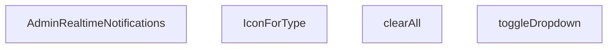

## Genel Bakış
`AdminRealtimeNotifications` modülü, yönetim panelinde gerçek zamanlı bildirimleri görüntüleyen, yöneten ve etkileşimleri işleyen bir React bileşenidir. Bildirim akışını görsel olarak sunar ve kullanıcının bildirimlerle ilgili temel aksiyonlarını (açma/kapama, temizleme) kontrol eder.

## Fonksiyon Grupları
### Ana Bileşen ve Render
Bileşenin temel yapısını ve bildirim listesinin nasıl görüntüleneceğini belirler.
- AdminRealtimeNotifications

### Etkileşim Yönetimi
Kullanıcının bildirimler üzerindeki eylemlerini (menü açma/kapatma, tümünü temizleme) yönetir.
- toggleDropdown, clearAll

### Görsel Yardımcılar
Her bildirim türü için uygun ikonu seçerek arayüzde görsel tutarlılık sağlar.
- IconForType

---

## AXIOMS – Mimari Varsayımlar

Bu modül, bir React UI bileşeni olup fonksiyon imzalarından çıkarılabilecek minimal mimari varsayımlar aşağıdadır.

---

**[Aksiyom 1]:** Eğer `IconForType` fonksiyonuna geçerli bir `type` string'i verilmezse (boş string, `undefined` veya uyumsuz değer), bileşen ikonu doğru gösteremez ve render hatası oluşur.

**[Aksiyom 2]:** Eğer `clearAll` fonksiyonu çağrıldığında bileşenin iç state'inde temizlenecek bildirim listesi mevcut değilse (boş dizi/null), fonksiyon anlamlı bir işlem yapmaz veya hata oluşur.

**[Aksiyom 3]:** Eğer `toggleDropdown` fonksiyonu çağrıldığında dropdown durumunu tutan iç state (boolean) mevcut değilse, fonksiyon durum değişikliğini doğru şekilde tetikleyemez.

**[Aksiyom 4]:** Eğer `IconForType` fonksiyonu, bilinmeyen veya desteklenmeyen bir `type` değeri alırsa, varsayılan/bilinmeyen bir ikon göstermelidir; aksi takdirde render hatası oluşur.

**[Aksiyom 5]:** Bu modül bir React fonksiyonel bileşeni olduğundan, JSX içeriğini döndürebilmesi için React ortamının (React kütüphanesi ve JSX derleyicisi) mevcut olması gerekir; eğer React ortamı yoksa bileşen oluşturulamaz.

---

## FONKSİYON DETAYLARI

### AdminRealtimeNotifications
**Ne yapar**: Admin panelinde gerçek zamanlı bildirimleri gösteren ana React bileşenidir. Kullanıcıya anlık bildirim akışı sunar ve bildirim yönetimi için arayüz sağlar.

**Nasıl yapar**: Bileşen, gerçek zamanlı bildirimleri alır ve bunları kullanıcıya gösterir. Bildirim dropdown menüsünü, bildirim listesini ve bildirim temizleme işlevselliğini bir arada sunar. İç state'ler aracılığıyla dropdown durumunu ve bildirimleri yönetir.

**Parametreler**:
- Parametre almaz (props'suz fonksiyon bileşeni)

**Dönüş**: `React.FC` tipinde bir React bileşeni döndürür. Bileşen, admin paneline yerleştirilebilen gerçek zamanlı bildirim arayüzünü render eder.

### toggleDropdown
**Ne yapar**: Geliştirildi ancak detay üretilemedi.

### clearAll
**Ne yapar**: Geliştirildi ancak detay üretilemedi.

### IconForType
**Ne yapar**: Geliştirildi ancak detay üretilemedi.

---

## INTERFACES

### AppNotification
- `id: string`
- `type: 'order' | 'stock' | 'system'`
- `title: string`
- `message: string`
- `timestamp: string`
- `isRead: boolean`
- `link?: string`

---

## AST POINTERS

### [N1_NASIL] AST Pointer: `src/components/admin/AdminRealtimeNotifications.tsx`::AdminRealtimeNotifications
- **params**: () — parametre yok, React bileşeni
- **ic_degiskenler**:
  - `active` — useEffect cleanup flag'i; false olduğunda state güncellemelerini engeller
  - `fetchRecentActivity` — son sipariş ve stok hareketlerini Supabase'den çeken async fonksiyon
  - `oData` — supabase.from('venthub_orders').select(...) sonucu dönen sipariş verisi dizisi
  - `sData` — supabase.from('inventory_movements').select(...) sonucu dönen stok hareket verisi dizisi
  - `combined` — sipariş ve stok hareketlerinin birleştirildiği AppNotification[]
  - `pName` — products?.name || 'Bilinmeyen Ürün' — stok hareketine ait ürün adı
  - `pSku` — products?.sku || '' — stok hareketine ait ürün SKU kodu
  - `delta` — Number(s.delta || 0) — stok miktarı değişim değeri (pozitif/negatif)
  - `movementType` — delta > 0 ise 'Giriş', değilse 'Çıkış' — hareket yönü
  - `absQty` — Math.abs(delta) — mutlak stok miktarı
  - `ordersChannel` — supabase.channel('admin-orders-realtime') — sipariş INSERT realtime kanalı
  - `stockChannel` — supabase.channel('admin-stock-realtime') — stok hareketi INSERT realtime kanalı
  - `handleClickOutside` — dropdown dışına tıklama algılayıcı; MouseEvent parametresi alır
- **Dönüş**: JSX — bildirim dropdown'ı ve toast'ları içeren React bileşeni

---

### [N2_NASIL] AST Pointer: `src/components/admin/AdminRealtimeNotifications.tsx`::fetchRecentActivity
- **params**: () — parametre yok
- **ic_degiskenler**:
  - `oData` — supabase.from('venthub_orders').select('id, total_amount, created_at, order_number').order('created_at', { ascending: false }).limit(5) sonucu
  - `sData` — supabase.from('inventory_movements').select('id, delta, reason, created_at, products!product_id(name, sku)').order('created_at', { ascending: false }).limit(5) sonucu
  - `combined` — AppNotification[] — birleştirilmiş bildirim dizisi
  - `pName` — products?.name || 'Bilinmeyen Ürün' — s.products içinden ürün adı
  - `pSku` — products?.sku || '' — s.products içinden SKU kodu
  - `delta` — Number(s.delta || 0) — stok değişim miktarı
  - `movementType` — delta > 0 ? 'Giriş' : 'Çıkış' — hareket yönü
  - `absQty` — Math.abs(delta) — mutlak stok değişim değeri
  - `err` — catch bloğu yakaladığı hata nesnesi
- **Dönüş**: yok (setNotifications(combined.slice(0, 10)) ile yan etki)

---

### [N3_NASIL] AST Pointer: `src/components/admin/AdminRealtimeNotifications.tsx`::o => callback (sipariş forEach)
- **params**: `o` — tek bir sipariş satırı (venthub_orders tablosundan gelen satır)
- **ic_degiskenler**:
  - `o.id` — sipariş benzersiz kimliği
  - `o.total_amount` — sipariş tutarı
  - `o.created_at` — sipariş oluşturma tarihi
  - `o.order_number` — sipariş numarası
- **Dönüş**: yok (combined.push ile yan etki — order tipinde AppNotification ekler)

---

### [N4_NASIL] AST Pointer: `src/components/admin/AdminRealtimeNotifications.tsx`::s => callback (stok forEach)
- **params**: `s` — Record<string, unknown> — tek bir stok hareketi satırı
- **ic_degiskenler**:
  - `products` — s.products as Record<string, unknown> | null — JOIN ile gelen ilişkili ürün verisi
  - `pName` — products?.name || 'Bilinmeyen Ürün' — ürün adı
  - `pSku` — products?.sku || '' — ürün SKU kodu
  - `delta` — Number(s.delta || 0) — stok değişim miktarı
  - `movementType` — delta > 0 ? 'Giriş' : 'Çıkış' — hareket yönü
  - `absQty` — Math.abs(delta) — mutlak stok değişim değeri
  - `s.id` — stok hareketi benzersiz kimliği
  - `s.created_at` — stok hareketi tarihi
- **Dönüş**: yok (combined.push ile yan etki — stock tipinde AppNotification ekler)

---

### [N5_NASIL] AST Pointer: `src/components/admin/AdminRealtimeNotifications.tsx`::useEffect — realtime kanal kurulumu
- **params**: () — parametre yok
- **ic_degiskenler**:
  - `ordersChannel` — supabase.channel('admin-orders-realtime') — venthub_orders INSERT olayını dinleyen Supabase Realtime kanalı
  - `stockChannel` — supabase.channel('admin-stock-realtime') — inventory_movements INSERT olayını dinleyen Supabase Realtime kanalı
  - `newOrder` — payload.new as Record<string, unknown> — orders channel payload'undan gelen yeni sipariş verisi
  - `totalAmt` — Number(newOrder.total_amount || 0) — sipariş toplam tutarı
  - `amt` — Intl.NumberFormat('tr-TR', { style: 'currency', currency: 'TRY' }).format(totalAmt) — TRY formatında tutar
  - `orderId` — String(newOrder.id || '') — sipariş ID string karşılığı
  - `orderNumber` — newOrder.order_number ? String(newOrder.order_number) : orderId.slice(0, 8) — sipariş numarası
  - `notif` — AppNotification — sipariş bildirim nesnesi
  - `m` — payload.new as Record<string, unknown> — stock channel payload'undan gelen yeni stok hareketi verisi
  - `delta` — Number(m.delta || 0) — stok değişim miktarı
  - `movementType` — delta > 0 ? 'Giriş' : 'Çıkış' — hareket yönü
  - `absQty` — Math.abs(delta) — mutlak stok değişim değeri
- **Dönüş**: () => { supabase.removeChannel(ordersChannel); supabase.removeChannel(stockChannel) } — cleanup fonksiyonu

---

### [N6_NASIL] AST Pointer: `src/components/admin/AdminRealtimeNotifications.tsx`::ordersChannel payload callback
- **params**: `payload` — postgres_changes event payload nesnesi (payload.new içerir)
- **ic_degiskenler**:
  - `newOrder` — payload.new as Record<string, unknown> — INSERT edilen yeni sipariş satırı
  - `totalAmt` — Number(newOrder.total_amount || 0) — sipariş tutarı sayısal değeri
  - `amt` — Intl.NumberFormat('tr-TR', { style: 'currency', currency: 'TRY' }).format(totalAmt) — TRY formatında tutar stringi
  - `orderId` — String(newOrder.id || '') — sipariş benzersiz ID'si
  - `orderNumber` — newOrder.order_number ? String(newOrder.order_number) : orderId.slice(0, 8) — sipariş numarası veya ID'den türetilen kısaltma
  - `notif` — AppNotification — real-time sipariş bildirim nesnesi
- **Dönüş**: yok (setNotifications, setUnreadCount, toast.custom ile yan etki)

---

### [N7_NASIL] AST Pointer: `src/components/admin/AdminRealtimeNotifications.tsx`::stockChannel payload callback
- **params**: `payload` — postgres_changes event payload nesnesi
- **ic_degiskenler**:
  - `m` — payload.new as Record<string, unknown> — INSERT edilen yeni stok hareketi satırı
  - `delta` — Number(m.delta || 0) — stok değişim miktarı
  - `movementType` — delta > 0 ? 'Giriş' : 'Çıkış' — hareket yönü
  - `absQty` — Math.abs(delta) — mutlak stok değişim miktarı
  - `notif` — AppNotification — real-time stok bildirim nesnesi
  - `m.id` — stok hareketi benzersiz kimliği
  - `m.reason` — stok hareketi sebebi (String olarak kullanılır)
  - `m.created_at` — stok hareketi oluşturma tarihi
- **Dönüş**: yok (setNotifications, setUnreadCount, toast.custom ile yan etki)

---

### [N8_NASIL] AST Pointer: `src/components/admin/AdminRealtimeNotifications.tsx`::toggleDropdown
- **params**: () — parametre yok
- **ic_degiskenler**:
  - (ic değişken yok — doğrudan state setter'ları çağırır)
- **Dönüş**: yok
  - setIsOpen(!isOpen) ile dropdown açma/kapama
  - isOpen === false ve unreadCount > 0 ise: tüm bildirimleri okundu olarak işaretler (setNotifications ile map), unreadCount'u sıfırlar

---

### [N9_NASIL] AST Pointer: `src/components/admin/AdminRealtimeNotifications.tsx`::clearAll
- **params**: () — parametre yok
- **ic_degiskenler**:
  - (ic değişken yok)
- **Dönüş**: yok (setNotifications([]) ve setUnreadCount(0) ile yan etki)

---

### [N10_NASIL] AST Pointer: `src/components/admin/AdminRealtimeNotifications.tsx`::IconForType
- **params**: `{ type }` — `{ type: string }` — bildirim tipi ('order', 'stock' veya diğer)
- **ic_degiskenler**:
  - (ic değişken yok — doğrudan JSX döner)
- **Dönüş**: JSX — type='order' ise ShoppingBag ikonu (mavi), type='stock' ise Box ikonu (yeşil), diğer durumlarda Activity ikonu (gri)

---

### [N11_NASIL] AST Pointer: `src/components/admin/AdminRealtimeNotifications.tsx`::useEffect — dış tıklama algılama
- **params**: () — parametre yok
- **ic_degiskenler**:
  - `handleClickOutside` — (event: MouseEvent) => void — dropdownRef.contains kontrolü ile dışarı tıklama algılar
- **Dönüş**: () => document.removeEventListener('mousedown', handleClickOutside) — cleanup

---

### [N12_NASIL] AST Pointer: `src/components/admin/AdminRealtimeNotifications.tsx`::handleClickOutside
- **params**: `event` — MouseEvent — DOM mousedown olay nesnesi
- **ic_degiskenler**:
  - (ic değişken yok — dropdownRef.current ve event.target kontrol edilir)
- **Dönüş**: yok (setIsOpen(false) ile dropdown kapatma yan etkisi)

---

### [N13_NASIL] AST Pointer: `src/components/admin/AdminRealtimeNotifications.tsx`::toast.orders onClick handler
- **params**: () — parametre yok (arrow function)
- **ic_degiskenler**:
  - `t` — toast instance (üst scope'tan gelir, toast.custom callback parametresi)
  - `notif` — AppNotification nesnesi (üst scope'tan gelir)
- **Dönüş**: yok (toast.dismiss(t.id) ve router.push(notif.link) ile yan etki)

---

### [N14_NASIL] AST Pointer: `src/components/admin/AdminRealtimeNotifications.tsx`::toast.orders onKeyDown handler
- **params**: `e` — React.KeyboardEvent — klavye olay nesnesi
- **ic_degiskenler**:
  - (e.key === 'Enter' || e.key === ' ') kontrolü yapılır)
  - `t` — toast instance (üst scope'tan)
  - `notif` — AppNotification (üst scope'tan)
- **Dönüş**: yok (e.preventDefault(), toast.dismiss, router.push ile yan etki)

---

### [N15_NASIL] AST Pointer: `src/components/admin/AdminRealtimeNotifications.tsx`::toast.stock onClick handler
- **params**: () — parametre yok (arrow function)
- **ic_degiskenler**:
  - `t` — toast instance (üst scope'tan)
  - `notif` — AppNotification nesnesi (üst scope'tan)
- **Dönüş**: yok (toast.dismiss(t.id) ve router.push(notif.link) ile yan etki)

---

### [N16_NASIL] AST Pointer: `src/components/admin/AdminRealtimeNotifications.tsx`::toast.stock onKeyDown handler
- **params**: `e` — React.KeyboardEvent — klavye olay nesnesi
- **ic_degiskenler**:
  - `t` — toast instance (üst scope'tan)
  - `notif` — AppNotification (üst scope'tan)
- **Dönüş**: yok (e.preventDefault(), toast.dismiss, router.push ile yan etki)

---

### [N17_NASIL] AST Pointer: `src/components/admin/AdminRealtimeNotifications.tsx`::supabase cleanup
- **params**: () — parametre yok (arrow function)
- **ic_degiskenler**:
  - (ic değişken yok — supabase.removeChannel çağırır)
- **Dönüş**: yok (ordersChannel ve stockChannel kaldırma yan etkisi)

---

### [N18_NASIL] AST Pointer: `src/components/admin/AdminRealtimeNotifications.tsx`::notification item renderer
- **params**: `notif` — AppNotification — tek bir bildirim nesnesi
- **ic_degiskenler**:
  - `notif.id` — bildirim benzersiz kimliği (key olarak kullanılır)
  - `notif.link` — tıklama halinde gidilecek rota
  - `notif.isRead` — okundu durumu (stil ve mavi nokta gösterimini belirler)
  - `notif.title` — bildirim başlığı
  - `notif.message` — bildirim açıklaması
  - `notif.type` — bildirim tipi ('order'/'stock')
  - `notif.timestamp` — bildirim zaman damgası
  - `e` — React.KeyboardEvent — onKeyDown handler parametresi
- **Dönüş**: JSX — tek bir bildirim satırı (başlık, mesaj, zaman, okundu göstergesi, icon)

---

### [N19_NASIL] AST Pointer: `src/components/admin/AdminRealtimeNotifications.tsx`::notification item onClick handler
- **params**: () — parametre yok (arrow function)
- **ic_degiskenler**:
  - `notif` — AppNotification (üst scope'tan, forEach callback parametresi)
- **Dönüş**: yok (setIsOpen(false) ve router.push(notif.link) ile yan etki)

---

### [N20_NASIL] AST Pointer: `src/components/admin/AdminRealtimeNotifications.tsx`::notification item onKeyDown handler
- **params**: `e` — React.KeyboardEvent — klavye olay nesnesi
- **ic_degiskenler**:
  - `notif` — AppNotification (üst scope'tan)
- **Dönüş**: yok (e.preventDefault(), setIsOpen(false), router.push(notif.link) ile yan etki)

---

## MERMAID CALL GRAPH

## NODE ID STANDARD

  file: src\components\admin\AdminRealtimeNotifications.tsx
  function: src\components\admin\AdminRealtimeNotifications.tsx::AdminRealtimeNotifications
  function: src\components\admin\AdminRealtimeNotifications.tsx::toggleDropdown
  function: src\components\admin\AdminRealtimeNotifications.tsx::clearAll
  function: src\components\admin\AdminRealtimeNotifications.tsx::IconForType

---

## DISA AKTARILANLAR (EXPORTS)
  export: AdminRealtimeNotifications

---

## STİL TOKENLERİ

### Arbitrary Değerler (token'a geçirilmemiş)
Yok — tüm stiller token'a geçirilmiş. ✅

### Kullanılan Token'lar (zaten token'a geçirilmiş)
- (yok)

### Tailwind Sınıf Özeti
- **Renkler:** `bg-blue-50`, `bg-blue-50/30`, `bg-emerald-50`, `bg-emerald-500/10`, `bg-primary-navy`, `bg-primary-navy/10`, `bg-rose-100`, `bg-rose-500`, `bg-slate-100`, `bg-slate-50/30`, `bg-slate-50/50`, `bg-slate-50/80`, `bg-slate-500/10`, `bg-white`, `border-2`
- **Layout:** `absolute`, `flex`, `flex-1`, `flex-col`, `flex-shrink-0`, `gap-1`, `gap-2`, `gap-3`, `h-10`, `h-12`, `h-2`, `h-2.5`, `items-center`, `justify-between`, `justify-center`
- **Varyant/Responsive:** `:`, `hover:`, `sm:` önekleri
- **Yardımcı Sınıflar:** `${!notif.isRead`, `${notif.link`, `${t.visible`, `:`, `animate-in`, `animate-out`, `animate-pulse`, `border`, `cursor-pointer`, `fade-in`, `fade-out`, `font-bold`, `font-medium`, `hover:shadow`, `leading-relaxed`