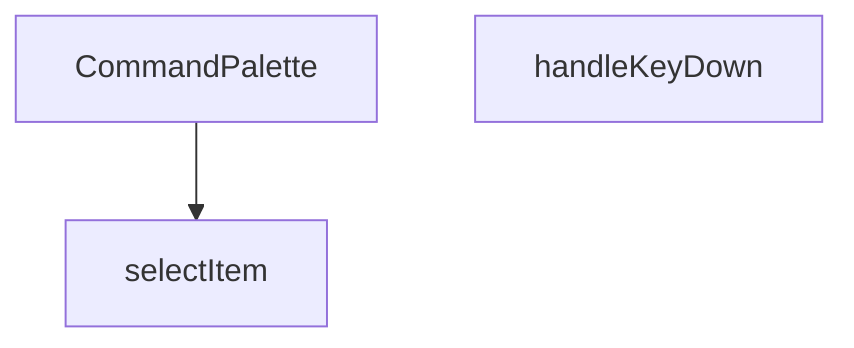

## Genel Bakış
CommandPalette, yönetim panelinde klavye kısayollarıyla hızlı komut arama ve seçimini sağlayan bir arayüz bileşenidir. Kullanıcının klavye girdilerini yakalayarak palet içindeki komutlar arasında gezinmesini ve istediğini seçmesini mümkün kılar. Temel olarak, verimli bir navigasyon deneyimi sunmak için klavye etkileşimleri ve seçim mantığını yönetir.

## Fonksiyon Grupları
### Ana Bileşen
Komut paletinin temel arayüzünü oluşturur ve tüm bileşenin render sürecini yönetir.
- CommandPalette

### Klavye Etkileşimi ve Seçim Mantığı
Kullanıcı klavye girdilerini işleyerek palet içindeki öğeler arasında gezinmeyi ve seçimi kontrol eder.
- handleKeyDown, selectItem

---

## AXIOMS – Mimari Varsayımlar

Bu modül için özel aksiyom tanımlanmamıştır.

---

## FONKSİYON DETAYLARI

### CommandPalette
**Ne yapar**: Komut paleti bileşenini oluşturur ve render eder. Kullanıcının uygulama içinde arama yapmasına ve komutlar/öğeler üzerinde gezinmesine olanak tanıyan bir arayüz sunar.
**Nasıl yapar**: Bileşen, durum yönetimi için useState ve useEffect hook'larını kullanarak arama terimini, seçili indeksi ve gerekli verileri tutar. Kullanıcı etkileşimlerine yanıt vermek için olay dinleyicileri ekler ve filtrelenmiş öğeleri listeler.
**Parametreler**:
- Parametre almaz (props kullanmaz).
**Dönüş**: `React.FC` (React Function Component) tipinde bir bileşen döner.

### selectItem
**Ne yapar**: Bu fonksiyon, bir `SelectableItem` nesnesini alarak bir seçim eylemini tetikler. Genellikle bir kullanıcı arayüzünde (UI) bir listeden, menüden veya_palette'ten bir öğe seçildiğinde çağrılan bir işlevdir ve seçimin programatik olarak işlenmesini sağlar.

**Nasıl yapar**: Fonksiyon, parametre olarak gelen `SelectableItem` türündeki nesneyi doğrudan bir `selectItem` çağrı fonksiyonuna (muhtemelen dışarıda tanımlı bir state setter veya handler) `type: 'nav'` ve ilgili `item` özellikleriyle paketleyerek aktarır. Bu, seçilen öğenin bir navigasyon (nav) eylemiyle ilişkilendirildiğini ve ana uygulama mantığına iletildiğini gösterir.

**Parametreler**:
- `selectable`: `SelectableItem` — Seçilen öğeyi temsil eden bir nesne. Bu nesne, öğenin türü (örn. navigasyon, komut) ve içeriği hakkında bilgi taşır.

**Dönüş**: `void` — Fonksiyon bir değer döndürmez; yalnızca bir yan etki (seçim işlenmesi) gerçekleştirir.

### handleKeyDown
**Ne yapar**: Komut paleti içindeki klavye olaylarını işler, özellikle yukarı/aşağı ok tuşlarıyla gezinme ve Enter tuşuyla seçim yapma gibi işlevselliği yönetir.
**Nasıl yapar**: Olay nesnesinin `key` özelliğini kontrol ederek hangi tuşa basıldığını belirler. Ok tuşları için seçili indeksi artırır/azaltır (sınır kontrolü yaparak), Escape tuşu için paleti kapatır ve Enter tuşu için mevcut seçili öğeyi seçer.
**Parametreler**:
- e: `React.KeyboardEvent` — Klavye olayı nesnesi, basılan tuş hakkında bilgi içerir.
**Dönüş**: `void` — Belirli bir değer dönmez, yan etki olarak durum değişiklikleri yapar.

---

## İTHALATLAR (IMPORTS)
- import: ../../i18n/I18nProvider::useI18n
- import: @/config/admin-resources::ADMIN_RESOURCES
- import: @/config/admin-resources::AdminResource
- import: @/hooks/useRole::useRole
- import: @/lib/supabase/client::supabaseBrowserClient
- import: next/navigation::useRouter
- import: react::React

---

## INTERFACES

### SelectableItem
- `type: 'nav' | 'searchResult'`
- `item: AdminResource | CommandResult`

---

## SABİTLER
- **resourceSearchers** (object) — `{
  products: searchProducts,
  orders: searchOrders,
  returns: searchRet...`

---

## AST POINTERS

### [N1_NASIL] AST Pointer: src/components/admin/CommandPalette.tsx::getAccessibleNavItems
- **params**: ()
- **ic_degiskenler**:
  - `ADMIN_RESOURCES` — Import edilen sabit, tüm admin kaynaklarını içeren dizi
  - `canAccess` — Hook veya context'ten gelen, erişim izni kontrolü yapan fonksiyon
  - `r` — Filter döngüsündeki mevcut resource nesnesi
  - `r.requiredAccess` — Resource'un gerektirdiği erişim seviyesi
- **Dönüş**: `AdminResource[]` — Kullanıcının erişebileceği navigasyon öğeleri

### [N2_NASIL] AST Pointer: src/components/admin/CommandPalette.tsx::getFilteredNavItems
- **params**: ()
- **ic_degiskenler**:
  - `search` — Arama kutusundaki mevcut arama terimi (state)
  - `accessibleNavItems` — Kullanıcının erişebileceği navigasyon öğeleri (önceki fonksiyonun sonucu)
  - `lowerQuery` — Küçük harfe dönüştürülmüş arama terimi
  - `item` — Filter döngüsündeki mevcut navigasyon öğesi
  - `t` — Çeviri fonksiyonu (i18n hook'undan)
  - `item.labelKey` — Öğenin çeviri anahtarı
- **Dönüş**: `AdminResource[]` — Arama terimine göre filtrelenmiş navigasyon öğeleri

### [N3_NASIL] AST Pointer: src/components/admin/CommandPalette.tsx::filterByLabel
- **params**: `item` — Filtralanacak navigasyon öğesi
- **ic_degiskenler**:
  - `t` — Çeviri fonksiyonu (i18n hook'undan)
  - `item.labelKey` — Öğenin çeviri anahtarı
  - `label` — Öğenin çevrilmiş etiketi
- **Dönüş**: `boolean` — Öğenin etiketinin arama terimini içerip içermediği

### [N4_NASIL] AST Pointer: src/components/admin/CommandPalette.tsx::getSearchableResources
- **params**: ()
- **ic_degiskenler**:
  - `ADMIN_RESOURCES` — Import edilen sabit, tüm admin kaynaklarını içeren dizi
  - `canAccess` — Hook veya context'ten gelen, erişim izni kontrolü yapan fonksiyon
  - `r` — Filter döngüsündeki mevcut resource nesnesi
  - `r.searchable` — Resource'un aranabilir olup olmadığı
  - `r.requiredAccess` — Resource'un gerektirdiği erişim seviyesi
- **Dönüş**: `AdminResource[]` — Aranabilir ve erişilebilir kaynaklar

### [N5_NASIL] AST Pointer: src/components/admin/CommandPalette.tsx::getSelectableItems
- **params**: ()
- **ic_degiskenler**:
  - `list` — OluşturulacakSelectableItem dizisi
  - `filteredNavItems` — Filtrelenmiş navigasyon öğeleri
  - `searchableResources` — Aranabilir kaynaklar
  - `results` — Arama sonuçları (state)
  - `item` — forEach döngüsündeki mevcut navigasyon öğesi
  - `res` — forEach döngüsündeki mevcut resource
  - `resResults` — Bu resource'a ait arama sonuçları
- **Dönüş**: `SelectableItem[]` — Seçilebilir öğeler (navigasyon + arama sonuçları)

### [N6_NASIL] AST Pointer: src/components/admin/CommandPalette.tsx::pushNavItem
- **params**: `item` — Eklenecek navigasyon öğesi
- **ic_degiskenler**:
  - `list` — Dış scope'tan gelenSelectableItem dizisi
- **Dönüş**: yok

### [N7_NASIL] AST Pointer: src/components/admin/CommandPalette.tsx::renderSearchResultsGroup
- **params**: `res` — Render edilecek resource grubu
- **ic_degiskenler**:
  - `results` — Arama sonuçları (state)
  - `resResults` — Bu resource'a ait arama sonuçları
  - `filteredNavItems` — Filtrelenmiş navigasyon öğeleri (index hesaplama için)
  - `searchableResources` — Aranabilir kaynaklar (index hesaplama için)
  - `groupStartIdx` — Bu grubun başlangıç indeksi
  - `r` — Index hesaplama döngüsündeki mevcut resource
  - `res.icon` — Resource'un ikonu
  - `t` — Çeviri fonksiyonu
  - `activeIndex` — Aktif öğe indeksi (state)
  - `selectItem` — Öğe seçim fonksiyonu
- **Dönüş**: JSX element veya null

### [N8_NASIL] AST Pointer: src/components/admin/CommandPalette.tsx::pushSearchResult
- **params**: `item` — Eklenecek arama sonucu
- **ic_degiskenler**:
  - `list` — Dış scope'tan gelenSelectableItem dizisi
- **Dönüş**: yok

### [N9_NASIL] AST Pointer: src/components/admin/CommandPalette.tsx::useKeyboardShortcut
- **params**: ()
- **ic_degiskenler**:
  - `down` — keydown event handler fonksiyonu
  - `e` — KeyboardEvent nesnesi
  - `setOpen` — Modal durumunu güncelleyen state setter
- **Dönüş**: Cleanup fonksiyonu (event listener kaldırma)

### [N10_NASIL] AST Pointer: src/components/admin/CommandPalette.tsx::handleGlobalKeyDown
- **params**: `e` — KeyboardEvent nesnesi
- **ic_degiskenler**:
  - `setOpen` — Modal durumunu güncelleyen state setter
- **Dönüş**: yok

### [N11_NASIL] AST Pointer: src/components/admin/CommandPalette.tsx::resetSearchState
- **params**: ()
- **ic_degiskenler**:
  - `open` — Modal'ın açık olup olmadığı (state)
  - `setSearch` — Arama terimini güncelleyen state setter
  - `setResults` — Arama sonuçlarını güncelleyen state setter
  - `setActiveIndex` — Aktif indeksi güncelleyen state setter
  - `inputRef` — Input elementine referans
- **Dönüş**: yok

### [N12_NASIL] AST Pointer: src/components/admin/CommandPalette.tsx::useSearchEffect
- **params**: ()
- **ic_degiskenler**:
  - `search` — Arama terimi (state)
  - `setResults` — Arama sonuçlarını güncelleyen state setter
  - `setLoading` — Yükleme durumunu güncelleyen state setter
  - `runSearch` — Asenkron arama fonksiyonu
  - `timer` — Debounce timer'ı
- **Dönüş**: Cleanup fonksiyonu (timer temizleme)

### [N13_NASIL] AST Pointer: src/components/admin/CommandPalette.tsx::runSearchAsync
- **params**: ()
- **ic_degiskenler**:
  - `setLoading` — Yükleme durumunu güncelleyen state setter
  - `search` — Arama terimi (state)
  - `term` — Trim edilmiş arama terimi
  - `searchableResources` — Aranabilir kaynaklar
  - `resourceSearchers` — Kaynak arama fonksiyonları nesnesi
  - `supabase` — Supabase istemcisi
  - `searchPromises` — Arama promise'ları dizisi
  - `r` — map döngüsündeki mevcut resource
  - `settled` — Tüm promise'ların sonuçları
  - `newResults` — Yeni arama sonuçları nesnesi
  - `res` — forEach döngüsündeki sonuç
  - `val` — Başarılı sonucun değeri
- **Dönüş**: yok

### [N14_NASIL] AST Pointer: src/components/admin/CommandPalette.tsx::searchResource
- **params**: `r` — Aranacak resource
- **ic_degiskenler**:
  - `resourceSearchers` — Kaynak arama fonksiyonları nesnesi
  - `searcher` — Bu resource'a ait arama fonksiyonu
  - `supabase` — Supabase istemcisi
  - `term` — Arama terimi
  - `data` — Arama sonuçları
- **Dönüş**: `Promise<{key: string, data: CommandResult[]}>`

### [N15_NASIL] AST Pointer: src/components/admin/CommandPalette.tsx::processSearchResult
- **params**: `res` — Promise.allSettled sonucu
- **ic_degiskenler**:
  - `newResults` — Dış scope'tan gelen yeni sonuçlar nesnesi
  - `val` — Başarılı sonucun değeri
- **Dönüş**: yok

### [N16_NASIL] AST Pointer: src/components/admin/CommandPalette.tsx::resetActiveIndex
- **params**: ()
- **ic_degiskenler**:
  - `setActiveIndex` — Aktif indeksi güncelleyen state setter
- **Dönüş**: yok

### [N17_NASIL] AST Pointer: src/components/admin/CommandPalette.tsx::selectItem
- **params**: `selectable` — Seçilecek öğe (SelectableItem tipinde)
- **ic_degiskenler**:
  - `setOpen` — Modal durumunu güncelleyen state setter
  - `selectable.type` — Öğenin türü (nav veya searchResult)
  - `selectable.item` — Seçilen öğenin kendisi
  - `router` — Next.js router hook'u
  - `item.route` — Gitilecek rota
- **Dönüş**: yok

### [N18_NASIL] AST Pointer: src/components/admin/CommandPalette.tsx::handleKeyDown
- **params**: `e` — React.KeyboardEvent nesnesi
- **ic_degiskenler**:
  - `setActiveIndex` — Aktif indeksi güncelleyen state setter
  - `selectableItems` — Seçilebilir öğeler dizisi
  - `activeIndex` — Mevcut aktif indeks (state)
  - `selectItem` — Öğe seçim fonksiyonu
  - `setOpen` — Modal durumunu güncelleyen state setter
- **Dönüş**: yok

### [N19_NASIL] AST Pointer: src/components/admin/CommandPalette.tsx::renderNavItem
- **params**: `item`, `idx` — Render edilecek öğe ve indeksi
- **ic_degiskenler**:
  - `item.icon` — Öğenin ikonu
  - `activeIndex` — Aktif indeks (state)
  - `isActive` — Bu öğenin aktif olup olmadığı
  - `t` — Çeviri fonksiyonu
  - `selectItem` — Öğe seçim fonksiyonu
- **Dönüş**: JSX element

### [N20_NASIL] AST Pointer: src/components/admin/CommandPalette.tsx::renderSearchResultGroup
- **params**: `res` — Render edilecek resource grubu
- **ic_degiskenler**:
  - `results` — Arama sonuçları (state)
  - `filteredNavItems` — Filtrelenmiş navigasyon öğeleri
  - `searchableResources` — Aranabilir kaynaklar
  - `groupStartIdx` — Grubun başlangıç indeksi
  - `r` — Index hesaplama döngüsündeki resource
  - `res.icon` — Resource ikonu
  - `t` — Çeviri fonksiyonu
  - `activeIndex` — Aktif indeks (state)
  - `selectItem` — Öğe seçim fonksiyonu
  - `skuLabel` — SKU etiketi (muhtemelen sabit veya hesaplanmış)
- **Dönüş**: JSX element

### [N21_NASIL] AST Pointer: src/components/admin/CommandPalette.tsx::renderSearchResultItem
- **params**: `p`, `idx` — Render edilecek arama sonucu ve indeksi
- **ic_degiskenler**:
  - `groupStartIdx` — Grubun başlangıç indeksi (dış scope)
  - `activeIndex` — Aktif indeks (state)
  - `globalIdx` — Global indeks hesaplaması
  - `isActive` — Bu sonucun aktif olup olmadığı
  - `selectItem` — Öğe seçim fonksiyonu
  - `ResourceIcon` — Resource ikonu (dış scope)
  - `skuLabel` — SKU etiketi
- **Dönüş**: JSX element

---

## MERMAID CALL GRAPH

## NODE ID STANDARD

  file: src\components\admin\CommandPalette.tsx
  function: src\components\admin\CommandPalette.tsx::CommandPalette
  function: src\components\admin\CommandPalette.tsx::selectItem
  function: src\components\admin\CommandPalette.tsx::handleKeyDown

---

## DISA AKTARILANLAR (EXPORTS)
  export: CommandPalette

---

## STİL TOKENLERİ

### Arbitrary Değerler (token'a geçirilmemiş)
Yok — tüm stiller token'a geçirilmiş. ✅

### Kullanılan Token'lar (zaten token'a geçirilmiş)
- `rounded-hvac-xl`, `shadow-glow-md`, `shadow-glow-sm`, `tracking-hvac-normal`

### Tailwind Sınıf Özeti
- **Renkler:** `bg-cyan-400`, `bg-cyan-400/10`, `bg-surface-deep/10`, `bg-surface-deep/60`, `bg-transparent`, `bg-white/5`, `border-b`, `border-cyan-400/20`, `border-none`, `border-t`, `border-white/10`, `border-white/5`, `group-hover:text-cyan-400`, `hover:bg-white/5`, `hover:text-white`
- **Layout:** `absolute`, `backdrop-blur-md`, `fixed`, `flex`, `flex-1`, `gap-1.5`, `gap-2`, `gap-4`, `h-1.5`, `h-10`, `h-16`, `h-5`, `h-8`, `h-full`, `items-center`
- **Varyant/Responsive:** `:`, `group-hover:`, `hover:`, `placeholder:` önekleri
- **Yardımcı Sınıflar:** `$`, `${isActive`, `:`, `animate-in`, `animate-pulse`, `animate-spin`, `border`, `cursor-default`, `cursor-pointer`, `cyan-glow`, `duration-200`, `font-black`, `font-bold`, `font-medium`, `font-mono`