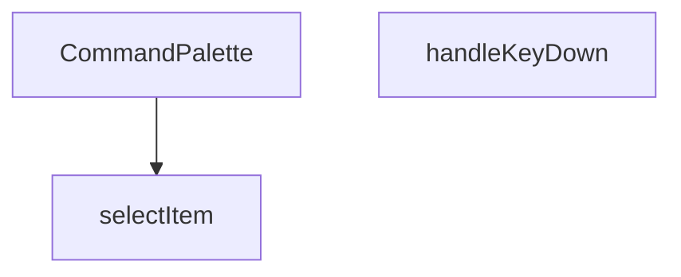

## Genel Bakış
CommandPalette, yönetim panelinde klavye kısayollarıyla hızlı komut arama ve seçimini sağlayan bir arayüz bileşenidir. Kullanıcının klavye girdilerini yakalayarak palet içindeki komutlar arasında gezinmesini ve istediğini seçmesini mümkün kılar. Temel olarak, verimli bir navigasyon deneyimi sunmak için klavye etkileşimleri ve seçim mantığını yönetir.

## Fonksiyon Grupları
### Ana Bileşen
Komut paletinin temel arayüzünü oluşturur ve tüm bileşenin render sürecini yönetir.
- CommandPalette

### Klavye Etkileşimi ve Seçim Mantığı
Kullanıcı klavye girdilerini işleyerek palet içindeki öğeler arasında gezinmeyi ve seçimi kontrol eder.
- handleKeyDown, selectItem

---

## AXIOMS – Mimari Varsayımlar

Bu modül için, verilen fonksiyon imzası bilgilerine dayanarak, fonksiyon gövdeleri bilinmediğinden çıkarılabilecek somut mimari aksiyom bulunmamaktadır.

[Aksiyom 1]: Eğer `selectItem` fonksiyonuna geçerli bir `index` parametresi verilmezse (örn: listede olmayan bir indeks), ilgili komut düzgün bir şekilde seçilemez veya uygulama beklenmedik bir duruma düşebilir.

[Aksiyom 2]: Eğer `handleKeyDown` fonksiyonuna geçerli bir `React.KeyboardEvent` nesnesi sağlanmazsa, klavye etkileşimleri (örn: yukarı/aşağı ok tuşlarıyla gezinme, Enter ile seçim) işlenemez.

[Aksiyom 3]: Eğer `CommandPalette` bileşeni, klavye olaylarını dinleyecek bir `onKeyDown` prop'u ile çağrılmazsa, klavye kısayolları çalışmaz.

---

## FONKSİYON DETAYLARI

### CommandPalette
**Ne yapar**: Komut paleti bileşenini oluşturur ve render eder. Kullanıcının uygulama içinde arama yapmasına ve komutlar/öğeler üzerinde gezinmesine olanak tanıyan bir arayüz sunar.
**Nasıl yapar**: Bileşen, durum yönetimi için useState ve useEffect hook'larını kullanarak arama terimini, seçili indeksi ve gerekli verileri tutar. Kullanıcı etkileşimlerine yanıt vermek için olay dinleyicileri ekler ve filtrelenmiş öğeleri listeler.
**Parametreler**:
- Parametre almaz (props kullanmaz).
**Dönüş**: `React.FC` (React Function Component) tipinde bir bileşen döner.

### handleKeyDown
**Ne yapar**: Komut paleti içindeki klavye olaylarını işler, özellikle yukarı/aşağı ok tuşlarıyla gezinme ve Enter tuşuyla seçim yapma gibi işlevselliği yönetir.
**Nasıl yapar**: Olay nesnesinin `key` özelliğini kontrol ederek hangi tuşa basıldığını belirler. Ok tuşları için seçili indeksi artırır/azaltır (sınır kontrolü yaparak), Escape tuşu için paleti kapatır ve Enter tuşu için mevcut seçili öğeyi seçer.
**Parametreler**:
- e: `React.KeyboardEvent` — Klavye olayı nesnesi, basılan tuş hakkında bilgi içerir.
**Dönüş**: `void` — Belirli bir değer dönmez, yan etki olarak durum değişiklikleri yapar.

### selectItem
**Ne yapar**: Verilen indeksteki öğeyi seçer ve ilgili eylemi (örneğin bir sayfaya yönlendirme, bir komutu çalıştırma) başlatır.
**Nasıl yapar**: Gelen `index` parametresiyle filtrelenmiş öğeler dizisinden ilgili öğeyi alır. Seçilen öğenin `action` veya benzeri bir özelliğinde tanımlı olan fonksiyonu çağırır ve ardından komut paletini kapatır.
**Parametreler**:
- index: `number` — Seçilmek istenen öğenin filtrelenmiş listedeki indeks numarası.
**Dönüş**: `void` — Belirli bir değer dönmez, yan etki olarak öğe seçimini ve paletin kapatılmasını sağlar.

---

## INTERFACES

### SearchResult
- `id: string`
- `name: string`
- `sku: string`

---

## AST POINTERS

### [N1_NASIL] AST Pointer: CommandPalette.tsx::CommandPalette
- **params**: (parametre yok)
- **ic_degiskenler**: 
  - `open` — Komut paletinin açık/kapalı durumunu tutan state (React.useState ile oluşturuldu)
  - `setOpen` — open state'ini güncellemek için kullanılan setter fonksiyonu
  - `search` — Arama kutusundaki yazıyı tutan state (React.useState ile oluşturuldu)
  - `setSearch` — search state'ini güncellemek için kullanılan setter fonksiyonu
  - `products` — Supabase'den getirilen ürün sonuçlarını tutan state array (SearchResult[] tipinde)
  - `setProducts` — products state'ini güncellemek için kullanılan setter fonksiyonu
  - `loading` — Arama yükleniyor durumunu tutan boolean state
  - `setLoading` — loading state'ini güncellemek için kullanılan setter fonksiyonu
  - `activeIndex` — Klavye navigasyonunda seçili olan öğenin indeksini tutan state
  - `setActiveIndex` — activeIndex state'ini güncellemek için kullanılan setter fonksiyonu
  - `router` — Next.js router hook'u ile oluşturulan yönlendirme nesnesi (useRouter())
  - `inputRef` — Arama input DOM elemanına referans tutan React ref nesnesi
  - `navItems` — Statik navigasyon öğeleri array'i (React.useMemo ile optimize edildi, 6 öğe: label, icon, href)
  - `totalItems` — Toplam seçilebilir öğe sayısını hesaplayan değişken (React.useMemo ile optimize edildi, filteredNav.length + products.length)
  - `filteredNav` — Arama terimine göre filtrelenmiş navigasyon öğeleri array'i (search.length > 0 ise navItems.filter(), değilse navItems)
  - `e` — handleKeyDown fonksiyonunun parametresi (React.KeyboardEvent), tuş olayı nesnesi
  - `index` — selectItem fonksiyonunun parametresi (number), seçilecek öğenin indeks değeri
  - `prodIndex` — Ürün listesindeki göreli indeks hesaplaması (index - filteredNav.length)
- **Dönüş**: JSX element (komut paleti arayüzü, !open ise null döner)

### [N2_NASIL] AST Pointer: CommandPalette.tsx::useMemoNavItems
- **params**: (parametre yok)
- **ic_degiskenler**: yok (sadece array literal return eder)
- **Dönüş**: Array<{ label: string, icon: Component, href: string }> — 6 statik navigasyon öğesi (Panel, Sipariş Yönetimi, Ürün Kataloğu, Stok Durumu, Kullanıcı Yönetimi, Ayarlar)

### [N3_NASIL] AST Pointer: CommandPalette.tsx::useMemoTotalItems
- **params**: (parametre yok)
- **ic_degiskenler**: 
  - `filteredNav` — Arama terimine göre filtrelenmiş navigasyon öğeleri array'i (search.length > 0 ise navItems.filter(), değilse navItems)
  - `search` — Arama kutusundaki yazıyı tutan değişken (üst scope'tan erişim)
  - `navItems` — Statik navigasyon öğeleri array'i (üst scope'tan erişim)
  - `products` — Ürün sonuçları array'i (üst scope'tan erişim)
- **Dönüş**: number — Toplam seçilebilir öğe sayısı (filteredNav.length + products.length)

### [N4_NASIL] AST Pointer: CommandPalette.tsx::useEffectCtrlK
- **params**: (parametre yok)
- **ic_degiskenler**: 
  - `down` — Klavye olay handler fonksiyonu (KeyboardEvent parametreli, CTRL+K tuş basımını yakalar)
  - `e` — down fonksiyonunun parametresi (KeyboardEvent), tuş olayı nesnesi
- **Dönüş**: Cleanup fonksiyonu (document.removeEventListener ile event listener'ı kaldırır)

### [N5_NASIL] AST Pointer: CommandPalette.tsx::useEffectCtrlKHandler
- **params**: (e: KeyboardEvent)
- **ic_degiskenler**: 
  - `e` — Parametre olarak gelen KeyboardEvent nesnesi
- **Dönüş**: yok (sadece setOpen state'ini toggles)

### [N6_NASIL] AST Pointer: CommandPalette.tsx::useEffectResetOnOpen
- **params**: (parametre yok)
- **ic_degiskenler**: 
  - `open` — Komut paletinin açık/kapalı durumunu tutan değişken (üst scope'tan erişim)
  - `setTimeout` — 50ms gecikmeli fonksiyon çağırma (inputRef.current?.focus())
- **Dönüş**: yok (yan etki: search, products, activeIndex state'lerini sıfırlar, input'a odaklanır)

### [N7_NASIL] AST Pointer: CommandPalette.tsx::useEffectProductSearch
- **params**: (parametre yok)
- **ic_degiskenler**: 
  - `searchProducts` — Async fonksiyon, Supabase'den ürün araması yapar
  - `timer` — setTimeout return değeri, debounce için kullanılır
  - `search` — Arama terimini tutan değişken (üst scope'tan erişim)
  - `setLoading` — Loading state'ini güncelleyen setter (üst scope'tan erişim)
  - `setProducts` — Ürün sonuçlarını güncelleyen setter (üst scope'tan erişim)
  - `supabase` — Supabase istemcisi (import edilmiş)
  - `data` — Supabase yanıtından dönen data alanı
- **Dönüş**: Cleanup fonksiyonu (clearTimeout ile timer'ı iptal eder)

### [N8_NASIL] AST Pointer: CommandPalette.tsx::searchProductsAsync
- **params**: (parametre yok)
- **ic_degiskenler**: 
  - `setLoading` — Loading state'ini true yapan setter (üst scope'tan erişim)
  - `supabase` — Supabase istemcisi (üst scope'tan erişim)
  - `data` — Supabase yanıtından dönen data alanı (products tablosundan id, name, sku alanlarını getirir)
  - `setProducts` — Ürün sonuçlarını güncelleyen setter (üst scope'tan erişim)
- **Dönüş**: Promise<void> (async fonksiyon, await ile Supabase çağrısı yapar)

### [N9_NASIL] AST Pointer: CommandPalette.tsx::useEffectResetActiveIndex
- **params**: (parametre yok)
- **ic_degiskenler**: 
  - `setActiveIndex` — ActiveIndex state'ini 0 yapan setter (üst scope'tan erişim)
  - `search` — Arama terimini tutan değişken (üst scope'tan erişim)
  - `products` — Ürün sonuçları array'i (üst scope'tan erişim)
- **Dönüş**: yok (yan etki: activeIndex'i 0'a sıfırlar)

### [N10_NASIL] AST Pointer: CommandPalette.tsx::handleKeyDown
- **params**: (e: React.KeyboardEvent)
- **ic_degiskenler**: 
  - `e` — Parametre olarak gelen React.KeyboardEvent nesnesi
  - `totalItems` — Toplam seçilebilir öğe sayısı (üst scope'tan erişim)
  - `activeIndex` — Mevcut aktif indeks (üst scope'tan erişim)
  - `setActiveIndex` — ActiveIndex state'ini güncelleyen setter (üst scope'tan erişim)
  - `setOpen` — Open state'ini false yapan setter (üst scope'tan erişim)
  - `selectItem` — Öğe seçme fonksiyonu (üst scope'tan erişim)
- **Dönüş**: yok (yan etki: klavye olaylarına göre state güncellemesi, yönlendirme)

### [N11_NASIL] AST Pointer: CommandPalette.tsx::selectItem
- **params**: (index: number)
- **ic_degiskenler**: 
  - `index` — Parametre olarak gelen sayısal indeks değeri
  - `filteredNav` — Arama terimine göre filtrelenmiş navigasyon öğeleri array'i (search.length > 0 ise navItems.filter(), değilse navItems)
  - `search` — Arama terimini tutan değişken (üst scope'tan erişim)
  - `navItems` — Statik navigasyon öğeleri array'i (üst scope'tan erişim)
  - `setOpen` — Open state'ini false yapan setter (üst scope'tan erişim)
  - `router` — Next.js router nesnesi (üst scope'tan erişim)
  - `prodIndex` — Ürün listesindeki göreli indeks hesaplaması (index - filteredNav.length)
  - `products` — Ürün sonuçları array'i (üst scope'tan erişim)
- **Dönüş**: yok (yan etki: komut paletini kapatır, belirli URL'ye yönlendirir)

### [N12_NASIL] AST Pointer: CommandPalette.tsx::renderNavItem
- **params**: (item: { label: string, icon: Component, href: string }, idx: number)
- **ic_degiskenler**: 
  - `item` — Parametre olarak gelen navigasyon öğesi nesnesi (label, icon, href)
  - `idx` — Parametre olarak gelen array indeksi
  - `Icon` — item.icon değerini atayan değişken (React bileşeni)
  - `isActive` — Bu öğenin seçili olup olmadığını belirleyen boolean (activeIndex === idx)
  - `activeIndex` — Seçili olan indeks (üst scope'tan erişim)
  - `setOpen` — Open state'ini false yapan setter (üst scope'tan erişim)
  - `router` — Next.js router nesnesi (üst scope'tan erişim)
- **Dönüş**: JSX element (navigasyon öğesi butonu)

### [N13_NASIL] AST Pointer: CommandPalette.tsx::renderProductItem
- **params**: (p: { id: string, name: string, sku: string }, idx: number)
- **ic_degiskenler**: 
  - `p` — Parametre olarak gelen ürün nesnesi (id, name, sku)
  - `idx` — Parametre olarak gelen array indeksi
  - `globalIdx` — Tüm öğeler arasındaki global indeks hesaplaması (filteredNav.length + idx)
  - `isActive` — Bu ürünün seçili olup olmadığını belirleyen boolean (activeIndex === globalIdx)
  - `activeIndex` — Seçili olan indeks (üst scope'tan erişim)
  - `filteredNav` — Filtrelenmiş navigasyon array'i (üst scope'tan erişim)
  - `setOpen` — Open state'ini false yapan setter (üst scope'tan erişim)
  - `router` — Next.js router nesnesi (üst scope'tan erişim)
- **Dönüş**: JSX element (ürün öğesi butonu)

---

## MERMAID CALL GRAPH

## NODE ID STANDARD

  file: src\components\admin\CommandPalette.tsx
  function: src\components\admin\CommandPalette.tsx::CommandPalette
  function: src\components\admin\CommandPalette.tsx::handleKeyDown
  function: src\components\admin\CommandPalette.tsx::selectItem

---

## DISA AKTARILANLAR (EXPORTS)
  export: CommandPalette

---

## STİL TOKENLERİ

### Arbitrary Değerler (token'a geçirilmemiş)
Yok — tüm stiller token'a geçirilmiş. ✅

### Kullanılan Token'lar (zaten token'a geçirilmiş)
- `rounded-hvac-xl`, `shadow-glow-md`, `shadow-glow-sm`, `tracking-hvac-normal`

### Tailwind Sınıf Özeti
- **Renkler:** `bg-cyan-400`, `bg-cyan-400/10`, `bg-surface-deep/10`, `bg-surface-deep/60`, `bg-transparent`, `bg-white/5`, `border-b`, `border-cyan-400/20`, `border-none`, `border-t`, `border-white/10`, `border-white/5`, `group-hover:text-cyan-400`, `hover:bg-white/5`, `hover:text-white`
- **Layout:** `absolute`, `backdrop-blur-md`, `fixed`, `flex`, `flex-1`, `gap-1.5`, `gap-2`, `gap-4`, `h-1.5`, `h-10`, `h-16`, `h-5`, `h-8`, `h-full`, `items-center`
- **Varyant/Responsive:** `:`, `group-hover:`, `hover:`, `placeholder:` önekleri
- **Yardımcı Sınıflar:** `$`, `${isActive`, `:`, `animate-in`, `animate-pulse`, `animate-spin`, `border`, `cursor-default`, `cursor-pointer`, `cyan-glow`, `duration-200`, `font-black`, `font-bold`, `font-medium`, `font-mono`