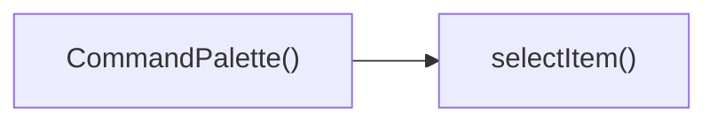

## Genel Bakış
`CommandPalette` bileşeni, yönetim panelinde kullanıcıların klavye kısayollarıyla hızlı komut seçimi yapmasını sağlayan bir komut paleti arayüzüdür. Bileşen, klavye etkileşimlerini yönetir, öğeler arasında gezinme ve seçim işlemlerini gerçekleştirir.

## Fonksiyon Grupları
### UI Bileşeni  
Komponentin kendisini tanımlar, render sürecini yönetir ve palet arayüzünün temel yapısını oluşturur.
- CommandPalette

### Etkileşim ve Seçim Mantığı  
Klavye girdilerini işler, aktif öğeyi günceller ve kullanıcı bir öğe seçtiğinde ilgili aksiyonu yürütür.
- handleKeyDown, selectItem

---

## AXIOMS – Mimari Varsayımlar
Bu modül için özel aksiyom tanımlanmamıştır.

---

---

## FONKSIYON DETAYLARI

### CommandPalette
**Ne yapar**: CommandPalette, `React.FC` dönüş tipine sahip bir fonksiyonel bileşendir. Komut paleti arayüzünü temsil eder.
**Nasıl yapar**: İç mantığına dair bilgi verilmemiştir.
**Parametreler**: Bu fonksiyon parametre almaz.
**Dönüş**: `React.FC` — React fonksiyonel bileşen döndürür.

### handleKeyDown
**Ne yapar**: handleKeyDown, klavye olaylarını işleyen bir olay işleyici fonksiyonudur.
**Nasıl yapar**: İç mantığına dair bilgi verilmemiştir.
**Parametreler**:
- `e`: `React.KeyboardEvent` — Tetiklenen klavye olayını temsil eden olay nesnesi.
**Dönüş**: Dönüş tipi belirtilmemiştir (muhtemelen `void`).

### selectItem
**Ne yapar**: selectItem, belirtilen indeksteki öğeyi seçmek için kullanılan bir fonksiyondur.
**Nasıl yapar**: İç mantığına dair bilgi verilmemiştir.
**Parametreler**:
- `index`: `number` — Seçilecek öğenin sıfır tabanlı indeksi.
**Dönüş**: Dönüş tipi belirtilmemiştir (muhtemelen `void`).

---

## INTERFACES

### SearchResult
- `id: string`
- `name: string`
- `sku: string`

---

## AST POINTERS

### [N1_NASIL] AST Pointer: src/components/admin/CommandPalette.tsx::CommandPalette
- **params**: (parametre yok)
- **ic_degiskenler**:
  - `open` — boolean state, palette'in açık (true) veya kapalı (false) olduğunu tutar
  - `setOpen` — open state'ini güncellemek için kullanılan setter fonksiyon
  - `search` — string state, kullanıcının arama girdisini tutar
  - `setSearch` — search state'ini güncellemek için kullanılan setter
  - `products` — SearchResult[] state, supabase'den gelen ürün arama sonuçlarını tutar
  - `setProducts` — products state'ini güncellemek için kullanılan setter
  - `loading` — boolean state, ürün araması yapılırken true olur
  - `setLoading` — loading state'ini güncellemek için kullanılan setter
  - `activeIndex` — number state, şu anda seçili olan öğenin indeksini tutar
  - `setActiveIndex` — activeIndex state'ini güncellemek için kullanılan setter
  - `router` — useRouter() ile oluşturulan Next.js yönlendirme nesnesi
  - `inputRef` — React.useRef<HTMLInputElement>(null) ile oluşturulan referans, arama input'una erişim sağlar
  - `navItems` — React.useMemo ile hesaplanmış, statik navigasyon öğelerinin dizisi; her öğe label, icon, href içerir
  - `totalItems` — React.useMemo ile hesaplanmış, seçilebilir toplam öğe sayısı (filtrelenmiş nav + products)
  - `handleKeyDown` — klavye olaylarını işleyen fonksiyon (aşağıda ayrıca açıklanmıştır)
  - `selectItem` — bir öğeyi seçmek için çağrılan fonksiyon (aşağıda ayrıca açıklanmıştır)
  - `filteredNav` — render sırasında search'e göre filtrelenmiş navItems (yerel değişken, return bloğunda hesaplanır)
- **Dönüş**: `null` (open false ise) veya JSX elementi (palette arayüzü)

### [N2_NASIL] AST Pointer: src/components/admin/CommandPalette.tsx::navItems (useMemo factory)
- **params**: (parametre yok — useMemo'nun üretici fonksiyonu)
- **ic_degiskenler**: (yok — sabit dizi döndürür)
- **Dönüş**: `Array<{label: string, icon: React.ComponentType, href: string}>` — 6 adet navigasyon öğesi

### [N3_NASIL] AST Pointer: src/components/admin/CommandPalette.tsx::totalItems (useMemo factory)
- **params**: (parametre yok — useMemo üretici fonksiyonu)
- **ic_degiskenler**:
  - `filteredNav` — search.length > 0 ise navItems.filter(...) ile filtrelenmiş dizi, değilse navItems'ın kendisi
- **Dönüş**: `number` — filteredNav.length + products.length

### [N4_NASIL] AST Pointer: src/components/admin/CommandPalette.tsx::ctrlKHandlerEffect (useEffect)
- **params**: (parametre yok — useEffect callback)
- **ic_degiskenler**:
  - `down` — klavye olayını yakalayan iç fonksiyon (aşağıda ayrıca açıklanmıştır)
- **Dönüş**: cleanup fonksiyonu — `document.removeEventListener('keydown', down)` çağrılır

### [N5_NASIL] AST Pointer: src/components/admin/CommandPalette.tsx::downHandler (keyboard event handler)
- **params**:
  - `e` — `KeyboardEvent` tipinde olay nesnesi
- **ic_degiskenler**: (yok — sadece e parametresi kullanılır)
- **Dönüş**: yok (void)  
  **Yan etki**: eğer `e.key === 'k'` ve (`e.metaKey || e.ctrlKey`) ise `e.preventDefault()` ve `setOpen(prev => !prev)` çağrılır

### [N6_NASIL] AST Pointer: src/components/admin/CommandPalette.tsx::openResetEffect (useEffect)
- **params**: (parametre yok — useEffect callback)
- **ic_degiskenler**:
  - `open` — boolean state, palette açık mı kontrolü için kullanılır
  - `setSearch` — search state setter
  - `setProducts` — products state setter
  - `setActiveIndex` — activeIndex state setter
  - `inputRef` — input referansı, focus çağırmak için kullanılır
- **Dönüş**: yok (void)  
  **Yan etki**: open true ise `setSearch('')`, `setProducts([])`, `setActiveIndex(0)` yapılır, 50ms sonra `inputRef.current?.focus()`

### [N7_NASIL] AST Pointer: src/components/admin/CommandPalette.tsx::searchEffect (useEffect)
- **params**: (parametre yok — useEffect callback)
- **ic_degiskenler**:
  - `searchProducts` — supabase sorgusunu gerçekleştiren async fonksiyon (aşağıda ayrıca açıklanmıştır)
  - `timer` — setTimeout ile oluşturulan zamanlayıcı ID'si
  - (dışarıdan) `search` — string state, arama metni; uzunluğu < 2 ise ürünler sıfırlanır
  - (dışarıdan) `setProducts` — products state setter
  - (dışarıdan) `setLoading` — loading state setter
  - (dışarıdan) `supabase` — import edilmiş supabase istemcisi, `from('products').select(...)` için
- **Dönüş**: cleanup fonksiyonu — `clearTimeout(timer)` ile zamanlayıcı iptal edilir

### [N8_NASIL] AST Pointer: src/components/admin/CommandPalette.tsx::searchProducts (async function)
- **params**: (parametre yok — useEffect içinde tanımlanmış async fonksiyon)
- **ic_degiskenler**:
  - `data` — supabase sorgusunun sonucu (`const { data } = await supabase.from(...)...`)
  - (dışarıdan) `setLoading` — loading state setter, önce true, sonra false yapılır
  - (dışarıdan) `supabase` — supabase istemcisi
  - (dışarıdan) `search` — string state, sorguda `ilike` için kullanılır
  - (dışarıdan) `setProducts` — setter, `data` varsa `data as SearchResult[]` ile products güncellenir
- **Dönüş**: `Promise<void>`  
  **Yan etki**: `setLoading(true)`, supabase sorgusu, başarılı ise `setProducts(data)`, sonunda `setLoading(false)`

### [N9_NASIL] AST Pointer: src/components/admin/CommandPalette.tsx::resetActiveIndexEffect (useEffect)
- **params**: (parametre yok — useEffect callback)
- **ic_degiskenler**:
  - `setActiveIndex` — activeIndex state setter (dışarıdan alınır)
- **Dönüş**: yok (void)  
  **Yan etki**: `setActiveIndex(0)` çağrılır

### [N10_NASIL] AST Pointer: src/components/admin/CommandPalette.tsx::handleKeyDown
- **params**:
  - `e` — `React.KeyboardEvent` tipinde olay nesnesi
- **ic_degiskenler**:
  - (dışarıdan) `totalItems` — toplam seçilebilir öğe sayısı, arrow tuşlarında mod alma işleminde kullanılır
  - (dışarıdan) `setActiveIndex` — activeIndex state setter
  - (dışarıdan) `selectItem` — öğe seçme fonksiyonu, Enter tuşunda çağrılır
  - (dışarıdan) `setOpen` — open state setter, Escape tuşunda çağrılır
- **Dönüş**: yok (void)  
  **Yan etki**: tuşa bağlı olarak `setActiveIndex`, `selectItem(activeIndex)`, veya `setOpen(false)` işlemleri yapılır

### [N11_NASIL] AST Pointer: src/components/admin/CommandPalette.tsx::selectItem
- **params**:
  - `index` — `number` türünde, seçilen öğenin indeksi
- **ic_degiskenler**:
  - `filteredNav` — search.length > 0 ise navItems.filter(...) ile filtrelenmiş dizi, değilse navItems'ın kendisi
  - `prodIndex` — `index - filteredNav.length` şeklinde hesaplanan ürün indeksi
  - (dışarıdan) `search` — string state, filtreleme için kullanılır
  - (dışarıdan) `navItems` — statik navigasyon öğeleri
  - (dışarıdan) `router` — Next.js router nesnesi, `router.push(...)` yönlendirme için
  - (dışarıdan) `setOpen` — open state setter, `setOpen(false)` ile palette kapatılır
  - (dışarıdan) `products` — SearchResult[] state, ürün listesi
- **Dönüş**: yok (void)  
  **Yan etki**: index filteredNav içindeyse `router.push(filteredNav[index].href)`, değilse ilgili ürün için `router.push('/admin/products?id=...')` yapar ve `setOpen(false)` ile palette'i kapatır

### [N12_NASIL] AST Pointer: src/components/admin/CommandPalette.tsx::renderNavItem (filteredNav.map callback)
- **params**:
  - `item` — `{ label: string, icon: React.ComponentType, href: string }` tipinde nav öğesi
  - `idx` — `number` türünde, dizi indeksi
- **ic_degiskenler**:
  - `Icon` — `item.icon`'dan alınan, render edilen ikon bileşeni
  - `isActive` — `activeIndex === idx` bool değeri, aktif öğeyi belirler
  - (dışarıdan) `activeIndex` — number

---

## ÇAĞRI HARİTASI

### Dışarıya Çağrılar (Outgoing)
- **CommandPalette()**: Kullanıcı bir öğe seçtiğinde seçim işlemini gerçekleştirmek için `selectItem` fonksiyonunu çağırır.

### Dışarıdan Çağrılanlar (Incoming)
- Verilen veride bu modülü kullanan dış bir dosya veya fonksiyon bulunmamaktadır.

### İç İçe Fonksiyonlar (Nested)
- Yok

---

## DOSYA-İÇİ ÇAĞRI GRAFİĞİ
  CommandPalette() → selectItem()

---

## NODE ID STANDARD

  file: src\components\admin\CommandPalette.tsx
  function: src\components\admin\CommandPalette.tsx::CommandPalette
  function: src\components\admin\CommandPalette.tsx::handleKeyDown
  function: src\components\admin\CommandPalette.tsx::selectItem

---

## DISA AKTARILANLAR (EXPORTS)
  export: CommandPalette