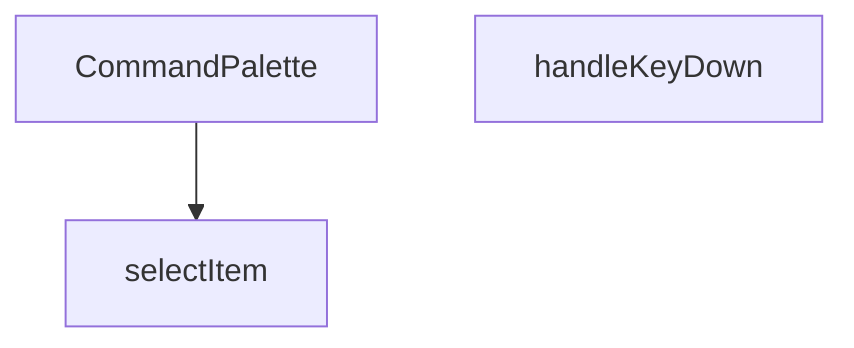

## Genel Bakış
CommandPalette, yönetim panelinde klavye kısayollarıyla hızlı komut arama ve seçimini sağlayan bir arayüz bileşenidir. Klavye etkileşimlerini yöneterek kullanıcıların komutlar arasında gezinmesini ve seçim yapmasını mümkün kılar.

## Fonksiyon Grupları
### Ana Bileşen
Komut paletinin temel arayüzünü oluşturur ve tüm bileşenin render sürecini yönetir.
- CommandPalette

### Klavye Etkileşimi ve Seçim Mantığı
Kullanıcı klavye girdilerini işleyerek palet içindeki öğeler arasında gezinmeyi ve seçimi kontrol eder.
- handleKeyDown, selectItem

---

## AXIOMS – Mimari Varsayımlar
Bu modül, klavye etkileşimleriyle çalışan bir komut paleti arayüzüdür. Fonksiyon gövdesi içeriği paylaşılmadığı için, yalnızca fonksiyon imzalarından türetilen minimum aksiyomlar aşağıdadır.

**[Aksiyom 1]:** Eğer `selectItem` fonksiyonuna geçilen `index` değeri, mevcut öğe listesinin geçerli bir indeks aralığı dışındaysa, öğe seçimi başarısız olur veya tanımsız davranış meydana gelir.

**[Aksiyom 2]:** Eğer `handleKeyDown` fonksiyonuna geçilen `e` parametresi geçerli bir `React.KeyboardEvent` nesnesi değilse (null/undefined), klavye etkileşimi işlenemez ve fonksiyon hata verir.

**[Aksiyom 3]:** Eğer `CommandPalette` bileşeni, dışarıdan erişilebilir bir öğe listesi (komut listesi) içermiyorsa veya bu liste boşsa, `selectItem` fonksiyonu anlam ifade etmez ve hiçbir seçim gerçekleşemez.

**[Aksiyom 4]:** Eğer bileşenin bağımlı olduğu external state/context (örn: aktif öğe indeksi, öğe listesi) yanlış başlatılmışsa veya sağlanmamışsa, klavye navigasyonu ve seçim mantığı düzgün çalışamaz.

---

## FONKSİYON DETAYLARI

### CommandPalette
**Ne yapar**: Komut paleti bileşenini oluşturur ve render eder. Kullanıcının uygulama içinde arama yapmasına ve komutlar/öğeler üzerinde gezinmesine olanak tanıyan bir arayüz sunar.
**Nasıl yapar**: Bileşen, durum yönetimi için useState ve useEffect hook'larını kullanarak arama terimini, seçili indeksi ve gerekli verileri tutar. Kullanıcı etkileşimlerine yanıt vermek için olay dinleyicileri ekler ve filtrelenmiş öğeleri listeler.
**Parametreler**:
- Parametre almaz (props kullanmaz).
**Dönüş**: `React.FC` (React Function Component) tipinde bir bileşen döner.

### handleKeyDown
**Ne yapar**: Komut paleti içindeki klavye olaylarını işler, özellikle yukarı/aşağı ok tuşlarıyla gezinme ve Enter tuşuyla seçim yapma gibi işlevselliği yönetir.
**Nasıl yapar**: Olay nesnesinin `key` özelliğini kontrol ederek hangi tuşa basıldığını belirler. Ok tuşları için seçili indeksi artırır/azaltır (sınır kontrolü yaparak), Escape tuşu için paleti kapatır ve Enter tuşu için mevcut seçili öğeyi seçer.
**Parametreler**:
- e: `React.KeyboardEvent` — Klavye olayı nesnesi, basılan tuş hakkında bilgi içerir.
**Dönüş**: `void` — Belirli bir değer dönmez, yan etki olarak durum değişiklikleri yapar.

### selectItem
**Ne yapar**: Verilen indeksteki öğeyi seçer ve ilgili eylemi (örneğin bir sayfaya yönlendirme, bir komutu çalıştırma) başlatır.
**Nasıl yapar**: Gelen `index` parametresiyle filtrelenmiş öğeler dizisinden ilgili öğeyi alır. Seçilen öğenin `action` veya benzeri bir özelliğinde tanımlı olan fonksiyonu çağırır ve ardından komut paletini kapatır.
**Parametreler**:
- index: `number` — Seçilmek istenen öğenin filtrelenmiş listedeki indeks numarası.
**Dönüş**: `void` — Belirli bir değer dönmez, yan etki olarak öğe seçimini ve paletin kapatılmasını sağlar.

---

## INTERFACES

### SearchResult
- `id: string`
- `name: string`
- `sku: string`

---

## AST POINTERS

### [N1_NASIL] AST Pointer: src/components/admin/CommandPalette.tsx::CommandPalette
- **params**: (parametre yok)
- **ic_degiskenler**:
  - `open` — Paletin açık/kapalı durumunu tutar (boolean state)
  - `search` — Kullanıcının arama kutusuna yazdığı sorgu metni
  - `products` — Supabase'den getirilen ürün arama sonuçları (SearchResult[])
  - `loading` — Ürün araması sırasında yükleme durumunu gösterir (boolean state)
  - `activeIndex` — Klavye ile gezinirde hangi öğenin seçili olduğunu tutar (sayısal index)
  - `router` — Next.js router örneği, sayfa yönlendirmeleri için kullanılır
  - `inputRef` — Arama input DOM elemanına erişim için useRef
  - `navItems` — useMemo ile memoize edilmiş statik navigasyon öğeleri dizisi (label, icon, href)
  - `totalItems` — useMemo ile hesaplanan toplam seçilebilir öğe sayısı (filteredNav + products)
  - `filteredNav` — search değerine göre filtrelenmiş navigasyon öğeleri
  - `down` — useEffect içindeki keydown event handler fonksiyonu (CTRL+K toggle)
  - `searchProducts` — useEffect içindeki async fonksiyon, supabase products tablosundan ürün arar
  - `timer` — debounce için setTimeout return değeri
- **Dönüş**: open false ise `null`, değilse JSX (React komut paleti dialog JSX'i)

### [N2_NASIL] AST Pointer: src/components/admin/CommandPalette.tsx::navItemsMemo
- **params**: (parametre yok)
- **ic_degiskenler**: (yok — inline array döner)
- **Dönüş**: Static navigasyon öğeleri dizisi (label, icon, href alanları)

### [N3_NASIL] AST Pointer: src/components/admin/CommandPalette.tsx::totalItemsMemo
- **params**: (parametre yok)
- **ic_degiskenler**:
  - `filteredNav` — search uzunluğu sıfırdan büyükse navItems'ı küçük harfe çevirerek filtreler, değilse tüm navItems'ı döner
- **Dönüş**: `filteredNav.length + products.length` (toplam seçilebilir öğe sayısı)

### [N4_NASIL] AST Pointer: src/components/admin/CommandPalette.tsx::useEffectToggleOpen
- **params**: (parametre yok)
- **ic_degiskenler**:
  - `down` — KeyboardEvent handler; `e.key === 'k'` ve metaKey/ctrlKey basılıysa open durumunu toggling yapar
- **Dönüş**: Temizlik fonksiyonu (keydown listener kaldırma)

### [N5_NASIL] AST Pointer: src/components/admin/CommandPalette.tsx::handleKeyDownInner
- **params**: `e: KeyboardEvent`
- **ic_degiskenler**: (yok — doğrudan e parametresini kullanır)
- **Dönüş**: yok

### [N6_NASIL] AST Pointer: src/components/admin/CommandPalette.tsx::useEffectResetState
- **params**: (parametre yok)
- **ic_degiskenler**: (yok — open true ise state'leri resetler)
- **Dönüş**: yok (side effect: search '', products [], activeIndex 0, input focus)

### [N7_NASIL] AST Pointer: src/components/admin/CommandPalette.tsx::useEffectProductSearch
- **params**: (parametre yok)
- **ic_degiskenler**:
  - `searchProducts` — Async fonksiyon; setLoading(true) ile başlar, `supabase.from('products').select('id, name, sku').ilike('name', %${search}%).limit(5)` sorgusu yapar, sonuçları products state'ine set eder, setLoading(false) ile bitirir
  - `timer` — `searchProducts` fonksiyonunu 300ms gecikmeyle çalıştıran setTimeout
- **Dönüş**: Temizlik fonksiyonu (timer'ı temizleme)

### [N8_NASIL] AST Pointer: src/components/admin/CommandPalette.tsx::searchProductsAsync
- **params**: (parametre yok — async inner fonksiyon)
- **ic_degiskenler**:
  - `data` — Supabase sorgusundan dönen ürün verisi (destructure: `{ data }`)
- **Dönüş**: yok (side effect: loading ve products state'lerini günceller)

### [N9_NASIL] AST Pointer: src/components/admin/CommandPalette.tsx::useEffectResetIndex
- **params**: (parametre yok)
- **ic_degiskenler**: (yok)
- **Dönüş**: yok (side effect: activeIndex'i 0'a resetler)

### [N10_NASIL] AST Pointer: src/components/admin/CommandPalette.tsx::handleKeyDown
- **params**: `e: React.KeyboardEvent`
- **ic_degiskenler**: (yok — doğrudan e parametresi ve component state'lerini kullanır)
- **Dönüş**: yok (side effect: activeIndex, setOpen güncellemeleri)

### [N11_NASIL] AST Pointer: src/components/admin/CommandPalette.tsx::selectItem
- **params**: `index: number`
- **ic_degiskenler**:
  - `filteredNav` — search length sıfırdan büyükse navItems küçük harf filtresi ile, değilse tüm navItems
  - `prodIndex` — Seçilen öğenin products dizisindeki indeksi (`index - filteredNav.length`)
- **Dönüş**: yok (side effect: setOpen(false) ve router.push ile sayfa yönlendirme)

### [N12_NASIL] AST Pointer: src/components/admin/CommandPalette.tsx::renderNavItem
- **params**: `item` (navItem nesnesi), `idx` (dizi indeksi)
- **ic_degiskenler**:
  - `Icon` — item.icon değerinden türetilen React bileşeni
  - `isActive` — `activeIndex === idx` karşılaştırması ile hesaplanan boolean, öğenin seçili olup olmadığını belirler
- **Dönüş**: JSX (nav öğesi button bileşeni)

### [N13_NASIL] AST Pointer: src/components/admin/CommandPalette.tsx::renderProductItem
- **params**: `p` (product nesnesi), `idx` (dizi indeksi)
- **ic_degiskenler**:
  - `globalIdx` — `filteredNav.length + idx` ile hesaplanan global liste indeksi
  - `isActive` — `activeIndex === globalIdx` karşılaştırması ile hesaplanan boolean
- **Dönüş**: JSX (ürün öğesi button bileşeni)

---

## MERMAID CALL GRAPH

## NODE ID STANDARD

  file: src\components\admin\CommandPalette.tsx
  function: src\components\admin\CommandPalette.tsx::CommandPalette
  function: src\components\admin\CommandPalette.tsx::handleKeyDown
  function: src\components\admin\CommandPalette.tsx::selectItem

---

## DISA AKTARILANLAR (EXPORTS)
  export: CommandPalette

---

## STİL TOKENLERİ

### Arbitrary Değerler (token'a geçirilmemiş)
Yok — tüm stiller token'a geçirilmiş. ✅

### Kullanılan Token'lar (zaten token'a geçirilmiş)
- `rounded-hvac-xl`, `shadow-glow-md`, `shadow-glow-sm`, `tracking-hvac-normal`

### Tailwind Sınıf Özeti
- **Renkler:** `bg-cyan-400`, `bg-cyan-400/10`, `bg-surface-deep/10`, `bg-surface-deep/60`, `bg-transparent`, `bg-white/5`, `border-b`, `border-cyan-400/20`, `border-none`, `border-t`, `border-white/10`, `border-white/5`, `group-hover:text-cyan-400`, `hover:bg-white/5`, `hover:text-white`
- **Layout:** `absolute`, `backdrop-blur-md`, `fixed`, `flex`, `flex-1`, `gap-1.5`, `gap-2`, `gap-4`, `h-1.5`, `h-10`, `h-16`, `h-5`, `h-8`, `h-full`, `items-center`
- **Varyant/Responsive:** `:`, `group-hover:`, `hover:`, `placeholder:` önekleri
- **Yardımcı Sınıflar:** `$`, `${isActive`, `:`, `animate-in`, `animate-pulse`, `animate-spin`, `border`, `cursor-default`, `cursor-pointer`, `cyan-glow`, `duration-200`, `font-black`, `font-bold`, `font-medium`, `font-mono`