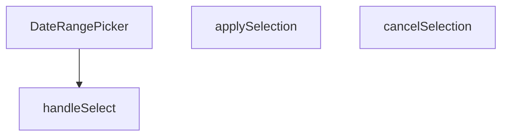

## Genel Bakış
Bu modül, yönetim paneli arayüzünde başlangıç ve bitiş tarihlerinin seçilmesi için kullanılan kontrollü bir React bileşenidir. Kullanıcının yaptığı geçici seçimleri yönetir, onaylama veya iptal mekanizması sağlar ve nihai tarih aralığını üst bileşene iletir.

## Fonksiyon Grupları
### Bileşen Tanımı
Tarih seçici arayüzünü ve temel yapılandırmasını tanımlayan ana bileşendir.
- DateRangePicker

### Etkileşim ve Durum Yönetimi
Kullanıcının tarih seçimi, seçimi onaylama veya iptal etme gibi aksiyonlarını işleyerek bileşenin iç durumunu ve çıktısını günceller.
- handleSelect, applySelection, cancelSelection

## AXIOMS – Mimari Varsayımlar
Bu modül için özel aksiyom tanımlanmamıştır.

**Aksiyom 1**: `className` prop’u sağlanmazsa, bileşen boş bir CSS sınıfı ile render edilir.  
**Aksiyom 2**: `value` prop’u `undefined` veya geçerli bir tarih aralığı nesnesi değilse, bileşen başlangıçta seçili bir aralık göstermez.  
**Aksiyom 3**: `onChange` callback’i sağlanmazsa, tarih aralığı değişiklikleri üst bileşene bildirilmez.  
**Aksiyom 4**: `handleSelect` fonksiyonu `undefined` bir argüman alırsa, mevcut iç seçim durumu temizlenir.  
**Aksiyom 5**: `handleSelect` fonksiyonu geçerli bir tarih aralığı nesnesi alırsa, bu değer iç duruma kaydedilir ve `onChange` tetiklenir.

---

## AXIOMS – Mimari Varsayımlar

Bu modül için sadece fonksiyon imzalarından türetilebilen temel mimari varsayımlar tanımlanmıştır. Fonksiyon gövdeleri verilmediğinden, içsel davranışa ilişkin aksiyomlar çıkarılamamıştır.

**[Aksiyom 1]**: Eğer `DateRangePicker` bileşenine üst bileşen tarafından `onChange` callback'i sağlanmazsa, kullanıcının nihai tarih aralığı seçimi üst bileşene iletilemez (bileşen işlevsel olarak anlamsız hale gelir).

**[Aksiyom 2]**: Eğer `DateRangePicker` bileşenine üst bileşen tarafından `value` prop'u (mevcut tarih aralığı) sağlanmazsa, bileşenin başlangıçta hangi tarih aralığını gösterdiği bilinmiyor; muhtemelen boş/belirsiz bir durumda başlar.

**[Aksiyom 3]**: `handleSelect(r: DateRange | undefined)` fonksiyonu, `r` parametresi olarak `undefined` alabilir; bu durumda geçici seçim temizlenir (seçim iptal edilir). Eğer bu geçiş düzgün yönetilmezse, kullanıcı arayüzünde tutarsız bir seçim durumu oluşur.

**[Aksiyom 4]**: `applySelection()` ve `cancelSelection()` fonksiyonları, bir içsel "geçici seçim" (pending selection) durumuna bağlıdır. Eğer geçici seçim durumu yoksa (hiç tarih seçilmediyse veya zaten uygulandıysa), bu fonksiyonların çağrılması anlamsızdır ve beklenmeyen davranışa yol açabilir.

**[Aksiyom 5]**: Bileşen `className` prop'u için varsayılan değer olarak boş string (`''`) kullanır. Eğer üst bileşen bu değeri değiştirmezse, bileşen varsayılan stillendirme ile render edilir.

---

## FONKSİYON DETAYLARI

### DateRangePicker
**Ne yapar**: Kullanıcıların bir tarih aralığı seçmesine olanak tanıyan bir React bileşeni sunar.  
**Nasıl yapar**: `value`, `onChange`, `placeholder` ve isteğe bağlı `className` propslarını alır; içsel durum ve etkileşimleri yöneterek seçilen aralığı dışarıya `onChange` callback’iyle bildirir.  
**Parametreler**:
- `value`: DateRange — Bileşenin mevcut tarih aralığı değeri.
- `onChange`: (range: DateRange) => void — Seçim değiştiğinde tetiklenen geri çağırma fonksiyonu.
- `placeholder`: string — Kullanıcıya gösterilecek yer tutucu metin.
- `className`: string — Bileşenin dış görünümünü özelleştirmek için ek CSS sınıfları (varsayılan: boş string).  
**Dönüş**: React.FC<DateRangePickerProps> — Tanımlı props tipine sahip bir fonksiyonel React bileşeni.

### handleSelect
**Ne yapar**: Önceden tanımlı bir tarih aralığı (preset) seçildiğinde, bu aralığı işleyerek bileşenin durumunu günceller.  
**Nasıl yapar**: `preset.getRange()` çağrısıyla elde edilen `DateRange` nesnesini alır ve `handleSelect` fonksiyonuna iletir; fonksiyon içinde muhtemelen `onChange` callback’i çağrılır.  
**Parametreler**:
- `r`: DateRange | undefined — Seçilen tarih aralığı; tanımsız (undefined) olma ihtimali vardır.  
**Dönüş**: Belirtilmemiş (void veya bilinmiyor).

### applySelection
**Ne yapar**: Kullanıcı tarafından yapılan tarih aralığı seçimini onaylar ve seçilen değeri dışa aktarır.  
**Nasıl yapar**: Muhtemelen geçerli seçim durumunu `onChange` callback’iyle iletir ve UI’yı kapatır; iç mantık kodda belirtilmemiştir.  
**Parametreler**: Yok.  
**Dönüş**: Belirtilmemiş (void veya bilinmiyor).

### cancelSelection
**Ne yapar**: Kullanıcı tarafından başlatılan tarih aralığı seçimini iptal eder ve önceki duruma geri döner.  
**Nasıl yapar**: Seçim sürecini sonlandırarak geçici değişiklikleri temizler; iç mantık kodda yer almamaktadır.  
**Parametreler**: Yok.  
**Dönüş**: Belirtilmemiş (void veya bilinmiyor).

---

## İTHALATLAR (IMPORTS)
- import: ../../i18n/I18nProvider::useI18n
- import: @radix-ui/react-popover
- import: date-fns/locale::enUS
- import: date-fns/locale::tr
- import: lucide-react::Calendar
- import: lucide-react::Check
- import: lucide-react::ChevronDown
- import: react-day-picker::DateRange
- import: react-day-picker::DayPicker
- import: react::React
- import: react::useState

---

## INTERFACES

### DateRangePickerProps
- `value?: DateRange`
- `onChange?: (range?: DateRange) => void`
- `placeholder?: string`
- `className?: string`

---

## AST POINTERS

### [N1_NASIL] AST Pointer: `DateRangePicker.tsx::DateRangePicker`
- **params**: `({ value, onChange, placeholder, className = '' })`
- **ic_degiskenler**:
  - `lang` — `useI18n()` hook'undan destructure edilen dil ayarı (`'en'` veya `'tr'`)
  - `locale` — `lang` değerine göre seçilen date-fns locale nesnesi (`enUS` veya `tr`)
  - `isOpen` — `useState(false)`, popover'ın açık/kapalı durumunu tutar
  - `setIsOpen` — `isOpen` state setter'ı, popover açma/kapama için kullanılır
  - `selectedRange` — `useState<DateRange | undefined>(value)`, takvimde seçili olan tarih aralığını tutar
  - `setSelectedRange` — `selectedRange` state setter'ı, seçim değişikliklerinde çağrılır
  - `months` — `useState(2)`, DayPicker'da gösterilecek ay sayısını tutar (mobilde 1, masaüstünde 2)
  - `setMonths` — `months` state setter'ı, resize eventinde güncellenir
  - `checkMobile` — arrow function, `window.innerWidth < 768` kontrolü ile `setMonths` çağırır; hem useEffect içinde hem resize listener'da kullanılır
  - `presets` — `Array<{label: string, getRange: () => DateRange}>`, 8 adet hazır tarih aralığı seçeneği (Bugün, Dün, Son 7 Gün, vb.) içeren dizi
  - `triggerLabel` — string, popover tetikleyici butonunda gösterilen formatlanmış tarih aralığı metni; `value.from` varsa formatlanmış tarih, yoksa `placeholder` veya varsayılan metin
  - `dayPickerClassNames` — object, `react-day-picker` `DayPicker` bileşeninin `classNames` prop'una geçirilen Tailwind CSS class override'ları
- **Dönüş**: JSX — `Popover.Root` içine sarılı buton + popover content (takvim ve preset butonları)

---

## MERMAID CALL GRAPH

## NODE ID STANDARD

  file: src\components\admin\DateRangePicker.tsx
  function: src\components\admin\DateRangePicker.tsx::DateRangePicker
  function: src\components\admin\DateRangePicker.tsx::handleSelect
  function: src\components\admin\DateRangePicker.tsx::applySelection
  function: src\components\admin\DateRangePicker.tsx::cancelSelection

---

## DISA AKTARILANLAR (EXPORTS)
  export: DateRangePicker

---

## STİL TOKENLERİ

### Arbitrary Değerler (token'a geçirilmemiş)
Yok — tüm stiller token'a geçirilmiş. ✅

### Kullanılan Token'lar (zaten token'a geçirilmiş)
- (yok)

### Tailwind Sınıf Özeti
- **Renkler:** `bg-primary-navy`, `bg-slate-50`, `bg-white`, `bg-white/95`, `border-b`, `border-slate-100`, `border-slate-200`, `border-slate-200/60`, `border-t`, `hover:bg-primary-navy/90`, `hover:bg-slate-100`, `hover:bg-slate-200/50`, `hover:bg-slate-50`, `hover:border-slate-300`, `hover:text-slate-800`
- **Layout:** `backdrop-blur-xl`, `flex`, `flex-col`, `gap-1`, `gap-2`, `inline-flex`, `items-center`, `justify-between`, `max-h-60vh`, `max-h-85vh`, `max-w-full`, `md:flex-row`, `md:max-h-none`, `md:w-48`, `md:w-auto`
- **Varyant/Responsive:** `:`, `active:`, `disabled:`, `focus-visible:`, `hover:`, `md:`, `sm:` önekleri
- **Yardımcı Sınıflar:** `${className`, `${isOpen`, `${isSelected`, `:`, `active:scale-95`, `animate-in`, `border`, `disabled:active:scale-100`, `disabled:opacity-50`, `duration-200`, `fade-in`, `focus-visible:outline-none`, `focus-visible:ring-2`, `focus-visible:ring-primary-navy/20`, `font-bold`