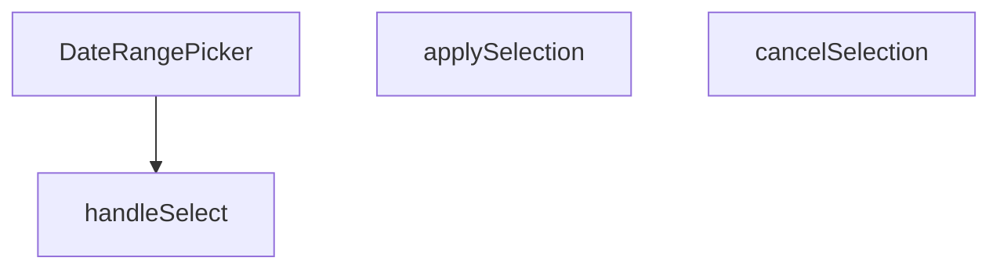

## Genel Bakış
Bu modül, yönetim paneli arayüzünde başlangıç ve bitiş tarihlerinin seçilmesi için kullanılan kontrollü bir React bileşenidir. Kullanıcının yaptığı geçici seçimleri yönetir, onaylama veya iptal mekanizması sağlar ve nihai tarih aralığını üst bileşene iletir.

## Fonksiyon Grupları
### Bileşen Tanımı
Tarih seçici arayüzünü ve temel yapılandırmasını tanımlayan ana bileşendir.
- DateRangePicker

### Etkileşim ve Durum Yönetimi
Kullanıcının tarih seçimi, seçimi onaylama veya iptal etme gibi aksiyonlarını işleyerek bileşenin iç durumunu ve çıktısını günceller.
- handleSelect, applySelection, cancelSelection

---

## AXIOMS – Mimari Varsayımlar

Bu modül için fonksiyon gövdesi verilmediğinden, çalışan kodun gerektirdiği mimari koşullar çıkarılamamıştır. Aşağıdaki yalnızca bileşen imzasından çıkarılabilen temel kontrollü-bileşen varsayımlarıdır:

[Aksiyom 1]: Eğer `value` prop'u sağlanmazsa, bileşen kontrolsüz modda çalışır ve nihai seçim bileşen iç state'inde kaybolur; üst bileşene bildirim yapılamaz.

[Aksiyom 2]: Eğer `onChange` prop'u sağlanmazsa, `applySelection` çağrıldığında nihai tarih aralığını üst bileşene iletme mekanizması çalışmaz.

[Aksiyom 3]: Eğer `handleSelect` parametresi `undefined` olarak çağrılırsa, geçici seçim temizlenir (bu, mevcut eski dokümanın genel bakış bölümünden doğrulanmaktadır).

---

## FONKSİYON DETAYLARI

### DateRangePicker
**Ne yapar**: Kullanıcıların bir tarih aralığı seçmesine olanak tanıyan bir React bileşeni sunar.  
**Nasıl yapar**: `value`, `onChange`, `placeholder` ve isteğe bağlı `className` propslarını alır; içsel durum ve etkileşimleri yöneterek seçilen aralığı dışarıya `onChange` callback’iyle bildirir.  
**Parametreler**:
- `value`: DateRange — Bileşenin mevcut tarih aralığı değeri.
- `onChange`: (range: DateRange) => void — Seçim değiştiğinde tetiklenen geri çağırma fonksiyonu.
- `placeholder`: string — Kullanıcıya gösterilecek yer tutucu metin.
- `className`: string — Bileşenin dış görünümünü özelleştirmek için ek CSS sınıfları (varsayılan: boş string).  
**Dönüş**: React.FC<DateRangePickerProps> — Tanımlı props tipine sahip bir fonksiyonel React bileşeni.

### handleSelect
**Ne yapar**: Önceden tanımlı bir tarih aralığı (preset) seçildiğinde, bu aralığı işleyerek bileşenin durumunu günceller.  
**Nasıl yapar**: `preset.getRange()` çağrısıyla elde edilen `DateRange` nesnesini alır ve `handleSelect` fonksiyonuna iletir; fonksiyon içinde muhtemelen `onChange` callback’i çağrılır.  
**Parametreler**:
- `r`: DateRange | undefined — Seçilen tarih aralığı; tanımsız (undefined) olma ihtimali vardır.  
**Dönüş**: Belirtilmemiş (void veya bilinmiyor).

### applySelection
**Ne yapar**: Kullanıcı tarafından yapılan tarih aralığı seçimini onaylar ve seçilen değeri dışa aktarır.  
**Nasıl yapar**: Muhtemelen geçerli seçim durumunu `onChange` callback’iyle iletir ve UI’yı kapatır; iç mantık kodda belirtilmemiştir.  
**Parametreler**: Yok.  
**Dönüş**: Belirtilmemiş (void veya bilinmiyor).

### cancelSelection
**Ne yapar**: Kullanıcı tarafından başlatılan tarih aralığı seçimini iptal eder ve önceki duruma geri döner.  
**Nasıl yapar**: Seçim sürecini sonlandırarak geçici değişiklikleri temizler; iç mantık kodda yer almamaktadır.  
**Parametreler**: Yok.  
**Dönüş**: Belirtilmemiş (void veya bilinmiyor).

---

## İTHALATLAR (IMPORTS)
- import: ../../i18n/I18nProvider::useI18n
- import: @radix-ui/react-popover
- import: date-fns/locale::enUS
- import: date-fns/locale::tr
- import: lucide-react::Calendar
- import: lucide-react::Check
- import: lucide-react::ChevronDown
- import: react-day-picker::ClassNames
- import: react-day-picker::DateRange
- import: react-day-picker::DayPicker
- import: react::React
- import: react::useState

---

## INTERFACES

### DateRangePickerProps
- `value?: DateRange`
- `onChange?: (range?: DateRange) => void`
- `placeholder?: string`
- `className?: string`

---

## AST POINTERS

### [N1_NASIL] AST Pointer: DateRangePicker.tsx::DateRangePicker
- **params**: `{ value, onChange, placeholder, className = '' }`
- **ic_degiskenler**:
  - `lang` — useI18n hook'undan alınan mevcut dil kodu (örn: 'en', 'tr')
  - `t` — useI18n hook'undan alınan çeviri fonksiyonu
  - `locale` — lang değerine göre date-fns locale nesnesi (enUS veya tr)
  - `isOpen` — Popover'ın açık/kapalı durumunu tutan state
  - `selectedRange` — Seçili tarih aralığını tutan state (DateRange | undefined)
  - `months` — Takvimde gösterilecek ay sayısını tutan state (mobilde 1, masaüstünde 2)
  - `checkMobile` — Pencere genişliğine göre months state'ini güncelleyen fonksiyon
  - `presets` — Hazır tarih aralıklarını (bugün, dün, son 7 gün vb.) tutan dizi
  - `triggerLabel` — Tetikleyici düğmesinin gösterilecek metni (seçili aralığa göre formatlanmış)
  - `navButton` — Takvim gezinme düğmeleri için Tailwind CSS sınıf dizgisi
  - `dayPickerClassNames` — DayPicker bileşeni için özel CSS sınıflarını tutan Partial<ClassNames> nesnesi
- **Dönüş**: JSX (React bileşen ağacı)

### [N2_NASIL] AST Pointer: DateRangePicker.tsx::useEffect[checkMobile]
- **params**: (yok)
- **ic_degiskenler**:
  - `checkMobile` — Pencere genişliğine göre months state'ini güncelleyen yerel fonksiyon
- **Dönüş**: Temizleme fonksiyonu (resize event listener'ı kaldırır)

### [N3_NASIL] AST Pointer: DateRangePicker.tsx::useEffect[syncValue]
- **params**: (yok)
- **ic_degiskenler**:
  - (yok — sadece setSelectedRange çağrısı yapılıyor)
- **Dönüş**: yok

### [N4_NASIL] AST Pointer: DateRangePicker.tsx::presets[lastMonth].getRange
- **params**: (yok)
- **ic_degiskenler**:
  - `lp` — Bir önceki ayın tarih nesnesi (subMonths ile hesaplanan)
- **Dönüş**: `{ from: startOfMonth(lp), to: endOfMonth(lp) }` (DateRange nesnesi)

### [N5_NASIL] AST Pointer: DateRangePicker.tsx::handleSelect
- **params**: `r: DateRange | undefined`
- **ic_degiskenler**:
  - (yok — sadece setSelectedRange çağrısı yapılıyor)
- **Dönüş**: yok

### [N6_NASIL] AST Pointer: DateRangePicker.tsx::applySelection
- **params**: (yok)
- **ic_degiskenler**:
  - (yok — onChange ve setIsOpen çağrısı yapılıyor)
- **Dönüş**: yok

### [N7_NASIL] AST Pointer: DateRangePicker.tsx::cancelSelection
- **params**: (yok)
- **ic_degiskenler**:
  - (yok — setSelectedRange ve setIsOpen çağrısı yapılıyor)
- **Dönüş**: yok

### [N8_NASIL] AST Pointer: DateRangePicker.tsx::presets.map[preset, idx]
- **params**: `(preset, idx)`
- **ic_degiskenler**:
  - `isSelected` — Mevcut seçimin bu preset ile aynı olup olmadığını hesaplayan boolean değer
- **Dönüş**: JSX (button bileşeni)

---

## MERMAID CALL GRAPH

## NODE ID STANDARD

  file: src\components\admin\DateRangePicker.tsx
  function: src\components\admin\DateRangePicker.tsx::DateRangePicker
  function: src\components\admin\DateRangePicker.tsx::handleSelect
  function: src\components\admin\DateRangePicker.tsx::applySelection
  function: src\components\admin\DateRangePicker.tsx::cancelSelection

---

## DISA AKTARILANLAR (EXPORTS)
  export: DateRangePicker

---

## STİL TOKENLERİ

### Arbitrary Değerler (token'a geçirilmemiş)
Yok — tüm stiller token'a geçirilmiş. ✅

### Kullanılan Token'lar (zaten token'a geçirilmiş)
- (yok)

### Tailwind Sınıf Özeti
- **Renkler:** `bg-admin-accent`, `bg-admin-surface`, `bg-admin-surface-2`, `border-admin-border`, `border-b`, `border-t`, `hover:bg-admin-accent-hover`, `hover:bg-admin-surface-2`, `hover:border-admin-border`, `hover:text-admin-fg-subtle`, `md:border-b-0`, `md:border-r`, `text-admin-accent`, `text-admin-accent-fg`, `text-admin-fg-muted`
- **Layout:** `flex`, `flex-col`, `gap-1`, `gap-2`, `inline-flex`, `items-center`, `justify-between`, `max-h-admin-popover`, `max-h-admin-popover-section`, `max-w-full`, `md:flex-row`, `md:max-h-none`, `md:w-48`, `md:w-auto`, `overflow-hidden`
- **Varyant/Responsive:** `:`, `active:`, `disabled:`, `focus-visible:`, `hover:`, `md:`, `sm:` önekleri
- **Yardımcı Sınıflar:** `${className`, `${isOpen`, `${isSelected`, `:`, `active:scale-95`, `animate-in`, `border`, `disabled:active:scale-100`, `disabled:opacity-50`, `duration-200`, `fade-in`, `focus-visible:outline-none`, `focus-visible:ring-2`, `focus-visible:ring-admin-ring`, `font-medium`