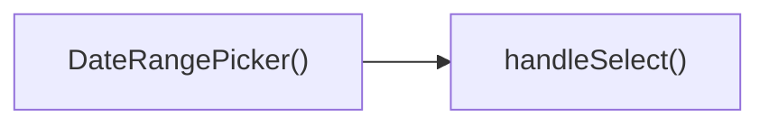

## Genel Bakış
`DateRangePicker` bileşeni, kullanıcıların bir tarih aralığı seçmesine olanak tanıyan bir UI kontrolüdür. Seçim işlemleri sırasında geçici durumu yönetir, onay veya iptal akışlarını gerçekleştirir ve dışarıya sağlanan callback aracılığıyla ebeveyn bileşeni günceller.

## Fonksiyon Grupları
### Bileşen Tanımı
Bileşenin dış arayüzünü, props yapılandırmasını ve temel render mekanizmasını içerir; tarih aralığı seçme arayüzünün görüntülenmesini sağlar.  
- `DateRangePicker`

### Seçim İşleme
Kullanıcının geçici seçimlerini kaydeder, onaylandığında `onChange` callback'ini tetikler ya da iptal edildiğinde seçimi sıfırlayarak önceki duruma döndürür.  
- `handleSelect`, `applySelection`, `cancelSelection`

---

## AXIOMS – Mimari Varsayımlar  
Bu modül için özel aksiyom tanımlanmamıştır.

### Aksiyom 1  
**Aksiyom 1**: Eğer `value` parametresi `undefined` ise, bileşen kullanıcıya `placeholder` metnini gösterir.  
**Aksiyom 2**: Eğer `value` parametresi `undefined` değilse, bileşen `value` içinde belirtilen tarih aralığını varsayılan olarak seçilmiş olarak gösterir.  

### Aksiyom 2  
**Aksiyom 3**: `handleSelect(r: DateRange | undefined)` fonksiyonu çağrıldığında, `r` değeri `undefined` ise bileşenin geçici seçimi (internal state) boşaltılır; aksi halde geçici seçim `r` ile güncellenir.  

### Aksiyom 3  
**Aksiyom 4**: `applySelection()` fonksiyonu çağrıldığında, geçici seçim `value` ile aynı değilse `onChange` callback’i çağrılır ve geçici seçim `value` olarak kabul edilir.  
**Aksiyom 5**: `applySelection()` çağrıldığında `onChange` callback’i tanımlı değilse, fonksiyon hiçbir yan etki yaratmaz.  

### Aksiyom 4  
**Aksiyom 6**: `cancelSelection()` fonksiyonu çağrıldığında, geçici seçim `value` ile aynı hale getirilir (yani yapılan değişiklikler iptal edilir).  

### Aksiyom 5  
**Aksiyom 7**: `className` parametresi boş string (`''`) ise bileşen root elementine herhangi bir ek sınıf eklenmez; aksi halde verilen sınıf root elementine uygulanır.  

### Domain‑specific Kurallar  
- `DateRange` nesnesi, `start` ve `end` alanlarına sahip olmalı ve `start` tarihinin `end` tarihinden önce veya eşit olması gerekir.  
- `onChange` callback’i, yeni `DateRange` nesnesini alacak şekilde tanımlanmalıdır.  
- `placeholder` metni, `value` `undefined` olduğunda gösterilecek metindir; bu metin boş olamaz.  

Bu aksiyomlar, fonksiyon gövdelerinin (varsa) ve fonksiyon imzalarının (verilen) temel mantığını yansıtmaktadır.

---

---

## FONKSIYON DETAYLARI

### DateRangePicker
**Ne yapar**: Tarih aralığı seçmek için kullanılan bir React fonksiyonel bileşenidir. Kullanıcının başlangıç ve bitiş tarihlerini seçmesine olanak tanır.

**Nasıl yapar**: Belirtilen prop'lar aracılığıyla seçili değeri alır, değişiklikleri üst bileşene bildirir ve görsel özelleştirmeye izin verir. İç yapısında genellikle iki adet tarih seçici alanı ve onay/iptal düğmeleri barındırır.

**Parametreler**:
- value: DateRange | undefined — Bileşenin kontrol ettiği seçili tarih aralığı değeri.
- onChange: (range: DateRange | undefined) => void — Kullanıcı seçimi onayladığında yeni aralığı ileten geri çağırma işlevi.
- placeholder: string — Seçim yapılmadığında gösterilecek yer tutucu metin.
- className: string — Bileşenin kök öğesine eklenecek ek CSS sınıfı.

**Dönüş**: React.FC<DateRangePickerProps>

### handleSelect
**Ne yapar**: Kullanıcı tarafından bir tarih aralığı seçildiğinde tetiklenen olay işleyicisidir. Seçilen aralığı yakalar ve bileşenin geçici durumuna işler.

**Nasıl yapar**: Aldığı `r` parametresini kullanarak seçilen aralığı kaydeder. Bu işlem genellikle bileşenin bir `useState` değişkenini güncellemeyi içerir.

**Parametreler**:
- r: DateRange | undefined — Kullanıcının seçtiği yeni tarih aralığı; aralık seçimi kaldırılmışsa `undefined` gelir.

**Dönüş**: (belirtilmemiş)

### applySelection
**Ne yapar**: Kullanıcının geçici olarak seçtiği tarih aralığını onaylar ve kesinleşt

---

## INTERFACES

### DateRangePickerProps
- `value?: DateRange`
- `onChange?: (range?: DateRange) => void`
- `placeholder?: string`
- `className?: string`

---

## AST POINTERS

### [N1_NASIL] AST Pointer: C:\Users\alize\venthub-hvac\src\components\admin\DateRangePicker.tsx::DateRangePicker
- **params**: `value`, `onChange`, `placeholder`, `className` (varsayılan değer `''`)
- **ic_degiskenler**:
  - `lang` — `useI18n()` hook'undan alınan dil kodu (örn. `'en'` veya `'tr'`)
  - `locale` — `lang` değerine göre `enUS` veya `tr` olarak atanan date-fns locale objesi
  - `isOpen` — popover'ın açık/kapalı durumunu tutan state (`useState(false)`)
  - `selectedRange` — mevcut seçili tarih aralığını tutan state (`useState<DateRange | undefined>(value)`)
  - `months` — takvimde görüntülenecek ay sayısını tutan state (`useState(2)`, mobilde 1)
  - `checkMobile` — `useEffect` içinde tanımlanan, pencere genişliğine göre `months` değerini güncelleyen fonksiyon
  - `presets` — hızlı seçim butonları için tanımlanan, her biri `label` ve `getRange` metodu olan nesne dizisi
  - `triggerLabel` — popover tetikleyici butonda gösterilecek metin; `value.from` varsa formatlanmış tarih, yoksa `placeholder` veya varsayılan metin
  - `dayPickerClassNames` — `react-day-picker` bileşenini Tailwind CSS ile özelleştirmek için sınıf isimleri objesi
- **Dönüş**: JSX (Popover.Root, Popover.Trigger, Popover.Content, DayPicker, butonlar)

### [N2_NASIL] AST Pointer: C:\Users\alize\venthub-hvac\src\components\admin\DateRangePicker.tsx::handleSelect
- **params**: `r: DateRange | undefined`
- **ic_degiskenler**: (yok)
- **Dönüş**: yok (`setSelectedRange(r)` çağrısı yapar)

### [N3_NASIL] AST Pointer: C:\Users\alize\venthub-hvac\src\components\admin\DateRangePicker.tsx::applySelection
- **params**: (parametre yok)
- **ic_degiskenler**: (yok)
- **Dönüş**: yok (`onChange` varsa `onChange(selectedRange)` çağrısı yapar, `setIsOpen(false)` ile popover'ı kapatır)

### [N4_NASIL] AST Pointer: C:\Users\alize\venthub-hvac\src\components\admin\DateRangePicker.tsx::cancelSelection
- **params**: (parametre yok)
- **ic_degiskenler**: (yok)
- **Dönüş**: yok (`setSelectedRange(value)` ile seçimi iptal eder, `setIsOpen(false)` ile popover'ı kapatır)

### [N5_NASIL] AST Pointer: C:\Users\alize\venthub-hvac\src\components\admin\DateRangePicker.tsx::useEffect (mobil kontrol)
- **params**: (parametre yok, useEffect callback)
- **ic_degiskenler**:
  - `checkMobile` — `window.innerWidth < 768` kontrolü ile `setMonths(1)` veya `setMonths(2)` yapan fonksiyon
- **Dönüş**: temizleme fonksiyonu (`window.removeEventListener('resize', checkMobile)`)

### [N6_NASIL] AST Pointer: C:\Users\alize\venthub-hvac\src\components\admin\DateRangePicker.tsx::useEffect (dışarıdan value senkronizasyonu)
- **params**: (parametre yok, useEffect callback)
- **ic_degiskenler**: (yok, doğrudan `value?.from`, `value?.to`, `selectedRange?.from`, `selectedRange?.to` karşılaştırılır)
- **Dönüş**: yok (fark varsa `setSelectedRange(value)` çağrısı)

### [N7_NASIL] AST Pointer: C:\Users\alize\venthub-hvac\src\components\admin\DateRangePicker.tsx::Geçen Ay preset arrow function
- **params**: (parametre yok, preset.getRange fonksiyonu)
- **ic_degiskenler**:
  - `lp` — `subMonths(new Date(), 1)` ile bir önceki ayın tarihi
- **Dönüş**: `{ from: startOfMonth(lp), to: endOfMonth(lp) }`

### [N8_NASIL] AST Pointer: C:\Users\alize\venthub-hvac\src\components\admin\DateRangePicker.tsx::preset.map callback
- **params**: `preset`, `idx`
- **ic_degiskenler**:
  - `isSelected` — `selectedRange.from` ve `selectedRange.to` ile `preset.getRange()` dönüşünün karşılaştırılması sonucu boolean
- **Dönüş**: JSX (buton elementi, tıklanınca `handleSelect(preset.getRange())` çağrısı)

---

## Çağrı Haritası

### Dışarıya Çağrılar (Outgoing)
- **DateRangePicker()** fonksiyonu, kullanıcı bir tarih aralığı seçtiğinde **handleSelect** fonksiyonunu çağırır; seçilen tarihleri işlemek için bu çağrı yapılır.

### Dışarından Çağrılanlar (Incoming)
- Verilen veri setinde bu modülü çağıran dış bir fonksiyon veya modül bulunmamaktadır.

### İç İçe Fonksiyonlar (Nested)
- Yok

---

## DOSYA-İÇİ ÇAĞRI GRAFİĞİ
  DateRangePicker() → handleSelect()

---

## NODE ID STANDARD

  file: src\components\admin\DateRangePicker.tsx
  function: src\components\admin\DateRangePicker.tsx::DateRangePicker
  function: src\components\admin\DateRangePicker.tsx::handleSelect
  function: src\components\admin\DateRangePicker.tsx::applySelection
  function: src\components\admin\DateRangePicker.tsx::cancelSelection

---

## DISA AKTARILANLAR (EXPORTS)
  export: DateRangePicker