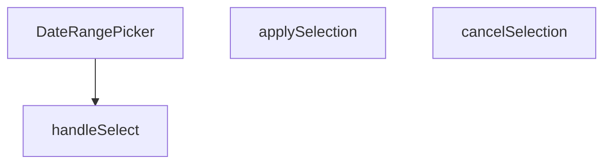

## Genel Bakış
Bu modül, yönetim paneli arayüzünde başlangıç ve bitiş tarihlerinin seçilmesi için kullanılan kontrollü bir React bileşenidir. Kullanıcının yaptığı geçici seçimleri yönetir, onaylama veya iptal mekanizması sağlar ve nihai tarih aralığını üst bileşene iletir.

## Fonksiyon Grupları
### Bileşen Tanımı
Tarih seçici arayüzünü ve temel yapılandırmasını tanımlayan ana bileşendir. `value` ve `onChange` props'ları aracılığıyla kontrollü bir bileşen olarak çalışır.
- DateRangePicker

### Etkileşim ve Durum Yönetimi
Kullanıcının tarih seçimi, seçimi onaylama veya iptal etme gibi aksiyonlarını işleyerek bileşenin iç durumunu ve çıktısını günceller. `handleSelect` geçici seçimi günceller, `applySelection` onaylandığında üst bileşene bildirir, `cancelSelection` ise seçimi sıfırlar.
- handleSelect, applySelection, cancelSelection

---

## AXIOMS – Mimari Varsayımlar
- Bu modül davranışsal mantık içermez (salt veri / konfigürasyon / tip tanımı).
- [Aksiyom 1]: Modülün dışa açtığı yapı (anahtar kümesi / şema) bir sözleşmedir; tüketiciler bu sabit yapıya bağlıdır — kırıcı değişiklik tüm tüketicileri etkiler.
- [Aksiyom 2]: Bir öğe ekleme/çıkarma yapısal-uyumlu olmalı; ilgili tipler ve seçiciler aynı commit'te güncel tutulmalıdır.

---

## FONKSİYON DETAYLARI

### DateRangePicker
**Ne yapar**: Kullanıcıların bir tarih aralığı seçmesine olanak tanıyan bir React bileşeni sunar.  
**Nasıl yapar**: `value`, `onChange`, `placeholder` ve isteğe bağlı `className` propslarını alır; içsel durum ve etkileşimleri yöneterek seçilen aralığı dışarıya `onChange` callback’iyle bildirir.  
**Parametreler**:
- `value`: DateRange — Bileşenin mevcut tarih aralığı değeri.
- `onChange`: (range: DateRange) => void — Seçim değiştiğinde tetiklenen geri çağırma fonksiyonu.
- `placeholder`: string — Kullanıcıya gösterilecek yer tutucu metin.
- `className`: string — Bileşenin dış görünümünü özelleştirmek için ek CSS sınıfları (varsayılan: boş string).  
**Dönüş**: React.FC<DateRangePickerProps> — Tanımlı props tipine sahip bir fonksiyonel React bileşeni.

### handleSelect
**Ne yapar**: Önceden tanımlı bir tarih aralığı (preset) seçildiğinde, bu aralığı işleyerek bileşenin durumunu günceller.  
**Nasıl yapar**: `preset.getRange()` çağrısıyla elde edilen `DateRange` nesnesini alır ve `handleSelect` fonksiyonuna iletir; fonksiyon içinde muhtemelen `onChange` callback’i çağrılır.  
**Parametreler**:
- `r`: DateRange | undefined — Seçilen tarih aralığı; tanımsız (undefined) olma ihtimali vardır.  
**Dönüş**: Belirtilmemiş (void veya bilinmiyor).

### applySelection
**Ne yapar**: Kullanıcı tarafından yapılan tarih aralığı seçimini onaylar ve seçilen değeri dışa aktarır.  
**Nasıl yapar**: Muhtemelen geçerli seçim durumunu `onChange` callback’iyle iletir ve UI’yı kapatır; iç mantık kodda belirtilmemiştir.  
**Parametreler**: Yok.  
**Dönüş**: Belirtilmemiş (void veya bilinmiyor).

### cancelSelection
**Ne yapar**: Kullanıcı tarafından başlatılan tarih aralığı seçimini iptal eder ve önceki duruma geri döner.  
**Nasıl yapar**: Seçim sürecini sonlandırarak geçici değişiklikleri temizler; iç mantık kodda yer almamaktadır.  
**Parametreler**: Yok.  
**Dönüş**: Belirtilmemiş (void veya bilinmiyor).

---

## İTHALATLAR (IMPORTS)
- import: ../../i18n/I18nProvider::useI18n
- import: @radix-ui/react-popover
- import: date-fns/locale::enUS
- import: date-fns/locale::tr
- import: lucide-react::Calendar
- import: lucide-react::Check
- import: lucide-react::ChevronDown
- import: react-day-picker::ClassNames
- import: react-day-picker::DateRange
- import: react-day-picker::DayPicker
- import: react::React
- import: react::useState

---

## INTERFACES

### DateRangePickerProps
- `value?: DateRange`
- `onChange?: (range?: DateRange) => void`
- `placeholder?: string`
- `className?: string`

---

## AST POINTERS

### [N1_NASIL] AST Pointer: src/components/admin/DateRangePicker.tsx::DateRangePicker
- **params**: `value`, `onChange`, `placeholder`, `className` (varsayılan: `''`)
- **ic_degiskenler**:
  - `lang` — `useI18n()` hook'undan gelen dil kodu; `'en'` ise `enUS`, değilse `tr` locale'ini seçmek için kullanılır
  - `t` — `useI18n()` hook'undan gelen çeviri fonksiyonu; preset etiketleri, buton metinleri ve yer tutucu metinler için kullanılır
  - `locale` — `lang` değerine göre seçilen `date-fns` locale nesnesi (`enUS` veya `tr`); tarih formatlamalarında kullanılır
  - `isOpen` — popover'ın açık/kapalı durumunu tutan state; `Popover.Root` bileşeninin `open` prop'una bağlanır
  - `setIsOpen` — `isOpen` state'ini güncelleyen setter; `Popover.Root`'un `onOpenChange`'ine, `applySelection` ve `cancelSelection` fonksiyonlarına bağlanır
  - `selectedRange` — kullanıcının seçtiği tarih aralığını tutan state (`DateRange | undefined`); `DayPicker`'ın `selected` prop'una, preset karşılaştırmalarına ve aksiyon butonlarına bağlanır
  - `setSelectedRange` — `selectedRange` state'ini güncelleyen setter; `handleSelect`, `cancelSelection` ve dış `value` senkronizasyonu useEffect'inde kullanılır
  - `months` — takvimde gösterilen ay sayısını tutan state; ekran genişliğine göre 1 veya 2 olur; `DayPicker`'ın `numberOfMonths` prop'una bağlanır
  - `setMonths` — `months` state'ini güncelleyen setter; resize event listener içinde kullanılır
  - `checkMobile` — useEffect içinde tanımlanan fonksiyon; `window.innerWidth < 768` kontrolü yaparak `months` değerini belirler
  - `presets` — hazır tarih aralığı seçeneklerini içeren dizi; her eleman `label` (çevrilmiş metin) ve `getRange` (aralık üreten fonksiyon) içerir
  - `handleSelect` — `DayPicker`'ın `onSelect` prop'una ve preset butonlarına bağlanan callback; seçilen aralığı `selectedRange` state'ine yazar
  - `applySelection` — "Uygula" butonuna bağlı callback; `selectedRange`'i dışarıya `onChange` ile bildirir ve popover'ı kapatır
  - `cancelSelection` — "Vazgeç" butonuna bağlı callback; `selectedRange`'i dış `value`'ya sıfırlar ve popover'ı kapatır
  - `triggerLabel` — tetikleyici butonda gösterilen metin; `value.from` varsa tarihleri formatlar, yoksa `placeholder` veya çeviri metni kullanır
  - `navButton` — navigasyon butonlarına uygulanan Tailwind CSS sınıf dizesi; `button_previous` ve `button_next` sınıflarında yeniden kullanılır
  - `dayPickerClassNames` — `react-day-picker` v9 için Tailwind CSS sınıf geçersiz kılma haritası (`Partial<ClassNames>` tipinde); takvim görünümünü özelleştirir
- **Dönüş**: JSX (React.FC<DateRangePickerProps>)

### [N2_NASIL] AST Pointer: src/components/admin/DateRangePicker.tsx::handleSelect
- **params**: `r` (`DateRange | undefined`)
- **ic_degiskenler**: yok
- **Dönüş**: yok

### [N3_NASIL] AST Pointer: src/components/admin/DateRangePicker.tsx::applySelection
- **params**: yok
- **ic_degiskenler**:
  - `onChange` — üst bileşenden gelen callback; `selectedRange` varsa çağrılır
  - `selectedRange` — kullanıcının seçtiği tarih aralığı; `onChange`'e argüman olarak geçilir
  - `setIsOpen` — popover'ı kapatmak için çağrılır (`false` argümanıyla)
- **Dönüş**: yok

### [N4_NASIL] AST Pointer: src/components/admin/DateRangePicker.tsx::cancelSelection
- **params**: yok
- **ic_degiskenler**:
  - `value` — üst bileşenden gelen mevcut tarih aralığı; `setSelectedRange`'e argüman olarak geçilerek seçim sıfırlanır
  - `setSelectedRange` — `value` ile çağrılarak yerel seçim dış değere geri döndürülür
  - `setIsOpen` — popover'ı kapatmak için çağrılır (`false` argümanıyla)
- **Dönüş**: yok

### [N5_NASIL] AST Pointer: src/components/admin/DateRangePicker.tsx::useEffect (mobil kontrol)
- **params**: yok
- **ic_degiskenler**:
  - `checkMobile` — ok fonksiyonu; `window.innerWidth < 768` koşuluyla `months` değerini 1 veya 2 olarak ayarlar
  - `setMonths` — `checkMobile` içinde çağrılır; ekran genişliğine göre ay sayısını günceller
  - `window` — `innerWidth` özelliği okunur; `resize` event listener eklenir/kaldırılır
- **Dönüş**: cleanup fonksiyonu (`window.removeEventListener('resize', checkMobile)`)

### [N6_NASIL] AST Pointer: src/components/admin/DateRangePicker.tsx::useEffect (value senkronizasyonu)
- **params**: yok
- **ic_degiskenler**:
  - `value` — üst bileşenden gelen tarih aralığı; `setSelectedRange`'e argüman olarak geçilir
  - `setSelectedRange` — dış `value` değiştiğinde yerel `selectedRange`'i senkronize etmek için çağrılır
- **Dönüş**: yok

### [N7_NASIL] AST Pointer: src/components/admin/DateRangePicker.tsx::getRange (lastMonth preset)
- **params**: yok
- **ic_degiskenler**:
  - `lp` — `subMonths(new Date(), 1)` ile hesaplanan bir önceki ayın tarihi nesnesi; `startOfMonth` ve `endOfMonth`'a argüman olarak geçilir
- **Dönüş**: `{ from: Date, to: Date }` (bir önceki ayın başlangıç ve bitiş tarihleri)

### [N8_NASIL] AST Pointer: src/components/admin/DateRangePicker.tsx::presets.map callback
- **params**: `preset` (dizi elemanı), `idx` (dizi indeksi)
- **ic_degiskenler**:
  - `isSelected` — mevcut `selectedRange` ile `preset.getRange()`'in `from` ve `to` zaman damgalarının eşitliğini kontrol eden boolean; buton stilini ve `Check` ikonunun görünürlüğünü belirler
  - `selectedRange` — `from?.getTime()` ve `to?.getTime()` erişimleri yapılır; preset karşılaştırması için kullanılır
  - `preset` — `label` (buton metni) ve `getRange()` (aralık üreten fonksiyon) özelliklerine erişilir
  - `handleSelect` — buton `onClick`'inde `preset.getRange()` sonucuyla çağrılır
- **Dönüş**: JSX (button elementi)

---

## MERMAID CALL GRAPH

## NODE ID STANDARD

  file: src\components\admin\DateRangePicker.tsx
  function: src\components\admin\DateRangePicker.tsx::DateRangePicker
  function: src\components\admin\DateRangePicker.tsx::handleSelect
  function: src\components\admin\DateRangePicker.tsx::applySelection
  function: src\components\admin\DateRangePicker.tsx::cancelSelection

---

## DISA AKTARILANLAR (EXPORTS)
  export: DateRangePicker

---

## STİL TOKENLERİ

### Arbitrary Değerler (token'a geçirilmemiş)
Yok — tüm stiller token'a geçirilmiş. ✅

### Kullanılan Token'lar (zaten token'a geçirilmiş)
- (yok)

### Tailwind Sınıf Özeti
- **Renkler:** `bg-admin-accent`, `bg-admin-surface`, `bg-admin-surface-2`, `border-admin-border`, `border-b`, `border-t`, `hover:bg-admin-accent-hover`, `hover:bg-admin-surface-2`, `hover:border-admin-border`, `hover:text-admin-fg-subtle`, `md:border-b-0`, `md:border-r`, `text-admin-accent`, `text-admin-accent-fg`, `text-admin-fg-muted`
- **Layout:** `flex`, `flex-col`, `gap-1`, `gap-2`, `inline-flex`, `items-center`, `justify-between`, `max-h-admin-popover`, `max-h-admin-popover-section`, `max-w-full`, `md:flex-row`, `md:max-h-none`, `md:w-48`, `md:w-auto`, `overflow-hidden`
- **Varyant/Responsive:** `:`, `active:`, `disabled:`, `focus-visible:`, `hover:`, `md:`, `sm:` önekleri
- **Yardımcı Sınıflar:** `${className`, `${isOpen`, `${isSelected`, `:`, `active:scale-95`, `animate-in`, `border`, `disabled:active:scale-100`, `disabled:opacity-50`, `duration-200`, `fade-in`, `focus-visible:outline-none`, `focus-visible:ring-2`, `focus-visible:ring-admin-ring`, `font-medium`