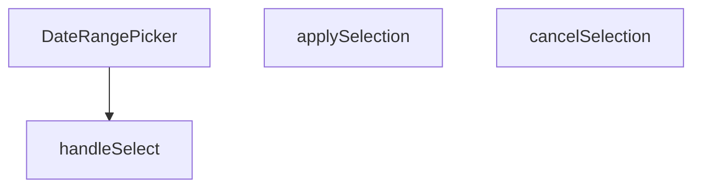

## Genel Bakış
Bu modül, yönetim paneli arayüzünde başlangıç ve bitiş tarihlerinin seçilmesi için kullanılan özel bir React bileşenidir. Kullanıcının yaptığı geçici seçimleri yönetir, onaylama veya iptal mekanizması sağlar ve nihai tarih aralığını üst bileşene iletir.

## Fonksiyon Grupları
### Bileşen Tanımı
Tarih seçici arayüzünü oluşturan ana bileşendir ve dış dünyadan gelen yapılandırma parametrelerini kabul eder.
- DateRangePicker

### Etkileşim ve Durum Yönetimi
Kullanıcının tarih seçimi, seçimi onaylama veya iptal etme gibi aksiyonlarını işleyerek bileşenin iç durumunu ve çıktısını günceller.
- handleSelect, applySelection, cancelSelection

---

## AXIOMS – Mimari Varsayımlar
Bu modül için özel aksiyom tanımlanmamıştır.

**Aksiyom 1**: Eğer `className` prop’u sağlanmazsa, `className` değeri boş string (`''`) olur.  
**Aksiyom 2**: Eğer `value` prop’u `undefined` ya da geçerli bir `DateRange` nesnesi değilse, tarih seçici başlangıçta **seçili bir aralık** göstermez.  
**Aksiyom 3**: Eğer `onChange` callback’i tanımlı değilse, tarih aralığı değiştiğinde **hiçbir dış etki** (state güncellemesi, API çağrısı vb.) gerçekleşmez.  
**Aksiyom 4**: Eğer `handleSelect` fonksiyonu `undefined` bir argüman (`r`) alırsa, mevcut seçili tarih aralığı **silinir** (yani içsel seçim durumu `null/undefined` olur).  
**Aksiyom 5**: Eğer `handleSelect` fonksiyonu geçerli bir `DateRange` nesnesi alırsa, bu nesne **içsel seçim durumuna** kaydedilir ve `onChange` callback’i (varsa) bu yeni `DateRange` ile tetiklenir.  
**Aksiyom 6**: Eğer `applySelection` çağrılırsa, **içsel seçim durumu** `value` prop’una aktarılır ve `onChange` callback’i (varsa) bu güncellenmiş `value` ile çalıştırılır.  
**Aksiyom 7**: Eğer `cancelSelection` çağrılırsa, **içsel seçim durumu** `value` prop’una eşitlenir (yani son onaylanmış değer geri yüklenir) ve `onChange` callback’i (varsa) bu geri yüklenmiş değerle tetiklenir.  
**Aksiyom 8**: Eğer `placeholder` prop’u sağlanmazsa, tarih seçici **varsayılan bir yer tutucu** (bilinmiyor) gösterir; bu, UI‑nın boş bir giriş alanı gibi görünmesini sağlar.  

*Domain‑specific not*: `DateRange` tipinin geçerli bir aralık olup olmadığını belirlemek için **başlangıç tarihinin bitiş tarihinden önce olması** gereklidir; aksi takdirde `handleSelect` içinde “geçersiz aralık” olarak kabul edilir ve seçim iptal edilir. (Bu kural, tip tanımının dışına çıkmadığı sürece uygulanır.)

---

## FONKSİYON DETAYLARI

### DateRangePicker
**Ne yapar**: Kullanıcıların bir tarih aralığı seçmesine olanak tanıyan bir React bileşeni sunar.  
**Nasıl yapar**: `value`, `onChange`, `placeholder` ve isteğe bağlı `className` propslarını alır; içsel durum ve etkileşimleri yöneterek seçilen aralığı dışarıya `onChange` callback’iyle bildirir.  
**Parametreler**:
- `value`: DateRange — Bileşenin mevcut tarih aralığı değeri.
- `onChange`: (range: DateRange) => void — Seçim değiştiğinde tetiklenen geri çağırma fonksiyonu.
- `placeholder`: string — Kullanıcıya gösterilecek yer tutucu metin.
- `className`: string — Bileşenin dış görünümünü özelleştirmek için ek CSS sınıfları (varsayılan: boş string).  
**Dönüş**: React.FC<DateRangePickerProps> — Tanımlı props tipine sahip bir fonksiyonel React bileşeni.

### handleSelect
**Ne yapar**: Önceden tanımlı bir tarih aralığı (preset) seçildiğinde, bu aralığı işleyerek bileşenin durumunu günceller.  
**Nasıl yapar**: `preset.getRange()` çağrısıyla elde edilen `DateRange` nesnesini alır ve `handleSelect` fonksiyonuna iletir; fonksiyon içinde muhtemelen `onChange` callback’i çağrılır.  
**Parametreler**:
- `r`: DateRange | undefined — Seçilen tarih aralığı; tanımsız (undefined) olma ihtimali vardır.  
**Dönüş**: Belirtilmemiş (void veya bilinmiyor).

### applySelection
**Ne yapar**: Kullanıcı tarafından yapılan tarih aralığı seçimini onaylar ve seçilen değeri dışa aktarır.  
**Nasıl yapar**: Muhtemelen geçerli seçim durumunu `onChange` callback’iyle iletir ve UI’yı kapatır; iç mantık kodda belirtilmemiştir.  
**Parametreler**: Yok.  
**Dönüş**: Belirtilmemiş (void veya bilinmiyor).

### cancelSelection
**Ne yapar**: Kullanıcı tarafından başlatılan tarih aralığı seçimini iptal eder ve önceki duruma geri döner.  
**Nasıl yapar**: Seçim sürecini sonlandırarak geçici değişiklikleri temizler; iç mantık kodda yer almamaktadır.  
**Parametreler**: Yok.  
**Dönüş**: Belirtilmemiş (void veya bilinmiyor).

---

## INTERFACES

### DateRangePickerProps
- `value?: DateRange`
- `onChange?: (range?: DateRange) => void`
- `placeholder?: string`
- `className?: string`

---

## AST POINTERS

### [N1_NASIL] AST Pointer: src/components/admin/DateRangePicker.tsx::DateRangePicker
- **params**: (value, onChange, placeholder, className = '')
- **ic_degiskenler**:
  - `lang` — `useI18n()` hook’den gelen mevcut dil kodu (`'en'` veya `'tr'`).
  - `locale` — Dil koduna göre seçilen `date-fns` locale (`enUS` veya `tr`).
  - `isOpen` — Popover’ın açık/kapalı durumunu tutan boolean state.
  - `setIsOpen` — `isOpen` state’ini güncelleyen setter fonksiyonu.
  - `selectedRange` — Kullanıcının seçtiği tarih aralığını tutan `DateRange | undefined` state.
  - `setSelectedRange` — `selectedRange` state’ini güncelleyen setter fonksiyonu.
  **`months`** — Mobil/desktop görünümüne göre gösterilecek takvim ayı sayısını tutan sayı state.  
  **`setMonths`** — `months` state’ini güncelleyen setter fonksiyonu.  
  **`presets`** — Ön tanımlı tarih aralıklarını içeren nesne dizisi; her nesne `label` ve `getRange` fonksiyonuna sahiptir.  
  **`triggerLabel`** — Popover tetikleyicisinin içinde gösterilen metin; seçili tarih aralığına göre formatlanır.  
  **`dayPickerClassNames`** — `react-day-picker` bileşeni için Tailwind‑CSS sınıf haritası.  
- **Dönüş**: JSX element (`<Popover.Root …>`). Component, dışarıdan `value` ve `onChange` prop’larıyla kontrol edilen bir tarih aralığı seçicisi render eder; yan etkileri arasında pencere boyutuna göre `months` ayarlanması ve `value` değiştiğinde `selectedRange` senkronizasyonu bulunur.

### [N2_NASIL] AST Pointer: src/components/admin/DateRangePicker.tsx::handleSelect
- **params**: (r: DateRange | undefined)
- **ic_degiskenler**:
  - `r` — Kullanıcının takvimden seçtiği yeni tarih aralığı; `undefined` olabilir.
  - `setSelectedRange` — Üst component’tan gelen state setter; `selectedRange`’ı `r` ile günceller.
- **Dönüş**: yok (sadece `selectedRange` state’ini günceller).

### [N3_NASIL] AST Pointer: src/components/admin/DateRangePicker.tsx::applySelection
- **params**: (parametre yok)
- **ic_degiskenler**:
  - `onChange` — Prop olarak gelen, seçili tarih aralığını dışarıya ileten callback; var olduğunda `selectedRange` ile çağrılır.
  - `selectedRange` — Şu anki seçili tarih aralığı state’i.
  - `setIsOpen` — Popover’ın açık/kapalı durumunu kontrol eden setter; `false` yaparak popover’ı kapatır.
- **Dönüş**: yok (callback’i tetikler ve popover’ı kapatır).

### [N4_NASIL] AST Pointer: src/components/admin/DateRangePicker.tsx::cancelSelection
- **params**: (parametre yok)
- **ic_degiskenler**:
  - `value` — Prop olarak gelen dış tarih aralığı; iptal edildiğinde `selectedRange` bu değere geri set edilir.
  - `setSelectedRange` — `selectedRange` state’ini `value` ile sıfırlar.
  - `setIsOpen` — Popover’ı kapatmak için `false` atanır.
- **Dönüş**: yok (state’i geri alır ve popover’ı kapatır).

### [N5_NASIL] AST Pointer: src/components/admin/DateRangePicker.tsx::<anonymous useEffect 1>
- **params**: (parametre yok)
- **ic_degiskenler**:
  - `checkMobile` — `window.innerWidth` kontrolüyle `months` state’ini `1` (mobile) veya `2` (desktop) olarak ayarlayan fonksiyon.
  - `setMonths` — `months` state’ini güncelleyen setter.
  - `window` — Global nesne; `innerWidth` ve `addEventListener`/`removeEventListener` kullanılır.
- **Dönüş**: yok (cleanup fonksiyonu `removeEventListener` ile event listener’ı kaldırır).

### [N6_NASIL] AST Pointer: src/components/admin/DateRangePicker.tsx::<anonymous useEffect 2>
- **params**: (parametre yok)
- **ic_degiskenler**:
  - `value` — Prop olarak gelen dış tarih aralığı.
  - `selectedRange` — İç state; `value` ile eşleşmezse `setSelectedRange` ile senkronize edilir.
  - `setSelectedRange` — `selectedRange` state’ini `value` ile günceller.
- **Dönüş**: yok (sadece koşullu senkronizasyon yapar).

---

## MERMAID CALL GRAPH

## NODE ID STANDARD

  file: src\components\admin\DateRangePicker.tsx
  function: src\components\admin\DateRangePicker.tsx::DateRangePicker
  function: src\components\admin\DateRangePicker.tsx::handleSelect
  function: src\components\admin\DateRangePicker.tsx::applySelection
  function: src\components\admin\DateRangePicker.tsx::cancelSelection

---

## DISA AKTARILANLAR (EXPORTS)
  export: DateRangePicker

---

## STİL TOKENLERİ

### Arbitrary Değerler (token'a geçirilmemiş)
Yok — tüm stiller token'a geçirilmiş. ✅

### Kullanılan Token'lar (zaten token'a geçirilmiş)
- (yok)

### Tailwind Sınıf Özeti
- **Renkler:** `bg-primary-navy`, `bg-slate-50`, `bg-white`, `bg-white/95`, `border-b`, `border-slate-100`, `border-slate-200`, `border-slate-200/60`, `border-t`, `hover:bg-primary-navy/90`, `hover:bg-slate-100`, `hover:bg-slate-200/50`, `hover:bg-slate-50`, `hover:border-slate-300`, `hover:text-slate-800`
- **Layout:** `backdrop-blur-xl`, `flex`, `flex-col`, `gap-1`, `gap-2`, `inline-flex`, `items-center`, `justify-between`, `max-h-60vh`, `max-h-85vh`, `max-w-full`, `md:flex-row`, `md:max-h-none`, `md:w-48`, `md:w-auto`
- **Varyant/Responsive:** `:`, `active:`, `disabled:`, `focus-visible:`, `hover:`, `md:`, `sm:` önekleri
- **Yardımcı Sınıflar:** `${className`, `${isOpen`, `${isSelected`, `:`, `active:scale-95`, `animate-in`, `border`, `disabled:active:scale-100`, `disabled:opacity-50`, `duration-200`, `fade-in`, `focus-visible:outline-none`, `focus-visible:ring-2`, `focus-visible:ring-primary-navy/20`, `font-bold`