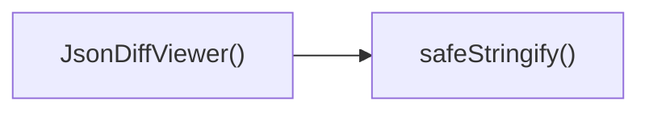

## Genel Bakış
`JsonDiffViewer` bileşeni, iki JSON nesnesi (`before` ve `after`) arasındaki farkları görsel olarak gösteren bir React arayüzü sunar. Bu işlemi destekleyen `safeStringify` yardımcı fonksiyonu, nesneleri güvenli bir şekilde stringe dönüştürerek görüntüleme sırasında oluşabilecek hataları önler.

## Fonksiyon Grupları
### UI Rendering
Kullanıcı arayüzünü oluşturur ve JSON farklarını ağaç veya liste formatında görselleştirir.  
- JsonDiffViewer

### Yardımcı / Utility
Veri işleme ve güvenli string dönüşümünü sağlar; UI bileşeni tarafından kullanılır.  
- safeStringify

---

## AXIOMS – Mimari Varsayımlar
Bu modül için özel aksiyom tanımlanmamıştır.

---

## FONKSIYON DETAYLARI

### JsonDiffViewer
**Ne yapar**: Bu bileşen, `before` ve `after` props'larını alır ve bir React functional component döndürür.  
**Nasıl yapar**: Fonksiyon imzasında gövde gözetilmediği için iç mantığı belirtilmemiştir; sadece prop alıp bir JSX döndürür.  
**Parametreler**:
- before: type — önceki JSON verisini temsil eder (tipi imzada belirtilmemiştir, `unknown` olarak kabul edilebilir)  
- after: type — sonraki JSON verisini temsil eder (tipi imzada belirtilmemiştir, `unknown` olarak kabul edilebilir)  
**Dönüş**: `React.FC<JsonDiffViewerProps>` — bir React fonksiyonel bileşeni döndürür.

### safeStringify
**Ne yapar**: Bu fonksiyon, bir `unknown` tipindeki değeri alır ve bir sonuç döndürür.  
**Nasıl yapar**: Fonksiyon gövdesi ve dönüş tipi belgelenmediği için iç işlem açıklanamamaktadır.  
**Parametreler**:
- val: type — işlenecek değeri temsil eder (tipi `unknown` olarak belirtilmiştir)  
**Dönüş**: Dönüş tipi fonksiyon imzasında açıkça belirtilmemiştir; belirsizdir (`void` veya başka bir tip olabilir).

---

## INTERFACES

### JsonDiffViewerProps
- `before: unknown`
- `after: unknown`

---

## AST POINTERS

### [N1_NASIL] AST Pointer: C:\Users\alize\venthub-hvac\src\components\admin\JsonDiffViewer.tsx::JsonDiffViewer
- **params**: before, after
- **ic_degiskenler**:
  - `bObj` — normalleştirilmiş *before* nesnesi; `before` bir obje ve null değilse onu `Record<string, unknown>` olarak alır, aksi takdirde boş obje `{}`.
  - `aObj` — normalleştirilmiş *after* nesnesi; `after` bir obje ve null değilse onu `Record<string, unknown>` olarak alır, aksi takdirde boş obje `{}`.
  - `allKeys` — `bObj` ve `aObj` anahtarlarının birleşiminden oluşan, tekrarlanmamış ve alfabetik olarak sıralanmış dizi.
  - `safeStringify` — bir değeri ekranda gösterilecek string hâline dönüştürücü yardımcı fonksiyon; `undefined`/`null` → `'null'`, string → `"${val}"`, obje → `JSON.stringify(val)`, diğer türler → `String(val)`.
- **Dönüş**: JSX elementi (React bileşeninin render çıktısı)

### [N2_NASIL] AST Pointer: C:\Users\alize\venthub-hvac\src\components\admin\JsonDiffViewer.tsx::safeStringify
- **params**: val
- **ic_degiskenler**: (yok)
- **Dönüş**: string

### [N3_NASIL] AST Pointer: C:\Users\alize\venthub-hvac\src\components\admin\JsonDiffViewer.tsx::map callback (key => { … })
- **params**: key
- **ic_degiskenler**:
  - `valB` — `bObj` nesnesindeki mevcut `key` değeri (tanımsız olabilir).
  - `valA` — `aObj` nesnesindeki mevcut `key` değeri (tanımsız olabilir).
  - `strB` — `valB` değerinin `safeStringify` ile elde edilen string temsili.
  - `strA` — `valA` değerinin `safeStringify` ile elde edilen string temsili.
  - `isRemoved` — `true` ise `key` yalnızca `before` içinde var, `after` içinde yoktur (silindi).
  - `isAdded` — `true` ise `key` yalnızca `after` içinde var, `before` içinde yoktur (eklendi).
  - `isChanged` — `true` ise `key` her iki nesnede de var fakat `strB` ve `strA` farklıdır (değiştirildi).
- **Dönüş**: JSX elementi (her satır için render edilen `
`)

---

## ÇAĞRI HARİTASI

### Disariya Cagrilar (Outgoing)
- JsonDiffViewer() fonksiyonu, JSON verisini güvenli bir şekilde stringe dönüştürmek için safeStringify fonksiyonunu çağırır.

### Disaridan Cagrilanlar (Incoming)
- Veri setinde bu modülü çağıran dış fonksiyon veya dosya bulunmamaktadır.

### Ic Ice Fonksiyonlar (Nested)
- Yok

---

## DOSYA-İÇİ ÇAĞRI GRAFİĞİ
  JsonDiffViewer() → safeStringify()

---

## NODE ID STANDARD

  file: src\components\admin\JsonDiffViewer.tsx
  function: src\components\admin\JsonDiffViewer.tsx::JsonDiffViewer
  function: src\components\admin\JsonDiffViewer.tsx::safeStringify

---

## DISA AKTARILANLAR (EXPORTS)
  export: JsonDiffViewer

---

## STİL TOKENLERİ

### Arbitrary Değerler (token'a geçirilmemiş)
- **shadow:** (yok)
- **height:** `max-h-[400px]`
- **width:** (yok)
- **spacing:** (yok)
- **diğer:** (yok)

### Kullanılan Token'lar (zaten token'a geçirilmiş)
- (yok)

### Tailwind Sınıf Özeti
- **Renkler:** `bg-emerald-500`, `bg-emerald-500/10`, `bg-rose-500`, `bg-rose-500/10`, `bg-slate-800/30`, `bg-slate-800/80`, `bg-slate-900`, `border-b`, `border-r`, `border-slate-700`, `border-slate-800`, `text-center`, `text-emerald-300`, `text-rose-300`, `text-slate-400`
- **Layout:** `flex`, `flex-1`, `gap-2`, `h-2`, `items-center`, `overflow-hidden`, `overflow-x-auto`, `p-3`, `shadow-xl`, `w-2`, `w-full`
- **Responsive:** (yok)
