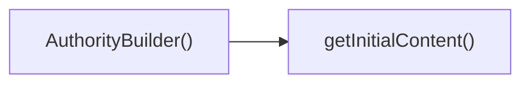

## Genel Bakış
`AuthorityBuilder` bileşeni, yönetim panelinde yetki bloklarının görüntülenmesi ve düzenlenmesinden sorumludur. Kullanıcı etkileşimleriyle blokları günceller, bu değişiklikleri `onChange` geri çağrısı ile dışarıya iletir. Yardımcı fonksiyon `getInitialContent` ise kullanıcı yeni bir blok eklediğinde türe uygun varsayılan içeriği oluşturarak bileşenin tutarlı bir başlangıç durumu almasını sağlar.

## Fonksiyon Grupları
### UI Bileşeni
Kullanıcının yetki bloklarını yönetmesini sağlayan ana React bileşenidir; mevcut değerleri görüntüler, ekleme/çıkarma/düzenleme işlemlerini yönetir ve sonuçları dışarıya bildirir.  
- AuthorityBuilder

### İçerik Başlatma
Yeni bir yetki bloğu oluşturulurken kullanılacak başlangıç içerik yapısını belirler; UI bileşeni tarafından çağrılır ve blok türüne göre uygun şablonu döndürür.  
- getInitialContent

---

## AXIOMS – Mimari Varsayımlar
Bu modül için özel aksiyom tanımlanmamıştır.

---

---

## FONKSIYON DETAYLARI

### AuthorityBuilder
**Ne yapar**: Yetki bloklarını görsel olarak düzenlemek ve yönetmek için kullanılan bir React bileşenidir. Belirtilen yetki yapılandırmasını (value) alır ve kullanıcı etkileşimleriyle değişiklikleri üst bileşene iletir.

**Nasıl yapar**: Bileşen, `value` prop'u ile aldığı yetki blokları listesini bir düzenleyici arayüzünde görüntüler. Kullanıcı blok ekleme, silme veya düzenleme yaptığında, `onChange` callback'ini güncellenmiş blok listesiyle çağırarak state değişikliklerini yukarı taşır.

**Parametreler**:
- `value: AuthorityBlock[]` — (isteğe bağlı, varsayılan `[]`) Mevcut yetki bloklarının listesini içeren dizi. Her blok tür, içerik ve alt blok bilgisi taşır.
- `onChange: (blocks: AuthorityBlock[]) => void` — Blok listesinde herhangi bir değişiklik olduğunda tetiklenen callback fonksiyonu. Güncellenmiş blok dizisini parametre olarak alır.

**Dönüş**: `React.FC<AuthorityBuilderProps>` — Bir JSX elementi döndürür. Yetki bloklarını görsel olarak düzenlemeye olanak tanıyan bir arayüz sağlar.

### getInitialContent
**Ne yapar**: Belirtilen yetki blok türüne göre başlangıç içerik yapısını oluşturan yardımcı bir fonksiyondur. Her blok türü için uygun varsayılan alanları ve değerleri döndürür.

**Nasıl yapar**: Parametre olarak alınan `type` değerine göre bir switch-case veya benzeri bir kontrol yapısı kullanarak ilgili blok türüne özel başlangıç içerik nesnesini oluşturur. Örneğin "user" türü için kullanıcı seçim alanı, "action" türü için işlem seçim alanı gibi yapılar hazırlar.

**Parametreler**:
- `type: AuthorityBlockType` — Başlangıç içeriğinin hangi blok türüne ait olduğunu belirten enum veya string değer. Örn: "user", "action", "condition".

**Dönüş**: `AuthorityBlock['content']` — Blok türüne uygun varsayılan içerik yapısını içeren bir nesne. Bu nesne daha sonra kullanıcı tarafından düzenlenebilir.

---

## INTERFACES

### AuthorityBuilderProps
- `value: AuthorityContent | null`
- `onChange: (value: AuthorityContent) => void`

---

## SABİTLER
- **btnGhost** (template) — ``${btnBase} hover:bg-slate-100 hover:text-slate-900``
- **btnOutline** (template) — ``${btnBase} border border-slate-200 bg-white shadow-sm hover:bg-slate-100 hov...`
- **btnSecondary** (template) — ``${btnBase} bg-slate-100 text-slate-900 shadow-sm hover:bg-slate-100/80``
- **BLOCK_TYPES** (array) — `[
  { type: 'hero', label: 'Hero / Banner', icon: Layers },
  { type: 'spec...`

---

## AST POINTERS

### [N1_NASIL] AST Pointer: src/components/admin/authority-builder/AuthorityBuilder.tsx::AuthorityBuilder
- **params**: `{ value = [], onChange }`
- **ic_degiskenler**:  
  - `activeTab` — state değişkeni, mevcut sekme (editor/preview/json) değerini tutar. `setActiveTab` ile güncellenir.  
  - `setActiveTab` — `activeTab` state’ini güncelleyen setter fonksiyonu. Sekme butonlarının `onClick`’inde kullanılır.  
  - `blocks` — `value` prop’unun normalize edilmiş dizisi. `Array.isArray(value) ? value : []` ile oluşturulur. Blok listesinin kaynağıdır.  
  - `addBlock` — yeni blok eklemek için kullanılan fonksiyon. Parametre olarak `type: Authority

---

## ÇAĞRI HARİTASI

### Dışarıya Çağrılar (Outgoing)
- **AuthorityBuilder()** fonksiyonu, başlangıç içeriğini almak için **getInitialContent()** fonksiyonunu çağırır.

### Dışarıdan Çağrılanlar (Incoming)
Yok

### İç İçe Fonksiyonlar (Nested)
Yok

---

## DOSYA-İÇİ ÇAĞRI GRAFİĞİ
  AuthorityBuilder() → getInitialContent()

---

## NODE ID STANDARD

  file: src\components\admin\authority-builder\AuthorityBuilder.tsx
  function: src\components\admin\authority-builder\AuthorityBuilder.tsx::AuthorityBuilder
  function: src\components\admin\authority-builder\AuthorityBuilder.tsx::getInitialContent

---

## DISA AKTARILANLAR (EXPORTS)
  export: AuthorityBuilder
  export: getInitialContent

---

## STİL TOKENLERİ

### Arbitrary Değerler (token'a geçirilmemiş)
- **shadow:** (yok)
- **height:** `max-h-[500px]`
- **width:** (yok)
- **spacing:** (yok)
- **diğer:** (yok)

### Kullanılan Token'lar (zaten token'a geçirilmiş)
- (yok)

### Tailwind Sınıf Özeti
- **Renkler:** `bg-indigo-600`, `bg-slate-50/50`, `bg-slate-50/80`, `bg-slate-900`, `bg-white`, `border-2`, `border-b`, `border-dashed`, `border-slate-100`, `border-slate-200`, `text-center`, `text-indigo-300`, `text-lg`, `text-red-500`, `text-slate-300`
- **Layout:** `flex`, `flex-1`, `flex-col`, `gap-1`, `gap-2`, `gap-3`, `grid`, `grid-cols-2`, `group-hover:opacity-100`, `h-10`, `h-4`, `h-5`, `h-6`, `h-8`, `h-auto`
- **Responsive:** `lg:`, `md:` prefix kullanımları
